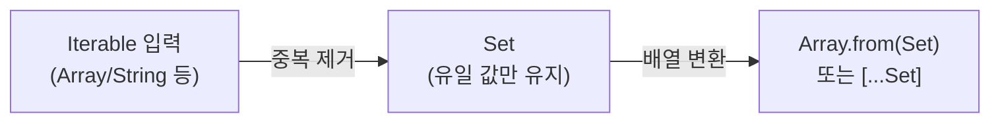
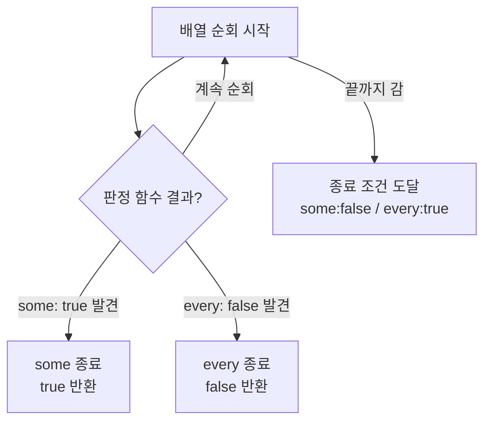

# 필요한 만큼만 바꿔라: Set·length·slice·some·every로 배열 로직 정리


한 문장 결론: **중복 제거·부분 추출·조건 검사처럼 “결과만 필요”한 작업은, 불필요한 순회/복사를 줄이는 API 조합이 핵심**이다.


배열은 프런트엔드에서 거의 모든 데이터 흐름의 중심에 있다.


여기서 중요한 건 “되긴 되게”가 아니라 **어디서(서버/브라우저), 어떤 상태 관리(불변성), 어떤 비용(순회/복사/메모리)**로 처리하느냐다.


정리하면 아래 5가지만 익혀도, 실무에서 자주 보는 배열 코드가 훨씬 짧아진다.

- **중복 제거**: `Set` + `Array.from`
- **앞에서 자르기**: `slice(0, n)` (또는 “정말 의도적”일 때 `length` 조절)
- **뒤에서 자르기**: `slice(-n)`
- **존재 여부**: `some` (조기 종료)
- **모두 만족**: `every` (조기 종료)

---


## 배경/문제


다음 같은 상황이 반복된다.

- 리스트에서 중복을 제거해야 한다.
- 목록 중 일부만 보여줘야 한다(앞/뒤 n개).
- 조건을 만족하는 값이 “있는지/전부인지”만 알고 싶다.

이때 흔한 실수는 **필요 이상으로 배열을 끝까지 돌거나**, **원본을 예상치 않게 변경**하는 것이다. UI 상태(React state)와 만나면 디버깅 난이도가 급상승한다.


---


## 핵심 개념


### 중복 제거가 “한 번에” 끝나는 이유


`Set`은 **중복을 허용하지 않는 컬렉션**이다. 이 특성을 이용해 “입력 → 중복 제거 → 배열로 변환” 파이프라인을 만들면 된다.


아래 다이어그램을 보면 흐름이 한 번에 정리된다.





→ 기대 결과/무엇이 달라졌는지: “중복 제거”와 “배열 변환”이 역할별로 분리되어, 코드가 짧아지고 의도가 선명해진다.


관련 문서: [MDN - Set](https://developer.mozilla.org/ko/docs/Web/JavaScript/Reference/Global_Objects/Set), [MDN - Array.from](https://developer.mozilla.org/ko/docs/Web/JavaScript/Reference/Global_Objects/Array/from)


---


### `some` / `every`의 핵심은 “조기 종료(Short-circuit)”


`some`은 조건을 만족하는 값을 찾는 순간 멈추고, `every`는 조건을 깨는 값을 찾는 순간 멈춘다.


즉 “결론만 필요”할 때 `filter` 같은 전체 순회/전체 결과 생성보다 유리하다.





→ 기대 결과/무엇이 달라졌는지: “필요한 순간에 멈춘다”는 특징이 고정되어, 성능/의도 모두 예측 가능해진다.


관련 문서: [MDN - Array.prototype.some](https://developer.mozilla.org/ko/docs/Web/JavaScript/Reference/Global_Objects/Array/some), [MDN - Array.prototype.every](https://developer.mozilla.org/ko/docs/Web/JavaScript/Reference/Global_Objects/Array/every)


---


## 해결 접근


아래 접근 순서를 추천한다.

1. **원본 변경이 허용되는가?**
    - UI 상태(React state)라면 보통 **원본 변경을 피하는 쪽이 안전**하다. ([React Docs - State 업데이트](https://react.dev/learn/updating-objects-in-state))
2. **결과가 “리스트”인가, “참/거짓”인가?**
    - 참/거짓이면 `some`/`every`로 “조기 종료”를 노린다.
3. **부분만 필요하면** **`slice`****를 우선**
    - `length` 조절은 강력하지만 원본이 바뀐다.

대안/비교도 같이 알아두면 판단이 빨라진다.

- 중복 제거 대안: `filter + indexOf` (의도는 명확하지만 O(n²)로 커지기 쉽다)
- 부분 추출 대안: `splice` (원본 변경) vs `slice` (원본 유지)
- 조건 검사 대안: `filter(...).length > 0` 대신 `some(...)` (의도/비용 모두 개선)

---


## 구현(코드)

> Next.js에서는 이 로직이 서버/클라이언트 어디서든 동작한다.
>
> 다만 **브라우저 콘솔에서 확인하려면 Client Component +** **`useEffect`**로 실행 위치를 고정하는 편이 편하다. ([Next.js Docs - Client Components](https://nextjs.org/docs/app/building-your-application/rendering/client-components), [React Docs - useEffect](https://react.dev/reference/react/useEffect))
>
>

### 0) 유틸 함수로 분리


```javascript
// lib/array-utils.js
export const unique = (iterable) => Array.from(new Set(iterable));

export const take = (arr, n) => arr.slice(0, n);

export const takeLast = (arr, n) => arr.slice(-n);

export const hasOver = (arr, threshold) => arr.some((v) => v > threshold);

export const allOver = (arr, threshold) => arr.every((v) => v > threshold);
```


→ 기대 결과/무엇이 달라졌는지: “어떤 의도(중복 제거/부분 추출/조건 검사)인지”가 함수 이름에 고정되어, 컴포넌트 코드가 얇아진다.


---


### 1) 배열에서 중복 데이터 제거 (`Set` + `Array.from`)


```javascript
const data = ['sejiwork', 'sejinjja', 'sejinjja', '홍길동', '홍길동', '홍길동', '홍길동'];

const uniqueData = Array.from(new Set(data));
console.log('uniqueData', uniqueData);

const uniqueAlpha = Array.from(new Set('sadfsdafas'));
console.log('uniqueAlpha', uniqueAlpha);
```


→ 기대 결과/무엇이 달라졌는지: 배열/문자열처럼 순회 가능한 입력에서 중복이 제거된 결과를 얻는다. 입력 순서는 유지된다.


관련 문서: [MDN - Set](https://developer.mozilla.org/ko/docs/Web/JavaScript/Reference/Global_Objects/Set), [MDN - Array.from](https://developer.mozilla.org/ko/docs/Web/JavaScript/Reference/Global_Objects/Array/from)


---


### 2) 배열 자르기 (앞에서): `slice(0, n)` 우선


원본을 유지하고 앞에서 n개만 가져오려면 `slice(0, n)`이 직관적이다.


```javascript
const data = ['sejiwork', 'sejinjja', 'sejinjja', '홍길동', '홍길동', '홍길동', '홍길동'];

const head3 = data.slice(0, 3);
console.log('head3', head3);
console.log('original', data);
```


→ 기대 결과/무엇이 달라졌는지: `head3`만 잘린 새 배열이 만들어지고, `data` 원본은 그대로 유지된다.


관련 문서: [MDN - Array.prototype.slice](https://developer.mozilla.org/ko/docs/Web/JavaScript/Reference/Global_Objects/Array/slice)


### (대안) `length`로 “잘라내기”는 원본 변경이다


`length`는 배열에서 **쓰기 가능한(writable) 속성**이라, 줄이면 뒤가 잘린다.


```javascript
const data = ['sejiwork', 'sejinjja', 'sejinjja', '홍길동', '홍길동', '홍길동', '홍길동'];

data.length = 3;
console.log('mutated', data);
```


→ 기대 결과/무엇이 달라졌는지: 배열 원본 자체가 변경되어 뒤 요소가 제거된다. 상태 관리/공유 참조가 있는 코드에서는 특히 주의가 필요하다.


관련 문서: [MDN - Array.length](https://developer.mozilla.org/ko/docs/Web/JavaScript/Reference/Global_Objects/Array/length)


---


### 3) 배열/문자열 자르기 (뒤에서): `slice(-n)`


뒤에서 n개는 `slice(-n)`로 한 번에 끝난다. 문자열도 동일하게 동작한다.


```javascript
const data = ['sejiwork', 'sejinjja', 'sejinjja', '홍길동', '홍길동', '홍길동', '홍길동'];
console.log('tail3', data.slice(-3));

const stringData = 'abcde';
console.log('tail3-string', stringData.slice(-3));
```


→ 기대 결과/무엇이 달라졌는지: 배열/문자열 모두 “뒤에서 n개”가 같은 규칙으로 잘려, API 기억 부담이 줄어든다.


관련 문서: [MDN - Array.prototype.slice](https://developer.mozilla.org/ko/docs/Web/JavaScript/Reference/Global_Objects/Array/slice), [MDN - String.prototype.slice](https://developer.mozilla.org/ko/docs/Web/JavaScript/Reference/Global_Objects/String/slice)


### 왜 `length`는 배열만 되고 문자열은 안 될까?


문자열은 **불변(immutable) 값**이라 길이를 “수정”하는 방식으로 바꿀 수 없다. `string.length`는 읽기 전용으로 동작한다.


반면 배열은 `length`가 요소 저장 구조와 연결되어 있어, 줄이면 뒤 요소가 제거된다.


관련 문서: [MDN - String.length](https://developer.mozilla.org/ko/docs/Web/JavaScript/Reference/Global_Objects/String/length), [MDN - Array.length](https://developer.mozilla.org/ko/docs/Web/JavaScript/Reference/Global_Objects/Array/length)


---


### 4) `some`: 조건을 만족하는 값이 “있는지”만 확인


```javascript
const test = [1, 2, 3, 4].some((v) => {
  console.log('some check:', v);
  return v > 2;
});

console.log('some result:', test);
```


→ 기대 결과/무엇이 달라졌는지: `3`을 만나는 순간 `true`를 반환하고 순회를 멈춘다. “존재 여부” 검사에 맞다.


관련 문서: [MDN - Array.prototype.some](https://developer.mozilla.org/ko/docs/Web/JavaScript/Reference/Global_Objects/Array/some)


---


### 5) `every`: 조건을 “모두” 만족하는지 확인


```javascript
const test = [1, 2, 3, 4].every((v) => {
  console.log('every check:', v);
  return v > 2;
});

console.log('every result:', test);
```


→ 기대 결과/무엇이 달라졌는지: `1`에서 바로 `false`가 나와 순회를 멈춘다. “전부 검사”에 맞다.


관련 문서: [MDN - Array.prototype.every](https://developer.mozilla.org/ko/docs/Web/JavaScript/Reference/Global_Objects/Array/every)


---


### 6) Next.js에서 바로 실행해보기 (브라우저 콘솔 고정)


```javascript
// app/playground/page.jsx
'use client';

import { useEffect } from 'react';
import { unique, take, takeLast, hasOver, allOver } from '@/lib/array-utils';

export default function PlaygroundPage() {
  useEffect(() => {
    const data = ['sejiwork', 'sejinjja', 'sejinjja', '홍길동', '홍길동', '홍길동', '홍길동'];

    console.log('unique:', unique(data));
    console.log('take 3:', take(data, 3));
    console.log('takeLast 3:', takeLast(data, 3));

    console.log('hasOver 2:', hasOver([1, 2, 3, 4], 2));
    console.log('allOver 2:', allOver([1, 2, 3, 4], 2));
  }, []);

  return<main style={{ padding: 16 }}>Open DevTools Console</main>;
}
```


→ 기대 결과/무엇이 달라졌는지: 브라우저 콘솔에서 결과를 안정적으로 재현할 수 있다. 서버 로그가 아닌 “클라이언트 실행”으로 고정된다.


관련 문서: [Next.js Docs - Client Components](https://nextjs.org/docs/app/building-your-application/rendering/client-components), [React Docs - useEffect](https://react.dev/reference/react/useEffect)


---


## 검증 방법(체크리스트)

- [ ] 중복 제거 결과가 입력 순서를 유지하는가 (`uniqueData`)
- [ ] `slice(0, n)`이 원본을 바꾸지 않는가 (`original` 확인)
- [ ] `length` 변경이 원본을 바꾼다는 점이 의도와 일치하는가
- [ ] `slice(-n)`이 배열/문자열에서 동일하게 동작하는가
- [ ] `some`이 조건 만족 시 로그가 중간에서 멈추는가
- [ ] `every`가 조건 불만족 시 로그가 중간에서 멈추는가

---


## 흔한 실수/FAQ


### Q1. `Set`이면 객체 배열도 중복 제거가 되나?


객체는 “값이 같아 보여도 참조(reference)가 다르면” 다른 값으로 취급된다.


객체 기준 중복 제거는 키를 뽑아 `Map`/`Set`으로 관리하는 방식이 더 안전하다.


관련 문서: [MDN - Set](https://developer.mozilla.org/ko/docs/Web/JavaScript/Reference/Global_Objects/Set)


### Q2. `data.length = 3`가 왜 위험할 때가 있나?


배열 원본이 변한다. 특히 React state처럼 “불변 업데이트”가 중요한 곳에서는 예기치 못한 UI 미갱신/공유 참조 문제가 생길 수 있다.


관련 문서: [React Docs - State 업데이트](https://react.dev/learn/updating-objects-in-state)


### Q3. `some`/`every` 대신 `filter`를 쓰면 안 되나?


가능하지만, “결론만 필요”한 상황에서 `filter`는 **끝까지 순회 + 새 배열 생성**을 한다.


`some`/`every`는 조기 종료로 불필요한 일을 줄인다.


관련 문서: [MDN - Array.prototype.some](https://developer.mozilla.org/ko/docs/Web/JavaScript/Reference/Global_Objects/Array/some), [MDN - Array.prototype.every](https://developer.mozilla.org/ko/docs/Web/JavaScript/Reference/Global_Objects/Array/every)


### Q4. 빈 배열에서 `every`가 `true`인 건 버그인가?


정의상 그렇다(모든 요소가 조건을 만족한다는 명제가 “반례가 없어서” 참이 되는 형태). 로직에서 의도와 어긋나면 빈 배열 케이스를 먼저 처리한다.


관련 문서: [MDN - Array.prototype.every](https://developer.mozilla.org/ko/docs/Web/JavaScript/Reference/Global_Objects/Array/every)


---


## 요약(3~5줄)

- 중복 제거는 `Set` + `Array.from`로 역할 분리하면 깔끔하다.
- 앞/뒤 일부만 필요하면 `slice`가 기본이고, `length` 변경은 원본 변경임을 기억한다.
- “있는지/전부인지” 같은 조건 검사는 `some`/`every`로 조기 종료를 노린다.
- Next.js에서는 브라우저에서 확인하려면 Client Component + `useEffect`로 실행 위치를 고정한다.

---


## 결론


배열 처리에서 중요한 건 “전부 다 만들고 나서”가 아니라 **필요한 만큼만 계산하고, 원본 변경을 통제**하는 것이다.


`Set`, `slice`, `some`, `every`를 조합하면 코드 길이보다 더 큰 이득—예측 가능성—을 얻는다.


---


## 참고(공식 문서 링크)

- [Next.js Docs - Client Components](https://nextjs.org/docs/app/building-your-application/rendering/client-components)
- [React Docs - useEffect](https://react.dev/reference/react/useEffect)
- [React Docs - Updating Objects in State](https://react.dev/learn/updating-objects-in-state)
- [MDN - Set](https://developer.mozilla.org/ko/docs/Web/JavaScript/Reference/Global_Objects/Set)
- [MDN - Array.from](https://developer.mozilla.org/ko/docs/Web/JavaScript/Reference/Global_Objects/Array/from)
- [MDN - Array.length](https://developer.mozilla.org/ko/docs/Web/JavaScript/Reference/Global_Objects/Array/length)
- [MDN - Array.prototype.slice](https://developer.mozilla.org/ko/docs/Web/JavaScript/Reference/Global_Objects/Array/slice)
- [MDN - String.prototype.slice](https://developer.mozilla.org/ko/docs/Web/JavaScript/Reference/Global_Objects/String/slice)
- [MDN - String.length](https://developer.mozilla.org/ko/docs/Web/JavaScript/Reference/Global_Objects/String/length)
- [MDN - Array.prototype.some](https://developer.mozilla.org/ko/docs/Web/JavaScript/Reference/Global_Objects/Array/some)
- [MDN - Array.prototype.every](https://developer.mozilla.org/ko/docs/Web/JavaScript/Reference/Global_Objects/Array/every)
- [Mermaid Docs](https://mermaid.js.org/)
