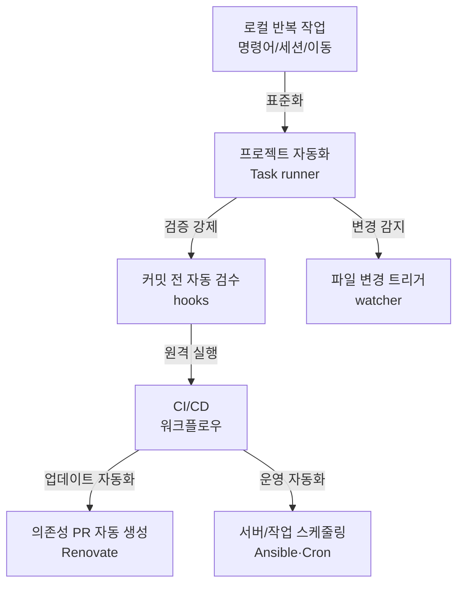

# 반복을 스크립트로 바꿔라: 게으른 개발자의 자동화 툴 스택


한 문장 결론: **반복되는 작업을 "명령어 → 자동화 → 검증" 흐름으로 고정하면, 개발 속도는 유지하고 실수는 줄일 수 있습니다.**


자동화가 중요한 이유는 단순히 "편해서"가 아닙니다.

- **UX/품질**: 테스트·린트·포맷이 자동으로 돌아가면, 릴리즈 품질이 일정해집니다.
- **성능/안정성**: 빌드·번들·의존성 업데이트를 규칙화하면, 갑작스러운 실패가 줄어듭니다.
- **유지보수**: "누가/언제/어떻게" 실행했는지 코드로 남아 팀 합의가 쉬워집니다.

---


## 배경/문제


개발하다 보면 이런 순간이 반복됩니다.

- 매번 같은 긴 명령어를 복사/붙여넣기 한다.
- 저장할 때마다 테스트/빌드를 까먹는다.
- 커밋 뒤에야 포맷/린트/시크릿 이슈를 발견한다.
- 의존성 업데이트가 밀려서 갑자기 깨진다.
- 터미널 세션 구성이 매일 리셋된다.

포인트는 하나입니다. **사람이 반복하면 언젠가 실수합니다. 반복은 도구로 넘기는 게 맞습니다.**


---


## 핵심 개념


자동화를 "한 방에 해결"하려고 하면 오히려 복잡해집니다.


대신 아래처럼 **레이어(층)** 로 나눠두면 유지보수가 쉬워집니다.





→ 기대 결과/무엇이 달라졌는지: 자동화 포인트가 겹치지 않고 역할이 분리됩니다. 로컬/커밋/CI/운영 단계가 한눈에 정리돼 "어디서 무엇을 돌리는지"가 명확해집니다.


---


## 해결 접근


아래 10가지는 "게으름"이 아니라 **반복을 시스템으로 바꾸는 장치**입니다.


### 1) Taskfile — 프로젝트 명령어를 한 곳에 모으기


Makefile 대체재로 많이 쓰이는 task runner입니다. 프로젝트에서 자주 쓰는 명령을 **짧은 별칭으로 고정**합니다.

- 기대 효과: 긴 커맨드를 외우지 않아도 되고, 팀이 동일한 실행 경로를 갖습니다.

```yaml
# Taskfile.yml
version: "3"

tasks:
  dev:
    cmds:
      - npm run dev
  build:
    cmds:
      - npm run build
  lint:
    cmds:
      - npm run lint
```


```bash
task dev
```


→ 기대 결과/무엇이 달라졌는지: `npm run ...` 조합이 흩어지지 않고 Taskfile로 수렴합니다. "실행 방법"이 문서가 아니라 코드가 됩니다.


대안/비교:

- `package.json`의 `scripts`만으로도 가능하지만, **복잡한 흐름(조건/의존 작업/공통 변수)** 이 생기면 Taskfile이 더 읽기 쉬울 수 있습니다.
- Makefile은 강력하지만, 팀이 크로스 플랫폼을 타면 **셸/환경 차이**가 발목을 잡을 수 있습니다(환경에 따라 다름).

---


### 2) Watchman — 파일 변경을 트리거로 테스트/빌드 돌리기


저장할 때마다 특정 명령을 실행해주는 watcher입니다.

- 기대 효과: "테스트 돌렸나?"를 머리로 기억하지 않게 됩니다.

```bash
watchman-make -p "*.js" --run "npm test"
```


→ 기대 결과/무엇이 달라졌는지: 파일 저장/변경이 곧 자동 실행으로 연결됩니다. 반복 클릭/수동 실행이 줄어듭니다.


대안/비교:

- 간단한 경우는 `package.json`에 watcher 스크립트를 두고 `nodemon`, `tsx --watch` 같은 도구를 쓰는 쪽이 더 가벼울 수 있습니다(환경에 따라 다름).
- Next.js 개발 서버 자체도 변경 감지를 포함하지만, "테스트/특정 검증"까지 자동화하려면 별도 트리거가 유용합니다.

---


### 3) tmux — 터미널 세션을 "재현 가능한 상태"로 만들기


터미널 탭/분할/세션을 구성해두고 재개하는 도구입니다.

- 기대 효과: 매일 "백엔드/프런트/로그/DB" 같은 세팅을 다시 만들지 않습니다.

```bash
# 예: 세션 생성 후 분할/커맨드 실행은 개인 워크플로우에 맞게 구성
tmux new -s app
```


→ 기대 결과/무엇이 달라졌는지: 터미널 작업이 "그날의 감"이 아니라 "저장 가능한 구성"이 됩니다.


대안/비교:

- GUI 터미널의 워크스페이스 기능을 쓰는 방법도 있습니다.
- SSH 중심 업무라면 tmux가 특히 강합니다(환경에 따라 다름).

---


### 4) Renovate — 의존성 업데이트를 PR로 자동 생성


의존성 업데이트를 사람이 수동으로 올리면 결국 밀립니다. Renovate는 업데이트 PR을 자동으로 만들고, 변경 내용을 한 눈에 보이게 합니다.

- 기대 효과: "언젠가 올려야지"가 "PR로 도착"합니다.

```json
// renovate.json
{
  "extends": ["config:base"]
}
```


→ 기대 결과/무엇이 달라졌는지: 의존성 업데이트가 이슈가 아니라 **리뷰 가능한 PR 단위**로 관리됩니다.


대안/비교:

- GitHub의 Dependabot도 선택지입니다. 팀 운영 방식(스케줄/규칙/세분화)에 따라 Renovate가 더 세밀할 수 있습니다(환경에 따라 다름).

---


### 5) pre-commit — 커밋 전에 "자동 사전 검수" 강제


커밋 훅으로 린트/포맷/시크릿 탐지/테스트 등을 자동화합니다.

- 기대 효과: 깨지는 커밋이 원격 저장소에 올라가기 전에 막힙니다.

```yaml
# .pre-commit-config.yaml
repos:
  - repo: https://github.com/psf/black
    rev: 23.9b0
    hooks:
      - id: black
```


→ 기대 결과/무엇이 달라졌는지: "커밋 후에 고치는 흐름"이 줄어들고, 커밋 자체가 더 신뢰 가능한 단위가 됩니다.


대안/비교:

- JavaScript/Next.js 중심이면 `lint-staged + husky` 조합이나, `lefthook` 같은 도구로 동일한 목적을 달성할 수 있습니다(환경에 따라 다름).
- 어떤 방식을 쓰든 핵심은 **"커밋 전에 자동으로 실패시키는 경계"** 를 만드는 것입니다.

---


### 6) GitHub Actions — CI/CD를 리포지토리 안으로 가져오기


테스트/빌드/배포를 커밋 이벤트에 연결합니다.

- 기대 효과: 개인 PC가 아니라 **클라우드에서 동일한 절차**로 검증됩니다.

```yaml
# .github/workflows/ci.yml
name: CI
on: [push]

jobs:
  test:
    runs-on: ubuntu-latest
    steps:
      - uses: actions/checkout@v4
      - run: npm ci
      - run: npm test
```


→ 기대 결과/무엇이 달라졌는지: "내 컴퓨터에서는 되는데…" 상황이 줄어듭니다. PR/푸시 단위로 일관된 검증이 가능합니다.


Next.js 문맥 보강:

- Next.js 프로젝트라면 `npm run build`를 CI에 포함해 **빌드 단계에서 터지는 문제**를 일찍 잡는 흐름이 흔합니다. (공식 가이드는 [Next.js Docs](https://nextjs.org/docs) 참고)

대안/비교:

- GitLab CI, CircleCI 등도 동일한 목적을 수행합니다. 조직/권한/비용/운영 방식에 따라 선택이 달라집니다(환경에 따라 다름).

---


### 7) Ansible — 서버 설정을 "명령어 묶음"이 아니라 "선언"으로 관리


서버에 손으로 접속해 설정을 바꾸는 순간, 기록과 재현성이 무너집니다. Ansible은 이를 플레이북으로 고정합니다.

- 기대 효과: 서버 변경이 사람의 손이 아니라 코드로 남습니다.

```yaml
- hosts: server
  tasks:
    - name: Install nginx
      apt:
        name: nginx
        state: present
```


→ 기대 결과/무엇이 달라졌는지: 서버 설정이 문서가 아니라 코드로 재현됩니다. 새 서버에도 같은 구성을 빠르게 적용할 수 있습니다.


대안/비교:

- Terraform 같은 IaC 도구는 "인프라 생성"에 강하고, Ansible은 "구성 관리"에 강한 편입니다(환경에 따라 다름).
- Next.js를 서버리스/플랫폼 배포로 운영한다면 Ansible의 필요도가 낮아질 수 있습니다(환경에 따라 다름).

---


### 8) Zoxide — "자주 가는 폴더"를 학습하는 cd 대체재


긴 경로를 직접 입력하는 시간은 생각보다 큽니다. Zoxide는 방문 기록을 학습해 빠르게 이동합니다.


```bash
z projects
z repo-name
```


→ 기대 결과/무엇이 달라졌는지: 경로 입력량이 줄고, 이동이 빨라집니다. "어디였지?" 탐색 시간이 줄어듭니다.


---


### 9) Cron + Bash — 정해진 시간에 작업을 자동 실행


운영에서 주기적으로 해야 하는 작업(백업/정리/알림)을 스케줄링합니다.


```bash
0 2 * * * /home/user/backup.sh
```


→ 기대 결과/무엇이 달라졌는지: "기억해서 실행"이 아니라 "시간이 실행"합니다. 사람이 잠든 시간에도 작업이 진행됩니다.


Next.js 문맥 보강:

- 서버리스/플랫폼 배포라면 Cron은 플랫폼 스케줄러로 대체될 수 있습니다(환경에 따라 달라질 수 있습니다). 핵심은 "정기 작업을 코드로 관리"하는 것입니다.

---


### 10) Espanso — 반복 입력을 트리거로 치환하는 텍스트 확장기


반복되는 서명/템플릿/UUID 같은 입력을 단축 트리거로 바꿉니다.


```plain text
/sig  ->  Kind regards, ...
/uuid ->  (UUID 자동 생성)
```


→ 기대 결과/무엇이 달라졌는지: 반복 입력이 줄고, 템플릿 품질이 일정해집니다. 같은 문장을 여러 번 쓰는 피로가 감소합니다.


---


## 구현(코드)


Next.js 프로젝트 기준으로 "최소 세트"를 잡으면 아래 조합이 실무에서 자주 먹힙니다.

1. Taskfile로 로컬 명령 통합
2. pre-commit(또는 대체 도구)로 커밋 전 검증
3. GitHub Actions로 원격 CI 고정
4. Renovate로 의존성 PR 자동 생성

```yaml
# Taskfile.yml (예시)
version: "3"

tasks:
  dev:
    cmds:
      - npm run dev
  verify:
    cmds:
      - npm run lint
      - npm test
      - npm run build
```


→ 기대 결과/무엇이 달라졌는지: 로컬에서 `task verify` 하나로 품질 게이트가 고정됩니다. 팀원마다 다른 실행 순서가 줄어듭니다.


---


## 검증 방법(체크리스트)

- [ ] `task verify`가 로컬에서 한 번에 통과한다.
- [ ] 커밋 시 포맷/린트/테스트 중 하나라도 실패하면 커밋이 막힌다.
- [ ] PR을 올리면 CI가 자동으로 돌아가고, 실패 로그가 남는다.
- [ ] 의존성 업데이트가 PR로 주기적으로 생성되고, 머지가 가능한 형태로 쪼개져 있다.
- [ ] (선택) 저장/변경 트리거로 테스트가 자동 실행되어 "수동 실행"이 줄었다.

---


## 흔한 실수/FAQ


**Q. 자동화가 너무 많아져서 오히려 느려졌어요.**


A. 로컬 훅은 "빠른 검증" 위주로 두고, 무거운 검증(전체 테스트/빌드)은 CI로 넘기는 방식이 흔합니다. 팀/레포 규모에 따라 달라질 수 있습니다.


**Q. 커밋 훅이 팀원마다 다르게 동작해요.**


A. 훅 도구 선택보다 중요한 건 "설치/실행 경로를 코드로 고정"하는 것입니다. Taskfile로 통일하거나, 리포지토리 내 스크립트로 실행 경로를 맞추는 편이 안정적입니다.


**Q. Next.js에서 서버/클라이언트 경계 때문에 자동화가 복잡해져요.**


A. 자동화는 런타임 경계와 직접 충돌하지 않습니다. 다만 CI에 `build`를 포함해두면 서버/클라이언트 관련 오류를 조기에 발견하기 좋습니다. 자세한 구조는 [Next.js Docs](https://nextjs.org/docs)와 [React Docs](https://react.dev/)를 참고하세요.


---


## 요약(3~5줄)

- 자동화는 "게으름"이 아니라 **반복을 시스템으로 바꾸는 설계**입니다.
- Taskfile로 로컬 실행을 통합하고, 커밋 훅으로 품질을 강제하고, CI로 원격 검증을 고정합니다.
- Renovate 같은 도구로 의존성 업데이트를 PR로 전환하면 운영 부담이 줄어듭니다.
- 중요한 건 도구 자체가 아니라 **단계별 책임 분리**입니다.

---


## 결론


생산성은 더 오래 일한다고 올라가지 않습니다.


반복되는 작업을 자동화 흐름으로 고정하면, **생각해야 하는 문제에 더 많은 시간을 쓸 수 있습니다.**


"손으로 하는 일"을 줄이고, "코드로 남는 일"을 늘리는 쪽이 결국 유지보수와 안정성까지 같이 가져갑니다.


---


## 참고(공식 문서 링크)

- [Task (go-task) GitHub](https://github.com/go-task/task)
- [Watchman GitHub](https://github.com/facebook/watchman)
- [tmux GitHub](https://github.com/tmux/tmux)
- [Renovate GitHub](https://github.com/renovatebot/renovate)
- [pre-commit GitHub](https://github.com/pre-commit/pre-commit)
- [GitHub Actions](https://github.com/features/actions)
- [Ansible GitHub](https://github.com/ansible/ansible)
- [Zoxide GitHub](https://github.com/ajeetdsouza/zoxide)
- [crontab.guru](http://crontab.guru/)
- [Espanso GitHub](https://github.com/espanso/espanso)
- [Next.js Docs](https://nextjs.org/docs)
- [React Docs](https://react.dev/)
