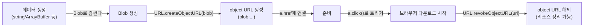

# 필요한 순간만 만들고 지워라: Blob 다운로드용 Object URL 패턴


한 문장 결론: **Blob(블롭) 데이터를 내려받을 땐** **`URL.createObjectURL()`****로 object URL(객체 URL,** **`blob:`** **URL)을 만들고, 클릭으로 다운로드를 트리거한 뒤** **`URL.revokeObjectURL()`****로 즉시 해제하는 흐름이 가장 안전하다.**


다운로드는 “기능”처럼 보이지만, SPA에서는 “자원 관리”에 가깝습니다. 같은 화면에서 다운로드를 여러 번 반복하면 object URL이 쌓일 수 있고, 이 누적은 탭 메모리 증가·느려짐·예상치 못한 크래시로 이어질 수 있습니다.


포인트는 단순합니다. **URL은 만들되, 쓰자마자 지운다.**


---


## 배경/문제


프런트엔드에서 생성한 데이터(예: CSV, 로그, 임시 리포트)를 “파일로 저장”시키고 싶을 때가 있습니다.

- 문자열/바이너리를 Blob으로 만든다
- Blob을 가리키는 임시 URL을 만든다
- `<a download>` 클릭으로 다운로드를 시작한다

문제는 여기서 끝이 아니라는 점입니다. **임시 URL을 해제하지 않으면** 같은 작업을 반복할수록 리소스가 누적될 수 있습니다.


---


## 핵심 개념


### 용어 정리

- **Blob(블롭)**: 브라우저가 다루는 “파일 같은” 불변(immutable) 원시 데이터 컨테이너
- **object URL(객체 URL,** **`blob:`** **URL)**: Blob을 가리키는 임시 URL 문자열
- **해제(revoke)**: object URL이 더 이상 필요 없음을 브라우저에 알려 리소스를 정리할 수 있게 함

### 흐름을 다이어그램으로 고정하기





→ 기대 결과/무엇이 달라졌는지: “다운로드 트리거”와 “리소스 해제”가 한 흐름으로 묶여, 반복 실행에서도 메모리 누적 위험이 줄어듭니다.


---


## 해결 접근


정석 패턴은 아래 3단계입니다.

1. **Blob 만들기** (왜: 다운로드 대상이 될 “파일 데이터”를 브라우저 표준 객체로 표현하기 위해)
2. **object URL 만들기 +** **`<a download>`** **클릭** (왜: 브라우저의 다운로드 UX를 그대로 재사용하기 위해)
3. **`revokeObjectURL()`****로 해제** (왜: 반복 다운로드에서 리소스가 쌓이지 않게 하기 위해)

추가로, Next.js에서는 **브라우저 전용 API(****`window`****,** **`document`****,** **`URL.createObjectURL`****)는 Client Component에서만** 실행되도록 경계를 명확히 해야 합니다. (`'use client'`)


---


## 구현(코드)


### 1) “Blob → 다운로드” 유틸 (정석)


```javascript
export function downloadBlob(blob, filename) {
  const url = URL.createObjectURL(blob);

  const a = document.createElement("a");
  a.href = url;
  a.download = filename;
  a.style.display = "none";

  document.body.appendChild(a);
  a.click();
  a.remove();

  // 다운로드 트리거 직후 해제(다음 틱으로 미룸)
  setTimeout(() => URL.revokeObjectURL(url), 0);
}
```


→ 기대 결과/무엇이 달라졌는지: 호출할 때마다 다운로드가 시작되고, object URL이 즉시 해제되어 반복 실행 시 누적 위험이 줄어듭니다.


---


### 2) Next.js Client Component에서 버튼 클릭으로 트리거


```typescript
'use client';

import { downloadBlob } from './downloadBlob';

export default function ExportButton() {
  const onClick = () => {
    const blob = new Blob(["hello\nworld\n"], {
      type: "text/plain;charset=utf-8",
    });

    downloadBlob(blob, "example.txt");
  };

  return (
    <button type="button" onClick={onClick}>
      Download example.txt
    </button>
  );
}
```


→ 기대 결과/무엇이 달라졌는지: 서버 렌더링 구간과 충돌하지 않고(브라우저 API는 클라이언트에서만), 클릭 시 파일 다운로드가 자연스럽게 동작합니다.


---


### 3) `fetch()` 응답을 그대로 다운로드 (실무 빈도 높음)


```javascript
import { downloadBlob } from "./downloadBlob";

export async function downloadFromUrl(fileUrl, filename) {
  const res = await fetch(fileUrl);

  if (!res.ok) {
    throw new Error(`Download failed:${res.status}`);
  }

  const blob = await res.blob();
  downloadBlob(blob, filename);
}
```


→ 기대 결과/무엇이 달라졌는지: 서버에서 내려준 응답을 Blob으로 변환한 뒤, 동일한 다운로드 유틸로 처리해 구현이 단순해집니다.


---


### 대안/비교: 서버에서 “진짜 다운로드 응답”으로 내리기


클라이언트 메모리에 Blob을 크게 올리고 싶지 않거나, **다운로드 정책을 서버에서 통제**하고 싶다면 서버 응답에 `Content-Disposition`을 설정해 “첨부(attachment)”로 내려주는 방식이 깔끔합니다.


```typescript
// app/api/export/route.ts
export async function GET() {
  const body = "id,name\n1,Alice\n2,Bob\n";

  return new Response(body, {
    headers: {
      "Content-Type": "text/csv; charset=utf-8",
      "Content-Disposition": 'attachment; filename="export.csv"',
    },
  });
}
```


→ 기대 결과/무엇이 달라졌는지: 브라우저가 “파일 다운로드”로 인식하는 응답을 받게 되어 `<a download>`/object URL 없이도 다운로드 UX를 만들 수 있습니다.


---


## 검증 방법(체크리스트)

- [ ] 버튼 클릭 시 브라우저의 다운로드 UI가 동작한다.
- [ ] 동일 동작을 여러 번 반복해도 탭 메모리가 과도하게 증가하지 않는다.
- [ ] 다운로드 파일명이 기대한 값으로 저장된다. (`a.download` 또는 `Content-Disposition`)
- [ ] Client Component 경계가 명확해 서버 렌더링에서 `document is not defined`류 오류가 없다.
- [ ] (원격 파일) CORS/인증이 필요한 경우 `fetch`가 정상 응답을 받는다.

---


## 흔한 실수/FAQ


### Q1. `URL.revokeObjectURL()`을 안 하면 뭐가 문제인가요?


object URL은 “임시”라고 해서 자동으로 바로 정리되진 않습니다. 다운로드를 반복하는 화면이라면 **해제 누락이 누적 리스크**가 됩니다. 그래서 유틸 레벨에서 해제를 강제하는 편이 유지보수에 유리합니다.


### Q2. `setTimeout(..., 0)`로 바로 해제해도 괜찮나요?


다운로드는 브라우저 내부 동작이라 “다운로드 시작 이벤트”를 직접 받기 어렵습니다. 그래서 보통 **클릭 직후 다음 틱에서 해제**하는 패턴을 사용합니다.


이미지/비디오처럼 로딩 이벤트가 있는 경우엔 `onload` 이후 해제가 더 명확합니다.


### Q3. `<a download>`는 아무 URL에나 붙이면 되나요?


`download`는 **같은 출처(same-origin) URL이거나** **`blob:`****/****`data:`** **스킴에서만 동작하는 것으로 안내**됩니다. 외부 URL 다운로드를 강제하려면 서버 응답 헤더(`Content-Disposition`)로 처리하는 방식이 더 예측 가능합니다.


### Q4. Service Worker에서도 이 방식으로 다운로드할 수 있나요?


Service Worker에서는 `URL.createObjectURL()` / `URL.revokeObjectURL()`을 사용할 수 없는 케이스가 있어, 다운로드 설계는 “클라이언트 페이지” 또는 “서버 응답” 중심으로 잡는 편이 안전합니다.


---


## 요약(3~5줄)

- Blob 데이터를 파일로 내려받을 땐 **object URL 생성 →** **`<a download>`** **클릭 → 즉시 revoke** 흐름이 정석이다.
- 해제(`revokeObjectURL`)는 “옵션”이 아니라 반복 다운로드에서 누적 리스크를 줄이는 핵심이다.
- Next.js에서는 브라우저 API 사용 코드를 **Client Component로 격리**해 실행 위치를 고정한다.
- 외부 URL/정책 통제가 필요하면 **서버에서** **`Content-Disposition`** **다운로드 응답**으로 처리하는 대안이 더 예측 가능하다.

---


## 결론


다운로드 기능은 “한 번 동작”보다 “반복해도 안전”이 더 중요합니다.


object URL은 강력하지만, 강력한 만큼 관리 포인트가 명확합니다. **만들고, 쓰고, 지우기**. 이 세 단계만 지키면 다운로드 로직은 오래 갑니다.


---


## 참고(공식 문서 링크)

- [Next.js – Server and Client Components](https://nextjs.org/docs/app/getting-started/server-and-client-components)
- [Next.js – ](https://nextjs.org/docs/app/api-reference/directives/use-client)[`use client`](https://nextjs.org/docs/app/api-reference/directives/use-client)[ Directive](https://nextjs.org/docs/app/api-reference/directives/use-client)
- [Next.js – Route Handlers](https://nextjs.org/docs/app/getting-started/route-handlers)
- [MDN – ](https://developer.mozilla.org/en-US/docs/Web/API/URL/createObjectURL_static)[`URL.createObjectURL()`](https://developer.mozilla.org/en-US/docs/Web/API/URL/createObjectURL_static)
- [MDN – ](https://developer.mozilla.org/en-US/docs/Web/API/URL/revokeObjectURL_static)[`URL.revokeObjectURL()`](https://developer.mozilla.org/en-US/docs/Web/API/URL/revokeObjectURL_static)
- [MDN – ](https://developer.mozilla.org/en-US/docs/Web/URI/Reference/Schemes/blob)[`blob:`](https://developer.mozilla.org/en-US/docs/Web/URI/Reference/Schemes/blob)[ URLs (Memory management)](https://developer.mozilla.org/en-US/docs/Web/URI/Reference/Schemes/blob)
- [MDN – ](https://developer.mozilla.org/en-US/docs/Web/HTML/Reference/Elements/a)[`<a>`](https://developer.mozilla.org/en-US/docs/Web/HTML/Reference/Elements/a)[ ](https://developer.mozilla.org/en-US/docs/Web/HTML/Reference/Elements/a)[`download`](https://developer.mozilla.org/en-US/docs/Web/HTML/Reference/Elements/a)[ attribute](https://developer.mozilla.org/en-US/docs/Web/HTML/Reference/Elements/a)
- [MDN – ](https://developer.mozilla.org/en-US/docs/Web/HTTP/Reference/Headers/Content-Disposition)[`Content-Disposition`](https://developer.mozilla.org/en-US/docs/Web/HTTP/Reference/Headers/Content-Disposition)[ header](https://developer.mozilla.org/en-US/docs/Web/HTTP/Reference/Headers/Content-Disposition)
