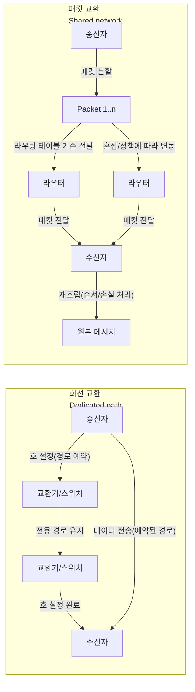

회선 교환은 통신 전에 전용 경로(회선)를 “예약”하고, 패킷 교환은 데이터를 쪼개 네트워크 자원을 “공유”하며 보냅니다.


웹/백엔드에서 이 차이를 알아두면 지연 시간(latency)과 지터(jitter)가 왜 흔들리는지 설명이 됩니다.


또, 타임아웃·재시도·멱등성(idempotency) 같은 설계 포인트가 “왜 필요한지”가 명확해집니다.


정리하면, 네트워크가 공유 자원이라는 전제를 코드와 운영에 반영하는 일이 핵심입니다.


---


## 배경/문제


전화처럼 “통화 중에는 품질이 일정한 연결”이 필요한 시스템이 있는 반면, 인터넷처럼 “여러 트래픽이 동시에 섞여 흘러도 되는” 시스템도 있습니다.


문제는 개발자가 패킷 교환 환경에서 **회선 교환처럼 동작할 거라 기대**할 때 생깁니다.

- 요청이 가끔 느려지는 이유를 서버 문제로만 오해한다
- 재시도를 아무 요청에나 붙여 중복 처리(이중 결제 등)를 만든다
- “연결(connection)”이라는 단어를 보고 물리적으로 고정된 경로라고 착각한다

---


## 핵심 개념


### 1) 회선 교환(Circuit Switching)


통신을 시작하기 전에 송신자와 수신자 사이에 **전용 경로를 설정(호 설정)**하고, 통신이 끝날 때까지 그 경로의 자원을 점유하는 방식입니다.

- **왜 하는지:** 통신 중 품질(대역폭/지연)을 예측 가능하게 만들기 위해
- **기대 결과:** 통신 중에는 비교적 일정한 품질을 기대할 수 있음(자원이 예약되므로)
- **트레이드오프:** 사용하지 않는 순간에도 자원을 점유해 효율이 낮아질 수 있음

### 2) 패킷 교환(Packet Switching)


메시지를 **패킷(packet)** 으로 쪼개 보내고, 네트워크는 그 순간순간의 상태에 따라 패킷을 전달합니다. 목적지에서는 패킷을 다시 조립합니다.

- **왜 하는지:** 여러 통신이 네트워크 자원을 공유하면서도 확장 가능하게 만들기 위해
- **기대 결과:** 회선 예약 없이도 많은 트래픽을 수용(높은 이용 효율)
- **트레이드오프:** 혼잡(congestion)에 따라 지연, 손실, 순서 뒤바뀜(재정렬) 등이 발생할 수 있음
> 포인트는 “고정된 한 줄”이 아니라, “공유 도로에서 교통량에 따라 달라지는 흐름”에 가깝다는 점입니다.

---


### 구조로 비교하기 (Mermaid)





→ 기대 결과/무엇이 달라졌는지: “전용 경로를 예약해 유지” vs “패킷을 쪼개 공유망으로 흘려보내 재조립”이라는 차이가 한눈에 정리됩니다.


---


## 해결 접근


백엔드/웹 개발 관점에서의 결론은 단순합니다.

1. 패킷 교환에서는 지연이 흔들릴 수 있으니 **타임아웃을 명시**한다
2. 손실/일시 장애가 있을 수 있으니 **재시도를 설계**한다
3. 재시도는 중복을 만들 수 있으니 **멱등성을 확보**한다(또는 멱등 키 사용)

비교/대안도 함께 잡아두면 안정적입니다.

- 대안 A: “무조건 재시도” 대신 **재시도 가능한 요청만 선별**(예: GET, 멱등 키가 있는 POST)
- 대안 B: 재시도 대신 **큐(Queue) + 비동기 처리**로 전환해 사용자 요청 경로를 짧게 유지
- 대안 C: 품질이 중요한 내부 통신은 **QoS/우선순위/전용망(전용 회선, VPN 등)** 으로 변동성을 낮춤(환경/정책에 따라 적용 가능 범위가 달라질 수 있습니다.)

---


## 구현(코드)


아래 예시는 “패킷 교환 환경에서 흔한 변동성(지연/실패)”을 가정하고, Next.js에서 **타임아웃 + 제한적 재시도**를 구현하는 방법입니다.


### 1) 지연/실패를 일부러 만드는 API Route


```javascript
// app/api/jitter/route.js
import { NextResponse } from "next/server";

export async function GET() {
  const delayMs = 200 + Math.floor(Math.random() * 1200);
  const fail = Math.random() < 0.25;

  await new Promise((r) => setTimeout(r, delayMs));

  if (fail) {
    return NextResponse.json(
      { ok: false, reason: "simulated transient failure", delayMs },
      { status: 503 }
    );
  }

  return NextResponse.json({ ok: true, delayMs });
}
```


→ 기대 결과/무엇이 달라졌는지: 요청이 가끔 느려지고(지터), 가끔 실패(일시 장애)하는 상황을 재현할 수 있습니다.


---


### 2) 타임아웃 + 재시도 유틸


```javascript
// lib/network.js
export async function fetchWithTimeout(url, { timeoutMs = 800, ...init } = {}) {
  const controller = new AbortController();
  const timer = setTimeout(() => controller.abort(), timeoutMs);

  try {
    return await fetch(url, { ...init, signal: controller.signal });
  } finally {
    clearTimeout(timer);
  }
}

export async function retry(fn, { retries = 2, backoffMs = 200 } = {}) {
  let lastError;

  for (let attempt = 0; attempt <= retries; attempt++) {
    try {
      return await fn(attempt);
    } catch (e) {
      lastError = e;
      if (attempt === retries) break;
      await new Promise((r) => setTimeout(r, backoffMs * (attempt + 1)));
    }
  }

  throw lastError;
}
```


→ 기대 결과/무엇이 달라졌는지: “무한 대기”를 막고, 일시 장애에는 제한적으로 회복을 시도합니다.


---


### 3) Server Component에서 호출(서버에서 안정적으로 제어)


```javascript
// app/page.js
import { fetchWithTimeout, retry } from "@/lib/network";

export default async function Page() {
  const result = await retry(async () => {
    const res = await fetchWithTimeout(`${process.env.NEXT_PUBLIC_BASE_URL}/api/jitter`, {
      timeoutMs: 900,
      cache: "no-store",
    });

    if (!res.ok) throw new Error(`upstream failed: ${res.status}`);
    return res.json();
  }, { retries: 2, backoffMs: 200 });

  return (
    <main style={{ padding: 24 }}>
      <h1>Network jitter demo</h1>
      <pre>{JSON.stringify(result, null, 2)}</pre>
    </main>
  );
}
```


→ 기대 결과/무엇이 달라졌는지: 지연/실패가 있어도 페이지 렌더링이 “예측 가능한 시간 안”에 성공하거나, 실패를 명확히 드러내도록 만들 수 있습니다.

> 주의: `process.env.NEXT_PUBLIC_BASE_URL` 같은 베이스 URL 구성은 배포 환경에 따라 달라질 수 있습니다. 서버/클라이언트 경계를 넘는 URL 조립은 팀 규칙에 맞게 정리해두는 편이 안전합니다.

---


## 검증 방법(체크리스트)

- [ ] 브라우저 DevTools에서 Network 탭을 열고 `/api/jitter` 호출이 **가끔 503 또는 지연**되는지 확인한다
- [ ] 타임아웃을 낮춰서(예: 200ms) **Abort가 발생**하는지 확인한다
- [ ] 재시도 횟수를 0으로 바꿔서 **회복 로직이 사라지는지** 비교한다
- [ ] 멱등성이 없는 요청(예: 결제/주문)에 재시도를 적용하지 않았는지 점검한다
- [ ] 서버 로그/모니터링에서 “재시도로 인한 트래픽 증가”를 감당 가능한지 확인한다

---


## 흔한 실수/FAQ


### Q1. “TCP 연결”은 회선 교환인가요?


아니요. TCP는 연결 지향 프로토콜이지만, 패킷 교환망 위에서 “논리적인 연결 상태”를 제공합니다. 물리적으로 전용 경로를 예약하는 의미와는 다릅니다.


### Q2. 패킷 교환이면 경로가 매번 바뀌나요?


상황에 따라 다릅니다. 라우팅이 재수렴(reconvergence)하거나 정책이 바뀌면 경로가 바뀔 수 있습니다. 중요한 건 “고정 경로를 전제로 하면 깨질 수 있다”는 점입니다.


### Q3. 재시도는 왜 위험할 수 있나요?


멱등성이 없는 요청을 재시도하면 “같은 작업이 두 번” 처리될 수 있습니다. 결제/주문/포인트 차감 같은 작업은 멱등 키(요청 식별자)나 서버 측 중복 방지 장치가 필요합니다.


### Q4. 헤더 오버헤드는 얼마나 중요한가요?


단일 요청에서는 체감이 작을 수 있지만, 작은 메시지를 매우 자주 보내는 시스템이나 대규모 트래픽에서는 누적 비용이 됩니다. 다만 실무에서는 오버헤드 자체보다 **혼잡과 재전송/지연**이 더 큰 병목이 되는 경우가 흔합니다.


---


## 요약(3~5줄)

- 회선 교환은 통신 전에 경로/자원을 예약해 예측 가능한 품질을 얻는 대신 효율이 떨어질 수 있습니다.
- 패킷 교환은 자원을 공유해 확장성이 좋지만, 혼잡에 따라 지연/손실/지터가 생길 수 있습니다.
- 백엔드/웹에서는 타임아웃, 제한적 재시도, 멱등성 설계가 이 변동성을 다루는 기본 도구입니다.
- “연결”이라는 용어를 물리적 전용 회선으로 오해하지 않는 게 출발점입니다.

---


## 결론


패킷 교환망은 “공유 자원”입니다. 그래서 빠를 때도, 느릴 때도 있습니다.


안정적인 시스템은 네트워크가 흔들리는 걸 전제로 설계합니다: 타임아웃으로 경계를 긋고, 재시도로 회복을 시도하며, 멱등성으로 중복을 통제합니다.


이 3가지를 코드에 박아두면, 네트워크 특성을 “운”이 아니라 “설계”로 다루게 됩니다.


---


## 참고(공식 문서 링크)

- [Next.js Route Handlers](https://nextjs.org/docs/app/building-your-application/routing/route-handlers)
- [MDN: fetch()](https://developer.mozilla.org/docs/Web/API/fetch)
- [MDN: AbortController](https://developer.mozilla.org/docs/Web/API/AbortController)
- [RFC Editor: RFC 791 (Internet Protocol)](https://www.rfc-editor.org/rfc/rfc791)
- [RFC Editor: RFC 9293 (Transmission Control Protocol)](https://www.rfc-editor.org/rfc/rfc9293)
- [Wikipedia: Circuit switching](https://en.wikipedia.org/wiki/Circuit_switching)
- [Wikipedia: Packet switching](https://en.wikipedia.org/wiki/Packet_switching)
