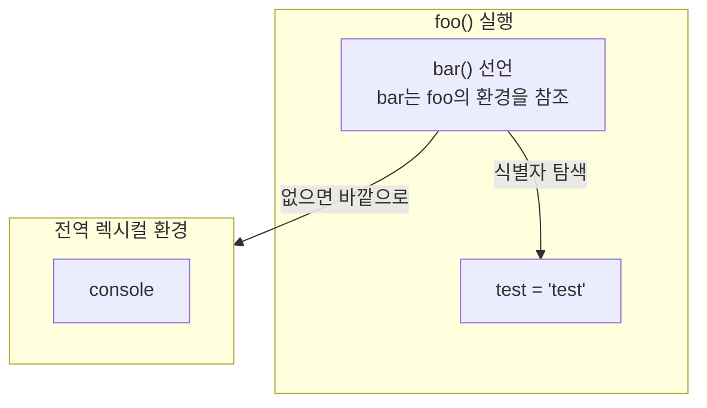
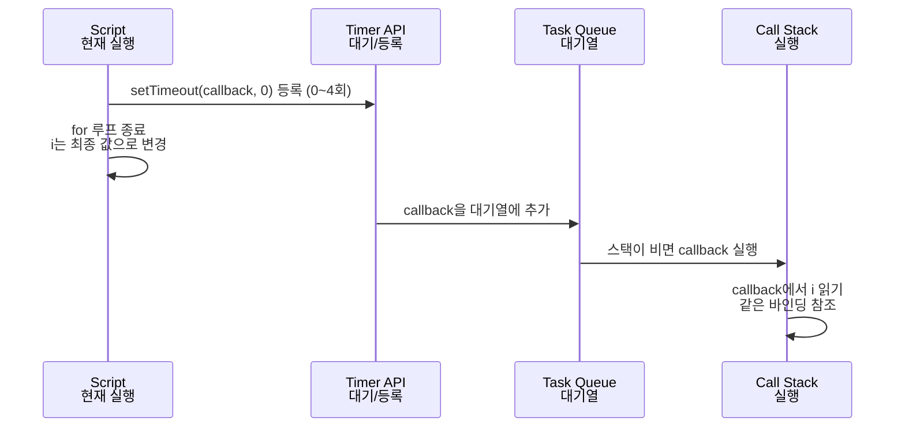

# 스코프는 선언에서 결정된다: 렉시컬 환경으로 이해하는 클로저


**한 문장 결론:** 클로저는 “함수 + 선언 당시 렉시컬 환경(lexical environment)”이어서, _무엇을 캡처했는지_만 알면 비동기/이벤트 기반 버그를 빠르게 정리할 수 있다.


---


## 1) 게시용 최종 글


## 요약 (3~5줄)

- 렉시컬 환경은 “식별자(변수/함수 이름)와 값의 연결”을 담는 실행 맥락의 저장소다.
- 자바스크립트는 함수가 만들어질 때, 자신이 선언된 렉시컬 환경을 함께 기억한다(= 클로저).
- `var` + 비동기 콜백에서 흔히 겪는 “루프가 끝난 값만 찍힘” 문제는 같은 바인딩을 공유해서 생긴다.
- `let`(블록 스코프) 또는 “값을 파라미터로 넘겨 고정”하는 패턴으로 해결한다.
- Next.js에서는 브라우저 API/이벤트 핸들러가 필요한 코드를 Client Component로 분리하면 재현과 디버깅이 쉬워진다.

---


## 배경/문제


클로저를 설명할 때 흔히 “함수와 렉시컬 환경의 조합”이라고 말한다.


그런데 “렉시컬 환경”이 감이 안 잡히면, 클로저가 왜 값을 “계속 기억하는지”, 왜 `for` 루프와 `setTimeout`에서 기대와 다른 결과가 나오는지 연결이 끊긴다.


여기서 중요한 건 두 가지다.

1. **스코프(식별자 탐색 규칙)는 코드가 ’어디에 선언됐는지’로 결정된다.**
2. **비동기 콜백은 ’나중에 실행’되기 때문에, 그 사이에 바뀐 값을 참조할 수 있다.**

이걸 렉시컬 환경으로 잡아두면, React/Next.js에서 흔한 “stale closure(오래된 캡처)” 류의 문제도 같은 원리로 정리된다.


---


## 핵심 개념


### 렉시컬 환경이란?


렉시컬 환경(lexical environment)은 간단히 말해:

- **현재 코드가 참조할 수 있는 식별자(변수/함수/매개변수)와 그 값의 연결**
- 그리고 **바깥 렉시컬 환경으로 이어지는 링크(외부 참조)**

로 구성된 “스코프를 구현하는 내부 저장소”다.


아래 다이어그램을 보면 “안쪽에서 바깥으로” 식별자를 찾는 흐름이 한 번에 잡힌다.





→ 기대 결과/무엇이 달라졌는지: “변수는 함수 안에 있어도”, 중첩 함수가 선언된 위치 기준으로 바깥 환경을 따라 올라가며 찾는다는 구조가 고정된다.


---


### 클로저란?


클로저(closure)는 **함수 + 그 함수가 선언될 당시의 렉시컬 환경 참조**다.


그래서 바깥 함수 실행이 끝나도, 반환된 함수가 그 환경을 계속 참조하면 **캡처된 값(정확히는 바인딩)이 살아있는 것처럼 보인다.**


```javascript
function foo() {
  const test = 'test';
  function bar() {
    console.log(test);
  }
  return bar;
}

const fooOfBar = foo();
fooOfBar();
```


→ 기대 결과/무엇이 달라졌는지: `foo()`가 끝난 뒤에도 `bar()`는 `test` 바인딩을 참조하고 있어 `"test"`가 출력된다.


---


## 해결 접근


클로저를 “마법”처럼 외우기보다, 아래 2단계로 사고하면 실무에서 훨씬 강해진다.

1. **이 콜백(함수)은 어떤 변수를 캡처했나?**
    - 값 자체를 복사한 게 아니라, _어떤 바인딩을 참조하는지_가 핵심이다.
2. **그 바인딩은 언제/어디서 바뀌나?**
    - 루프, 상태 업데이트, 비동기 콜백, 이벤트 핸들러가 대표적인 변경 지점이다.

여기에 “대안”을 붙이면 선택이 빨라진다.

- 대안 A: **블록 스코프(****`let`****)로 루프마다 바인딩을 분리**
- 대안 B: **파라미터로 값을 넘겨서 ’값을 고정’한 함수를 생성**
- 대안 C: **즉시 실행 함수(IIFE)로 스코프를 한 겹 더 만들어 고정**

---


## 구현(코드)


### 1) 렉시컬 스코핑: 선언 위치가 스코프를 결정한다


```javascript
function foo() {
  const test = 'test';
  function bar() {
    console.log(test);
  }
  bar();
}

foo();
```


→ 기대 결과/무엇이 달라졌는지: `bar()`는 자신이 선언된 위치 기준으로 `test`를 찾아 `"test"`를 출력한다.


---


### 2) 함수 공장(factory): makeAdder로 “값이 고정된 함수” 만들기


```javascript
function makeAdder(x) {
  return function (y) {
    return x + y;
  };
}

const add5 = makeAdder(5);
const add10 = makeAdder(10);

console.log(add5(5));   // 10
console.log(add5(10));  // 15
console.log(add10(20)); // 30
```


→ 기대 결과/무엇이 달라졌는지: 같은 함수 본문이라도, 각 반환 함수는 서로 다른 `x` 바인딩을 캡처해서 다른 결과를 만든다.


---


### 3) 루프 + 비동기 콜백에서 자주 터지는 패턴


### 문제: `var`는 루프마다 바인딩이 새로 생기지 않는다


```javascript
for (var i = 0; i < 5; i++) {
  setTimeout(() => console.log(i), 0);
}
```


→ 기대 결과/무엇이 달라졌는지: `setTimeout` 콜백들이 모두 같은 `i` 바인딩을 참조한다. 콜백이 실행될 때는 루프가 끝난 뒤라 `5`가 여러 번 찍힐 수 있다.


아래 다이어그램은 “언제 실행되는가”를 단순화해서 보여준다.





→ 기대 결과/무엇이 달라졌는지: “콜백은 나중에 실행”되며, 그때 읽는 `i`는 루프 도중의 값이 아니라 “마지막으로 바뀐 바인딩의 값”일 수 있다.


---


### 해결 A: `let`으로 루프마다 바인딩을 분리


```javascript
for (let i = 0; i < 5; i++) {
  setTimeout(() => console.log(i), 0);
}
```


→ 기대 결과/무엇이 달라졌는지: 반복마다 `i` 바인딩이 분리되어 `0 1 2 3 4`를 기대할 수 있다(환경에 따라 타이밍은 달라질 수 있어도 값은 분리된다).


---


### 해결 B: 값을 파라미터로 넘겨 “고정된 콜백” 만들기


```javascript
function makeCallback(i) {
  return () => console.log(i);
}

for (var i = 0; i < 5; i++) {
  setTimeout(makeCallback(i), 0);
}
```


→ 기대 결과/무엇이 달라졌는지: `makeCallback(i)`가 호출되는 시점의 `i` 값이 파라미터로 전달되고, 반환된 함수는 그 값을 캡처한다.


---


### 해결 C: IIFE로 스코프를 한 겹 더 만들기


```javascript
for (var i = 0; i < 5; i++) {
  (function (i) {
    setTimeout(() => console.log(i), 0);
  })(i);
}
```


→ 기대 결과/무엇이 달라졌는지: 각 반복에서 즉시 실행 함수가 새 렉시컬 환경을 만들고, 그 안의 `i`를 콜백이 캡처한다.


---


### 4) Next.js에서 재현하기: 브라우저에서만 도는 코드는 Client Component로


`setTimeout`, 클릭 이벤트 핸들러 같은 브라우저 동작은 Client Component에 두는 게 깔끔하다.


```typescript
'use client';

export default function ClosureLoopDemo() {
  const runVarLoop = () => {
    for (var i = 0; i < 5; i++) {
      setTimeout(() => console.log('var loop i =', i), 0);
    }
  };

  const runLetLoop = () => {
    for (let i = 0; i < 5; i++) {
      setTimeout(() => console.log('let loop i =', i), 0);
    }
  };

  return (
    <div style={{ display: 'flex', gap: 8 }}>
      <button onClick={runVarLoop}>var 루프 실행</button>
      <button onClick={runLetLoop}>let 루프 실행</button>
    </div>
  );
}
```


→ 기대 결과/무엇이 달라졌는지: 같은 UI에서 `var`/`let` 차이를 바로 재현할 수 있고, 콘솔 출력으로 캡처/바인딩 차이를 확인할 수 있다.

> 포인트: 이 컴포넌트는 브라우저에서 실행되는 로직이므로 파일 상단에 'use client'를 둔다.

---


## 검증 방법(체크리스트)

- [ ] `makeAdder` 예제에서 `add5(10)`과 `add10(20)`이 서로 다른 결과를 만든다.
- [ ] `var` 루프는 같은 값이 반복 출력될 수 있고, `let` 루프는 `0..4`가 출력된다.
- [ ] Next.js 예제에서 버튼 클릭 시 콘솔 출력이 정상 동작한다.
- [ ] 콜백이 큰 객체(대용량 배열/DOM 참조)를 불필요하게 캡처하지 않는다.
- [ ] 타이머/이벤트 리스너를 등록했다면, 컴포넌트 생명주기에 맞게 정리(cleanup)할 위치가 분명하다.

---


## 흔한 실수/FAQ


### Q1. “클로저는 값을 복사해 저장한다”가 맞나?


완전히 맞지는 않다. 보통 문제를 만드는 지점은 “값 복사”가 아니라 **같은 바인딩을 여러 콜백이 공유**하는 경우다. `var` 루프가 대표적이다.


### Q2. `setTimeout(fn, 0)`이면 즉시 실행 아닌가?


“즉시”라기보다 **현재 실행이 끝난 다음**에 실행될 기회를 얻는다. 타이머는 “최소 지연”에 가깝고, 실제 실행 시점은 런타임/브라우저 상황에 따라 달라질 수 있다.


### Q3. React/Next.js에서 stale closure가 나오는 이유도 같은가?


핵심은 같다. 특정 렌더 시점에 만들어진 함수가 **그 렌더의 값(상태/props)을 캡처**한 채로 나중에 호출되면, 최신 값이 아닐 수 있다.


이럴 땐 “함수형 업데이트”, “의존성 관리”, “최신 값을 읽는 패턴” 중 하나로 정리하면 된다.


---


## 결론


렉시컬 환경을 “식별자 바인딩 저장소 + 바깥 링크”로 잡고 나면, 클로저는 그 위에 얹힌 아주 자연스러운 결과다.


특히 비동기/이벤트 기반 코드에서는 “무엇을 캡처했고, 그 바인딩이 언제 바뀌는지”를 먼저 확인하면, 재현도 해결도 훨씬 빨라진다.


---


## 참고(공식 문서 링크)

- [MDN: Closures](https://developer.mozilla.org/en-US/docs/Web/JavaScript/Guide/Closures)
- [MDN: let](https://developer.mozilla.org/en-US/docs/Web/JavaScript/Reference/Statements/let)
- [MDN: var](https://developer.mozilla.org/en-US/docs/Web/JavaScript/Reference/Statements/var)
- [MDN: for](https://developer.mozilla.org/en-US/docs/Web/JavaScript/Reference/Statements/for)
- [MDN: setTimeout](https://developer.mozilla.org/en-US/docs/Web/API/Window/setTimeout)
- [Next.js Docs: Server and Client Components](https://nextjs.org/docs/app/getting-started/server-and-client-components)
- [React Docs: useEffect](https://react.dev/reference/react/useEffect)
- [React Docs: useState](https://react.dev/reference/react/useState)
- [React Docs: useEffectEvent](https://react.dev/reference/react/useEffectEvent)
- [ECMAScript Spec: Executable Code and Execution Contexts](https://tc39.es/ecma262/multipage/executable-code-and-execution-contexts.html)
