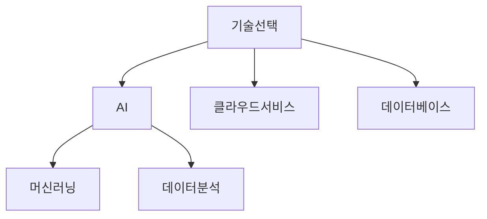

# Compound Engineering: Al 네이티브 엔지니어링 철학


## Compound Engineering이란?


Compound Engineering은 여러 기술 요소를 결합하여 효과적으로 문제를 해결하는 엔지니어링 접근 방식입니다. 복잡한 문제를 해결할 때 여러 가지 기술과 방법론을 체계적으로 통합하는 것이 핵심입니다.


### 왜 Compound Engineering이 중요한가?


오늘날의 소프트웨어 개발 환경은 점점 더 복잡해지고 있습니다. 이러한 복잡성을 관리하고, 다음과 같은 장점을 이끌어내기 위해 Compound Engineering 철학이 주목받고 있습니다.

- 효율성 향상: 여러 기술을 결합해 시너지를 발휘
- 유지보수성 개선: 통합된 솔루션을 통한 코드 품질 향상
- 확장성 강화: 유연한 구조를 활용해 추가 요구사항 수용

## Al 네이티브 엔지니어링


### 개념 설명


Al 네이티브 엔지니어링은 인공지능(AI)을 개발 프로세스에 기본으로 통합하는 방식을 의미합니다. 이는 AI의 강력한 분석 및 자동화 기능을 활용하여 효율적이고 지능적인 개발 환경을 구축합니다.


### 적용 방법

1. 기초 기술 학습
2. AI 기반 개발 도구 활용
3. 성능 최적화

### 예시


AI 기반의 코드를 간단히 예로 들어보겠습니다. 머신 러닝을 활용해 데이터를 예측하는 Python 코드입니다.


```python
from sklearn.linear_model import LinearRegression
import numpy as np

# 예제 데이터
X = np.array([[1], [2], [3], [4]])
y = np.array([2, 4, 6, 8])

# 모델 초기화
model = LinearRegression()
model.fit(X, y)

# 예측
prediction = model.predict(np.array([[5]]))
print("예측 결과:", prediction)
```


이 예시에서는 sklearn 라이브러리를 활용해 간단한 선형 회귀 모델을 만듭니다. 데이터 학습 후 새로운 입력에 대한 예측을 수행합니다.


## 단계별 실천 방법


### 1. 요구사항 분석

- 문제를 명확히 정의하고 목표를 설정합니다.

### 2. 기술 선택 및 결합 전략 수립

- 프로젝트에 적합한 AI 도구와 기술 스택을 선택합니다.




### 3. 프로토타입 개발

- 초기 버전을 개발하여 테스트 및 피드백 수집

### 4. 반복적 개발 및 최적화

- Agile 방법론을 적용하여 여러 차례 반복적 개발

### 5. 배포 및 모니터링

- 결과를 배포하고 성능을 모니터링합니다.

## 결론


Compound Engineering과 AI 네이티브 엔지니어링 철학은 현대 개발의 중요한 요소입니다. 이를 잘 활용하면 기술적 난관을 효과적으로 극복하고, 더 나은 개발 환경을 조성할 수 있습니다. 무엇보다 초보자도 이러한 철학을 이해하고 적용할 수 있도록 쉬운 접근방법을 제시했습니다.


지금까지의 내용을 바탕으로 여러분의 프로젝트에 적용해 보세요. 개발의 새로운 가능성을 체감할 수 있을 것입니다.
