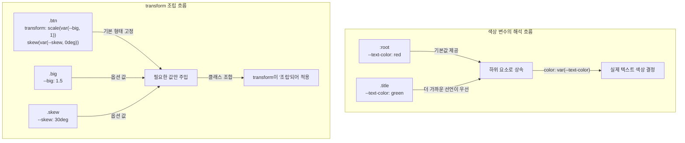

# 덮어쓰지 말고 조립하라: CSS 커스텀 프로퍼티로 조합 폭발 막기


한 문장 결론: **CSS 커스텀 프로퍼티로 “값만 바꾸는 클래스”를 만들면, 스타일 조합이 늘어도 CSS는 늘지 않는다.**


CSS를 쓰다 보면 “값만 조금 바꾸고 싶은데 클래스가 계속 늘어나는” 순간이 온다. 특히 `transform`처럼 여러 함수가 합쳐지는 속성은 조합이 늘어나는 속도가 빠르다.


포인트는 간단하다. **속성 자체를 재정의하지 말고, 속성이 참조하는 ’값’을 변수로 빼서 조립**한다.


이 방식은 유지보수에 강하다.


- 조합이 늘어도 CSS가 폭발하지 않는다.


- 런타임에서 테마/상태에 따라 값을 바꾸기 쉽다.


- 컴포넌트 단위로 “기본값 + 옵션” 구조를 유지할 수 있다.


---


## 배경과 문제


예를 들어 “큰 버튼”, “기울어진 버튼”, “큰+기울어진 버튼”을 만들고 싶다고 하자.

- 변수를 쓰지 않으면, 클래스 조합마다 `transform`을 새로 써야 한다.
- 조합이 2개에서 5개로 늘어나는 순간부터, CSS가 지옥으로 커진다.

여기서 중요한 건 **`transform`** **같은 속성은 “마지막 선언이 덮어쓴다”**는 점이다.


그래서 `.big { transform: ... }`와 `.skew { transform: ... }`를 동시에 쓰면, 기대와 다르게 한쪽이 날아갈 수 있다.


---


## 핵심 개념


CSS 커스텀 프로퍼티(CSS Custom Properties)는 `--token` 형태로 선언하고, `var()`로 꺼내 쓴다.


이 값은 **캐스케이드(cascade)**와 **상속(inheritance)** 규칙을 따라 “가까운 선언”이 우선한다.


아래 다이어그램을 보면, “어디에 변수를 선언하느냐”가 곧 “적용 범위”가 된다.





→ 기대 결과/무엇이 달라졌는지: 변수는 “가까운 선언”이 우선 적용되고, `transform`은 “속성 재정의” 대신 “값 주입”으로 조합이 가능해진다.


---


## 해결 접근


핵심 전략은 2가지다.

1. **속성은 한 곳에서만 선언한다**
    - 예: `.btn { transform: ... }`는 하나로 고정
2. **클래스는 값만 바꾼다**
    - 예: `.big { --big: 1.5 }`, `.skew { --skew: 30deg }`

그리고 `var(--token, fallback)` 형태로 **기본값**을 넣어두면, 옵션 클래스가 없어도 안전하게 동작한다.


---


## 구현 코드


### 예제 1: 색상 변수의 범위 만들기

- `{ color: ... }`처럼 전역 전체에 걸어버리면 의도치 않은 요소까지 영향을 줄 수 있다. 대신 **컨테이너(래퍼)에만 적용**해서 범위를 고정한다.

`app/globals.css`


```css
:root {
  --text-color: red;
}

.title {
  --text-color: green;
}

/* 전체가 아니라, 특정 영역만 변수 색상을 사용 */
.page {
  color: var(--text-color);
}
```


`app/page.jsx`


```javascript
export default function Page() {
  return (
    <main className="page">
      <h1 className="title">Title</h1>
      <p>안녕하세요</p>
    </main>
  );
}
```


→ 기대 결과/무엇이 달라졌는지: `main.page` 안에서 기본 텍스트는 빨간색, `.title`은 더 가까운 변수 선언을 가져와 초록색으로 보인다.


---


### 예제 2: transform을 “조합 가능한 옵션”으로 만들기


`app/components/Button.module.css`


```css
.btn {
  transform: scale(var(--big, 1)) skew(var(--skew, 0deg));
  transition: transform 200ms ease;
}

.big {
  --big: 1.5;
}

.skew {
  --skew: 30deg;
}
```


`app/components/DemoButton.jsx`


```javascript
"use client";

import { useMemo, useState } from "react";
import styles from "./Button.module.css";

export default function DemoButton() {
  const [isBig, setIsBig] = useState(false);
  const [isSkew, setIsSkew] = useState(false);

  const className = useMemo(() => {
    return [
      styles.btn,
      isBig ? styles.big : null,
      isSkew ? styles.skew : null,
    ]
      .filter(Boolean)
      .join(" ");
  }, [isBig, isSkew]);

  return (
    <div>
      <button className={className}>Button</button>

      <div style={{ marginTop: 12, display: "flex", gap: 8 }}>
        <button onClick={() => setIsBig((v) => !v)}>
          big 토글
        </button>
        <button onClick={() => setIsSkew((v) => !v)}>
          skew 토글
        </button>
      </div>
    </div>
  );
}
```


`app/page.jsx`


```javascript
import DemoButton from "./components/DemoButton";

export default function Page() {
  return (
    <main style={{ padding: 24 }}>
      <DemoButton />
    </main>
  );
}
```


→ 기대 결과/무엇이 달라졌는지: `.btn`이 `transform` 구조를 고정하고, `.big`/`.skew`는 값만 주입한다. 조합이 늘어도 `transform` 선언은 늘지 않는다.


---


### 값 주입을 더 직접적으로 하고 싶다면


상태에 따라 클래스 대신 **인라인 스타일로 변수만 주입**할 수도 있다.


```javascript
<button
  className={styles.btn}
  style={{ "--big": 1.2, "--skew": "10deg" }}
>
  Button
</button>
```


→ 기대 결과/무엇이 달라졌는지: 클래스 조합 없이도 “값만” 바꿔서 동일한 조립 구조를 유지한다.


---


## 검증 방법


체크리스트로 빠르게 확인한다.

- [ ] DevTools에서 `.title` 요소의 `-text-color`가 초록으로 계산되는가
- [ ] `.page` 안의 일반 텍스트는 기본값(빨강)으로 보이는가
- [ ] `.btn` 단독일 때 `transform`이 `scale(1) skew(0deg)`로 계산되는가
- [ ] `.big`만 붙이면 `scale`만 바뀌고 `skew`는 기본값으로 남는가
- [ ] `.skew`만 붙이면 `skew`만 바뀌고 `scale`은 기본값으로 남는가
- [ ] `.big.skew` 조합에서도 `transform`이 “둘 다 적용”되는가

---


## 흔한 실수와 FAQ


### `{ color: var(--text-color) }`로 걸면 안 되나?


가능은 하지만 영향 범위가 너무 넓어질 수 있다. 링크, 버튼, 폼 요소 등까지 한 번에 바뀌면 스타일 충돌이 나기 쉽다.


**래퍼(예:** **`.page`****)에만 적용**해서 범위를 제한하는 편이 안정적이다.


### `var(--big, 1)`의 기본값은 언제 쓰이나?


변수가 **정의되지 않았을 때** 기본값이 사용된다.


반대로, 변수가 정의되어 있어도 **값 형태가 속성 문법에 맞지 않으면** `transform` 자체가 무효가 될 수 있으니 단위/형식을 맞춰야 한다.


### `.big { transform: scale(1.5) }`처럼 쓰면 뭐가 문제지?


`transform`은 덮어쓰기 속성이라 `.skew { transform: skew(...) }`와 같이 조합하면 한쪽이 날아갈 수 있다.


커스텀 프로퍼티로 “값만” 바꾸면, `.btn`의 `transform` 구조가 유지된다.


### 대안은 뭐가 있나?

- **Sass 변수**
빌드 시점에 값이 확정된다. 런타임에서 테마/상태로 바꾸려면 추가 전략이 필요하다.
- **CSS-in-JS의 theme 토큰**
컴포넌트 단위로 관리가 쉽지만, 스타일 생성/주입 방식이 프로젝트 정책에 영향을 받을 수 있다.
- **유틸리티 클래스**
조합 속도가 빠르지만, `transform`처럼 “한 속성 안에서 함수 조립”이 필요한 경우엔 별도 패턴이 필요하다.

---


## 요약

- 커스텀 프로퍼티는 캐스케이드/상속을 따라 “가까운 값”이 우선된다.
- `transform`은 “속성 재정의”가 아니라 “값 주입”으로 조합을 만든다.
- `var(--token, fallback)`로 기본값을 넣어두면 옵션이 없어도 안전하다.
- 조합이 늘어도 CSS 선언이 폭발하지 않는 구조를 만들 수 있다.

---


## 결론


스타일을 “클래스 = 속성 선언”으로만 생각하면, 조합이 늘어날수록 코드가 무너진다.


반대로 “속성은 고정, 값은 변수로 주입”으로 바꾸면, CSS는 조립 가능한 부품이 된다.


특히 `transform` 같은 조합형 속성에서 이 패턴은 효과가 크다.


---


## 참고

- [Next.js Docs - Styling](https://nextjs.org/docs/app/building-your-application/styling)
- [MDN Web Docs - Using CSS custom properties](https://developer.mozilla.org/en-US/docs/Web/CSS/Using_CSS_custom_properties)
- [MDN Web Docs - var()](https://developer.mozilla.org/en-US/docs/Web/CSS/var)
- [MDN Web Docs - transform](https://developer.mozilla.org/en-US/docs/Web/CSS/transform)
- [web.dev - CSS variables](https://web.dev/learn/css/variables/)
- [Mermaid Docs](https://mermaid.js.org/)
