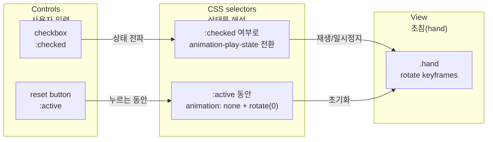

# 상태는 선택자로 만든다: JavaScript 없는 CSS 타이머


체크박스(`:checked`)로 “상태”를 만들고 `animation-play-state`로 재생을 제어하면, JavaScript 없이도 초침(Second hand) 회전 + 일시정지 + 초기화 동작을 구현할 수 있다.


## 배경/문제


“타이머처럼 보이는 UI”는 종종 실제 시간 계산보다 **시각적 피드백**이 더 중요할 때가 있습니다. 예를 들면:

- 프로토타입에서 “동작하는 것처럼 보이기”
- 문서/가이드에서 CSS만으로 상태 제어 패턴 보여주기
- 번들 크기나 클라이언트 로직 없이 정적인 인터랙션 흉내내기

포인트는 간단합니다. **CSS는 값(커스텀 프로퍼티)을 가질 수는 있어도, 스스로 값을 “변경”할 수는 없습니다.** 그래서 “상태 전환 트리거”가 필요하고, 그 역할을 `:checked` 같은 선택자가 맡습니다.


## 핵심 개념


아래 다이어그램처럼, 입력(checkbox / button) → 선택자(`:checked`, `:active`) → 애니메이션 속성 제어 흐름으로 생각하면 구현이 빠릅니다.





→ 기대 결과/무엇이 달라졌는지: “상태”를 JS 변수로 생각하지 않고, **선택자 조합으로 상태를 해석**하는 구조가 고정됩니다.


## 해결 접근


필요한 조각은 3가지입니다.

1. **초침 회전 애니메이션**

    `@keyframes` + `transform: rotate()`로 0° → 360° 회전을 만들고, 한 바퀴가 걸리는 시간을 `animation-duration`으로 정합니다.

2. **멈춤/재생 상태**

    체크박스를 토글하고, `:checked` 여부에 따라 `animation-play-state: running | paused`를 전환합니다.

3. **초기화(되감기)**

    리셋 버튼을 누르는 동안(`:active`)만 `.hand`의 `animation`을 잠시 끊고(`animation: none`), `transform: rotate(0deg)`로 되감습니다. 버튼에서 손을 떼면 애니메이션이 다시 붙으면서 0°부터 시작합니다.


## 구현(코드)


### 1) Next.js 페이지 컴포넌트

> App Router 기준 예시입니다. 동작 자체는 “정적 HTML + CSS”라서 Client Component가 필요 없습니다.

```typescript
// app/css-timer/page.tsx
import styles from "./Timer.module.css";

export default function CssTimerPage() {
  return (
    <main className={styles.wrap}>
      <h1 className={styles.title}>CSS Timer</h1>

      {/* 체크박스가 상태를 담당 */}
      <section className={styles.controls} aria-label="Timer controls">
        <input
          id="timer-running"
          className={styles.srOnly}
          type="checkbox"
          defaultChecked
        />
        <label className={styles.toggle} htmlFor="timer-running">
          <span className={styles.toggleText}>Play / Pause</span>
        </label>

        {/* :active로 초기화 트리거 */}
        <button className={styles.reset} type="button">
          Reset
        </button>
      </section>

      {/* 버튼/체크박스와 sibling selector로 연결하기 위해 controls 뒤에 배치 */}
      <section className={styles.dial} aria-label="Timer face">
        <div className={styles.hand} aria-hidden="true" />
        <div className={styles.centerDot} aria-hidden="true" />
        <p className={styles.hint}>
          Play/Pause는 토글, Reset은 누르는 동안 0으로 되감습니다.
        </p>
      </section>
    </main>
  );
}
```


→ 기대 결과/무엇이 달라졌는지: 체크박스가 “상태 저장소” 역할을 하고, 버튼은 “초기화 트리거”만 제공합니다. React 상태/이벤트 없이도 UI가 움직입니다.


---


### 2) CSS Module


```css
/* app/css-timer/Timer.module.css */

.wrap {
  display: grid;
  gap: 16px;
  justify-items: center;
  padding: 24px;
}

.title {
  margin: 0;
  font-size: 20px;
}

.controls {
  display: flex;
  gap: 12px;
  align-items: center;
}

/* 접근성: display:none 대신 screen-reader only 패턴 */
.srOnly {
  position: absolute;
  width: 1px;
  height: 1px;
  padding: 0;
  margin: -1px;
  overflow: hidden;
  clip: rect(0, 0, 0, 0);
  white-space: nowrap;
  border: 0;
}

.toggle,
.reset {
  border: 1px solid #ccc;
  background: white;
  border-radius: 10px;
  padding: 10px 12px;
  cursor: pointer;
  user-select: none;
}

.toggle:focus-visible,
.reset:focus-visible {
  outline: 2px solid #000;
  outline-offset: 2px;
}

.toggleText {
  font-size: 14px;
}

.dial {
  position: relative;
  width: 220px;
  height: 220px;
  border-radius: 999px;
  border: 1px solid #ddd;
  display: grid;
  place-items: center;
}

.hand {
  position: absolute;
  width: 2px;
  height: 90px;
  top: 20px;
  left: 50%;
  transform-origin: 50% 100%;

  /* 기본 회전 애니메이션 */
  animation: tick 60s linear infinite;
  animation-play-state: running;
}

/* 체크박스 상태로 재생/정지 전환 */
#timer-running:not(:checked) ~ .dial .hand {
  animation-play-state: paused;
}
#timer-running:checked ~ .dial .hand {
  animation-play-state: running;
}

/* Reset 버튼을 누르는 동안만 초기화 */
.reset:active ~ .dial .hand {
  animation: none;
  transform: rotate(0deg);
}

.centerDot {
  width: 10px;
  height: 10px;
  border-radius: 999px;
  background: #111;
}

.hint {
  position: absolute;
  bottom: -28px;
  font-size: 12px;
  color: #555;
  margin: 0;
}

/* 모션 민감 사용자 배려 */
@media (prefers-reduced-motion: reduce) {
  .hand {
    animation: none;
    transform: rotate(0deg);
  }
}

@keyframes tick {
  from {
    transform: rotate(0deg);
  }
  to {
    transform: rotate(360deg);
  }
}
```


→ 기대 결과/무엇이 달라졌는지: `:checked`로 **재생/정지**가 바뀌고, `:active`로 **누르는 동안만** 0°로 되감깁니다. `prefers-reduced-motion` 환경에서는 애니메이션이 꺼집니다.


## 검증 방법(체크리스트)

- [ ] Play/Pause 토글 시 초침이 즉시 멈추고, 다시 토글하면 이어서 회전한다.
- [ ] Pause 상태에서 Reset을 누르면 0°로 되감긴 채 유지된다(버튼에서 손을 떼면 0°).
- [ ] Running 상태에서 Reset을 누르고 떼면 0°부터 다시 회전한다.
- [ ] 키보드로도 토글/리셋이 가능하다(Tab 이동, Enter/Space).
- [ ] OS 설정에서 “동작 줄이기”가 켜진 환경에서 초침이 움직이지 않는다.

## 흔한 실수/FAQ


**Q. “정확한 타이머”인가요?**


A. 이 구현은 “시간 측정”이 아니라 “회전 애니메이션”입니다. 정확한 시간 동기화(예: 초 단위 표시, 일시정지 시 경과 시간 저장)가 목적이면 JavaScript 기반이 더 적합합니다.


**Q. 체크박스를** **`display: none`****으로 숨기면 더 깔끔한데요?**


A. 키보드/보조기기에서 접근이 끊길 수 있습니다. 대신 `sr-only`처럼 **포커스 가능**한 숨김 패턴을 쓰는 편이 안전합니다.


**Q. Reset을 “클릭 한 번”으로 고정 초기화하고 싶어요.**


A. `:active`는 “누르는 동안”만 적용됩니다. 고정 리셋 상태가 필요하면 reset 전용 체크박스/라디오로 상태를 하나 더 만들고, 선택자로 `animation: none`을 유지하는 방식이 맞습니다(UX는 별도 설계 필요).


**Q. 왜 버튼이** **`.dial`****보다 위에 있어야 하죠?**


A. `A:active ~ B`처럼 **sibling selector(****`~`****)는 뒤에 오는 형제 요소만** 선택할 수 있습니다. 그래서 reset 버튼이 `.dial` 앞에 있어야 `.dial .hand`를 제어할 수 있습니다.


## 요약(3~5줄)

- CSS만으로도 “상태 전환”은 가능합니다. 핵심은 `:checked` 같은 선택자를 상태로 쓰는 것.
- 초침 회전은 `@keyframes` + `transform: rotate()`로 만들고, 정지는 `animation-play-state`로 제어합니다.
- 초기화는 `:active`로 애니메이션을 잠시 끊어 0°로 되감는 방식이 단순합니다.
- 접근성과 모션 민감 사용자 배려(`prefers-reduced-motion`)까지 같이 챙기면 재사용성이 올라갑니다.

## 결론


CSS 타이머의 핵심은 “변수”가 아니라 “선택자 기반 상태”입니다. UI 프로토타입이나 정적 데모라면 이 방식이 충분히 가볍고 빠릅니다. 반대로 정확한 시간 계산이 필요해지는 순간부터는 JavaScript(또는 서버 시간)로 책임을 옮기는 게 자연스럽습니다.


## 참고(공식 문서 링크)

- [Next.js Docs: Styling](https://nextjs.org/docs/app/building-your-application/styling)
- [React Docs](https://react.dev/)
- [MDN: @keyframes](https://developer.mozilla.org/en-US/docs/Web/CSS/@keyframes)
- [MDN: transform (rotate)](https://developer.mozilla.org/en-US/docs/Web/CSS/transform-function/rotate)
- [MDN: animation-play-state](https://developer.mozilla.org/en-US/docs/Web/CSS/animation-play-state)
- [MDN: :active](https://developer.mozilla.org/en-US/docs/Web/CSS/:active)
- [MDN: prefers-reduced-motion](https://developer.mozilla.org/en-US/docs/Web/CSS/@media/prefers-reduced-motion)
