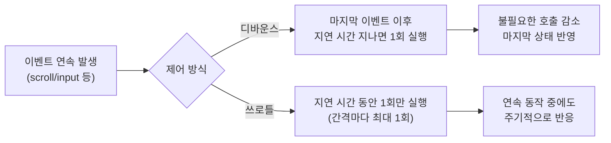

# 필요한 만큼만 실행하라: 디바운스·쓰로틀로 이벤트 폭주 다루기


한 문장 결론: **연속 이벤트는 디바운스로 “마지막만”, 쓰로틀로 “간격마다 한 번”만 처리하면 UI는 부드럽고 서버/브라우저 부담은 줄어든다.**


## 배경/문제


프런트엔드에서 `scroll`, `resize`, `input`, `mousemove` 같은 이벤트는 생각보다 자주 발생합니다.


그대로 핸들러를 붙이면 다음 문제가 바로 따라옵니다.

- **UX**: 스크롤/입력 중 끊김(jank), 프레임 드랍
- **성능**: 불필요한 렌더링/계산 반복, 메인 스레드 점유
- **안정성**: 요청 폭주(검색 API, 리스트 로딩), 레이스 컨디션
- **유지보수**: “왜 이 타이밍에 호출돼?” 같은 버그 재현 난이도 상승

포인트는 간단합니다. **이벤트를 모두 처리하지 말고, “처리할 타이밍”을 설계**하는 겁니다.


---


## 핵심 개념


디바운스(debounce)는 **연속 입력이 끝난 뒤** 한 번 실행합니다.


쓰로틀(throttle)은 **정해진 간격마다** 최대 한 번 실행합니다.





→ 기대 결과/무엇이 달라졌는지: 이벤트 폭주를 그대로 처리하지 않고, **‘실행 시점’이 예측 가능**해집니다. UI 끊김과 불필요한 요청이 함께 줄어듭니다.


### 디바운스가 어울리는 경우

- 검색어 입력 후 API 호출
- 창 크기 변경 끝난 뒤 레이아웃 재계산
- 폼 입력 검증(즉시 검증이 꼭 필요하지 않은 경우)

핵심은 **“최종 값만 필요”** 할 때입니다.

- 참고: [MDN setTimeout](https://developer.mozilla.org/en-US/docs/Web/API/setTimeout), [MDN clearTimeout](https://developer.mozilla.org/en-US/docs/Web/API/clearTimeout)

### 쓰로틀이 어울리는 경우

- 스크롤 위치 기반 UI 업데이트(상단 고정 헤더, 진행률 바)
- 드래그/마우스 이동 기반 계산
- 빈번하지만 **‘중간중간 반응’** 이 필요한 동작

핵심은 **“진행 중에도 주기적인 업데이트”** 가 필요할 때입니다.

- 참고: [MDN requestAnimationFrame](https://developer.mozilla.org/en-US/docs/Web/API/window/requestAnimationFrame)

---


## 해결 접근


### 1) 기본은 “무한 스크롤 = 쓰로틀”이 아니라 “관찰 기반”으로 바꾸기


무한 스크롤을 스크롤 이벤트로 구현하면, 결국 **스크롤 빈도 제어(쓰로틀/디바운스)를 고민**하게 됩니다.


하지만 더 단순한 선택지가 있습니다. **IntersectionObserver(교차 관찰자)** 로 “바닥 센티넬(sentinel)이 보일 때”만 로딩을 트리거하는 방식입니다.

- 장점: 스크롤 이벤트를 거의 다루지 않아도 됨(더 안정적)
- 단점: 관찰 대상 배치, 로딩 중복 방지 같은 상태 관리가 필요
- 참고: [MDN IntersectionObserver](https://developer.mozilla.org/en-US/docs/Web/API/Intersection_Observer_API)

### 2) 그래도 스크롤 이벤트를 써야 한다면: 쓰로틀 + 조건 체크 + 중복 방지


스크롤 기반이라면 보통 다음 3가지를 함께 둡니다.

- **쓰로틀**로 실행 빈도 제한
- **하단 근접 조건**(threshold)으로 필요할 때만 로딩
- **inFlight/isLoading 플래그**로 중복 요청 차단

---


## 구현(코드)


아래 예시는 Next.js 환경에서 재현 가능한 형태로 정리했습니다.


브라우저 전용 API(`window`, `document`, `IntersectionObserver`)를 사용하므로 **Client Component**로 작성합니다.

- 참고: [Next.js Client Components](https://nextjs.org/docs/app/building-your-application/rendering/client-components), [React useEffect](https://react.dev/reference/react/useEffect)

### A) 디바운스 유틸(검색 입력에 사용)


```typescript
// lib/debounce.ts
export function debounce<T extends (...args: any[]) => void>(fn: T, delayMs: number) {
  let timer: ReturnType<typeof setTimeout> | null = null;

  return (...args: Parameters<T>) => {
    if (timer) clearTimeout(timer);
    timer = setTimeout(() => fn(...args), delayMs);
  };
}
```


→ 기대 결과/무엇이 달라졌는지: 입력이 연속으로 들어와도 **마지막 입력 이후에만** `fn`이 호출됩니다.


```typescript
// app/search/SearchBox.tsx
"use client";

import { useMemo, useState } from "react";
import { debounce } from "@/lib/debounce";

export function SearchBox() {
  const [q, setQ] = useState("");

  const debouncedSearch = useMemo(
    () =>
      debounce((value: string) => {
        // fetch(`/api/search?q=${encodeURIComponent(value)}`)
        //   .then(...)
      }, 300),
    []
  );

  return (
    <input
      value={q}
      onChange={(e) => {
        const value = e.target.value;
        setQ(value);
        debouncedSearch(value);
      }}
      placeholder="Search..."
    />
  );
}
```


→ 기대 결과/무엇이 달라졌는지: 키 입력마다 요청이 나가지 않고, **입력이 멈춘 뒤**에만 검색이 실행됩니다.


---


### B) 쓰로틀 유틸(스크롤/리사이즈에 사용)


아래는 “간격마다 최대 한 번” 실행되는 쓰로틀입니다.


```typescript
// lib/throttle.ts
export function throttle<T extends (...args: any[]) => void>(fn: T, intervalMs: number) {
  let last = 0;

  return (...args: Parameters<T>) => {
    const now = Date.now();
    if (now - last < intervalMs) return;
    last = now;
    fn(...args);
  };
}
```


→ 기대 결과/무엇이 달라졌는지: 이벤트가 계속 발생해도 **intervalMs마다 한 번**만 실행됩니다.


---


### C) 무한 스크롤: IntersectionObserver 방식(권장)


```typescript
// app/feed/InfiniteFeed.tsx
"use client";

import { useEffect, useRef, useState } from "react";

type Item = { id: string; title: string };

export function InfiniteFeed() {
  const [items, setItems] = useState<Item[]>([]);
  const [isLoading, setIsLoading] = useState(false);
  const [hasMore, setHasMore] = useState(true);

  const sentinelRef = useRef<HTMLDivElement | null>(null);

  async function loadMore() {
    if (isLoading || !hasMore) return;

    setIsLoading(true);
    try {
      // 예시: 서버에서 next cursor 기반으로 받아온다고 가정
      // const res = await fetch(`/api/feed?cursor=${items.at(-1)?.id ?? ""}`);
      // const data = await res.json();
      // setItems((prev) => [...prev, ...data.items]);
      // setHasMore(data.hasMore);

      // demo: 더미 추가
      await new Promise((r) => setTimeout(r, 300));
      setItems((prev) => [
        ...prev,
        ...Array.from({ length: 10 }).map((_, i) => ({
          id: `${prev.length + i + 1}`,
          title: `Item ${prev.length + i + 1}`,
        })),
      ]);
      if (items.length > 60) setHasMore(false);
    } finally {
      setIsLoading(false);
    }
  }

  useEffect(() => {
    const el = sentinelRef.current;
    if (!el) return;

    const obs = new IntersectionObserver(
      (entries) => {
        if (entries[0]?.isIntersecting) loadMore();
      },
      {
        root: null, // viewport
        rootMargin: "200px", // 바닥 도달 전에 미리 로드
        threshold: 0,
      }
    );

    obs.observe(el);
    return () => obs.disconnect();
    // loadMore는 상태를 읽기 때문에, 실제 서비스에서는 의존성/상태 분리를 더 명확히 하거나
    // useCallback + ref 패턴으로 "최신 상태"를 안전하게 참조하는 구성이 좋습니다.
    // eslint-disable-next-line react-hooks/exhaustive-deps
  }, [hasMore, isLoading]);

  return (
    <section>
      <ul>
        {items.map((it) => (
          <li key={it.id}>{it.title}</li>
        ))}
      </ul>

      {hasMore && <div ref={sentinelRef} style={{ height: 1 }} />}

      {isLoading && <p>Loading...</p>}
      {!hasMore && <p>No more.</p>}
    </section>
  );
}
```


→ 기대 결과/무엇이 달라졌는지: 스크롤 이벤트 없이도 **바닥 센티넬이 보이는 순간에만** 로딩이 발생합니다. 불필요한 호출이 줄고, 하단 도달 직전에 부드럽게 이어집니다.


---


### D) 무한 스크롤: 스크롤 이벤트(대안) — 쓰로틀 적용


```typescript
// app/feed/InfiniteFeedScroll.tsx
"use client";

import { useEffect, useMemo, useState } from "react";
import { throttle } from "@/lib/throttle";

export function InfiniteFeedScroll() {
  const [isLoading, setIsLoading] = useState(false);
  const [hasMore, setHasMore] = useState(true);

  async function loadMore() {
    if (isLoading || !hasMore) return;
    setIsLoading(true);
    try {
      await new Promise((r) => setTimeout(r, 300));
      // 데이터 추가 로직...
      // 종료 조건이 충족되면 setHasMore(false)
    } finally {
      setIsLoading(false);
    }
  }

  const onScroll = useMemo(
    () =>
      throttle(() => {
        const nearBottom =
          window.innerHeight + window.scrollY >= document.documentElement.scrollHeight - 300;

        if (nearBottom) loadMore();
      }, 200),
    [hasMore, isLoading]
  );

  useEffect(() => {
    window.addEventListener("scroll", onScroll, { passive: true });
    return () => window.removeEventListener("scroll", onScroll);
  }, [onScroll]);

  return (
    <div>
      {/* ...리스트... */}
      {isLoading && <p>Loading...</p>}
    </div>
  );
}
```


→ 기대 결과/무엇이 달라졌는지: 스크롤이 계속 발생해도 핸들러가 **일정 간격으로만** 실행되어 계산/요청이 과도하게 반복되지 않습니다.


---


## 검증 방법(체크리스트)

- [ ] 검색 입력에서 네트워크 요청이 “입력 중 매번”이 아니라 “입력 멈춤 후”에만 발생한다(디바운스).
- [ ] 스크롤/리사이즈 중 UI가 끊기지 않고, 핸들러 호출 횟수가 줄었다(쓰로틀).
- [ ] 무한 스크롤에서 중복 요청이 발생하지 않는다(`isLoading`/inFlight 차단).
- [ ] 하단 근접 기준(threshold/rootMargin)이 UX에 맞다(너무 늦게/너무 빨리 로딩되지 않는다).
- [ ] Client Component에서만 브라우저 API를 사용한다(`"use client"`).

---


## 흔한 실수/FAQ


### Q1. 디바운스를 스크롤에 쓰면 왜 답답해지나요?


스크롤은 “진행 중 반응”이 중요한 이벤트입니다. 디바운스는 **멈춘 뒤에만** 실행되므로, 하단 도달 시점에 반응이 늦어질 수 있습니다. 무한 스크롤이 특히 그렇습니다.


### Q2. 쓰로틀이면 무조건 무한 스크롤에 적합한가요?


스크롤 기반이라면 쓰로틀이 일반적으로 더 맞습니다.


다만 더 안정적인 접근은 **IntersectionObserver로 스크롤 이벤트 자체를 피하는 것**입니다.


### Q3. 쓰로틀/디바운스가 렌더링 최적화의 전부인가요?


아닙니다. 이벤트 호출을 줄여도, 호출될 때마다 무거운 연산을 하면 여전히 느립니다.


핸들러 내부 계산을 줄이고(조건 체크, 캐싱), 렌더링 경로를 단순화하는 게 함께 필요합니다.


---


## 요약(3~5줄)

- 디바운스는 연속 이벤트의 **마지막만** 실행해 “최종 값”에 맞는 동작(검색 등)에 적합합니다.
- 쓰로틀은 **간격마다 최대 한 번** 실행해 “진행 중 반응”이 필요한 동작(스크롤/리사이즈 등)에 어울립니다.
- 무한 스크롤은 스크롤 이벤트 대신 **IntersectionObserver로 센티넬 관찰** 방식이 더 단순하고 안정적입니다.
- 스크롤 기반 구현이 필요하면 **쓰로틀 + 하단 조건 + 중복 방지**를 함께 둡니다.

---


## 결론


디바운스와 쓰로틀은 “이벤트를 얼마나 실행할지”가 아니라 **“언제 실행할지”를 결정하는 도구**입니다.


검색처럼 최종 입력만 중요하면 디바운스, 스크롤처럼 진행 중 반응이 중요하면 쓰로틀.


그리고 무한 스크롤은 한 단계 더 나아가 **관찰 기반(IntersectionObserver)** 으로 전환하면 설계 자체가 단순해집니다.


---


## 참고(공식 문서 링크)

- [Next.js Docs](https://nextjs.org/docs)
- [React Docs](https://react.dev/)
- [MDN Web Docs](https://developer.mozilla.org/)
- [MDN IntersectionObserver](https://developer.mozilla.org/en-US/docs/Web/API/Intersection_Observer_API)
- [MDN setTimeout](https://developer.mozilla.org/en-US/docs/Web/API/setTimeout)
- [MDN requestAnimationFrame](https://developer.mozilla.org/en-US/docs/Web/API/window/requestAnimationFrame)

---


# 2) 기술 검토 리포트(Tech Review)


## 업데이트 필요 항목


| 항목                                | 이유                                                     | 어떻게 바꿨는지                                                             | 영향도 | 근거                                                                                                             |
| --------------------------------- | ------------------------------------------------------ | -------------------------------------------------------------------- | --- | -------------------------------------------------------------------------------------------------------------- |
| 무한 스크롤의 기본 구현을 스크롤 이벤트 중심으로 두는 접근 | 스크롤 이벤트는 호출 빈도가 높아, 제어(쓰로틀/디바운스)·중복 방지·성능 이슈가 쉽게 얽힘    | 본문에서 기본 접근을 **IntersectionObserver(센티넬 관찰)** 로 전환하고, 스크롤 기반은 대안으로 분리 | 높음  | [MDN IntersectionObserver](https://developer.mozilla.org/en-US/docs/Web/API/Intersection_Observer_API)         |
| 브라우저 전용 API 사용 위치 명확화             | Next.js에서는 서버/클라이언트 경계가 있어 `window/document` 사용 위치가 중요 | 모든 예시를 **Client Component**로 작성하고 `"use client"`를 명시                 | 중간  | [Next.js Client Components](https://nextjs.org/docs/app/building-your-application/rendering/client-components) |
| 쓰로틀/디바운스 구현 시 타이밍/상태 최신성          | 이벤트 핸들러가 오래된 state를 캡처하면 로딩 조건/플래그가 어긋날 수 있음           | 본문에 `isLoading/hasMore` 차단을 포함하고, 관찰 방식 예시에서 의존성/상태 참조 패턴 주의점을 반영    | 중간  | [React useEffect](https://react.dev/reference/react/useEffect)                                                 |


## 확인 포인트(필요한 경우에만)

1. 무한 스크롤의 데이터 로딩이 **페이지네이션(cursor)** 인지, **offset 기반**인지? (요청/중복 방지 패턴이 달라질 수 있음)
2. 하단 로딩 트리거 시점(미리 로드 vs 바닥 도달 후 로드)에 대한 UX 기준(rootMargin/threshold)은?
3. 스크롤 컨테이너가 `window`가 아니라 특정 엘리먼트인지? (IntersectionObserver의 `root` 설정이 달라짐)

## Assumptions(가정)

- 예시는 “목록을 추가로 로드하는” 일반적인 무한 스크롤 UI를 전제로 작성했습니다.
- 서버 요청은 `fetch`로 대체 가능한 형태라고 가정했습니다.
- 렌더링 최적화는 “핸들러 실행 빈도 제어”에 초점을 두고, 데이터 가상화(virtualization) 같은 고급 최적화는 범위를 벗어나 생략했습니다.

---


# 3) 수정 내역 요약(Changelog)


## ✅ 기술 의미 변경/보완

- **무한 스크롤의 기본 해법을 ‘쓰로틀’에서 ‘IntersectionObserver(관찰 기반)’로 재정렬**
    - 스크롤 이벤트 제어는 필요할 수 있지만, 관찰 기반이 구조적으로 단순하고 안정적이어서 우선 제시했습니다.
- **Next.js의 서버/클라이언트 경계를 코드에 반영**
    - 브라우저 API 사용 예시는 모두 Client Component로 구성했습니다.
- **중복 요청 방지(inFlight)와 하단 조건(threshold/rootMargin)을 구현 단위로 명시**
    - “왜 하는지/기대 결과”가 코드에서 바로 드러나도록 보완했습니다.

## ✍️ 문장/구성 개선

- 결론을 글 초반에 한 문장으로 고정하고, “왜 중요한지(UX/성능/안정성)”를 바로 연결했습니다.
- 디바운스/쓰로틀의 차이를 Mermaid 다이어그램으로 먼저 고정해, 설명 문단을 짧게 만들었습니다.
- 무한 스크롤에서의 선택을 “쓰로틀 vs 디바운스” 단일 비교가 아니라, **관찰 기반(권장) vs 스크롤 기반(대안)** 으로 구조화했습니다.
