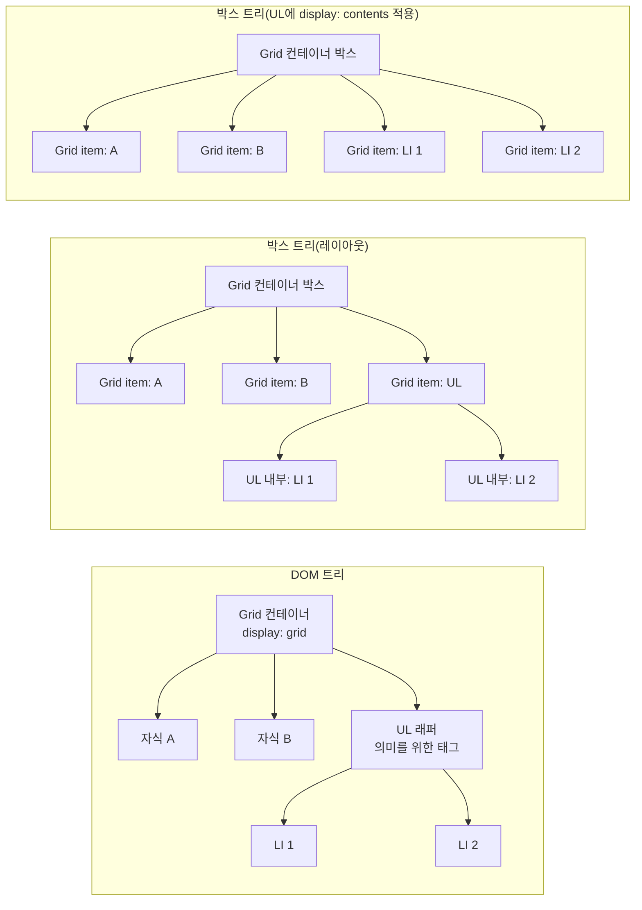

# 있었는데, 없어졌습니다: display: contents로 래퍼 없이 Grid/Flex 정렬하기


한 문장 결론: **레이아웃만 “납작하게” 만들고 싶다면** **`display: contents`****로 래퍼의 박스를 제거해 Grid/Flex의 직접 자식처럼 배치할 수 있다.**


## 배경과 문제


컴포넌트를 쪼개다 보면 “의미(semantics)를 위한 래퍼”가 자연스럽게 생깁니다. 예를 들어 목록을 표현하려고 `<ul>`을 두었는데, 바깥 컨테이너가 `display: grid`인 순간 레이아웃이 꼬이곤 하죠.


포인트는 하나입니다.

- **Grid/Flex는 “직접 자식”만 아이템으로 취급**한다.
- 의미를 위해 둔 래퍼가 **의도치 않게 하나의 Grid/Flex 아이템**이 되면, 내부 요소(예: `<li>`)는 기대한 칸에 배치되지 않는다.

## 핵심 개념


`display: contents`는 “요소 자체의 박스(box)는 만들지 않고, 자식 요소의 박스는 그대로 생성”하는 값입니다. 시각적 레이아웃 관점에서는 **부모-자식 관계가 한 단계 납작해진 것처럼** 동작합니다. ([drafts.csswg.org](https://drafts.csswg.org/css-display/))

> 주의: 문서 트리(DOM)가 바뀌는 게 아니라 **박스 트리(레이아웃 트리)**만 달라집니다. 그래서 선택자 매칭, 이벤트 버블링, 상속 같은 “DOM 기반 의미”는 유지되는 것이 의도입니다. ([drafts.csswg.org](https://drafts.csswg.org/css-display/))

아래 다이어그램을 보면, “DOM은 그대로인데 레이아웃에서만 래퍼가 사라지는” 느낌이 바로 들어옵니다.





→ 기대 결과/무엇이 달라졌는지: **DOM 구조는 유지하면서**, 레이아웃 계산에서만 UL의 박스가 제거되어 **LI가 Grid/Flex 아이템으로 직접 배치**됩니다.


## 해결 접근


같은 문제를 푸는 선택지는 크게 3가지입니다.

1. **래퍼를 아예 없애기(가능하면 최선)**

    React라면 `<Fragment>`로 불필요한 래퍼 엘리먼트를 만들지 않을 수 있습니다. ([react.dev](https://react.dev/reference/react/Fragment?utm_source=chatgpt.com))

2. **래퍼는 두되, Grid/Flex 배치 규칙으로 제어하기**

    예: 래퍼에게 `grid-column`을 주거나, 레이아웃 구조를 재배치해 “직접 자식” 제약을 피합니다.

3. **래퍼의 박스만 없애기:** **`display: contents`**

    의미(예: 리스트/그룹핑)를 위해 래퍼가 필요한데, 레이아웃에서는 “없는 것처럼” 취급하고 싶을 때 선택합니다. ([drafts.csswg.org](https://drafts.csswg.org/css-display/))


이 글은 3)번을 중심으로 정리합니다.


## 구현


### 1) 문제가 드러나는 Grid 예시


```html
<div style="display: grid; grid-template-columns: repeat(2, minmax(0, 1fr));">
  <div style="background: red;">test1</div>
  <div style="background: green;">test2</div>
  <ul>
    <li style="background: blue;">1</li>
    <li style="background: purple;">2</li>
  </ul>
</div>
```


→ 기대 결과/무엇이 달라졌는지: `ul`이 Grid의 “세 번째 아이템”이 되어 별도 칸을 차지하고, `li`는 Grid 아이템으로 배치되지 않아 의도한 2열 흐름이 깨질 수 있습니다.


### 2) `display: contents`로 UL 박스 제거


```html
<div style="display: grid; grid-template-columns: repeat(2, minmax(0, 1fr));">
  <div style="background: red;">test1</div>
  <div style="background: green;">test2</div>
  <ul style="color: #fff; display: contents;">
    <li style="background: blue;">1</li>
    <li style="background: purple;">2</li>
  </ul>
</div>
```


→ 기대 결과/무엇이 달라졌는지: `ul`의 박스가 사라져 **`li`****가 Grid의 직접 자식처럼 배치**됩니다. 동시에 `color`처럼 **상속되는 스타일은** **`li`****에 전달**되는 모습을 확인할 수 있습니다. ([drafts.csswg.org](https://drafts.csswg.org/css-display/))


### 3) Next.js에서 재현하기

- 컴포넌트 스타일은 CSS Modules로 관리하면 “클래스 충돌”을 피하면서 재현이 쉽습니다. ([nextjs.org](https://nextjs.org/docs/14/app/building-your-application/styling/css-modules?utm_source=chatgpt.com))

```typescript
// app/page.tsx
import styles from './page.module.css';

export default function Page() {
  return (
    <main className={styles.grid}>
      <section className={styles.red}>test1</section>
      <section className={styles.green}>test2</section>

      <ul className={styles.contentsList}>
        <li className={styles.blue}>1</li>
        <li className={styles.purple}>2</li>
      </ul>
    </main>
  );
}
```


→ 기대 결과/무엇이 달라졌는지: 마크업은 리스트 구조를 유지하면서, 레이아웃은 `li`가 직접 Grid 아이템이 됩니다.


```css
/* app/page.module.css */
.grid {
  display: grid;
  grid-template-columns: repeat(2, minmax(0, 1fr));
  gap: 12px;
}

.contentsList {
  display: contents;
  color: #fff;
}

.red { background: red; }
.green { background: green; }
.blue { background: blue; }
.purple { background: purple; }
```


→ 기대 결과/무엇이 달라졌는지: `contentsList`는 “박스가 없기 때문에” 배경/패딩/보더 같은 박스 기반 스타일을 기대하기 어렵고, 대신 자식(`li`)에 스타일을 주는 쪽이 자연스럽습니다. ([developer.mozilla.org](https://developer.mozilla.org/en-US/docs/Web/CSS/Reference/Values/display-box))


## 검증 방법(체크리스트)

- [ ] DevTools에서 Grid 오버레이를 켰을 때, `li`가 Grid 아이템으로 잡히는가
- [ ] `ul`에 배경/패딩을 줬을 때 기대대로 보이지 않는다는 점을 이해하고, 필요한 스타일은 `li` 쪽으로 이동했는가 ([developer.mozilla.org](https://developer.mozilla.org/en-US/docs/Web/CSS/Reference/Values/display-box))
- [ ] 스크린리더/접근성 트리에서 리스트 의미가 유지되는지 확인했는가
    - 일부 브라우저 구현에서는 `display: contents`가 요소 자체를 접근성 트리에서 제거해, 리스트/그룹 의미 전달이 달라질 수 있습니다. ([developer.mozilla.org](https://developer.mozilla.org/en-US/docs/Web/CSS/Reference/Properties/display?utm_source=chatgpt.com))
- [ ] `img`, `input`, `iframe` 같은 “replaced element/폼 컨트롤”에는 적용하지 않았는가
    - 이런 요소는 사양에서 `display: contents`가 사실상 `display: none`으로 계산될 수 있습니다. ([drafts.csswg.org](https://drafts.csswg.org/css-display/))
- [ ] 지원 범위는 [Can I use](https://caniuse.com/css-display-contents)로 확인했는가 ([caniuse.com](https://caniuse.com/css-display-contents))

## 흔한 실수/FAQ


### Q1. `display: contents`면 “태그 자체가 DOM에서 사라지나요?”


아니요. DOM은 유지되고, 레이아웃 계산에 쓰이는 박스만 생성되지 않습니다. ([drafts.csswg.org](https://drafts.csswg.org/css-display/))


### Q2. 그럼 이벤트는 어디에 붙나요?


이벤트 버블링은 DOM을 기준으로 동작하므로, `display: contents`로 인해 “이벤트 흐름 자체가 바뀌는 것”은 의도된 동작이 아닙니다. ([drafts.csswg.org](https://drafts.csswg.org/css-display/))


### Q3. 아무 데나 써도 되나요?


레이아웃 문제를 깔끔하게 풀어주지만, 접근성 트리에서의 처리나 “특수 렌더링 요소”는 브라우저 구현 차이가 있을 수 있습니다. 특히 폼 컨트롤/대체 요소(replaced element)에는 적용을 피하는 편이 안전합니다. ([drafts.csswg.org](https://drafts.csswg.org/css-display/))


## 요약(3~5줄)


`display: contents`는 요소의 **박스를 제거**해 자식을 **부모의 직접 자식처럼 레이아웃**에 참여시키는 도구입니다. ([drafts.csswg.org](https://drafts.csswg.org/css-display/))


Grid/Flex에서 “의미를 위한 래퍼” 때문에 생기는 배치 문제를 빠르게 해결합니다. ([caniuse.com](https://caniuse.com/css-display-contents))


다만 접근성 트리에서 요소 의미가 달라질 수 있고, 폼 컨트롤/대체 요소에는 적용이 제한될 수 있어 검증이 필요합니다. ([developer.mozilla.org](https://developer.mozilla.org/en-US/docs/Web/CSS/Reference/Properties/display?utm_source=chatgpt.com))


## 결론


래퍼가 레이아웃을 망가뜨릴 때, 선택지는 “구조를 바꾸기 / 배치 규칙으로 제어하기 / 박스만 없애기”입니다.


그중 `display: contents`는 구조는 유지하면서 레이아웃만 납작하게 만드는 카드입니다. 단, 접근성과 특수 요소 적용 범위는 반드시 테스트하고 적용하세요.


## 참고(공식 문서 링크)

- [MDN: display](https://developer.mozilla.org/en-US/docs/Web/CSS/display)
- [MDN:  (contents/none)](https://developer.mozilla.org/en-US/docs/Web/CSS/display-box)
- [CSS Display Module](https://www.w3.org/TR/css-display-3/)
- [Can I use: display: contents](https://caniuse.com/css-display-contents)
- [React Docs: Fragment](https://react.dev/reference/react/Fragment)
- [Next.js Docs: CSS Modules](https://nextjs.org/docs/app/building-your-application/styling/css-modules)
