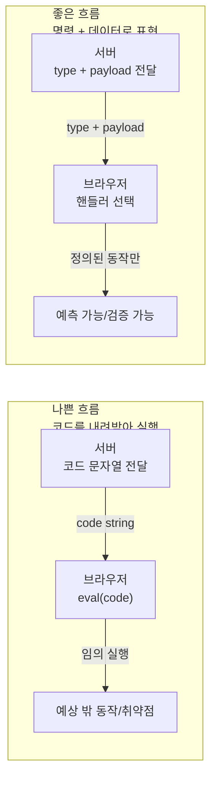

# 문자열을 실행하지 마라: eval을 지우고도 “동적인 UI”는 충분히 만든다


**한 문장 결론:** _동적으로 “행동”이 바뀌어야 한다면, 코드를 내려받아 실행하지 말고_ _**명령(type) + 데이터(payload)**_ _로 표현하자._


왜 이게 중요할까?


`eval()`은 문자열을 코드로 실행하는 “주입 지점(injection sink)”이 되기 쉬워, 작은 실수도 XSS 같은 사고로 커질 수 있다. ([developer.mozilla.org](https://developer.mozilla.org/en-US/docs/Web/JavaScript/Reference/Global_Objects/eval))


게다가 CSP(콘텐츠 보안 정책, Content Security Policy)로 스크립트 실행을 강하게 제한하는 환경에서는 `eval()`이 아예 막히기도 한다. ([developer.mozilla.org](https://developer.mozilla.org/en-US/docs/Web/JavaScript/Reference/Global_Objects/eval))


정리하면, “동적”을 만들려다 보안·운영·디버깅 난이도만 올리는 선택이 되기 쉽다.


---


## 배경/문제


과거 코드에서 이런 패턴을 볼 때가 있다.

- 서버가 “상황에 맞는 코드 문자열”을 내려준다.
- 프런트는 그 문자열을 `eval()`로 실행한다.
- 즉, **데이터가 아니라 코드가 이동**한다.

문제는 명확하다.

- 문자열이 코드가 되는 순간, 입력 검증이 조금만 흔들려도 **임의 코드 실행**으로 이어질 수 있다. ([developer.mozilla.org](https://developer.mozilla.org/en-US/docs/Web/JavaScript/Reference/Global_Objects/eval))
- 보안을 위해 CSP를 적용하면 `eval()`이 차단될 수 있다. ([developer.mozilla.org](https://developer.mozilla.org/en-US/docs/Web/JavaScript/Reference/Global_Objects/eval))

---


## 핵심 개념


### 1) eval은 “문자열을 코드로 실행”한다


```javascript
let value = eval('1 + 1')
console.log(value) // 2

let x = 5
eval('x = 10')
console.log(x) // 10

eval('let y = 10')
console.log(y) // ReferenceError
```


→ 기대 결과/무엇이 달라졌는지: `eval()`은 실행은 되지만, 스코프/선언 규칙이 직관적이지 않아 결과가 예상과 달라질 수 있다. (디버깅 난이도 상승)


`eval()` 자체가 “문자열을 파싱해서 실행”하는 구조라, 보안 관점에서 대표적인 위험 API로 분류된다. ([developer.mozilla.org](https://developer.mozilla.org/en-US/docs/Web/JavaScript/Reference/Global_Objects/eval))


---


### 2) “코드 전달”을 “명령 + 데이터 전달”로 바꿔야 한다


아래 다이어그램을 보면 차이가 빠르게 보인다.





→ 기대 결과/무엇이 달라졌는지: “서버가 코드를 내려준다”는 전제가 사라지고, 프런트는 **정의된 핸들러만** 실행하게 된다.


---


### 3) CSP는 eval 같은 “동적 실행”을 제어한다


CSP는 브라우저에 “어떤 스크립트가 허용되는지”를 선언적으로 알려서, XSS 같은 공격을 완화하는 방어선이다. ([developer.mozilla.org](https://developer.mozilla.org/en-US/docs/Web/HTTP/Guides/CSP))


즉, `eval()`에 기대는 설계는 CSP를 강화할수록 충돌 가능성이 커진다.


---


## 해결 접근


핵심 전략은 2가지다.

1. **명령 레지스트리(Registry)로 실행 경로를 고정**
- 왜: 실행 가능한 행동을 “코드 문자열”이 아니라 “허용된 목록”으로 제한하려고
- 기대 결과: 동작이 예측 가능해지고, 입력 검증/로깅/테스트가 쉬워진다.
1. **payload 검증(Validation)으로 입력 계약을 고정**
- 왜: type은 맞아도 payload가 깨지면 런타임 에러·취약점으로 번지기 쉬워서
- 기대 결과: 실패 조건이 명확해지고, 장애 재현과 회귀 테스트가 쉬워진다.

### 대안/비교 (최소 2개)

- 대안 A) **명령(type)+데이터(payload) + 레지스트리** ✅ 추천
    - 장점: 단순, 테스트 쉬움, 실행 경로 고정
    - 단점: 명령이 많아지면 설계(도메인 모델링)가 필요
- 대안 B) **서버 주도 UI(Server-Driven UI) 스키마**
    - 장점: UI 구성을 “데이터”로 내려서 다양하게 조합 가능
    - 단점: 스키마/컴포넌트 매핑/버전 호환 전략이 필요
- 대안 C) **제한된 DSL(도메인 전용 언어) + 파서**
    - 장점: “규칙”은 동적으로 바꾸되 실행 범위는 제한
    - 단점: 파서/실행기 구현·검증 비용이 든다

---


## 구현(코드)


아래 예시는 Next.js에서 **API Route가 “명령”을 내려주고**, Client Component가 **레지스트리로 실행**하는 형태다.


### 1) 서버: 명령 내려주기 (API Route)


`app/api/command/route.js`


```javascript
export async function GET() {
  // 예: 서버가 판단한 다음 액션
  const command = {
    type: 'TOAST',
    payload: { message: '저장되었습니다.' },
  }

  return Response.json(command)
}
```


→ 기대 결과/무엇이 달라졌는지: 서버는 “실행할 코드”가 아니라, **의미가 있는 데이터(JSON)** 를 내려준다.


---


### 2) 클라이언트: 레지스트리로 실행하기 (Client Component)


`app/command-consumer.jsx`


```javascript
'use client'

import { useEffect } from 'react'

const handlers = {
  TOAST: ({ message }) => {
    // 예시: 실제 서비스에서는 토스트 라이브러리로 대체
    alert(message)
  },
  NAVIGATE: ({ href }) => {
    window.location.href = href
  },
}

function assertCommandShape(command) {
  if (!command || typeof command !== 'object') return false
  if (typeof command.type !== 'string') return false
  if (!('payload' in command)) return false
  return true
}

export default function CommandConsumer() {
  useEffect(() => {
    let cancelled = false

    async function run() {
      const res = await fetch('/api/command', { cache: 'no-store' })
      const command = await res.json()

      if (cancelled) return
      if (!assertCommandShape(command)) return

      const handler = handlers[command.type]
      if (!handler) return

      // payload는 type별로 더 엄격하게 검증하는 편이 안전하다.
      handler(command.payload)
    }

    run()

    return () => {
      cancelled = true
    }
  }, [])

  return null
}
```


→ 기대 결과/무엇이 달라졌는지: 실행 가능한 동작은 `handlers`에 **명시된 것만** 가능해진다. `eval()` 없이도 “동적 행동”은 구현된다.


---


### 3) (선택) CSP 적용 힌트: Next.js에서 헤더로 관리하기


CSP는 “환경/정책에 따라 달라질 수” 있지만, Next.js에서는 공식 가이드처럼 **응답 헤더로 CSP를 설정**하는 방식을 안내한다. ([nextjs.org](https://nextjs.org/docs/app/guides/content-security-policy))

- 왜: 브라우저가 스크립트 실행 규칙을 강제하도록 하려고
- 기대 결과: 우발적인 인라인 스크립트/동적 실행이 줄고, XSS 완화에 도움이 된다. ([developer.mozilla.org](https://developer.mozilla.org/en-US/docs/Web/HTTP/Guides/CSP))
> 여기서 중요한 건 “`eval()`을 허용하는 방향으로 CSP를 완화”하기보다, 애초에 `eval()` 의존을 제거하는 설계로 가는 것이다. ([developer.mozilla.org](https://developer.mozilla.org/en-US/docs/Web/JavaScript/Reference/Global_Objects/eval))

---


## 검증 방법(체크리스트)

- [ ] 코드베이스에서 `eval(`, `new Function(`, `setTimeout("...")` 같은 문자열 실행 패턴을 검색해 제거/격리했다. ([developer.mozilla.org](https://developer.mozilla.org/en-US/docs/Web/JavaScript/Reference/Global_Objects/eval))
- [ ] 서버 응답은 `{ type, payload }` 형태로 통일했고, type별 payload 계약을 문서화했다.
- [ ] 알 수 없는 `type`은 무시(또는 로깅)하며, **기본 동작으로 실행되지 않는다**.
- [ ] payload 검증 실패 시의 처리(무시/에러/리포트)가 일관되다.
- [ ] CSP 적용 시 콘솔에서 스크립트 차단 경고가 없는지 확인했다(Report-Only 모드 활용 포함). ([developer.mozilla.org](https://developer.mozilla.org/en-US/docs/Web/HTTP/Guides/CSP))

---


## 흔한 실수/FAQ


### Q1. “서버가 상황에 따라 다른 로직을 내려줘야” 하는데요?


A. 로직을 내려주지 말고, **서버가 판단한 결과를 명령(type)으로 표현**하자. 프런트는 그 명령을 해석해 실행한다. (서버는 정책/판단, 프런트는 표현/실행)


### Q2. “정말 동적으로 계산식을 내려서 평가해야” 한다면요?


A. 가능한 선택지는 2가지다.


- 계산식을 **제한된 DSL**로 만들고 파서/실행기를 둔다.


- 또는 계산 자체를 **서버에서 수행**하고 결과만 내려준다.


둘 다 “임의 JS 실행”보다 계약이 명확해진다.


### Q3. CSP 때문에 어떤 라이브러리가 동작을 안 해요


A. 원인이 `eval()`류 동적 실행 요구일 수 있다. 우선 해당 지점을 찾아 **대체 가능한 구현/라이브러리인지** 검토하고, 불가피할 때만 CSP 정책을 조정한다. ([owasp.org](https://owasp.org/www-project-web-security-testing-guide/latest/4-Web_Application_Security_Testing/02-Configuration_and_Deployment_Management_Testing/12-Test_for_Content_Security_Policy?utm_source=chatgpt.com))


---


## 요약(3~5줄)

- `eval()`은 문자열을 코드로 실행해, 보안 사고의 출발점이 되기 쉽다. ([developer.mozilla.org](https://developer.mozilla.org/en-US/docs/Web/JavaScript/Reference/Global_Objects/eval))
- 동적인 UI가 필요하면 “코드 전달”이 아니라 **명령(type) + 데이터(payload)** 로 설계하자.
- 프런트는 레지스트리로 실행 경로를 고정하고, payload 검증으로 입력 계약을 지킨다.
- CSP는 동적 실행을 제어하는 방어선이며, Next.js에서는 헤더로 관리하는 가이드를 제공한다. ([nextjs.org](https://nextjs.org/docs/app/guides/content-security-policy))

---


## 결론


`eval()`이 필요해 보이는 순간은 대개 “동적 실행”이 아니라 “동적 선택”이 필요한 경우가 많다.


선택은 데이터로 표현할 수 있다. **type + payload** 로 바꾸면, 보안·테스트·유지보수까지 한 번에 정리된다.


---


## 참고(공식 문서 링크)

- [MDN: eval()](https://developer.mozilla.org/en-US/docs/Web/JavaScript/Reference/Global_Objects/eval)
- [Next.js Docs: Content Security Policy](https://nextjs.org/docs/app/guides/content-security-policy)
- [MDN: Content Security Policy (CSP)](https://developer.mozilla.org/en-US/docs/Web/HTTP/Guides/CSP)
- [OWASP: Cross Site Scripting Prevention Cheat Sheet](https://cheatsheetseries.owasp.org/cheatsheets/Cross_Site_Scripting_Prevention_Cheat_Sheet.html)
- [OWASP: Content Security Policy Cheat Sheet](https://cheatsheetseries.owasp.org/cheatsheets/Content_Security_Policy_Cheat_Sheet.html)
