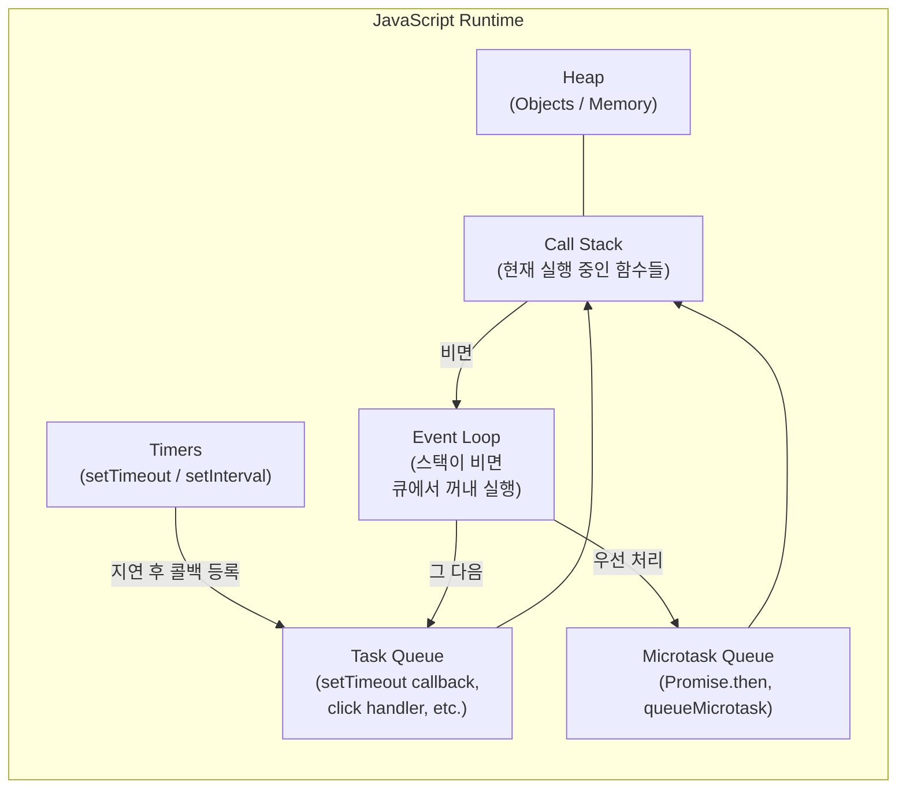

# 정확한 시간은 없다: `setTimeout`·`setInterval`이 “최소 지연”인 이유(이벤트 루프)


**요약**

- `setTimeout(ms)`/`setInterval(ms)`의 `ms`는 "정확한 실행 시각"이 아니라 **최소 대기시간**에 가깝다. ([MDN — setTimeout](https://developer.mozilla.org/en-US/docs/Web/API/Window/setTimeout), [MDN — setInterval](https://developer.mozilla.org/en-US/docs/Web/API/Window/setInterval))
- 콜백은 "시간이 지나면 즉시 실행"이 아니라, **이벤트 루프가 다음 태스크를 꺼낼 수 있을 때** 실행된다. ([MDN — JavaScript execution model](https://developer.mozilla.org/en-US/docs/Web/JavaScript/Reference/Execution_model))
- 탭이 백그라운드로 가면 타이머가 더 지연되거나 실행 빈도가 제한될 수 있다. ([MDN — Page Visibility API](https://developer.mozilla.org/en-US/docs/Web/API/Page_Visibility_API))
- 반복 작업은 목적에 따라 `setInterval` 외 대안(재귀 `setTimeout`, `requestAnimationFrame`)을 섞는 편이 안전하다. ([MDN — requestAnimationFrame](https://developer.mozilla.org/en-US/docs/Web/API/Window/requestAnimationFrame))

---


## 배경/문제


`setTimeout(fn, 1000)`을 “1초 뒤 실행”이라고 이해하면, 운영에서 한 번쯤은 당한다.


로그가 늦게 찍히고, UI가 버벅이고, “왜 시간 맞춰서 안 돌아가지?”가 된다.


포인트는 간단하다.

- 브라우저는 “정확히 그 시각”에 실행을 보장하지 않는다.
- 자바스크립트는 한 번에 하나의 작업만 처리하며, **실행 중인 작업이 끝나야** 다음 작업을 실행한다. ([MDN — JavaScript execution model](https://developer.mozilla.org/en-US/docs/Web/JavaScript/Reference/Execution_model))

이제 “왜 ms가 정확하지 않은지”를, 그림(다이어그램)으로 먼저 잡고 가자.


---


## 핵심 개념


### 런타임 구성요소를 한 장으로 보기





**기대 결과/무엇이 달라졌는지**

- “타이머 콜백은 시간이 되면 바로 실행”이 아니라, **큐에 들어가고 스택이 빌 때 실행**된다는 흐름이 눈에 보인다.
- 마이크로태스크가 태스크보다 먼저 처리된다는 우선순위도 같이 정리된다.

---


### 1) 콜스택(Call Stack)


현재 실행 중인 함수 호출이 쌓이는 곳이다.


스택이 바쁘면(= 긴 동기 작업이 돌면) 타이머 콜백은 끼어들 수 없다. ([MDN — JavaScript execution model](https://developer.mozilla.org/en-US/docs/Web/JavaScript/Reference/Execution_model))


### 2) 태스크 큐(Task Queue)와 이벤트 루프(Event Loop)


`setTimeout`은 “지연 시간”이 지나면 콜백을 **태스크로 큐에 등록**한다.


그리고 이벤트 루프는 **콜스택이 비었을 때** 큐에서 태스크를 꺼내 실행한다. ([MDN — JavaScript execution model](https://developer.mozilla.org/en-US/docs/Web/JavaScript/Reference/Execution_model))


### 3) 마이크로태스크(Microtask)


`Promise.then`, `queueMicrotask` 같은 콜백은 마이크로태스크 큐로 들어가며, **일반 태스크보다 우선 처리**되는 성격이 있다. ([MDN — Microtask guide](https://developer.mozilla.org/en-US/docs/Web/API/HTML_DOM_API/Microtask_guide))


### 4) 브라우저 정책(백그라운드 타이머 지연)


탭이 비활성화되면 타이머는 배터리/성능을 위해 지연되거나 제한될 수 있다. ([MDN — Page Visibility API](https://developer.mozilla.org/en-US/docs/Web/API/Page_Visibility_API))


---


## 해결 접근


“타이머가 정확하지 않다”로 끝내면 계속 흔들린다. 아래 3가지를 기준으로 설계를 바꾸는 게 핵심이다.

1. `ms`는 **최소 대기시간**이라고 전제한다. ([MDN — setTimeout](https://developer.mozilla.org/en-US/docs/Web/API/Window/setTimeout))
2. 반복/애니메이션/즉시 실행 같은 목적별로 **도구를 분리**한다. (`setInterval` vs 재귀 `setTimeout` vs `requestAnimationFrame` vs 마이크로태스크)
3. Next.js에서는 **서버/클라이언트 경계**를 먼저 확정한다. 브라우저 전용 로직은 Client Component에서 `useEffect`로 시작하는 편이 안전하다. ([Next.js Docs — Server and Client Components](https://nextjs.org/docs/app/getting-started/server-and-client-components))

---


## 구현(코드)


### 1) “0ms”라도 즉시 실행이 아닌 걸 확인하기


```javascript
console.log("A");

setTimeout(() => {
  console.log("B (timeout)");
}, 0);

console.log("C");
```


**기대 결과/무엇이 달라졌는지**

- 출력은 보통 `A → C → B` 순서가 된다.
- `0ms`는 “바로 실행”이 아니라 “가능해지는 순간에 태스크로 실행”에 가깝다.

---


### 2) 콜스택이 바쁘면 타이머는 더 늦어진다


```javascript
const start = performance.now();

setTimeout(() => {
  console.log("timeout after:", Math.round(performance.now() - start), "ms");
}, 50);

// 일부러 메인 스레드를 막아보기
while (performance.now() - start < 200) {
  // busy wait
}
```


**기대 결과/무엇이 달라졌는지**

- `50ms`를 줬더라도 실제 로그는 대개 `200ms` 근처로 찍힌다.
- “지연 시간 경과” 이후에도 **콜스택이 비기 전까지** 콜백이 실행되지 않기 때문이다.

---


### 3) 마이크로태스크 vs 타이머: 실행 순서 차이


```javascript
setTimeout(() => console.log("timeout"), 0);

queueMicrotask(() => console.log("microtask"));

Promise.resolve().then(() => console.log("promise"));

console.log("sync");
```


**기대 결과/무엇이 달라졌는지**

- 출력은 보통 `sync → microtask/promise → timeout` 순서가 된다.
- 마이크로태스크 큐가 태스크 큐보다 먼저 비워지는 흐름 때문이다.

---


### 4) 반복 작업 대안: 재귀 `setTimeout` + 기준 시간 보정


`setInterval`은 콜백 실행 시간이 섞이거나 탭이 비활성화될 때 주기와 어긋나기 쉽다.


이럴 땐 “다음 실행 시각”을 계산하는 패턴이 드리프트(지연 누적)를 줄인다.


```javascript
function startTicker(intervalMs, onTick) {
  let expected = performance.now() + intervalMs;
  let timerId;

  const step = () => {
    const now = performance.now();
    const drift = now - expected;

    onTick({ now, drift });

    expected += intervalMs;
    timerId = setTimeout(step, Math.max(0, intervalMs - drift));
  };

  timerId = setTimeout(step, intervalMs);

  return () => clearTimeout(timerId);
}

// 사용 예
const stop = startTicker(1000, ({ drift }) => {
  console.log("tick drift:", Math.round(drift), "ms");
});

// 필요 시 stop()
```


**기대 결과/무엇이 달라졌는지**

- 콜백이 늦게 실행되더라도 다음 대기 시간을 보정해 **주기 누적 오차를 줄인다.**
- “항상 정확히 1초”가 아니라 “가능한 한 일정한 페이스”로 맞추는 방식이다.

---


### 5) Next.js에서 타이머는 “Client Component + cleanup”이 기본값


```typescript
'use client';

import { useEffect, useState } from 'react';

export default function AutoRefreshBadge() {
  const [count, setCount] = useState(0);

  useEffect(() => {
    const id = window.setInterval(() => {
      setCount((c) => c + 1);
    }, 1000);

    return () => window.clearInterval(id);
  }, []);

  return <span>ticks: {count}</span>;
}
```


**기대 결과/무엇이 달라졌는지**

- 컴포넌트가 마운트된 뒤에만 타이머가 시작되고, 언마운트 시 정리되어 **메모리 누수/중복 실행**을 줄인다.
- 브라우저 전용 API(`window`)를 서버에서 실행하는 실수를 예방한다.

---


## 검증 방법(체크리스트)

- [ ] `performance.now()`로 “요청한 ms” vs “실제 경과 시간”을 로그로 비교한다.
- [ ] 동기 루프(무거운 계산)를 넣어 **콜스택이 바쁠 때 지연이 커지는지** 재현한다.
- [ ] 탭을 백그라운드로 보내 **지연/실행 빈도 변화**를 확인한다. ([MDN — Page Visibility API](https://developer.mozilla.org/en-US/docs/Web/API/Page_Visibility_API))
- [ ] 반복 로직은 `setInterval`과 “재귀 `setTimeout` 보정”을 둘 다 돌려 **드리프트 차이**를 비교한다.
- [ ] 애니메이션은 `setInterval` 대신 `requestAnimationFrame`으로 바꿨을 때 **프레임/리페인트 타이밍**이 안정적인지 확인한다. ([MDN — requestAnimationFrame](https://developer.mozilla.org/en-US/docs/Web/API/Window/requestAnimationFrame))

---


## 흔한 실수/FAQ


### Q1. “그럼 setTimeout은 믿을 수 없는 API인가요?”


아니다. “정확한 시각 예약”이 아니라 “최소 지연 후 실행 예약”으로 쓰면 된다.


디바운스, 재시도(backoff), UI 딜레이 같은 용도엔 잘 맞는다. ([MDN — setTimeout](https://developer.mozilla.org/en-US/docs/Web/API/Window/setTimeout))


### Q2. 애니메이션을 `setInterval`로 돌려도 되나요?


가능은 하지만 목적에 따라 흔들릴 수 있다.


애니메이션은 **리페인트 직전에 호출되는** `requestAnimationFrame`이 더 자연스럽다. ([MDN — requestAnimationFrame](https://developer.mozilla.org/en-US/docs/Web/API/Window/requestAnimationFrame))


### Q3. 백그라운드에서도 정확히 돌려야 한다면?


브라우저는 백그라운드에서 타이머를 제한할 수 있다.


이럴 땐 “정확한 주기 실행”보다 **기준 시간 기반으로 상태를 재계산**(예: `Date.now()`/`performance.now()` 기준)하는 방식이 보통 더 견고하다.


필요하면 가시성 변화에 맞춰 동작을 조정한다. ([MDN — Page Visibility API](https://developer.mozilla.org/en-US/docs/Web/API/Page_Visibility_API))


---


## 결론

- `setTimeout`/`setInterval`의 `ms`는 **정확한 실행 시각이 아니라 최소 지연**이다.
- 타이머 콜백은 **큐에 들어간 뒤**, 콜스택이 비고 이벤트 루프가 꺼낼 수 있을 때 실행된다.
- 반복·애니메이션·즉시 실행을 목적별로 분리하면, “왜 늦는지”가 아니라 “늦어도 안전한 설계”로 바뀐다.

---


## 참고(공식 문서 링크)

- [Next.js Docs — Server and Client Components](https://nextjs.org/docs/app/getting-started/server-and-client-components)
- [React Docs — useEffect](https://react.dev/reference/react/useEffect)
- [MDN — setTimeout](https://developer.mozilla.org/en-US/docs/Web/API/Window/setTimeout)
- [MDN — setInterval](https://developer.mozilla.org/en-US/docs/Web/API/Window/setInterval)
- [MDN — JavaScript execution model](https://developer.mozilla.org/en-US/docs/Web/JavaScript/Reference/Execution_model)
- [MDN — Microtask guide](https://developer.mozilla.org/en-US/docs/Web/API/HTML_DOM_API/Microtask_guide)
- [MDN — queueMicrotask](https://developer.mozilla.org/en-US/docs/Web/API/Window/queueMicrotask)
- [MDN — requestAnimationFrame](https://developer.mozilla.org/en-US/docs/Web/API/Window/requestAnimationFrame)
- [MDN — Page Visibility API](https://developer.mozilla.org/en-US/docs/Web/API/Page_Visibility_API)
