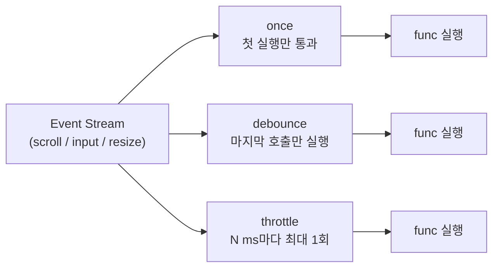

# 필요한 만큼만 호출하라: `once·debounce·throttle`로 함수 실행 제어하기


한 문장 결론: **이벤트는 그대로 두고 “실행”만 줄이면, UX는 부드러워지고 비용(렌더/네트워크/배터리)은 내려간다.**


자주 호출되는 함수는 대부분 “기능”이 아니라 “빈도” 때문에 문제가 됩니다.


스크롤·리사이즈·입력 같은 이벤트는 매우 촘촘하게 발생하고, 그때마다 API 호출이나 무거운 계산을 붙이면 체감 성능이 바로 흔들리죠.


포인트는 단순합니다. **호출을 막는 게 아니라, 실행 타이밍을 설계**하는 겁니다.


---


## 배경/문제


프런트엔드에서 흔히 마주치는 패턴은 이렇습니다.

- 입력할 때마다 자동 저장/검색 API가 호출된다.
- 스크롤할 때마다 헤더 상태/애니메이션/레이아웃 계산이 수행된다.
- “초기화 함수”가 의도보다 여러 번 실행된다(재렌더, 이벤트 중복 바인딩 등).

이런 상황에서 필요한 건 “이벤트를 줄이는 기술”이 아니라 **함수 실행을 제어하는 래퍼(wrapper)** 입니다. 대표적으로 `lodash`의 `once`, `debounce`, `throttle`이 여기에 해당합니다.


---


## 핵심 개념


아래 다이어그램을 보면 세 가지가 무엇을 바꾸는지 한 번에 정리됩니다.





→ 기대 결과/무엇이 달라졌는지: 이벤트가 많이 발생해도, “언제 실행할지” 규칙이 고정되어 호출 폭주를 제어할 수 있습니다.


### 1) `once`: “초기화는 한 번만”

- **목적**: 같은 함수를 여러 번 호출해도, 실제 실행은 최초 1회로 제한
- **기대 결과**: 초기화·설정·싱글톤 로딩 같은 로직이 중복 실행되지 않음

### 2) `debounce`: “멈춘 뒤 한 번만”

- **목적**: 연속 호출이 이어지는 동안은 미루고, **마지막 호출 이후 일정 시간 동안 추가 호출이 없을 때** 실행
- **기대 결과**: 타이핑/드래그처럼 이벤트가 폭주해도, “마지막 순간”에만 실행

### 3) `throttle`: “자주 하되, 간격은 지킨다”

- **목적**: 연속 호출이 와도 **정해진 간격마다 최대 1회**만 실행
- **기대 결과**: 스크롤/리사이즈처럼 실시간성이 필요한 이벤트를 “적당히” 따라감

---


## 해결 접근


### 언제 무엇을 선택할까?

- **`once`**: “초기화가 중복되면 안 된다” → SDK 초기화, 단일 이벤트 바인딩, 단일 리스너 설치
- **`debounce`**: “마지막 값이 중요하고 실시간일 필요는 없다” → 자동 저장, 검색어 추천, 유효성 검사
- **`throttle`**: “실시간성이 어느 정도 필요하다” → 스크롤 위치 기반 UI, 리사이즈 기반 레이아웃 계산

### 대안/비교 (최소 2개)

1. **직접 구현**: `setTimeout` 기반 debounce, `requestAnimationFrame` 기반 throttle
    - 장점: 의존성/번들 부담이 적음
    - 단점: 취소/플러시, 옵션(leading/trailing) 등 디테일을 직접 관리해야 함
2. **React 렌더 우선순위로 푸는 방식**: `useDeferredValue`, `startTransition`
    - 장점: “네트워크 호출 지연”이 아니라 **렌더링 부담을 분리**하는 데 강함
    - 단점: 이벤트 호출 자체를 줄이는 도구는 아니라서, API 호출 폭주 방지는 별도 전략이 필요

정리하면, **API 호출/외부 시스템 동기화는** **`debounce/throttle`**, **무거운 렌더 부담은 React 우선순위 도구**가 잘 맞습니다.


---


## 구현(코드)


아래 예시는 **Next.js에서 브라우저 API(이벤트/타이머)를 쓰는 코드**이므로 **Client Component**로 작성합니다.


### 1) `debounce`로 “타이핑 멈추면 자동 저장” 만들기


```typescript
'use client';

import { useEffect, useMemo, useState } from 'react';
import debounce from 'lodash/debounce';

async function saveDraft(text: string) {
  // 예시: 실제로는 Route Handler나 API 엔드포인트로 전송
  await fetch('/api/draft', {
    method: 'POST',
    headers: { 'content-type': 'application/json' },
    body: JSON.stringify({ text }),
  });
}

export default function DebouncedEditor() {
  const [text, setText] = useState('');

  // 핵심: debounce로 만든 함수는 "렌더마다 새로 만들지" 않는 게 중요
  const debouncedSave = useMemo(() => debounce(saveDraft, 600), []);

  // 언마운트 시점에 남은 타이머/예약 실행을 정리
  useEffect(() => {
    return () => {
      debouncedSave.cancel();
    };
  }, [debouncedSave]);

  return (
    <label style={{ display: 'block' }}>
      <div style={{ marginBottom: 8 }}>Draft</div>
      <textarea
        value={text}
        onChange={(e) => {
          const next = e.target.value;
          setText(next);
          debouncedSave(next);
        }}
        rows={6}
        style={{ width: '100%' }}
      />
    </label>
  );
}
```


→ 기대 결과/무엇이 달라졌는지: 타이핑 중에는 요청이 쌓이지 않고, 입력이 “멈춘 뒤” 한 번만 저장 요청이 발생합니다.


---


### 2) `throttle`로 “스크롤 핸들러 간격 제한”하기


```typescript
'use client';

import { useEffect, useMemo, useState } from 'react';
import throttle from 'lodash/throttle';

export default function ThrottledScrollIndicator() {
  const [y, setY] = useState(0);

  const onScroll = useMemo(
    () =>
      throttle(() => {
        setY(window.scrollY);
      }, 100),
    []
  );

  useEffect(() => {
    // 핵심: add/removeEventListener는 "같은 함수 참조"로 관리해야 함
    window.addEventListener('scroll', onScroll, { passive: true });

    return () => {
      window.removeEventListener('scroll', onScroll);
      onScroll.cancel();
    };
  }, [onScroll]);

  return (
    <div style={{ position: 'sticky', top: 0, padding: 12, background: 'white' }}>
      scrollY: {Math.round(y)}
    </div>
  );
}
```


→ 기대 결과/무엇이 달라졌는지: 스크롤 이벤트가 촘촘해도 상태 업데이트가 과도하게 발생하지 않아, UI가 더 안정적으로 유지됩니다.


---


### 3) `once`로 “초기화는 한 번만” 보장하기


```typescript
'use client';

import { useEffect } from 'react';
import once from 'lodash/once';

const initAnalyticsOnce = once(() => {
  // 예시: SDK 초기화 / 전역 리스너 등록 / 단일 설정 로딩 등
  window.__analytics_inited__ = true;
});

export default function AnalyticsInit() {
  useEffect(() => {
    initAnalyticsOnce();
  }, []);

  return null;
}

declare global {
  interface Window {
    __analytics_inited__?: boolean;
  }
}
```


→ 기대 결과/무엇이 달라졌는지: 컴포넌트가 다시 마운트되거나 Effect가 재실행되어도, 초기화 로직은 최초 1회만 실행됩니다.


---


## 검증 방법(체크리스트)

- [ ] 타이핑을 빠르게 해도 저장/검색 요청이 “멈춘 뒤” 한 번만 나간다(`debounce`)
- [ ] 스크롤 중에도 상태 업데이트가 일정 간격으로만 발생한다(`throttle`)
- [ ] 컴포넌트 재마운트/재렌더 상황에서도 초기화가 중복 실행되지 않는다(`once`)
- [ ] 언마운트 시 `cancel()`로 예약 실행이 정리되어, 경고(언마운트 후 setState 등)가 없다
- [ ] 이벤트 리스너가 누적되지 않는다(DevTools에서 리스너 개수 확인)

---


## 흔한 실수/FAQ


### Q1. `debounce`/`throttle` 함수를 렌더마다 새로 만들면 왜 안 되나요?


새 함수가 만들어지면 내부 타이머/상태가 초기화됩니다.


특히 이벤트 리스너는 “함수 참조”로 제거되기 때문에, 참조가 바뀌면 `removeEventListener`가 제대로 동작하지 않을 수 있습니다.


### Q2. `debounce`와 `throttle` 중 뭐가 더 성능이 좋나요?


성능보다 **의도**가 먼저입니다.

- 마지막 입력만 중요하면 `debounce`
- 중간 중간 업데이트가 필요하면 `throttle`

### Q3. 옵션(`leading/trailing`)은 언제 만지나요?

- “바로 한 번 보여주고, 이후는 묶고 싶다” → `leading`을 고려
- “끝에 반드시 한 번 더 실행돼야 한다” → `trailing`을 고려
옵션은 UX 요구사항(즉시성 vs 확정 시점)에 맞춰 결정하는 게 안전합니다.

---


## 요약(3~5줄)

- 이벤트 자체를 줄이기 어렵다면, **함수 실행 타이밍을 제어**하는 게 정답이다.
- `once`는 “초기화 1회”, `debounce`는 “멈춘 뒤 1회”, `throttle`은 “간격마다 1회”다.
- Next.js에서는 브라우저 API를 쓰는 코드가 **Client Component 경계** 안에 있어야 한다.
- 래퍼 함수는 **참조를 고정(useMemo/useRef)** 하고, 언마운트 시 **cancel/리스너 정리**를 습관화한다.

---


## 결론


함수 실행 제어는 “미세 최적화”가 아니라 **UX 안정화 전략**입니다.


한 번만, 멈춘 뒤 한 번만, 일정 간격으로만. 이 세 가지 규칙만 잘 적용해도 스크롤·입력·리사이즈에서 발생하는 대부분의 호출 폭주는 정리됩니다.


---


## 참고(공식 문서 링크)

- [Lodash Docs](https://lodash.com/docs)
- [Next.js: ](https://nextjs.org/docs/app/api-reference/directives/use-client)[`use client`](https://nextjs.org/docs/app/api-reference/directives/use-client)[ Directive](https://nextjs.org/docs/app/api-reference/directives/use-client)
- [React: ](https://react.dev/reference/react/useEffect)[`useEffect`](https://react.dev/reference/react/useEffect)
- [React: ](https://react.dev/reference/react/useDeferredValue)[`useDeferredValue`](https://react.dev/reference/react/useDeferredValue)
- [React: ](https://react.dev/reference/react/startTransition)[`startTransition`](https://react.dev/reference/react/startTransition)
- [MDN: ](https://developer.mozilla.org/ko/docs/Web/API/EventTarget/addEventListener)[`addEventListener`](https://developer.mozilla.org/ko/docs/Web/API/EventTarget/addEventListener)
- [MDN: ](https://developer.mozilla.org/ko/docs/Web/API/EventTarget/removeEventListener)[`removeEventListener`](https://developer.mozilla.org/ko/docs/Web/API/EventTarget/removeEventListener)
- [MDN: ](https://developer.mozilla.org/ko/docs/Web/API/Window/requestAnimationFrame)[`requestAnimationFrame`](https://developer.mozilla.org/ko/docs/Web/API/Window/requestAnimationFrame)
