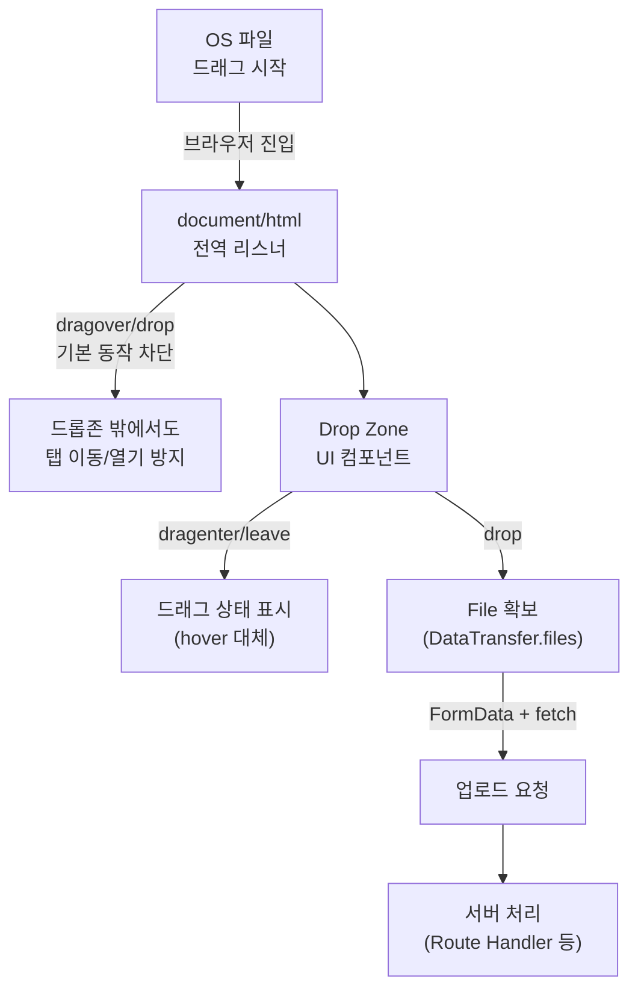

# 기본 동작부터 끊어라: File Drag & Drop 업로드 UX


**한 문장 결론:** 드롭존(drop zone)만 만들지 말고, _페이지 전역에서 브라우저 기본 동작(파일 열기/탭 이동)을 먼저 차단_하면 “뚱뚱한 손가락” 같은 실수도 안전하게 막을 수 있다.


드래그 앤 드롭으로 파일 업로드를 붙이는 건 어렵지 않습니다. 문제는 “실수”가 자주 난다는 점입니다.


드롭존을 조금만 빗나가도 브라우저가 파일을 열어버리거나, 새 탭/다운로드 흐름으로 가는 순간 UX가 깨집니다. 그래서 핵심은 기능 구현이 아니라 **안전장치(기본 동작 차단) + 대체 입력(클릭 업로드)**를 함께 설계하는 것입니다.


---


## 배경/문제

- 사용자는 파일을 끌어다 놓을 때, 정확히 지정된 영역에만 떨어뜨리지 않습니다.
- 브라우저는 “파일 드롭”을 자체적으로 처리하려는 기본 동작을 가지고 있어, 드롭존 밖에서 놓으면 예상치 못한 화면 전환이 발생할 수 있습니다.
- 드래그 중에는 `:hover` 같은 스타일이 기대대로 동작하지 않는 경우가 많아, 별도의 상태(드래그 진입/이탈)를 UI에 반영해야 합니다.

정리하면, 드롭존만 구현하면 “작동은 하지만 불안한 업로드 UI”가 됩니다.


---


## 핵심 개념


드래그 앤 드롭 업로드는 이벤트 흐름이 거의 고정입니다.

- `dragover`: “드롭 가능” 상태를 유지시키는 이벤트 (여기서 기본 동작을 막아야 드롭이 성립)
- `drop`: 실제로 파일을 받는 이벤트
- `dragenter` / `dragleave`: 드롭존 하이라이트(hover 대체)를 만들기 위한 상태 트리거

아래 다이어그램을 보면, **전역 차단(루트 리스너) → 드롭존 처리(컴포넌트) → 업로드 요청**이 한 흐름으로 이어집니다.





→ 기대 결과/무엇이 달라졌는지: 드롭존을 빗나가도 브라우저가 파일을 “열어버리는” 사고를 막습니다. 드래그 중 UI 피드백이 안정적으로 유지됩니다.


---


## 해결 접근


### 1) 전역에서 “파일 드롭” 기본 동작을 먼저 차단한다 (안전장치)


왜 하냐면, 사용자는 항상 드롭존에 정확히 놓지 않기 때문입니다.


기대 결과는 단순합니다. **실수로 페이지 어디에 떨어뜨려도 브라우저가 파일을 열지 않게** 됩니다.


### 2) 드롭존은 “드래그 + 클릭” 하이브리드로 만든다 (대체 입력)


드래그만 강제하면 멀티 모니터/멀티 윈도우 환경에서 불편합니다.


드롭존을 클릭하면 파일 선택 창이 열리게 만들어서, **드래그가 어려운 상황에서도 같은 기능을 제공**합니다.


### 3) hover 대신 “드래그 진입/이탈 상태”로 스타일을 제어한다 (UI 안정화)


드래그 중에는 CSS 의사 클래스만으로 UX를 만들기 어렵습니다.


`dragenter/dragleave`로 상태를 만들면, 드롭 가능한 순간을 더 명확하게 표현할 수 있습니다.


### 대안/비교 (최소 2개)

- **대안 A:** **`<input type="file">`****만 사용**
구현은 가장 단순하지만, 드래그 앤 드롭 UX는 제공하지 못합니다.
- **대안 B: 드래그 앤 드롭 + 클릭 업로드(이 글의 방식)**
안전장치(전역 차단)까지 포함하면 “실수”가 줄고, 사용성도 좋아집니다.
- **대안 C: 라이브러리 사용(예: dropzone 류)**
교차 브라우저 처리와 기능(accept, 캡처, 프리뷰, 다중 업로드 등)을 빠르게 붙일 수 있지만, 프로젝트 정책/번들 크기/커스터마이징 비용을 같이 봐야 합니다.

---


## 구현(코드)


### 1) Client Component: Drop Zone UI + 전역 차단

> 파일 드래그 이벤트와 `document` 접근이 있으므로 **Client Component**로 작성합니다.

```javascript
'use client'

import { useEffect, useId, useMemo, useRef, useState } from 'react'

function isFileDrag(event) {
  const dt = event.dataTransfer
  if (!dt) return false

  // Files 드래그 여부를 최대한 안전하게 판별
  if (Array.from(dt.types || []).includes('Files')) return true
  if (dt.items && Array.from(dt.items).some((item) => item.kind === 'file')) return true

  return false
}

export default function FileDropZone({
  multiple = false,
  accept,
  onFiles,
}) {
  const inputId = useId()
  const inputRef = useRef(null)
  const zoneRef = useRef(null)

  const [isDragActive, setIsDragActive] = useState(false)
  const dragDepth = useRef(0)

  const zoneStyle = useMemo(() => {
    const base = {
      border: '2px dashed #bbb',
      borderRadius: 12,
      padding: 20,
      cursor: 'pointer',
      userSelect: 'none',
      outline: 'none',
      transition: 'transform 120ms ease, border-color 120ms ease',
    }

    if (!isDragActive) return base

    return {
      ...base,
      borderColor: '#666',
      transform: 'scale(1.01)',
    }
  }, [isDragActive])

  useEffect(() => {
    // 전역 안전장치: 드롭존 밖으로 떨어져도 브라우저 기본 동작(열기/이동)을 막는다.
    const preventDefaultIfFile = (e) => {
      if (!isFileDrag(e)) return
      e.preventDefault()
    }

    document.addEventListener('dragover', preventDefaultIfFile, { capture: true })
    document.addEventListener('drop', preventDefaultIfFile, { capture: true })

    return () => {
      document.removeEventListener('dragover', preventDefaultIfFile, { capture: true })
      document.removeEventListener('drop', preventDefaultIfFile, { capture: true })
    }
  }, [])

  const emitFiles = (fileList) => {
    const files = Array.from(fileList || [])
    if (files.length === 0) return
    onFiles?.(files)
  }

  const onClickZone = () => inputRef.current?.click()

  const onKeyDownZone = (e) => {
    if (e.key !== 'Enter' && e.key !== ' ') return
    e.preventDefault()
    inputRef.current?.click()
  }

  const onDragEnter = (e) => {
    if (!isFileDrag(e)) return
    e.preventDefault()

    dragDepth.current += 1
    setIsDragActive(true)
  }

  const onDragOver = (e) => {
    if (!isFileDrag(e)) return
    // drop이 성립하려면 dragover에서 기본 동작을 막아야 한다.
    e.preventDefault()
    e.dataTransfer.dropEffect = 'copy'
  }

  const onDragLeave = (e) => {
    if (!isFileDrag(e)) return
    e.preventDefault()

    dragDepth.current -= 1
    if (dragDepth.current <= 0) {
      dragDepth.current = 0
      setIsDragActive(false)
    }
  }

  const onDrop = (e) => {
    if (!isFileDrag(e)) return
    e.preventDefault()

    dragDepth.current = 0
    setIsDragActive(false)

    emitFiles(e.dataTransfer.files)
  }

  const onChangeInput = (e) => {
    emitFiles(e.target.files)

    // 같은 파일을 다시 선택할 수 있도록 value 초기화
    e.target.value = ''
  }

  return (
    <div
      ref={zoneRef}
      role="button"
      tabIndex={0}
      aria-label="파일을 드래그 앤 드롭하거나 클릭하여 선택"
      onClick={onClickZone}
      onKeyDown={onKeyDownZone}
      onDragEnter={onDragEnter}
      onDragOver={onDragOver}
      onDragLeave={onDragLeave}
      onDrop={onDrop}
      style={zoneStyle}
    >
      <input
        id={inputId}
        ref={inputRef}
        type="file"
        accept={accept}
        multiple={multiple}
        onChange={onChangeInput}
        style={{ display: 'none' }}
      />

      <div style={{ display: 'flex', gap: 10, alignItems: 'center' }}>
        <strong>{isDragActive ? '여기에 놓아서 업로드' : '파일을 드래그하거나 클릭해서 선택'}</strong>
        <span style={{ opacity: 0.7 }}>
          {multiple ? '여러 개 선택 가능' : '하나 선택'}
        </span>
      </div>

      <div style={{ marginTop: 8, opacity: 0.75, fontSize: 14 }}>
        드롭존 밖에 놓아도 브라우저가 파일을 열지 않도록 기본 동작을 차단합니다.
      </div>
    </div>
  )
}
```


→ 기대 결과/무엇이 달라졌는지: 드롭존 밖에 실수로 파일을 떨어뜨려도 페이지가 이동/파일 열기 흐름으로 가지 않습니다. 드래그 중 UI가 안정적으로 “드롭 가능” 상태를 표시합니다.


---


### 2) 사용 예시: 선택된 파일을 미리 확인하고 업로드 호출


```javascript
'use client'

import { useState } from 'react'
import FileDropZone from './FileDropZone'

export default function UploadDemo() {
  const [lastFileName, setLastFileName] = useState('')
  const [status, setStatus] = useState('idle')

  const onFiles = async (files) => {
    const [file] = files
    setLastFileName(file.name)
    setStatus('uploading')

    const formData = new FormData()
    formData.append('file', file)

    const res = await fetch('/api/upload', {
      method: 'POST',
      body: formData,
    })

    setStatus(res.ok ? 'done' : 'error')
  }

  return (
    <div style={{ maxWidth: 560 }}>
      <FileDropZone
        accept="image/*"
        onFiles={onFiles}
      />

      <div style={{ marginTop: 12, opacity: 0.85 }}>
        <div>마지막 선택: {lastFileName || '-'}</div>
        <div>상태: {status}</div>
      </div>
    </div>
  )
}
```


→ 기대 결과/무엇이 달라졌는지: 드래그/클릭으로 파일을 고르면 즉시 파일명을 확인하고, 업로드 요청까지 한 흐름으로 이어집니다.


---


### 3) 서버 처리 예시: Route Handler에서 `request.formData()`로 받기

> 업로드는 배포 환경/스토리지 구성에 따라 달라질 수 있습니다. 아래는 “파일을 받는 최소 뼈대”입니다.

```javascript
export async function POST(request) {
  const formData = await request.formData()
  const file = formData.get('file')

  // 런타임에 따라 File 인스턴스 체크가 다르게 동작할 수 있어, 메서드 기반으로도 방어합니다.
  if (!file || typeof file.arrayBuffer !== 'function') {
    return Response.json({ error: 'file is required' }, { status: 400 })
  }

  const bytes = await file.arrayBuffer()

  //TODO:
  // - bytes를 스토리지에 저장(S3, GCS 등)
  // - 파일명/타입/사이즈 검증
  // - 인증/인가 적용

  return Response.json({
    name: file.name,
    type: file.type,
    size: file.size,
  })
}
```


→ 기대 결과/무엇이 달라졌는지: 클라이언트에서 보낸 `FormData`를 서버에서 파싱해 파일 메타데이터를 확인할 수 있습니다. 이후 스토리지 저장 로직을 붙이면 업로드 기능으로 확장됩니다.


---


## 검증 방법(체크리스트)

- [ ] 드롭존 밖에 파일을 떨어뜨려도 **새 탭 이동/파일 열기**가 발생하지 않는다.
- [ ] 드롭존 위에 파일을 올리면 **드롭 가능 UI 상태**가 표시된다.
- [ ] 드롭존에서 파일을 놓으면 `onFiles`가 호출되고, `DataTransfer.files`에서 파일을 받는다.
- [ ] 드롭존을 클릭/Enter/Space로도 파일 선택이 가능하다.
- [ ] 같은 파일을 연속으로 선택해도 `onChange`가 다시 발생한다(value 초기화).
- [ ] 서버 업로드 시, **파일 타입/크기 검증은 서버에서** 수행한다(클라이언트 값만 믿지 않기).

---


## 흔한 실수/FAQ


### Q. 드롭이 아예 안 돼요.


`dragover`에서 `event.preventDefault()`를 호출하지 않으면 드롭이 성립하지 않는 경우가 많습니다. 드롭존의 `onDragOver`를 확인하세요.


### Q. 드롭존 하이라이트가 깜빡여요.


자식 요소를 오갈 때 `dragleave`가 여러 번 발생할 수 있습니다. 위 코드처럼 “깊이 카운터(dragDepth)”로 드래그 상태를 관리하면 깜빡임을 줄일 수 있습니다.


### Q. 드래그 중에 hover 스타일이 먹지 않아요.


드래그 동작은 포인터 hover와 별개의 흐름입니다. `dragenter/dragleave`로 상태를 만들고, 그 상태로 스타일을 바꾸는 방식이 예측 가능하게 동작합니다.


### Q. 모바일에서는 드래그가 안 되나요?


환경에 따라 드래그 앤 드롭 지원이 제한될 수 있습니다. 그래서 클릭 업로드(파일 선택)를 반드시 같이 제공합니다.


### Q. “accept=image/*”면 서버 검증은 안 해도 되죠?


아니요. `accept`는 UX 힌트에 가깝습니다. 서버에서 파일 타입/크기/개수/권한을 검증해야 합니다.


---


## 요약(3~5줄)

- 드래그 앤 드롭 업로드의 핵심은 “드롭존 구현”보다 **전역 기본 동작 차단**입니다.
- 드롭존은 드래그만 고집하지 말고 **클릭 업로드를 함께 제공**해야 안정적입니다.
- hover 대신 `dragenter/dragleave`로 상태를 만들면 UI 피드백이 예측 가능해집니다.
- 업로드는 클라이언트가 아니라 **서버에서 검증**해야 안전합니다.

---


## 결론


File Drag & Drop은 이벤트 두세 개 붙이면 “되긴” 합니다.


하지만 사용자가 조금만 빗나가도 망가지는 UI가 되기 쉽습니다. 전역 차단 + 하이브리드 입력 + 드래그 상태 기반 UI, 이 3가지만 고정하면 실수에 강한 업로드 경험을 만들 수 있습니다.


---


## 참고(공식 문서 링크)

- [Next.js Docs: Client Components와 use client](https://nextjs.org/docs/app/getting-started/server-and-client-components)
- [Next.js Docs: Route Handlers](https://nextjs.org/docs/app/getting-started/route-handlers)
- [Next.js Docs: route.js 파일 컨벤션](https://nextjs.org/docs/app/api-reference/file-conventions/route)
- [Next.js Docs: Backend for Frontend 가이드(Request.json/formData 등)](https://nextjs.org/docs/app/guides/backend-for-frontend)
- [React Docs: useEffect](https://react.dev/reference/react/useEffect)
- [MDN: HTML Drag and Drop API](https://developer.mozilla.org/en-US/docs/Web/API/HTML_Drag_and_Drop_API)
- [MDN: File drag and drop](https://developer.mozilla.org/en-US/docs/Web/API/HTML_Drag_and_Drop_API/File_drag_and_drop)
- [MDN: DataTransfer.files](https://developer.mozilla.org/en-US/docs/Web/API/DataTransfer/files)
- [MDN: File API](https://developer.mozilla.org/en-US/docs/Web/API/File_API)
