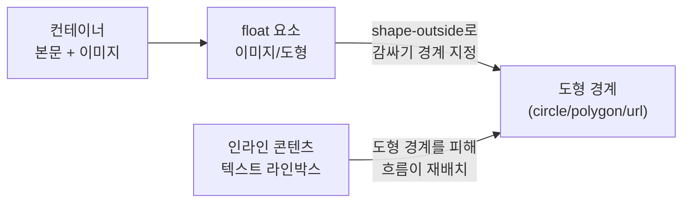

# 레이아웃은 Grid, 감싸기는 float: CSS Shapes로 텍스트 흐름 만들기


한 문장 결론: **float은 “레이아웃”보다 “텍스트 감싸기(특히 비정형 도형)”에서 여전히 쓸모가 있다.**


---


## 배경/문제


과거에는 `float`로 레이아웃을 잡는 경우가 많았다. 하지만 지금은 Flexbox, Grid가 레이아웃 목적에 훨씬 맞는 도구다. 그럼에도 `float` 자체는 여전히 표준 속성으로 정의되어 있고, “특정 효과”에서는 대체가 쉽지 않다.


여기서 중요한 건 이거다.

- 레이아웃 정렬(2열/3열, 영역 배치)은 **Flexbox/Grid**가 담당한다.
- “이미지/도형을 피해 텍스트가 자연스럽게 휘어 감싸는” 효과는 **CSS Shapes + float** 조합이 담당한다.

---


## 핵심 개념


`float`는 요소를 좌/우로 띄우고, 주변의 **인라인 콘텐츠(텍스트)** 가 그 주변을 감싸도록 만든다. 그리고 **`shape-outside`** 는 그 감싸는 경계를 “사각형 박스”가 아니라 “원/다각형/이미지 기반 도형”으로 바꿔준다.


즉, “텍스트 흐름”을 디자인하려면 float이 다시 등장한다.





→ 기대 결과/무엇이 달라졌는지: `float`가 “배치 도구”가 아니라 “텍스트가 흐르는 공간을 만드는 도구”로 정리된다.


---


## 해결 접근


목표는 단순하다: **텍스트가 이미지(또는 도형) 가장자리를 따라 자연스럽게 감싸도록 만든다.**


핵심 포인트는 3가지다.

1. `shape-outside`를 적용할 요소는 **반드시 float이어야** 한다.
2. float 요소는 **크기(가로/세로)** 가 있어야 도형 경계가 계산된다.
3. float이 컨테이너 레이아웃을 깨뜨리지 않도록 **`display: flow-root`** 같은 “float 포함(컨테이너 높이 보정)” 처리를 한다.

대안/비교도 같이 정리해두자.

- 대안 A: **Flexbox/Grid**
    - 장점: 레이아웃 정렬/반응형에 최적
    - 한계: “텍스트가 도형을 피해 휘어 흐르는” 효과를 직접 만들지는 못한다.
- 대안 B: **`clip-path`**
    - 장점: 요소 자체를 도형으로 “잘라 보이게” 만들기 좋다.
    - 한계: 텍스트 흐름(감싸기 경계)은 바꾸지 못한다. (요소 모양만 바뀜)

---


## 구현(코드)


아래 예시는 Next.js에서 그대로 재현 가능한 형태로 구성한다.


(`shape-outside`는 CSS로 처리되므로, 서버/클라이언트 경계와 무관하게 동작한다.)


### 1) 컴포넌트 (Next.js)


```typescript
// app/components/ShapeFloatArticle.tsx
import styles from "./ShapeFloatArticle.module.css";

export default function ShapeFloatArticle() {
  return (
    <article className={styles.article}>
      

      <h2 className={styles.title}>float + shape-outside로 텍스트 흐름 만들기</h2>

      <p>
        float은 요소를 좌/우로 띄우고, 텍스트가 그 주변을 감싸도록 만든다. 여기에 shape-outside를
        더하면 감싸기 경계를 원형/다각형/이미지 기반 도형으로 바꿀 수 있다.
      </p>

      <p>
        이 패턴은 “레이아웃 정렬”이 아니라 “읽는 흐름(타이포그래피)”을 만들 때 유효하다.
        특히 히어로 영역, 매거진형 소개 섹션, 스토리텔링 페이지처럼 텍스트 자체가 디자인 요소인 경우에
        선택지가 된다.
      </p>
    </article>
  );
}
```


→ 기대 결과/무엇이 달라졌는지: `/public/shape.png` 주변으로 텍스트가 사각형이 아니라 “도형 경계”를 따라 감싸지기 시작한다.


### 2) 스타일 (CSS Shapes 적용)


```css
/* app/components/ShapeFloatArticle.module.css */
.article {
  display: flow-root; /* float이 컨테이너 밖으로 빠져나가 높이가 무너지는 문제를 예방 */
  line-height: 1.8;
}

.title {
  margin: 0 0 12px;
}

.floatShape {
  float: left;

  /* 핵심: 텍스트 감싸기 경계를 도형으로 지정 */
  shape-outside: circle(50%);
  shape-margin: 12px;

  width: 280px;
  height: 280px;
  margin: 0 16px 12px 0;

  border-radius: 50%;
  object-fit: cover;
}
```


→ 기대 결과/무엇이 달라졌는지: 텍스트가 이미지 박스의 직각 모서리를 피하는 대신, 원형 경계를 따라 부드럽게 휘어 흐른다.


### 3) 이미지 기반 도형(더 “비정형”이 필요할 때)


원형이 아니라 PNG/WebP처럼 **알파 채널(투명도)** 이 있는 이미지를 도형 경계로 쓰고 싶다면 `shape-outside: url(...)` 패턴을 고려할 수 있다.


```css
.floatShape {
  float: left;

  /* 이미지의 투명도를 기반으로 도형 경계를 추출 */
  shape-outside: url("/shape.png");
  shape-image-threshold: 0.5;
  shape-margin: 12px;

  width: 280px;
  height: 280px;
  margin: 0 16px 12px 0;
}
```


→ 기대 결과/무엇이 달라졌는지: 단순 원형을 넘어, 이미지 실루엣을 따라 텍스트가 감싸는 “매거진형” 레이아웃을 만들 수 있다.


---


## 검증 방법(체크리스트)

- [ ] float 요소에 `float: left | right` 가 실제로 적용되어 있는가?
- [ ] float 요소에 `width/height` 가 지정되어 있는가? (도형 경계 계산에 필요)
- [ ] 컨테이너에 `display: flow-root`(또는 동등한 float 포함 처리)가 적용되어 있는가?
- [ ] 텍스트가 “사각형 박스”가 아니라 도형 경계를 따라 감싸는가?
- [ ] 이미지가 로드되지 않아도 읽기 흐름이 깨지지 않는가? (`alt` 포함)

---


## 흔한 실수/FAQ


### Q1. `shape-outside`만 넣었는데 아무 변화가 없어요.


대부분 **float이 빠져있거나**, 요소 크기가 없어서다.


`shape-outside`는 “텍스트가 피해 갈 영역(감싸기 경계)”을 정의하는데, 그 전제는 float로 텍스트를 옆으로 밀어내는 구조다. (즉, float이 먼저다.)


### Q2. Flexbox/Grid로도 똑같이 만들 수 있나요?


레이아웃 정렬은 가능하지만, “텍스트 라인박스가 도형을 피해 휘어 흐르는 효과”는 결이 다르다.


그 효과가 목표라면 CSS Shapes 쪽이 직선적이다.


### Q3. `clip-path`로 요소를 도형으로 만들면 텍스트도 따라오나요?


아니다. `clip-path`는 “요소 보이는 모양”만 바꾸고, **텍스트 흐름 경계는 바꾸지 않는다.**


텍스트 감싸기까지 필요하면 `shape-outside`를 같이 봐야 한다.


### Q4. Next.js의 `next/image`를 쓰면 안 되나요?


써도 된다. 다만 **float/shape-outside가 실제로 적용되는 요소가 무엇인지**가 중요하다.


렌더링 결과에서 float이 걸린 요소가 “실제 이미지 요소”인지(또는 래퍼 요소인지)를 확인하고, 그 요소에 `float`/`shape-outside`를 적용하면 된다.


---


## 요약(3~5줄)

- `float`는 레이아웃 정렬보다 “텍스트 감싸기”에 초점이 맞는 도구다.
- `shape-outside`를 결합하면 텍스트가 원/다각형/이미지 실루엣을 따라 흐르도록 만들 수 있다.
- 구현의 핵심은 **float 적용 + 크기 지정 + 컨테이너의 float 포함 처리(flow-root)** 다.
- Flexbox/Grid와 역할이 다르며, `clip-path`는 텍스트 흐름을 바꾸지 않는다.

---


## 결론


`float`를 “레이아웃 도구”로만 보면 이제 쓸 일이 적다. 하지만 “텍스트가 도형을 피해 흐르는 디자인”을 구현하려는 순간, `float + shape-outside` 조합은 여전히 깔끔한 해법이 된다. 포인트는 기능의 목적을 바꾸는 것—**정렬이 아니라 흐름**이다.


---


## 참고(공식 문서 링크)

- [MDN: float](https://developer.mozilla.org/ko/docs/Web/CSS/Reference/Properties/float)
- [MDN: shape-outside](https://developer.mozilla.org/en-US/docs/Web/CSS/Reference/Properties/shape-outside)
- [MDN: CSS Shapes 가이드](https://developer.mozilla.org/ko/docs/Web/CSS/Guides/Shapes)
- [MDN: Shapes from images](https://developer.mozilla.org/en-US/docs/Web/CSS/Guides/Shapes/From_images)
- [W3C: CSS Shapes Module](https://www.w3.org/TR/css-shapes/)
- [Next.js Docs](https://nextjs.org/docs)
- [React Docs](https://react.dev/)
- [MDN Web Docs](https://developer.mozilla.org/)
- [web.dev](https://web.dev/)
