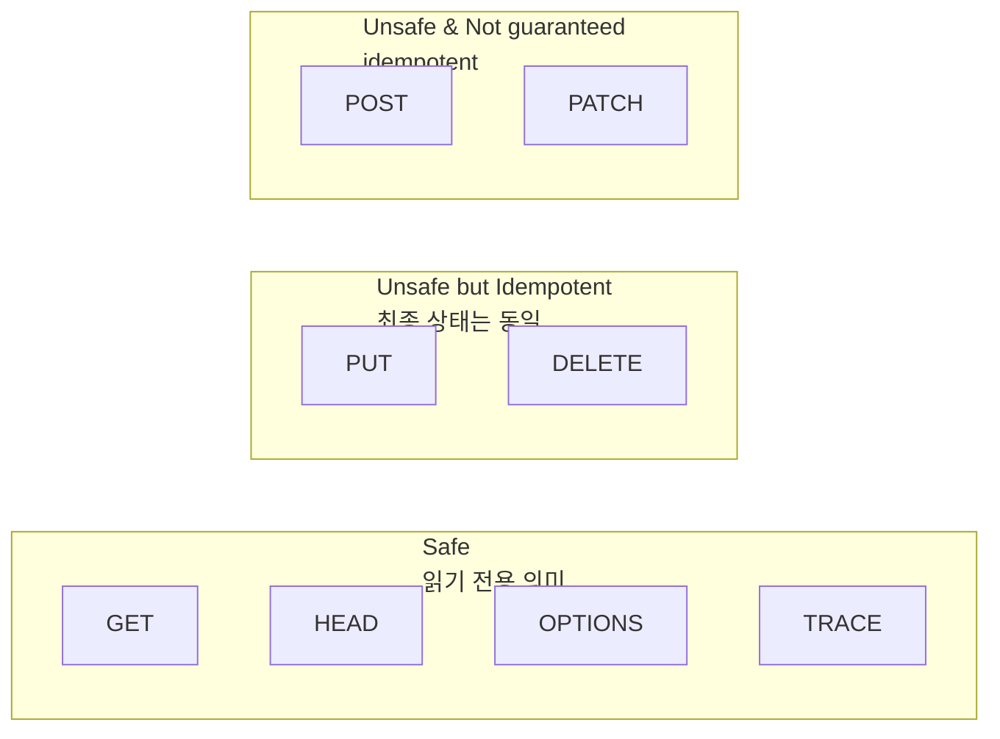

# 의미를 지켜라: GET·POST를 안전·멱등성으로 설계하기

> GET은 “URL에 싣는 방식”이 아니라 “읽기 전용 의미”다. 이 의미를 지키면 캐시·프리패치·재시도가 안전해지고, API가 예측 가능해진다. (RFC 9110)

## 배경과 문제


HTTP를 처음 배울 때 흔히 이렇게 외운다.

- GET은 URL에 파라미터를 붙인다
- POST는 Body에 데이터를 실어 보낸다
- GET은 길이 제한이 있고 주소창에 보여서 “보안상 위험하다”

하지만 이건 **전송 “모양”**에 가까운 이야기다. GET·POST가 진짜로 갈리는 지점은 **서버가 기대하는 의미(semantics)**다. ([MDN: HTTP request methods](https://developer.mozilla.org/en-US/docs/Web/HTTP/Reference/Methods))


이 의미가 깨지면 이런 문제가 생긴다.

- GET 요청이 **자동 수집(크롤러)**, **프리패치**, **캐시 최적화** 과정에서 의도치 않게 실행되어 서버 상태를 바꿔버린다. ([RFC 9110](https://www.rfc-editor.org/rfc/rfc9110.html))
- 네트워크 실패 시 클라이언트/중간 장치가 **재시도**를 하면서 “같은 요청을 여러 번 보냈을 때의 최종 상태”가 흔들린다. ([RFC 9110](https://www.rfc-editor.org/rfc/rfc9110.html))
- Next.js에서는 GET Route Handler가 캐시/정적화 경로에 올라갈 수 있는데, GET이 변경을 일으키면 최적화가 곧 사고가 된다. ([Next.js Route Handlers](https://nextjs.org/docs/app/getting-started/route-handlers))

## 핵심 개념


### 안전한 메서드


**안전(safe)**은 “서버 상태를 바꾸지 않는 읽기 전용 의미”를 말한다. (GET/HEAD/OPTIONS/TRACE가 안전으로 정의된다.) ([RFC 9110](https://www.rfc-editor.org/rfc/rfc9110.html))


### 멱등성


**멱등(idempotent)**은 “같은 요청을 여러 번 보내도 **의도된 최종 효과가 한 번 보낸 것과 같다**”는 성질이다. ([RFC 9110](https://www.rfc-editor.org/rfc/rfc9110.html))

- 안전한 메서드는 모두 멱등이다. ([MDN: Safe HTTP methods](https://developer.mozilla.org/en-US/docs/Glossary/Safe/HTTP))
- 하지만 **멱등 = 안전**은 아니다. 예를 들어 DELETE는 서버 상태를 바꾸므로 안전하지 않지만, 같은 삭제를 여러 번 호출해도 “해당 리소스가 없다”라는 최종 상태로 수렴할 수 있어 멱등으로 분류된다. ([MDN: Idempotent](https://developer.mozilla.org/en-US/docs/Glossary/Idempotent))




→ 기대 결과/무엇이 달라졌는지: “GET=URL, POST=Body” 같은 모양이 아니라, **안전/멱등** 기준으로 메서드 역할이 정리된다.


## 해결 접근


포인트는 단순하다. **메서드가 기대하는 의미를 코드로 지키는 것.** ([RFC 9110](https://www.rfc-editor.org/rfc/rfc9110.html))


### 1) 조회는 GET, 변경은 POST/PUT/PATCH/DELETE

- **GET**: 조회. 읽기 전용(안전) 의미를 지킨다. ([RFC 9110](https://www.rfc-editor.org/rfc/rfc9110.html))
- **POST**: “무언가를 수행해 결과를 만든다”에 가깝다. 기본적으로 멱등이 보장되지 않는다. ([MDN: Idempotent](https://developer.mozilla.org/en-US/docs/Glossary/Idempotent))
- **PUT vs PATCH 비교**
    - **PUT**: “해당 리소스를 이 내용으로 맞춘다(대체/업서트 성격)”로 설계하면 멱등에 잘 맞는다. ([RFC 9110](https://www.rfc-editor.org/rfc/rfc9110.html))
    - **PATCH**: “부분 수정”에 쓰지만 멱등이 자동으로 보장되지는 않는다. ([MDN: Idempotent](https://developer.mozilla.org/en-US/docs/Glossary/Idempotent))
- **DELETE**: 삭제. 안전하진 않지만 멱등으로 설계할 수 있다. ([RFC 9110](https://www.rfc-editor.org/rfc/rfc9110.html))

### 2) “GET은 보안에 취약”이 아니라 “GET은 노출/캐시 경로에 잘 탄다”


GET은 링크/로그/히스토리/캐시 같은 경로를 더 쉽게 탄다. 그래서 **민감 데이터는 어떤 메서드든 전송 위치(쿼리/바디)에 상관없이** 다루는 정책이 필요하다. 안전/멱등은 “보안 기능”이 아니라 “의미 규약”에 가깝다. ([RFC 9110](https://www.rfc-editor.org/rfc/rfc9110.html))


### 3) 큰 페이로드가 필요하면 “GET 바디”가 아니라 설계를 바꾼다


GET 요청에 Body를 붙이는 건 구현체에 따라 거부되거나 의미가 통일되지 않을 수 있다. 복잡한 검색 조건처럼 URL로 표현하기 어려운 조회는 **POST로 조회 엔드포인트를 만드는 방식**도 실무에서 쓰인다(캐시/프리패치 기대는 낮아진다). ([RFC 9110](https://www.rfc-editor.org/rfc/rfc9110.html))


## 구현 코드


아래 예시는 Next.js Route Handler로 메서드 의미를 고정하는 패턴이다. Route Handler는 `app` 디렉터리의 `route.js` 파일에서 HTTP 메서드 이름으로 함수를 export한다. ([Next.js Route Handlers](https://nextjs.org/docs/app/getting-started/route-handlers))


### 조회는 GET


```javascript
// app/api/todos/route.js
import { NextResponse } from "next/server";

const todos = [
  { id: "1", title: "read docs" },
  { id: "2", title: "ship it" },
];

export async function GET(request) {
  const url = new URL(request.url);
  const q = url.searchParams.get("q") ?? "";

  const filtered = q
    ? todos.filter((t) => t.title.toLowerCase().includes(q.toLowerCase()))
    : todos;

  return NextResponse.json({ todos: filtered });
}
```


→ 기대 결과/무엇이 달라졌는지: 같은 GET을 여러 번 호출해도 서버 데이터는 바뀌지 않는다. 검색/필터는 URL로 공유 가능해진다.


### 생성은 POST


```javascript
// app/api/todos/route.js
import { NextResponse } from "next/server";

let todos = [{ id: "1", title: "read docs" }];

export async function POST(request) {
  const body = await request.json();
  const title = String(body.title ?? "").trim();

  if (!title) {
    return NextResponse.json({ message: "title is required" }, { status: 400 });
  }

  const todo = { id: crypto.randomUUID(), title };
  todos = [...todos, todo];

  return NextResponse.json({ todo }, { status: 201 });
}
```


→ 기대 결과/무엇이 달라졌는지: 같은 요청을 여러 번 보내면 항목이 여러 개 생길 수 있다. 즉 POST는 기본적으로 “한 번만 실행될 것”을 전제로 하면 위험하다. ([MDN: Idempotent](https://developer.mozilla.org/en-US/docs/Glossary/Idempotent))


### 삭제는 DELETE, 멱등성은 최종 상태로 보장


```javascript
// app/api/todos/[id]/route.js
import { NextResponse } from "next/server";

let todos = [
  { id: "1", title: "read docs" },
  { id: "2", title: "ship it" },
];

export async function DELETE(_request, { params }) {
  const before = todos.length;
  todos = todos.filter((t) => t.id !== params.id);

  // "이미 없던 리소스를 또 삭제"해도 최종 상태는 동일(없음)으로 수렴
  const deleted = todos.length !== before;

  return NextResponse.json({ deleted });
}
```


→ 기대 결과/무엇이 달라졌는지: 같은 DELETE를 여러 번 호출해도 “해당 리소스가 없다”라는 최종 상태로 수렴한다. 응답(예: deleted=false)은 달라질 수 있어도, 서버의 최종 상태를 흔들지 않는다. ([RFC 9110](https://www.rfc-editor.org/rfc/rfc9110.html))


### 중복 생성 방지 대안: Idempotency-Key 패턴


POST의 “중복 생성”을 줄이고 싶다면, **Idempotency-Key** 같은 키를 받아서 “같은 키의 요청은 같은 결과를 돌려준다”로 설계할 수 있다. ([MDN: Idempotency-Key](https://developer.mozilla.org/en-US/docs/Web/HTTP/Reference/Headers/Idempotency-Key))


```javascript
// app/api/payments/route.js
import { NextResponse } from "next/server";

const store = new Map(); // demo: 운영에서는 영속 저장소/만료 전략 사용

export async function POST(request) {
  const key = request.headers.get("Idempotency-Key");
  if (key && store.has(key)) {
    return NextResponse.json(store.get(key));
  }

  // ... 실제로는 결제/생성 로직 수행
  const result = { ok: true, createdId: crypto.randomUUID() };

  if (key) store.set(key, result);

  return NextResponse.json(result, { status: 201 });
}
```


→ 기대 결과/무엇이 달라졌는지: 네트워크 재시도/중복 클릭이 있어도 같은 키로는 결과가 재사용되어 중복 생성이 줄어든다.


## 검증 방법 체크리스트

- [ ] **GET** 엔드포인트를 10번 호출해도 서버 데이터(저장소)가 변하지 않는다. ([RFC 9110](https://www.rfc-editor.org/rfc/rfc9110.html))
- [ ] **DELETE**를 같은 id로 여러 번 호출해도 최종 상태가 “없음”으로 유지된다. ([RFC 9110](https://www.rfc-editor.org/rfc/rfc9110.html))
- [ ] **POST**는 같은 요청을 반복하면 중복 생성이 발생할 수 있음을 테스트로 확인한다. ([MDN: Idempotent](https://developer.mozilla.org/en-US/docs/Glossary/Idempotent))
- [ ] Route Handler에서 **GET만 캐시/정적화 옵션 대상**임을 이해하고, 변경 로직을 GET에 넣지 않는다. ([Next.js Route Handlers](https://nextjs.org/docs/app/getting-started/route-handlers))
- [ ] 복잡한 조회 조건이 필요할 때 “GET 바디” 대신 설계를 바꾼다. ([RFC 9110](https://www.rfc-editor.org/rfc/rfc9110.html))

## 흔한 실수와 FAQ


### GET에 삭제/구매 같은 동작을 붙이면 왜 위험한가


자동 수집(스파이더), 링크 검사, 프리패치가 “GET은 안전하다”는 전제하에 움직일 수 있다. GET이 변경을 일으키면 의도치 않은 실행이 된다. ([RFC 9110](https://www.rfc-editor.org/rfc/rfc9110.html))


### DELETE는 멱등이면 안전한가


아니다. 멱등은 “최종 효과가 동일”이고, 안전은 “상태 변경이 없음”이다. DELETE는 상태를 바꾸므로 안전하지 않다. ([MDN: Safe HTTP methods](https://developer.mozilla.org/en-US/docs/Glossary/Safe/HTTP))


### POST만 쓰면 되지 않나


기능은 될 수 있지만, 캐시/재시도/자동화 도구가 기대하는 의미가 깨진다. 특히 GET은 웹 성능 최적화의 중심에 있어 “읽기 전용 리소스는 GET으로 주소를 만들 때” 효과가 커진다. ([RFC 9110](https://www.rfc-editor.org/rfc/rfc9110.html))


### 조회인데 POST를 쓰는 경우도 있나


복잡한 검색 조건처럼 URL로 표현하기 어려운 조회에서 실무적으로 쓰인다. 대신 공유성(링크로 재현)과 캐시 기대치는 낮아진다. ([RFC 9110](https://www.rfc-editor.org/rfc/rfc9110.html))


## 요약

- GET·POST의 차이는 “URL vs Body”보다 **의미(안전/멱등)**가 핵심이다. ([RFC 9110](https://www.rfc-editor.org/rfc/rfc9110.html))
- **안전(safe)**은 읽기 전용, **멱등(idempotent)**은 여러 번 호출해도 최종 효과가 같다. ([MDN: Safe HTTP methods](https://developer.mozilla.org/en-US/docs/Glossary/Safe/HTTP))
- DELETE는 안전하진 않지만 멱등으로 설계할 수 있고, POST는 기본적으로 멱등이 보장되지 않는다. ([RFC 9110](https://www.rfc-editor.org/rfc/rfc9110.html))
- Next.js에서는 GET Route Handler에 캐시/정적화 옵션이 붙을 수 있어 의미를 더 엄격히 지키는 게 유리하다. ([Next.js Route Handlers](https://nextjs.org/docs/app/getting-started/route-handlers))

## 결론


GET은 “편의상 URL에 붙이는 방식”이 아니라, 자동화·캐시·재시도 생태계를 움직이는 **읽기 전용 계약**이다. POST/PUT/PATCH/DELETE는 변경의 성격과 멱등성 요구에 맞춰 역할을 분리하면 된다. 메서드 의미를 지키는 것만으로도 API는 더 안전하고, 더 빠르고, 더 예측 가능해진다. ([RFC 9110](https://www.rfc-editor.org/rfc/rfc9110.html))


## 참고

- [Next.js Route Handlers](https://nextjs.org/docs/app/getting-started/route-handlers)
- [React Docs](https://react.dev/)
- [MDN: HTTP request methods](https://developer.mozilla.org/en-US/docs/Web/HTTP/Reference/Methods)
- [MDN: Safe HTTP methods](https://developer.mozilla.org/en-US/docs/Glossary/Safe/HTTP)
- [MDN: Idempotent](https://developer.mozilla.org/en-US/docs/Glossary/Idempotent)
- [RFC 9110: HTTP Semantics](https://www.rfc-editor.org/rfc/rfc9110.html)
- [MDN: Idempotency-Key](https://developer.mozilla.org/en-US/docs/Web/HTTP/Reference/Headers/Idempotency-Key)
- [Mermaid Docs](https://mermaid.js.org/)
