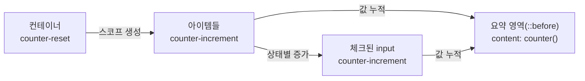

# 필요한 만큼만 계산하라: CSS Counter로 체크박스 개수 표시하기


**한 문장 결론:** CSS Counter(CSS 카운터)만으로 “전체/체크됨” 같은 카운트를 UI에 표시할 수 있다.


자바스크립트 없이도 “몇 개가 선택됐는지”를 보여주고 싶을 때가 있다.


예를 들면 체크리스트, 가입 단계(step), 문서 섹션 번호처럼 **단순한 수량 표시**는 JS 없이도 충분히 해결된다.


포인트는 하나다. **DOM 구조에서 증가시키고,** **`content`****로 꺼내 쓰면 된다.**


---


## 배경/문제


“특정 태그를 세는 것”을 브라우저에서 바로 보여주려면 보통 JS로 길이를 세고 텍스트를 갱신한다.


하지만 카운트가 **단순 표시 목적**이라면 CSS만으로도 가능하다.


이 글에서는 CSS Counter로:

- 체크박스 “체크됨/전체” 카운트 표시
- 아이템 번호(1, 2, 3… 또는 로마 숫자)
- Next.js에서 CSS Modules(모듈 CSS)로 안전하게 적용

까지 한 번에 정리한다.


---


## 핵심 개념


CSS Counter는 “카운터 생성/초기화 → 증가 → 출력” 3단계로 생각하면 쉽다.

- `counter-reset`: 카운터를 **만들고 초기화**
- `counter-increment`: 특정 요소가 등장할 때 **카운터를 증가**
- `counter()`: 카운터 값을 **문자열로 꺼내기** (보통 `content`에서 사용)

아래 다이어그램을 보면 흐름이 딱 고정된다.





→ 기대 결과/무엇이 달라졌는지: “어디서 초기화하고, 무엇이 증가시키며, 어디서 출력하는지”를 한 장으로 고정할 수 있다.


---


## 해결 접근


### 접근 1) CSS Counter로 “전체/체크됨”을 만든다


핵심은 두 가지다.

1. **전체 카운트**는 각 아이템이 1번씩 증가시키고
2. **체크됨 카운트**는 `:checked` 상태의 `input`이 1번씩 증가시킨다.

그리고 중요한 제약이 하나 있다.

- Counter는 **소스 순서(문서 흐름)**를 따라 누적된다.
그래서 “요약(카운트 출력)”은 **증가가 끝난 뒤에 배치**해야 최종 값이 나온다.
- 대신 CSS의 `order`로 화면에서는 요약을 위로 올릴 수 있다. (DOM은 아래, 화면만 위)

### 접근 2) 대안과 비교


같은 목적을 다른 방식으로도 풀 수 있다.

- **JS로 계산**: 정확도/접근성/로그까지 모두 제어 가능. 대신 코드/상태 관리 비용이 생긴다.
- **HTML** **`<ol>`** **자동 번호**: 목록 번호만 필요하면 가장 단순하고 의미론도 좋다. (카운트 “요약”은 별도)
- **CSS Counter**: JS 없이 표시용 숫자를 만들기 좋다. 대신 “표시 목적”에 맞춰 쓰는 게 안전하다.

---


## 구현(코드)


아래 예시는 Next.js에서 그대로 재현 가능한 형태다. (입력은 브라우저 기본 동작만 사용)


### 1) `app/counter/page.tsx`


```typescript
import styles from "./page.module.css";

const todos = [
  "회사 계정 로그인",
  "프로필 입력",
  "알림 설정 확인",
  "첫 글 작성",
];

export default function Page() {
  return (
    <main className={styles.wrap}>
      <section className={styles.todo} aria-label="체크리스트">
        {/* 요약은 DOM에서 아래에 두고, CSS로 화면 상단에 올립니다 */}
        <ul className={styles.list}>
          {todos.map((text) => (
            <li key={text} className={styles.item}>
              <label className={styles.label}>
                <input className={styles.checkbox} type="checkbox" />
                <span className={styles.text}>{text}</span>
              </label>
            </li>
          ))}
        </ul>

        <p className={styles.summary} aria-label="선택 개수 요약" />
      </section>
    </main>
  );
}
```


→ 기대 결과/무엇이 달라졌는지: 체크박스는 JS 없이 토글되고, 카운트 표시는 CSS가 맡도록 DOM을 구성한다.


---


### 2) `app/counter/page.module.css`


```css
.wrap {
  padding: 24px;
}

.todo {
  /* 카운터 스코프 생성 + 초기화 */
  counter-reset: total checked item;

  display: flex;
  flex-direction: column;
  gap: 12px;
  max-width: 520px;
}

/* 요약은 DOM상 마지막이지만, 화면에서는 위로 올림 */
.summary {
  order: -1;
  margin: 0;
  padding: 10px 12px;
  border: 1px solid #e5e7eb;
  border-radius: 10px;
}

/* 카운트 출력: counter()는 보통 content에서 사용 */
.summary::before {
  content: "Checked: " counter(checked) " / " counter(total);
}

.list {
  list-style: none;
  margin: 0;
  padding: 0;
  border: 1px solid #e5e7eb;
  border-radius: 12px;
  overflow: hidden;
}

.item {
  /* 전체 아이템 수 + 아이템 번호 증가 */
  counter-increment: total item;

  padding: 12px;
  border-top: 1px solid #f3f4f6;
}

.item:first-child {
  border-top: 0;
}

.label {
  display: flex;
  align-items: center;
  gap: 10px;
}

/* input을 display:none으로 숨기면 카운터 증가가 막힐 수 있어, 시각적으로만 숨김 */
.checkbox {
  position: absolute;
  opacity: 0;
  pointer-events: none;
}

/* 아이템 번호는 ::before로 표시 */
.text::before {
  content: counter(item) ". ";
  font-variant-numeric: tabular-nums;
  margin-right: 2px;
}

/* 체크 상태일 때 checked 카운터 증가 */
.checkbox:checked {
  counter-increment: checked;
}

/* 체크된 항목은 스타일 변화(선택 표시) */
.checkbox:checked + .text {
  text-decoration: line-through;
  opacity: 0.7;
}
```


→ 기대 결과/무엇이 달라졌는지: “전체/체크됨/번호”가 CSS만으로 계산되고, 요약은 화면 상단에 고정된다.


---


### 3) 카운트 스타일 바꾸기(로마 숫자)


```css
.text::before {
  content: "[" counter(item, upper-roman) "] ";
}
```


→ 기대 결과/무엇이 달라졌는지: 1, 2, 3 대신 I, II, III 형태로 번호 표현이 바뀐다.


---


## 검증 방법(체크리스트)

- [ ] 체크박스를 여러 개 토글했을 때 `Checked: X / Y`가 즉시 갱신된다.
- [ ] 목록 상단에 요약이 보이지만, DOM에서는 요약이 목록 뒤에 위치한다. (Counter 누적 순서 보장)
- [ ] `input`을 `display:none`으로 숨기지 않고, 시각적으로만 숨겼다.
- [ ] CSS Modules로 클래스 충돌 없이 적용된다.

---


## 흔한 실수/FAQ


### Q. 요약을 DOM에서도 위에 두면 왜 숫자가 0으로 나오나요?


Counter는 **문서 흐름대로 누적**된다. 요약이 먼저 나오면 아직 증가가 일어나지 않아 초기값만 출력된다.


대신 이 글처럼 **DOM은 아래, 화면은 위(****`order`****)**로 정렬하면 “최종 값”을 위에 보여줄 수 있다.


### Q. `counter-reset`을 안 써도 되나요?


초기값이 0이라면 동작은 할 수 있다.


하지만 “이 컨테이너에서 카운트를 쓴다”는 의도를 남기려면 `counter-reset`으로 스코프를 여는 편이 유지보수에 유리하다.


### Q. 카운트 숫자를 접근성/SEO의 핵심 정보로 써도 되나요?


`content`로 넣은 생성 콘텐츠(Generated content, 생성 콘텐츠)는 **환경에 따라 보조기술이 읽는 방식이 달라질 수 있다.**


그래서 “표시용 뱃지/번호” 같은 용도에 특히 잘 맞는다. 핵심 정보라면 HTML 텍스트로도 제공하는 쪽이 안전하다.


---


## 요약(3~5줄)


CSS Counter는 `counter-reset` → `counter-increment` → `counter()` 흐름으로 동작한다.


체크박스 같은 상태 기반 카운트도 `:checked`와 조합하면 JS 없이 표시할 수 있다.


Counter는 소스 순서에 영향을 받으므로 “요약 출력은 뒤, 화면 배치는 위” 전략이 유효하다.


Next.js에서는 CSS Modules로 범위를 깔끔하게 고정하면 재사용과 충돌 방지가 쉽다.


---


## 결론


JS 없이도 “세는 UI”는 충분히 만들 수 있다.


CSS Counter는 특히 **단순 표시용 숫자**(번호, 배지, 진행 수량)에 잘 맞고, 코드량을 줄이면서도 UI의 의도를 또렷하게 만든다.


다만 생성 콘텐츠는 환경에 따라 해석이 달라질 수 있으니, 중요한 정보는 HTML 텍스트로도 제공하는 습관을 같이 가져가면 안정적이다.


---


## 참고(공식 문서 링크)

- [MDN - counter()](https://developer.mozilla.org/en-US/docs/Web/CSS/Reference/Values/counter)
- [MDN - counters()](https://developer.mozilla.org/en-US/docs/Web/CSS/Reference/Values/counters)
- [MDN - counter-reset](https://developer.mozilla.org/en-US/docs/Web/CSS/Reference/Properties/counter-reset)
- [MDN - counter-increment](https://developer.mozilla.org/en-US/docs/Web/CSS/Reference/Properties/counter-increment)
- [MDN - Using CSS counters](https://developer.mozilla.org/en-US/docs/Web/CSS/Guides/Counter_styles/Using_counters)
- [MDN - content](https://developer.mozilla.org/en-US/docs/Web/CSS/Reference/Properties/content)
- [MDN - :checked](https://developer.mozilla.org/en-US/docs/Web/CSS/Reference/Selectors/:checked)
- [MDN - CSS generated content](https://developer.mozilla.org/en-US/docs/Web/CSS/Guides/Generated_content)
- [Next.js Docs - CSS](https://nextjs.org/docs/app/getting-started/css)
- [Next.js Docs - Server and Client Components](https://nextjs.org/docs/app/getting-started/server-and-client-components)
- [React Docs](https://react.dev/)
