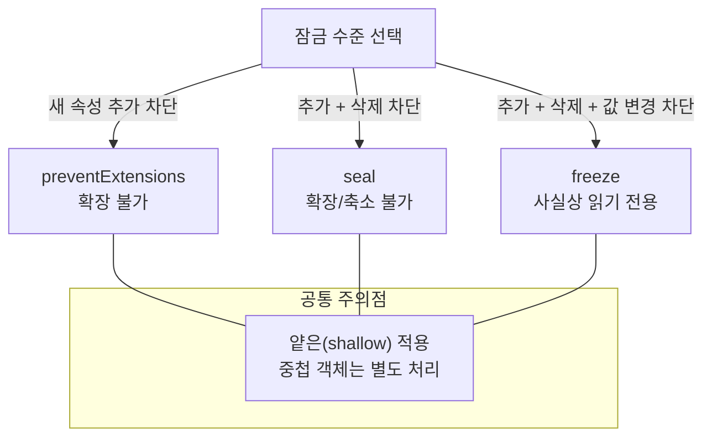

# 실수로 바꾸지 마라: `preventExtensions`·`seal`·`freeze`로 객체를 “잠가” 불변성에 가까워지기


한 문장 결론: **“불변 객체”가 필요하다면, 먼저** _**어디까지**_ **막을지(****`확장/삭제/값 변경`****)를 정하고 그에 맞는 잠금 메서드를 선택하면 된다.**


상태(STATE)나 설정(CONFIG) 같은 값은 “한 번 정해지면 바뀌면 안 되는” 경우가 많다. 문제는 JavaScript에서 객체/배열이 기본적으로 변경 가능하다는 점이다.


포인트는 두 가지다. **(1) 실수로 추가/삭제/변경되는 걸 런타임에서 막고**, **(2) React/Next.js처럼 “값의 변경 감지”가 중요한 환경에서 예측 가능한 업데이트 흐름을 유지**하는 것이다. ([react.dev](https://react.dev/learn/updating-objects-in-state?utm_source=chatgpt.com))


---


## 배경/문제

- `const`로 선언해도 **참조(reference) 자체만 고정**될 뿐, 내부 값은 바뀔 수 있다.
- 특히 배열은 `push/pop` 같은 메서드로 쉽게 변형된다.
- “바뀌면 안 되는 데이터”가 **어느 순간 조용히 변형**되면, 디버깅이 갑자기 어려워진다.

그래서 **객체 자체를 잠그는 방법**(확장/삭제/변경 제어)을 알아두면 실수 방지에 큰 도움이 된다.


---


## 핵심 개념


JavaScript에는 객체를 “잠그는(lock)” 3단계가 있다.

- `Object.preventExtensions(obj)`: **새 속성 추가만 차단** ([MDN](https://developer.mozilla.org/en-US/docs/Web/JavaScript/Reference/Global_Objects/Object/preventExtensions))
- `Object.seal(obj)`: **추가 + 삭제 차단**(기존 속성은 값 변경 가능) ([MDN](https://developer.mozilla.org/en-US/docs/Web/JavaScript/Reference/Global_Objects/Object/seal))
- `Object.freeze(obj)`: **추가 + 삭제 + 값 변경 차단**(기존 속성을 사실상 읽기 전용으로) ([MDN](https://developer.mozilla.org/en-US/docs/Web/JavaScript/Reference/Global_Objects/Object/freeze))

아래 다이어그램을 보면 “막는 범위”가 한 번에 정리된다.





→ 기대 결과/무엇이 달라졌는지: “불변”을 한 덩어리로 뭉뚱그리지 않고, **추가/삭제/변경 중 무엇을 막는지**를 기준으로 선택할 수 있다.


---


## 해결 접근


### 1) `preventExtensions`: “추가만” 막고 싶을 때


**왜 하는지:** 객체(배열)에 _새 속성/새 인덱스_가 생기면, 데이터 형태(shape)가 예기치 않게 바뀐다.


**기대 결과:** 기존 값 수정/삭제는 가능하되, **새 항목 추가는 차단**된다.


```javascript
const arr = [1, 2, 3];

Object.preventExtensions(arr);

arr[0] = 5;     // ✅ 기존 인덱스 수정 가능
arr.pop();      // ✅ 마지막 요소 삭제 가능

try {
  arr.push(3);  // ❌ 새 인덱스(=새 속성) 추가 시도
} catch (err) {
  console.error(err.name, err.message);
}

console.log(arr); // [5, 2]
```


→ 기대 결과/무엇이 달라졌는지: `pop()`은 동작하지만 `push()`는 **새 요소를 추가하려다 실패**한다. 배열 내용은 `[5, 2]`로 유지된다.


---


### 2) `seal`: “추가 + 삭제”를 막고 싶을 때


**왜 하는지:** 설정 객체처럼 “키 목록이 고정”이어야 할 때, 삭제/추가를 막으면 안정성이 올라간다.


**기대 결과:** **새 항목 추가/기존 항목 삭제는 차단**, 대신 **기존 값은 변경 가능**하다. ([MDN](https://developer.mozilla.org/en-US/docs/Web/JavaScript/Reference/Global_Objects/Object/seal))


```javascript
const arr = [1, 2, 3];

Object.seal(arr);

arr[0] = 5; // ✅ 기존 인덱스 값 변경 가능

try {
  arr.pop(); // ❌ 삭제 시도 (마지막 요소 제거)
} catch (err) {
  console.error(err.name, err.message);
}

try {
  arr.push(4); // ❌ 새 요소 추가
} catch (err) {
  console.error(err.name, err.message);
}

console.log(arr); // [5, 2, 3]
```


→ 기대 결과/무엇이 달라졌는지: `pop()`과 `push()` 모두 실패하고, 값 변경(`arr[0] = 5`)만 반영되어 `[5, 2, 3]`이 유지된다.


---


### 3) `freeze`: “추가 + 삭제 + 값 변경”까지 막고 싶을 때


**왜 하는지:** “이 객체는 절대 바뀌면 안 된다”를 런타임에서 강하게 보장하고 싶을 때 사용한다.


**기대 결과:** 값 변경까지 막아 **읽기 전용에 가까운 상태**로 만든다. ([MDN](https://developer.mozilla.org/en-US/docs/Web/JavaScript/Reference/Global_Objects/Object/freeze))


```javascript
const arr = [1, 2, 3];

Object.freeze(arr);

try {
  arr[0] = 5; // ❌ 값 변경
} catch (err) {
  console.error(err.name, err.message);
}

try {
  arr.pop();  // ❌ 삭제
} catch (err) {
  console.error(err.name, err.message);
}

try {
  arr.push(4); // ❌ 추가
} catch (err) {
  console.error(err.name, err.message);
}

console.log(arr); // [1, 2, 3]
```


→ 기대 결과/무엇이 달라졌는지: `push/pop`뿐 아니라 인덱스 값 변경도 실패하고, 배열은 `[1, 2, 3]` 그대로 유지된다.


---


## 구현(코드)


### React/Next.js에서의 실전 포인트: “잠금”보다 먼저 “불변 업데이트”를 기본으로


React는 상태로 저장한 배열/객체를 **직접 바꾸지 않고**, 복사본을 만들어 교체하는 방식이 권장된다. ([React Docs](https://react.dev/learn/updating-arrays-in-state))


즉, `freeze`로 막기 전에 **업데이트 습관 자체를 불변 방식으로 고정**하는 게 우선이다.


```javascript
// ✅ 불변 업데이트(예: 배열 추가)
setItems((prev) => [...prev, nextItem]);

// ❌ 변경형 업데이트(상태 직접 변형)
items.push(nextItem);
setItems(items);
```


→ 기대 결과/무엇이 달라졌는지: “어느 시점에 상태가 바뀌었는지”가 명확해지고, 렌더링/메모이제이션에서 예측 가능한 흐름을 만든다.


---


### (대안/비교 1) 중첩 객체까지 막고 싶다면: `deepFreeze`로 “깊게” 잠그기


`freeze/seal/preventExtensions`는 기본적으로 **얕게(shallow)** 적용된다. 즉, 중첩 객체는 여전히 바뀔 수 있다.


아래는 중첩까지 재귀적으로 `freeze`하는 예시다(순환 참조가 없는 데이터 구조라는 전제).


```javascript
function deepFreeze(value) {
  if (value && typeof value === "object" && !Object.isFrozen(value)) {
    Object.freeze(value);
    for (const key of Object.keys(value)) {
      deepFreeze(value[key]);
    }
  }
  return value;
}

const config = deepFreeze({
  theme: { color: "blue" },
});

try {
  config.theme.color = "red";
} catch (err) {
  console.error(err.name, err.message);
}
```


→ 기대 결과/무엇이 달라졌는지: 최상위뿐 아니라 `theme` 같은 **중첩 객체 변경도 차단**되어, 설정/상수 데이터의 안정성이 올라간다.


---


### (대안/비교 2) “작성 시점”에 막고 싶다면: 타입(예: `readonly`)으로 보조하기


런타임 잠금(`freeze`)은 실행 중에 막고, 타입 기반 제약은 작성 단계에서 실수를 줄인다.


둘은 경쟁 관계가 아니라, **안전망을 이중으로 두는 조합**으로 보는 편이 좋다.


---


## 검증 방법(체크리스트)


아래 체크로 “정말 잠겼는지” 빠르게 확인할 수 있다.

- [ ] `Object.isExtensible(obj)`가 `false`인가? (`preventExtensions/seal/freeze` 공통)
- [ ] `Object.isSealed(obj)`가 `true`인가? (`seal/freeze`에서 기대)
- [ ] `Object.isFrozen(obj)`가 `true`인가? (`freeze`에서 기대)

---


## 흔한 실수/FAQ


### Q1. `freeze` 했는데 중첩 객체가 바뀌어요.


`freeze`는 **얕은 잠금**이라서, 중첩 객체까지 자동으로 잠기지 않는다.


중첩까지 막으려면 `deepFreeze`처럼 재귀적으로 처리하거나, 애초에 중첩 구조를 “불변 업데이트”로 관리하는 방식이 필요하다.


### Q2. 에러가 안 나고 조용히 실패하는 것 같아요.


코드가 실행되는 환경(모듈/스크립트, 빌드 설정 등)에 따라 **실패가 예외로 드러나는 방식이 달라질 수 있다**.


실수를 빨리 찾고 싶다면 위 예시처럼 변경 시도를 `try/catch`로 감싸고, 검증 체크리스트(`isFrozen/isSealed`)로 상태를 확인하는 편이 안전하다.


### Q3. React 상태를 전부 `freeze` 해두면 더 안전한가요?


“실수로 mutate(변형)하는 버그”를 빨리 잡는 데는 도움이 될 수 있다. 다만, 데이터 크기/사용 패턴에 따라 비용이 생길 수 있으니 **핵심 경계(예: 설정, 상수, 캐시 키)**부터 선택적으로 적용하는 방식이 현실적이다.


---


## 요약(3~5줄)

- `preventExtensions`는 **추가만** 막고, `seal`은 **추가+삭제**를 막는다.
- `freeze`는 **추가+삭제+값 변경**까지 막아 읽기 전용에 가깝다.
- 셋 모두 기본은 **얕은(shallow) 잠금**이라 중첩 객체는 별도 전략이 필요하다.
- Next.js/React에서는 상태를 애초에 **복사 후 교체**하는 흐름으로 고정하면, `freeze` 같은 잠금은 “마지막 안전장치”로 더 가치가 올라간다. ([React Docs](https://react.dev/learn/updating-arrays-in-state))

---


## 결론


“불변 객체”를 만들고 싶다면, 먼저 **무엇을 막을지(추가/삭제/변경)**를 분리해서 선택하자.


그리고 React/Next.js에서는 상태를 애초에 **복사 후 교체**하는 흐름으로 고정하면, `freeze` 같은 잠금은 “마지막 안전장치”로 더 가치가 올라간다.


---


## 참고(공식 문서 링크)

- [MDN: Object.preventExtensions](https://developer.mozilla.org/en-US/docs/Web/JavaScript/Reference/Global_Objects/Object/preventExtensions)
- [MDN: Object.seal](https://developer.mozilla.org/en-US/docs/Web/JavaScript/Reference/Global_Objects/Object/seal)
- [MDN: Object.freeze](https://developer.mozilla.org/en-US/docs/Web/JavaScript/Reference/Global_Objects/Object/freeze)
- [React Docs: Updating Arrays in State](https://react.dev/learn/updating-arrays-in-state)
- [React Docs: Updating Objects in State](https://react.dev/learn/updating-objects-in-state)
- [Next.js Docs](https://nextjs.org/docs)
