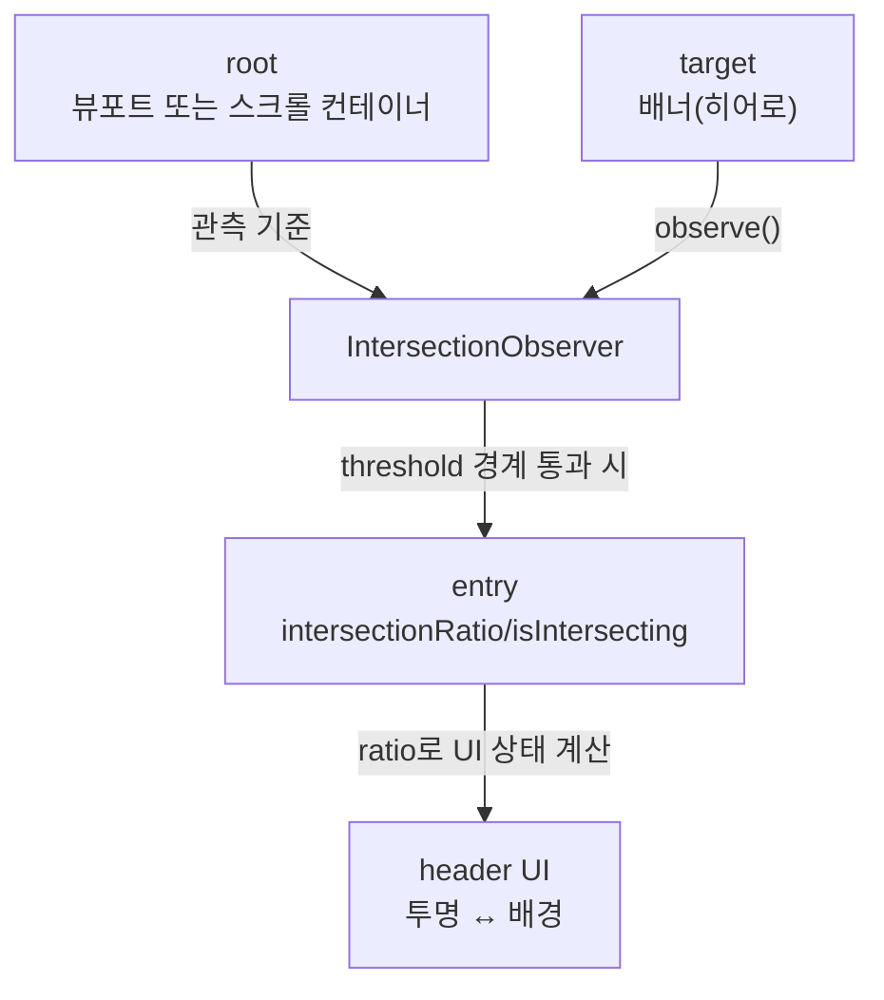

# 보이는 만큼만 반응하라: IntersectionObserver로 헤더 상태 제어


한 문장 결론: **배너(히어로)가 “얼마나 보이는지”를** **`IntersectionObserver`****로 측정하면, 스크롤 이벤트에 기대지 않고도 헤더 UI를 자연스럽게 전환할 수 있다.**


메인 배너 위에 제목이 크게 있고, 스크롤을 내리면 헤더가 내용을 가리지 않도록 스타일이 바뀌는 UI는 자주 등장한다.


포인트는 단순하다. **스크롤 위치가 아니라 “타깃 엘리먼트가 루트(뷰포트/스크롤 컨테이너) 안에 얼마나 보이는지”**로 상태를 결정하면 된다.


이 방식이 중요한 이유는 다음과 같다.

- UX: 배너 구간에서는 헤더를 가볍게, 본문 구간에서는 가독성/대비를 확실하게 가져갈 수 있다.
- 유지보수: “스크롤 탑 값 기준” 조건 분기가 줄고, 레이아웃이 바뀌어도 로직을 덜 흔든다.
- 안정성: 관측 기준이 DOM의 실제 교차 상태라서, 다양한 스크롤 컨테이너에서도 일관되게 동작한다. ([MDN Web Docs](https://developer.mozilla.org/))

---


## 배경/문제


헤더를 배너 위에 오버레이(겹침)로 올리면, 스크롤 중 헤더가 본문을 가리거나 대비가 부족해지는 순간이 생긴다.


보통은 “스크롤 위치가 어디쯤이면 헤더에 배경을 넣자” 같은 규칙으로 처리한다.


하지만 스크롤 위치 기반 로직은 다음 상황에서 자주 흔들린다.

- 스크롤 컨테이너가 뷰포트가 아니라 특정 래퍼(`overflow: auto`)인 경우
- 배너 높이가 반응형으로 바뀌는 경우
- 상단 여백/고정 요소(툴바 등)가 끼어드는 경우

이럴 때는 “스크롤 탑 값”보다 **“배너가 보이는 비율”**을 기준으로 잡는 편이 간결하다.


---


## 핵심 개념


`IntersectionObserver`는 **루트(root) 영역과 타깃(target) 엘리먼트가 얼마나 교차(intersect)하는지**를 비동기적으로 알려준다.


여기서 “얼마나 보이나요?”에 해당하는 값이 `intersectionRatio`(교차 비율)이다. ([IntersectionObserver - MDN](https://developer.mozilla.org/en-US/docs/Web/API/Intersection_Observer_API))

- `root`: 관측 기준이 되는 영역 (없으면 브라우저 뷰포트)
- `threshold`: 콜백이 호출될 “교차 비율 경계값” 목록 (0 ~ 1)
- `IntersectionObserverEntry.intersectionRatio`: 현재 교차 비율
- `IntersectionObserverEntry.isIntersecting`: 교차 여부(교차 중이면 `true`)

아래 다이어그램을 보면, “스크롤”을 직접 계산하지 않고도 “보임”을 상태로 만들 수 있다는 게 핵심이다.





→ 기대 결과/무엇이 달라졌는지: 스크롤 이벤트로 위치를 직접 재지 않고, “배너가 보이는 정도”만으로 헤더 스타일 전환을 구성할 수 있다.


---


## 해결 접근


목표는 2가지다.

1. **배너가 일정 비율 이상 보일 때**: 헤더를 투명/가벼운 스타일로 유지
2. **배너가 거의 안 보일 때**: 헤더에 배경을 넣어 본문 가독성을 확보

여기서 “일정 비율”은 팀/디자인에 따라 달라질 수 있으니 `threshold`와 전환 기준을 조정하면 된다.


### 대안/비교

- **스크롤 이벤트 +** **`getBoundingClientRect()`**
    - 장점: 구현이 직관적일 수 있음
    - 단점: 스크롤/리사이즈에서 직접 계산과 상태 업데이트를 설계해야 해서 분기가 늘기 쉽다.
- **CSS로 헤더를 항상 고정 + 항상 배경 적용**
    - 장점: 로직이 거의 필요 없다
    - 단점: 배너 위 오버레이 느낌(가벼운 첫 화면)을 포기하게 된다.
- **`IntersectionObserver`****로 “보이는 정도” 기준 전환**
    - 장점: 기준이 명확(교차 상태)하고, 스크롤 컨테이너/반응형에서 로직이 덜 흔들린다.
    - 단점: 실행 환경의 지원 범위는 정책에 따라 달라질 수 있다(필요 시 폴백 고려). ([MDN Web Docs](https://developer.mozilla.org/en-US/docs/Web/API/Intersection_Observer_API))

---


## 구현(코드)


아래 예시는 Next.js에서 재현 가능한 형태로 구성했다. `IntersectionObserver`는 브라우저 API이므로 **Client Component에서** **`useEffect`****로 초기화**한다. ([Next.js Docs](https://nextjs.org/docs), [React Docs](https://react.dev/))


### 1) 배너 “보임 비율”로 헤더 배경 투명도 제어


```typescript
'use client';

import { useEffect, useMemo, useRef, useState } from 'react';

export default function BannerAwareHeaderDemo() {
  const rootRef = useRef<HTMLDivElement | null>(null);   // 스크롤 컨테이너(없으면 뷰포트 기준)
  const bannerRef = useRef<HTMLDivElement | null>(null); // 관측 대상(배너)
  const [ratio, setRatio] = useState(1);

  // ratio(0~1)를 헤더 배경 투명도로 매핑 (예: 배너가 사라질수록 배경이 진해짐)
  const headerStyle = useMemo(() => {
    const opacity = Math.min(1, Math.max(0, 1 - ratio)); // ratio=1 -> 0, ratio=0 -> 1
    return { backgroundColor: `rgba(0, 0, 0, ${opacity})` };
  }, [ratio]);

  useEffect(() => {
    const rootEl = rootRef.current;      // null이면 뷰포트 기준
    const targetEl = bannerRef.current;
    if (!targetEl) return;

    const observer = new IntersectionObserver(
      ([entry]) => {
        setRatio(entry.intersectionRatio);
      },
      {
        root: rootEl ?? null,
        threshold: [0, 0.1, 0.25, 0.5, 0.75, 1],
      }
    );

    observer.observe(targetEl);
    return () => observer.disconnect();
  }, []);

  return (
    <div style={{ height: '100vh', position: 'relative' }}>
      <header
        style={{
          ...headerStyle,
          position: 'sticky',
          top: 0,
          zIndex: 10,
          color: 'white',
          padding: '12px 16px',
          backdropFilter: 'blur(8px)',
        }}
      >
        <strong>Header</strong>
      </header>

      <div
        ref={rootRef}
        style={{
          height: 'calc(100vh - 0px)',
          overflowY: 'auto',
        }}
      >
        <section
          ref={bannerRef}
          style={{
            height: 320,
            background: 'linear-gradient(135deg, #4f46e5, #22c55e)',
            display: 'flex',
            alignItems: 'end',
            padding: 16,
            color: 'white',
          }}
        >
          <h1 style={{ margin: 0 }}>Hero Banner</h1>
        </section>

        <main style={{ padding: 16, lineHeight: 1.7 }}>
          <p>스크롤을 내려 보세요. 배너가 보이는 비율에 따라 헤더 배경이 자연스럽게 변합니다.</p>
          {Array.from({ length: 40 }).map((_, i) => (
            <p key={i}>본문 내용 {i + 1}</p>
          ))}
        </main>
      </div>
    </div>
  );
}
```


→ 기대 결과/무엇이 달라졌는지: 배너가 화면에서 사라질수록 헤더 배경이 점점 진해지고, 배너가 많이 보이면 헤더가 투명해져 “첫 화면” 느낌을 유지한다.


### 2) “배너가 거의 안 보일 때”만 헤더 스타일 토글(단순 버전)


투명도까지 필요 없고, 경계만 깔끔히 자르고 싶다면 `ratio` 대신 boolean 상태로도 충분하다.


```typescript
'use client';

import { useEffect, useRef, useState } from 'react';

export function SimpleHeaderToggle() {
  const bannerRef = useRef<HTMLDivElement | null>(null);
  const [isSolid, setIsSolid] = useState(false);

  useEffect(() => {
    const targetEl = bannerRef.current;
    if (!targetEl) return;

    const observer = new IntersectionObserver(
      ([entry]) => {
        // 배너가 10% 미만 보이면 헤더에 배경 적용
        setIsSolid(entry.intersectionRatio < 0.1);
      },
      { threshold: [0, 0.1, 1] }
    );

    observer.observe(targetEl);
    return () => observer.disconnect();
  }, []);

  return (
    <>
      <header
        style={{
          position: 'sticky',
          top: 0,
          zIndex: 10,
          padding: '12px 16px',
          color: isSolid ? 'black' : 'white',
          background: isSolid ? 'white' : 'transparent',
          borderBottom: isSolid ? '1px solid rgba(0,0,0,0.08)' : 'none',
        }}
      >
        <strong>Header</strong>
      </header>

      <section ref={bannerRef} style={{ height: 320, background: '#111827' }} />
      <main style={{ padding: 16 }}>
        {Array.from({ length: 40 }).map((_, i) => (
          <p key={i}>본문 내용 {i + 1}</p>
        ))}
      </main>
    </>
  );
}
```


→ 기대 결과/무엇이 달라졌는지: 배너가 어느 정도 사라지는 순간(경계값 통과)부터 헤더가 “투명 → 배경 있음”으로 고정 전환된다.


### 3) 확장: 무한 스크롤(하단 센티널 관측)


같은 원리로 **리스트 맨 아래 센티널(sentinel) 엘리먼트**가 보이면 다음 페이지를 불러오는 형태도 만들 수 있다. ([web.dev](https://web.dev/))


```typescript
'use client';

import { useEffect, useRef, useState } from 'react';

export function InfiniteScrollSkeleton() {
  const sentinelRef = useRef<HTMLDivElement | null>(null);
  const [items, setItems] = useState(() => Array.from({ length: 20 }, (_, i) => `Item ${i + 1}`));
  const [loading, setLoading] = useState(false);

  useEffect(() => {
    const el = sentinelRef.current;
    if (!el) return;

    const observer = new IntersectionObserver(async ([entry]) => {
      if (!entry.isIntersecting) return;
      if (loading) return;

      setLoading(true);
      // 실제로는 API 호출 후 append
      await new Promise((r) => setTimeout(r, 300));
      setItems((prev) => [
        ...prev,
        ...Array.from({ length: 10 }, (_, i) => `Item ${prev.length + i + 1}`),
      ]);
      setLoading(false);
    });

    observer.observe(el);
    return () => observer.disconnect();
  }, [loading]);

  return (
    <div style={{ padding: 16 }}>
      <ul>
        {items.map((v) => (
          <li key={v}>{v}</li>
        ))}
      </ul>

      <div ref={sentinelRef} style={{ height: 1 }} />
      <p>{loading ? 'Loading…' : 'Scroll down'}</p>
    </div>
  );
}
```


→ 기대 결과/무엇이 달라졌는지: 스크롤 위치 계산 없이, 하단 센티널이 보이는 순간에만 다음 데이터를 붙이는 트리거를 만들 수 있다.


---


## 검증 방법(체크리스트)

- [ ] 배너가 화면에 많이 보일 때/거의 안 보일 때 헤더 상태가 의도대로 바뀐다.
- [ ] `root`를 뷰포트 기준으로 쓸 때(`root: null`)와 스크롤 컨테이너 기준으로 쓸 때 모두 동작한다.
- [ ] 페이지 이동/언마운트 시 `observer.disconnect()`로 정리되어 중복 관측이 쌓이지 않는다.
- [ ] 헤더가 투명한 구간에서도 텍스트 대비가 확보된다(배너 배경에 따라 조정 필요). ([MDN Web Docs](https://developer.mozilla.org/))
- [ ] “임계값(threshold) 경계”에서만 토글이 일어나며, 불필요한 상태 업데이트가 과도하게 발생하지 않는다.

---


## 흔한 실수/FAQ


### Q1. 콜백이 스크롤마다 계속 호출되나요?


`IntersectionObserver`는 **교차 상태가 바뀌거나, 설정한** **`threshold`** **경계를 넘나들 때** 호출된다.


정밀하게 추적하고 싶으면 `threshold`를 촘촘하게 늘리고, 단순 토글이면 2~3개만 둔다. ([IntersectionObserver - MDN](https://developer.mozilla.org/en-US/docs/Web/API/Intersection_Observer_API))


### Q2. `threshold: [0.1, 0]`처럼 순서가 섞여 있어도 되나요?


동작은 환경마다 내부 정렬이 이뤄질 수 있지만, 문서/코드 이해를 위해 **오름차순으로 정렬**해두는 편이 안전하다.


팀에서 합의한 UI 경계값을 보기 좋게 유지하는 데도 도움이 된다.


### Q3. Next.js에서 `document.querySelector`로 바로 잡으면 안 되나요?


서버 렌더링이 끼는 환경에서는 `document/window` 접근 시점이 문제가 될 수 있다.


Client Component에서 `ref + useEffect`로 DOM이 준비된 뒤 관측을 시작하는 방식이 안전하다. ([Next.js Docs](https://nextjs.org/docs), [React Docs](https://react.dev/))


### Q4. `root`를 지정했는데 관측이 안 되는 것 같아요


`root`는 **스크롤이 실제로 발생하는 컨테이너**여야 하고, 일반적으로 `overflow: auto/scroll`이 필요하다.


또한 `target`이 `root` 내부에 있어야 교차 계산이 자연스럽다.


---


## 요약(3~5줄)

- `IntersectionObserver`는 “스크롤 값”이 아니라 “엘리먼트가 얼마나 보이는지”로 UI 상태를 만든다.
- 헤더를 배너 위에서 가볍게, 본문 구간에서 또렷하게 바꾸는 전환에 특히 잘 맞는다.
- Next.js에서는 Client Component에서 `useEffect`로 초기화하고, 언마운트 시 `disconnect()`로 정리한다.
- `intersectionRatio`로 투명도까지 제어하거나, 단순 토글이면 ratio/`isIntersecting`만으로도 충분하다.

---


## 결론


헤더 전환을 “스크롤 탑 기준”으로 억지로 맞추기 시작하면, 레이아웃 변화와 스크롤 컨테이너 변형에 따라 조건이 계속 늘어난다.


`IntersectionObserver`로 **보이는 비율을 상태로 만들면** 규칙이 단순해지고, UI 전환도 더 자연스럽게 이어진다.


---


## 참고(공식 문서 링크)

- [Next.js Docs](https://nextjs.org/docs)
- [React Docs](https://react.dev/)
- [Intersection Observer API - MDN](https://developer.mozilla.org/en-US/docs/Web/API/Intersection_Observer_API)
- [IntersectionObserverEntry - MDN](https://developer.mozilla.org/en-US/docs/Web/API/IntersectionObserverEntry)
- [MDN Web Docs](https://developer.mozilla.org/)
- [web.dev](https://web.dev/)
