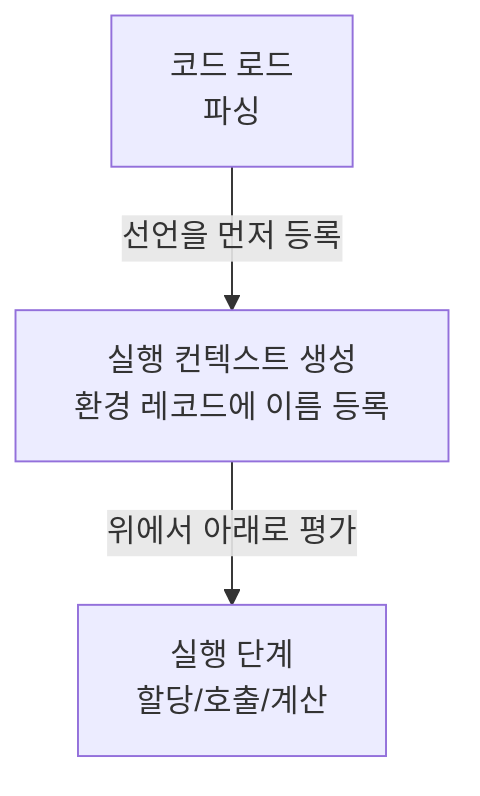

# 선언은 위로, 값은 아래로: 자바스크립트 호이스팅의 실제 동작


호이스팅(hoisting)은 코드가 “위로 이동”하는 현상이 아니라, **실행 전에 선언 정보가 먼저 등록되는 동작**이다.


왜 중요한가 하면, 선언 순서를 잘못 이해하면 `undefined`가 튀어나오거나 `ReferenceError`로 런타임이 깨진다.


특히 Next.js처럼 서버/클라이언트 실행 위치가 나뉘는 환경에서는 “어디서 실행되는 로그인지”까지 섞여 보이기 쉬워서, 호이스팅을 정확히 잡아두면 디버깅 속도가 확 올라간다.


포인트는 간단하다. **선언 등록과 값 할당(초기화)은 타이밍이 다르다.**


---


## 배경/문제


다음 코드는 왜 이렇게 동작할까?


```javascript
console.log(myVar); // undefined
var myVar = 5;
console.log(myVar); // 5
```


→ 기대 결과/무엇이 달라졌는지: 첫 번째 출력은 `undefined`, 두 번째 출력은 `5`가 나온다. “선언은 먼저 잡히고, 값은 나중에 들어간다”는 힌트다.


---


## 핵심 개념


자바스크립트 엔진은 코드를 실행할 때, 대략 다음 흐름으로 움직인다.

- **선언 수집**: 변수/함수/클래스 선언을 “이 스코프에 이런 이름이 있다” 수준으로 먼저 등록한다.
- **실행**: 위에서 아래로 코드를 평가하면서 값 할당, 함수 호출 같은 실제 동작이 일어난다.

아래 다이어그램을 보면 “호이스팅”이 왜 가능해지는지 한 번에 정리된다.





→ 기대 결과/무엇이 달라졌는지: “선언이 먼저 등록”되기 때문에, 선언문보다 위에서 이름을 참조하는 상황이 생긴다. 다만 “값까지 미리 올라가는 것”은 아니다.


### 1) `var`는 “선언 등록 + `undefined` 초기화”가 먼저 일어난다


`var`로 선언된 식별자(identifier)는 **선언이 등록될 때 기본값이** **`undefined`****로 잡히는 동작**을 기대할 수 있다.


```javascript
console.log(myVar); // undefined
var myVar = 5;
console.log(myVar); // 5
```


→ 기대 결과/무엇이 달라졌는지: `var myVar`는 먼저 등록되고 `undefined`로 시작한다. 실제 값 `5`는 실행이 그 줄에 도달했을 때 들어간다.


### 2) `let`/`const`는 “선언은 등록되지만, 초기화 전 접근이 막힌다”


`let`/`const`는 선언이 등록되더라도, **초기화 이전에는 접근이 차단**된다. 이 구간을 TDZ(Temporal Dead Zone, “일시적 사각지대”)라고 부른다.


```javascript
console.log(count); // ReferenceError
let count = 1;
```


→ 기대 결과/무엇이 달라졌는지: `let`도 선언 자체는 스코프에 잡히지만, 초기화 이전 접근은 에러로 막혀서 `var`처럼 `undefined`가 나오지 않는다.


`const`는 “재할당 금지”보다 먼저, **선언과 동시에 초기화가 필요**하다는 점도 같이 따라온다.


```javascript
const x; // SyntaxError
```


→ 기대 결과/무엇이 달라졌는지: `const`는 선언만 단독으로 둘 수 없다. 선언 시점에 값이 필요하다.


### 3) 함수는 “선언 방식”에 따라 호이스팅 체감이 달라진다


함수 선언문(function declaration)은 호출 위치가 앞에 있어도 동작하는 경우가 많다.


```javascript
sayHi(); // "hi"
function sayHi() {
  console.log("hi");
}
```


→ 기대 결과/무엇이 달라졌는지: 함수 선언문은 “함수 자체”가 먼저 등록되는 쪽으로 동작해서, 선언 이전 호출이 가능해 보인다.


반면 함수 표현식(function expression)은 변수를 통해 함수를 담는 형태라서, 변수 초기화 타이밍의 영향을 그대로 받는다.


```javascript
sayHi(); // TypeError (또는 ReferenceError)
var sayHi = function () {
  console.log("hi");
};
```


→ 기대 결과/무엇이 달라졌는지: `var sayHi`는 `undefined`로 먼저 잡히기 때문에, 호출 시점에는 “함수가 아닌 값”이라 에러가 난다.


---


## 해결 접근


호이스팅을 “피해야 할 마법”으로 보기보다, **실수를 줄이는 설계 규칙**으로 가져가면 깔끔해진다.

1. **기본은** **`const`****/****`let`**
    - 왜: TDZ 덕분에 초기화 이전 접근이 바로 드러나서 버그가 빨리 잡힌다.
    - 기대 결과: “조용한 `undefined`” 대신 “즉시 실패”로 원인 추적이 빨라진다.
2. **함수는 “선언문” 또는 “사용보다 위에 배치”로 통일**
    - 왜: 호출-정의 순서가 섞이면, 함수 선언/표현식의 차이로 오류가 불규칙하게 보인다.
    - 기대 결과: 팀 내 코드 스타일이 단순해지고, 리팩터링 시 안전해진다.
3. **(대안) 린트로 강제하기**
    - 왜: 사람은 항상 실수한다. 규칙을 도구로 고정하는 게 싸다.
    - 기대 결과: 리뷰에서 “순서 논쟁”이 줄고, 일관성이 확보된다.

비교해보면 이렇게 정리할 수 있다.

- 대안 A: `var` 허용 + 주의 깊은 코드 스타일
    - 장점: 레거시 코드와 섞을 때 변경 폭이 작다.
    - 단점: `undefined`가 조용히 흘러가 디버깅이 어려워질 수 있다.
- 대안 B: `const`/`let` 기본 + `no-use-before-define` 같은 린트 규칙
    - 장점: 실수를 “초기에” 잡는다.
    - 단점: 기존 코드 정리 비용이 발생할 수 있다.

---


## 구현(코드)


### Next.js에서 재현 가능한 최소 예시


Client Component에서 브라우저 콘솔로 확인하려면 `useEffect`를 쓰는 편이 안정적이다. (렌더링 중 로그가 섞이는 걸 피한다.)


```typescript
"use client";

import { useEffect } from "react";

export default function HoistingDemo() {
  useEffect(() => {
    console.log("var:", myVar); // undefined
    var myVar = 5;
    console.log("var:", myVar); // 5

    try {
      // eslint-disable-next-line no-use-before-define
      console.log("let:", myLet);
    } catch (e) {
      console.log("let error:", e instanceof Error ? e.name : e);
    }
    let myLet = 1;
    console.log("let:", myLet); // 1
  }, []);

  return <div>Open DevTools Console</div>;
}
```


→ 기대 결과/무엇이 달라졌는지: 브라우저 콘솔에서 `var`는 `undefined → 5`로, `let`은 초기화 전 접근이 에러로 찍힌 뒤 `1`이 출력된다.

> 서버에서 확인하고 싶다면 Server Component에서 `console.log`를 찍을 수 있지만, 그 로그는 브라우저가 아니라 서버 터미널에 찍힌다. 실행 위치를 혼동하지 않는 게 중요하다.
>
> 참고: [Next.js Docs](https://nextjs.org/docs) / [Client Components](https://nextjs.org/docs/app/building-your-application/rendering/client-components) / [Server Components](https://nextjs.org/docs/app/building-your-application/rendering/server-components)
>
>

---


## 검증 방법(체크리스트)

- [ ] `var` 예시에서 “선언 이전 참조”가 `undefined`로 나오는가?
- [ ] `let`/`const` 예시에서 “초기화 이전 참조”가 `ReferenceError`로 실패하는가?
- [ ] 함수 선언문은 선언 이전 호출이 동작하고, 함수 표현식은 동작하지 않는가?
- [ ] Next.js에서는 “로그가 서버인지/브라우저인지”를 구분해서 확인했는가?

---


## 흔한 실수/FAQ


### Q1. 호이스팅은 코드가 실제로 위로 이동하는 건가요?


아니다. 코드는 그대로 있고, **실행 전에 선언이 환경 레코드에 등록**되기 때문에 “위에서 접근 가능한 것처럼” 보인다.


참고: [MDN - Hoisting](https://developer.mozilla.org/en-US/docs/Glossary/Hoisting)


### Q2. `let`/`const`는 호이스팅이 안 되는 거 아닌가요?


선언 정보는 잡히지만, **초기화 이전 접근이 TDZ로 막힌다.** 그래서 “호이스팅이 안 된다”처럼 체감될 뿐이다.


참고: [MDN - let](https://developer.mozilla.org/en-US/docs/Web/JavaScript/Reference/Statements/let), [MDN - const](https://developer.mozilla.org/en-US/docs/Web/JavaScript/Reference/Statements/const)


### Q3. Next.js에서 `var`를 전역처럼 쓰면 `window.myVar`로 잡히나요?


Next.js의 소스 파일은 모듈로 동작하므로, 최상단 `var`가 항상 전역 객체 프로퍼티가 되는 방식으로 기대하기는 어렵다. “전역 공유”가 필요하면 `globalThis` 같은 명시적인 경로를 쓰는 편이 안전하다.


참고: [MDN - globalThis](https://developer.mozilla.org/en-US/docs/Web/JavaScript/Reference/Global_Objects/globalThis)


---


## 요약(3~5줄)

- 호이스팅은 “코드 이동”이 아니라 **선언 등록 타이밍** 문제다.
- `var`는 선언 시 `undefined`로 시작해 조용히 흘러갈 수 있다.
- `let`/`const`는 TDZ로 초기화 전 접근을 막아 실수를 빨리 드러낸다.
- 함수는 선언 방식에 따라 호출 가능 시점이 달라진다.
- Next.js에서는 실행 위치(서버/브라우저)까지 구분하면 디버깅이 쉬워진다.

---


## 결론


호이스팅을 이해하는 핵심은 “선언은 먼저 등록되지만, 값은 실행 중에 들어간다”로 끝난다.


코드에서는 `const`/`let`을 기본으로 하고, 함수 선언 방식과 선언 위치 규칙을 통일하면 호이스팅으로 인한 오류 대부분이 사라진다.


---


## 참고(공식 문서 링크)

- [Next.js Docs](https://nextjs.org/docs)
- [React Docs](https://react.dev/)
- [React - useEffect](https://react.dev/reference/react/useEffect)
- [MDN - Hoisting](https://developer.mozilla.org/en-US/docs/Glossary/Hoisting)
- [MDN - var](https://developer.mozilla.org/en-US/docs/Web/JavaScript/Reference/Statements/var)
- [MDN - let](https://developer.mozilla.org/en-US/docs/Web/JavaScript/Reference/Statements/let)
- [MDN - const](https://developer.mozilla.org/en-US/docs/Web/JavaScript/Reference/Statements/const)
- [MDN - Functions](https://developer.mozilla.org/en-US/docs/Web/JavaScript/Reference/Functions)
- [MDN - Classes](https://developer.mozilla.org/en-US/docs/Web/JavaScript/Reference/Classes)
- [MDN - globalThis](https://developer.mozilla.org/en-US/docs/Web/JavaScript/Reference/Global_Objects/globalThis)
