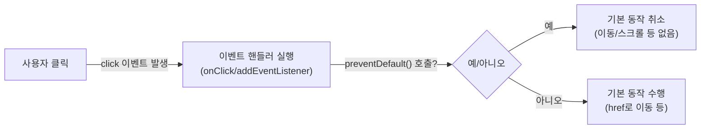

# 링크는 이동만 하라: `javascript:` pseudo protocol 걷어내기


한 문장 결론: **함수 실행은** **`<button>`****, 화면 이동은** **`<a>`****/****`<Link>`****로 분리하면** **`javascript:`****/****`#`** **같은 “이동 차단 꼼수”를 지울 수 있다.**


---


## 배경/문제


레거시 코드에서 아래 패턴을 종종 만난다.


```html
<a href="javascript:" onclick="foo()">javascript:</a>
<a href="#" onclick="foo();return false;">#</a>
<a href="javascript:void(0)" onclick="foo()">javascript:void(0)</a>
```


이 코드는 공통적으로 “클릭하면 함수를 실행하고 싶지만, `<a>`의 기본 동작(페이지 이동)은 막고 싶다”는 의도를 가진다. 문제는 이 방식이 **접근성(키보드/스크린리더 동작), 예측 가능성(스크롤/히스토리), 보안(문자열 URL 주입)** 측면에서 유지보수 비용을 키운다는 점이다.


포인트는 간단하다. **`<a>`****는 ‘이동’**, **`<button>`****은 ‘동작’**이다. 의미가 맞으면 브라우저의 기본 동작과 보조기기 동작이 자연스럽게 따라온다.


- `<a>`는 `href`로 “어디로 이동하는지”를 표현한다. ([MDN: ](https://developer.mozilla.org/en-US/docs/Web/HTML/Reference/Elements/a)[`<a>`](https://developer.mozilla.org/en-US/docs/Web/HTML/Reference/Elements/a)[ element](https://developer.mozilla.org/en-US/docs/Web/HTML/Reference/Elements/a))


- `<button>`은 “어떤 동작을 실행하는지”에 집중한다. ([MDN: ](https://developer.mozilla.org/en-US/docs/Web/HTML/Reference/Elements/button)[`<button>`](https://developer.mozilla.org/en-US/docs/Web/HTML/Reference/Elements/button)[ element](https://developer.mozilla.org/en-US/docs/Web/HTML/Reference/Elements/button))


---


## 핵심 개념


### 1) 클릭 이벤트와 “기본 동작(default action)”


링크 클릭은 대략 “이벤트 핸들러 실행 → 기본 동작(이동 등) 실행”의 흐름을 가진다. 기본 동작을 막고 싶다면 `preventDefault()`로 취소한다. ([MDN: ](https://developer.mozilla.org/en-US/docs/Web/API/Event/preventDefault)[`Event.preventDefault()`](https://developer.mozilla.org/en-US/docs/Web/API/Event/preventDefault))





→ 기대 결과/무엇이 달라졌는지: “왜 `onclick`이 먼저 실행되고 그 다음에 이동이 일어나는지”가 흐름으로 고정된다. `javascript:`/`#`가 왜 필요했는지도 같이 설명된다.


---


### 2) `javascript:` URL이 하는 일


`href="javascript:..."`는 URL 스킴(scheme)으로서 “해당 문자열을 코드로 평가”하는 특수 동작을 유도한다. 이런 사용 대신 **DOM API로 페이지를 직접 조작하는 방식**이 권장된다. ([MDN: ](https://developer.mozilla.org/en-US/docs/Web/URI/Reference/Schemes/javascript)[`javascript:`](https://developer.mozilla.org/en-US/docs/Web/URI/Reference/Schemes/javascript)[ URLs](https://developer.mozilla.org/en-US/docs/Web/URI/Reference/Schemes/javascript))


---


### 3) `href="#"`가 만드는 부작용


`#`는 “같은 문서 내 앵커로 이동”을 의미한다. 앵커 대상이 없으면 결과적으로 **문서 최상단으로 스크롤이 튈 수 있고**, 해시 변경으로 **히스토리/라우팅에 영향을 줄 수 있다**(환경에 따라 다름). “아무 것도 안 하게 만들기” 용도로 쓰면 의도가 흐려진다. ([MDN: Creating links](https://developer.mozilla.org/en-US/docs/Learn_web_development/Core/Structuring_content/Creating_links))


---


## 해결 접근


핵심은 “의도에 맞는 요소 선택”이다.

1. **이동(라우팅/URL 변경)이 목적**이면
- 내부 이동: Next.js의 `<Link>` 사용
- 외부 이동: `<a href="...">` 사용
([Next.js Docs: Link Component](https://nextjs.org/docs/app/api-reference/components/link))
1. **현재 화면에서 동작(모달 열기/토글/요청 보내기)이 목적**이면
- `<button type="button">` 사용
([MDN: ](https://developer.mozilla.org/en-US/docs/Web/HTML/Reference/Elements/button)[`<button>`](https://developer.mozilla.org/en-US/docs/Web/HTML/Reference/Elements/button)[ element](https://developer.mozilla.org/en-US/docs/Web/HTML/Reference/Elements/button))
1. “디자인이 링크처럼 보여야 한다”는 이유로 `<a>`를 쓰고 싶다면
- **버튼을 링크처럼 스타일링**하는 편이 의미/동작/접근성 정합성이 높다.

---


## 구현(코드)


### 1) Next.js에서 “이동”은 `<Link>`


```typescript
import Link from 'next/link';

export function NavExample() {
  return (
    <nav>
      <Link href="/settings">설정으로 이동</Link>
    </nav>
  );
}
```


→ 기대 결과/무엇이 달라졌는지: 내부 라우팅이 `<a>` 확장 컴포넌트로 통일되어, 이동 목적의 UI가 “진짜 링크”로 동작한다(새 탭/주소 미리보기 등 기대와 일치).


---


### 2) Next.js에서 “동작”은 `<button>` (Client Component)


클릭 핸들러가 필요하면 클라이언트에서 실행되는 컴포넌트 경계가 필요하다. ([Next.js Docs: Server and Client Components](https://nextjs.org/docs/app/getting-started/server-and-client-components), [Next.js Docs: ](https://nextjs.org/docs/app/api-reference/directives/use-client)[`use client`](https://nextjs.org/docs/app/api-reference/directives/use-client))


```typescript
'use client';

export function ActionExample() {
  const handleClick = () => {
    // foo()에 해당하는 “동작”을 여기에서 수행
    console.log('action!');
  };

  return (
    <button type="button" onClick={handleClick}>
      실행
    </button>
  );
}
```


→ 기대 결과/무엇이 달라졌는지: `href="javascript:void(0)"` 같은 우회 없이도 “클릭=동작 실행”이 된다. 기본 동작/히스토리/스크롤 부작용이 사라진다.


---


### 3) “링크처럼 보이는 버튼” 패턴 (추천)


```typescript
'use client';

export function LinkLikeButton() {
  return (
    <button
      type="button"
      className="linkLike"
      onClick={() => {
        // 예: 모달 열기, 토글, 클립보드 복사 등
      }}
    >
      링크처럼 보이지만 동작하는 버튼
    </button>
  );
}
```


```css
.linkLike {
  background: none;
  border: 0;
  padding: 0;
  font: inherit;
  text-decoration: underline;
  cursor: pointer;
}
```


→ 기대 결과/무엇이 달라졌는지: UI는 링크처럼 보여도 의미는 버튼으로 유지된다. 키보드(스페이스/엔터) 및 보조기기 기대 동작이 자연스럽다.


---


### 4) (불가피한 경우) `<a>`에서 기본 동작을 명시적으로 취소


레거시 마이그레이션 중 “마크업을 당장 바꾸기 어렵다”면, 최소한 기본 동작 취소를 **명시적으로** 한다.


```typescript
'use client';

export function TransitionalAnchor() {
  return (
    <a
      href="/noop"
      onClick={(e) => {
        e.preventDefault(); // 기본 동작(이동) 취소
        // 여기서 “동작” 수행
      }}
    >
      임시 처리
    </a>
  );
}
```


→ 기대 결과/무엇이 달라졌는지: `return false`나 `javascript:`에 기대지 않고 “무엇을 막는지”가 코드로 드러난다. (다만 최종 형태는 `<button>`으로 정리하는 편이 안전하다.)


---


## 검증 방법(체크리스트)

- [ ] **Tab**으로 포커스가 이동하고, 포커스 링이 보인다.
- [ ] “이동 UI”는 **주소 미리보기/새 탭 열기**가 자연스럽다. (링크)
- [ ] “동작 UI”는 **엔터/스페이스**로도 실행된다. (버튼)
- [ ] 클릭 후 **해시(****`#`****)가 바뀌지 않는다**(불필요한 스크롤 점프/히스토리 오염 없음).
- [ ] “동작 UI”를 눌러도 **페이지 이동/리로드가 발생하지 않는다**.
- [ ] 이벤트 취소가 필요하면 `preventDefault()`가 사용되고 있다. ([MDN: ](https://developer.mozilla.org/en-US/docs/Web/API/Event/preventDefault)[`Event.preventDefault()`](https://developer.mozilla.org/en-US/docs/Web/API/Event/preventDefault))

---


## 흔한 실수/FAQ


### Q1. “`return false`면 끝 아닌가?”


DOM 이벤트에서 기본 동작을 취소하려면 `preventDefault()`가 가장 명확하다. `return false`는 “어디에서 쓰느냐(인라인 핸들러/라이브러리/프레임워크)”에 따라 의미가 달라져 읽는 사람이 헷갈린다. 기본 동작 취소는 `preventDefault()`로 표현하는 편이 안전하다. ([MDN: ](https://developer.mozilla.org/en-US/docs/Web/API/Event/preventDefault)[`Event.preventDefault()`](https://developer.mozilla.org/en-US/docs/Web/API/Event/preventDefault))


### Q2. 링크에 `role="button"`만 달면 되지 않나?


`role="button"`은 “의미”만 바꾸고, 버튼이 기대하는 키보드 동작(특히 스페이스 처리)을 자동으로 만들어주지 않는다. 링크를 버튼처럼 쓰는 순간 추가 구현이 필요해진다. ([MDN: ARIA button role](https://developer.mozilla.org/en-US/docs/Web/Accessibility/ARIA/Reference/Roles/button_role))


### Q3. “왜 예전 코드에 `href="javascript:alert(2)"` 같은 게 있지?”


`onclick` 핸들러가 먼저 실행되고, 기본 동작(= `href`로 이동/평가)은 그 다음에 일어난다. 그래서 `onclick="alert(1); return false;"`처럼 기본 동작을 취소하면 `href`의 `javascript:` 평가는 실행되지 않는다. 이 흐름은 위 다이어그램의 “기본 동작” 개념으로 설명된다.


---


## 요약(3~5줄)

- `<a>`는 “이동”, `<button>`은 “동작”이라는 의미를 지키는 게 유지보수 비용을 낮춘다.
- `javascript:`/`#`는 “이동을 막기 위한 우회”였지만, 스크롤/히스토리/접근성/보안 관점에서 비용이 크다.
- Next.js에서는 내부 이동은 `<Link>`, 동작은 Client Component의 `<button>`으로 분리하면 깔끔하다.
- 기본 동작을 막아야 한다면 `preventDefault()`로 의도를 코드에 남긴다.

---


## 결론


레거시의 `javascript:` pseudo protocol은 “클릭=함수 실행”을 만들기 위한 시대의 산물일 수 있지만, 지금은 더 나은 기본 도구가 있다. **이동은 링크, 동작은 버튼**으로 분리하면 코드가 읽히는 방식 자체가 바뀌고, 그 순간부터 `javascript:void(0)` 같은 흔적도 자연스럽게 사라진다.


---


## 참고(공식 문서 링크)

- [Next.js Docs: Link Component](https://nextjs.org/docs/app/api-reference/components/link)
- [Next.js Docs: Server and Client Components](https://nextjs.org/docs/app/getting-started/server-and-client-components)
- [Next.js Docs: ](https://nextjs.org/docs/app/api-reference/directives/use-client)[`use client`](https://nextjs.org/docs/app/api-reference/directives/use-client)
- [MDN: ](https://developer.mozilla.org/en-US/docs/Web/HTML/Reference/Elements/a)[`<a>`](https://developer.mozilla.org/en-US/docs/Web/HTML/Reference/Elements/a)[ element](https://developer.mozilla.org/en-US/docs/Web/HTML/Reference/Elements/a)
- [MDN: ](https://developer.mozilla.org/en-US/docs/Web/HTML/Reference/Elements/button)[`<button>`](https://developer.mozilla.org/en-US/docs/Web/HTML/Reference/Elements/button)[ element](https://developer.mozilla.org/en-US/docs/Web/HTML/Reference/Elements/button)
- [MDN: ](https://developer.mozilla.org/en-US/docs/Web/URI/Reference/Schemes/javascript)[`javascript:`](https://developer.mozilla.org/en-US/docs/Web/URI/Reference/Schemes/javascript)[ URLs](https://developer.mozilla.org/en-US/docs/Web/URI/Reference/Schemes/javascript)
- [MDN: ](https://developer.mozilla.org/en-US/docs/Web/API/Event/preventDefault)[`Event.preventDefault()`](https://developer.mozilla.org/en-US/docs/Web/API/Event/preventDefault)
- [MDN: Introduction to events](https://developer.mozilla.org/en-US/docs/Learn_web_development/Core/Scripting/Events)
- [MDN: ARIA button role](https://developer.mozilla.org/en-US/docs/Web/Accessibility/ARIA/Reference/Roles/button_role)
