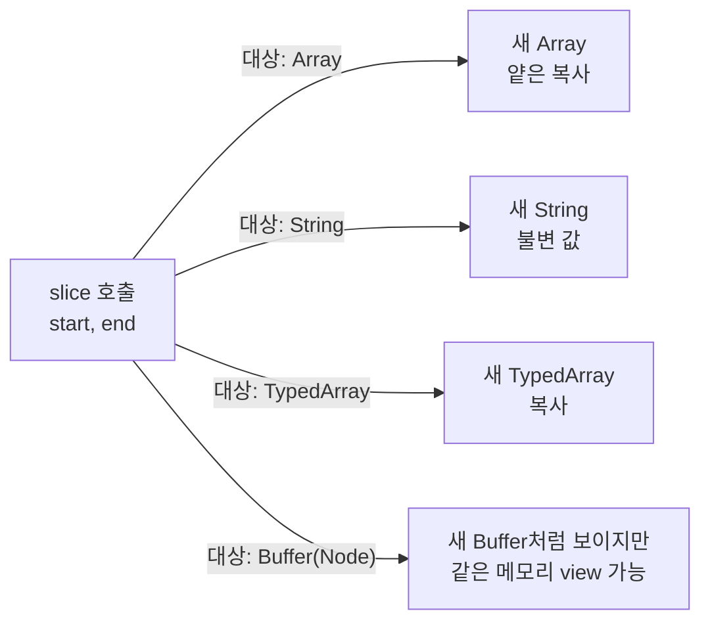

# 필요한 만큼만 잘라라: `slice`의 비파괴 복사 규칙


한 문장 결론: `slice`는 **원본을 유지한 채** 필요한 구간만 **새 값으로 잘라내는** 도구다. 다만 **Array / String / TypedArray / Buffer**는 "새 값"의 의미가 조금씩 다르다.


`slice`를 제대로 이해하면 얻는 이점이 분명하다.불필요한 원본 변경을 줄여 디버깅이 쉬워지고, 렌더링/상태 관리에서 의도치 않은 사이드 이펙트를 막는다. 또한 "복사 vs view(같은 메모리 공유)"를 구분하면 대용량 데이터 처리에서 성능·메모리 문제를 피하기 좋아진다.


---


## 배경/문제


코드를 보다 보면 이런 상황이 자주 생긴다.

- 리스트에서 "일부 구간만" 뽑아 UI에 보여주고 싶다.
- 문자열에서 "뒤쪽 확장자/접미사"만 안전하게 떼고 싶다.
- 바이너리/버퍼 데이터를 "헤더/페이로드"로 나눠 처리하고 싶다.

여기서 핵심은 **원본을 바꾸지 않는 것(비파괴)** 이다. 원본이 바뀌면, 상태 관리/캐시/렌더링 흐름에서 예상하지 못한 문제가 생기기 쉽다.


---


## 핵심 개념


### `slice`는 "잘라서 새 값"을 만든다 — 단, 타입별로 "새 값"의 의미가 다르다





→ 기대 결과/무엇이 달라졌는지: 같은 `slice`라도, **복사(copy)** 인지 **공유(view)** 인지 구분할 수 있어 의도치 않은 참조 공유/메모리 유지 문제를 줄입니다.


---


## 해결 접근

1. 먼저 "내가 다루는 대상"을 고른다: Array / String / TypedArray / Buffer
- 왜 하는지: 같은 API 이름이라도 결과가 달라질 수 있다.
- 기대 결과: "복사인지, view인지"를 코드 레벨에서 의식적으로 선택한다.
1. 구간 규칙을 고정한다: `start`부터 `end` **직전까지(end 미포함)**
- 왜 하는지: 오프바이원(off-by-one) 오류가 가장 흔하다.
- 기대 결과: 추출 구간이 예측 가능해진다.
1. 대안도 함께 기억한다(최소 2개)
- `slice` vs `splice` (원본 변경 여부)
- `TypedArray.slice` vs `TypedArray.subarray` (복사 vs view)
- `Buffer.slice`/`subarray` vs "진짜 복사" (`Buffer.from(...)`)

---


## 구현(코드)


### 1) Array `slice(start?, end?)`

- `start`부터 `end` 직전까지를 **새 배열**로 반환한다.
- 원본 배열은 변경되지 않는다.
- **얕은 복사(shallow copy)** 이므로 요소가 객체라면 **객체 참조는 공유**된다.

공식 문서: [MDN Array.prototype.slice()](https://developer.mozilla.org/en-US/docs/Web/JavaScript/Reference/Global_Objects/Array/slice)


```javascript
const animals = ["ant", "bison", "camel", "duck", "elephant"];

console.log(animals.slice(2));     // ["camel", "duck", "elephant"]
console.log(animals.slice(2, 4));  // ["camel", "duck"]
console.log(animals.slice(-2));    // ["duck", "elephant"]
console.log(animals.slice(2, -1)); // ["camel", "duck"]
console.log(animals.slice());      // 전체 복사(얕은 복사)
```


→ 기대 결과/무엇이 달라졌는지: 원본 `animals`는 그대로이고, 필요한 구간만 새 배열로 얻습니다. `end`는 포함되지 않습니다.


**음수 인덱스 규칙(배열)**: `-1`은 마지막, `-2`는 끝에서 두 번째…처럼 "뒤에서부터" 셉니다.


공식 문서: [MDN Array.prototype.slice()](https://developer.mozilla.org/en-US/docs/Web/JavaScript/Reference/Global_Objects/Array/slice)


---


### 2) String `slice(indexStart, indexEnd?)`

- 문자열에서 `indexStart`부터 `indexEnd` 직전까지를 잘라 **새 문자열**로 반환한다.
- 문자열은 불변(immutable) 값이므로 원본은 변경되지 않는다.
- `indexEnd <= indexStart`가 되면 정규화 후 **빈 문자열**이 나올 수 있다.

공식 문서: [MDN String.prototype.slice()](https://developer.mozilla.org/en-US/docs/Web/JavaScript/Reference/Global_Objects/String/slice)


```javascript
const str = "The quick brown fox jumps over the lazy dog.";

console.log(str.slice(31));      // "the lazy dog."
console.log(str.slice(4, 19));   // "quick brown fox"
console.log(str.slice(-4));      // "dog."
console.log(str.slice(-9, -5));  // "lazy"
```


→ 기대 결과/무엇이 달라졌는지: 문자열 일부를 안전하게 추출하고, 음수 인덱스로 "뒤에서부터"도 쉽게 자를 수 있습니다.


---


### 3) TypedArray `slice(start?, end?)` vs `subarray(start?, end?)`

- `Uint8Array`, `Float32Array` 같은 TypedArray에서도 `slice`는 같은 방식으로 잘라 **새 TypedArray(복사)** 를 만든다.

공식 문서: [MDN TypedArray.prototype.slice()](https://developer.mozilla.org/en-US/docs/Web/JavaScript/Reference/Global_Objects/TypedArray/slice)

- 반대로 `subarray`는 대개 **같은 메모리를 공유하는 view** 를 만든다(대용량에서 유리).

공식 문서: [MDN TypedArray.prototype.subarray()](https://developer.mozilla.org/en-US/docs/Web/JavaScript/Reference/Global_Objects/TypedArray/subarray)


```javascript
const bytes = new Uint8Array([10, 20, 30, 40, 50]);

const copied = bytes.slice(1, 4);     // 복사
const viewed = bytes.subarray(1, 4);  // view(공유)

bytes[2] = 999;

console.log(bytes);   // Uint8Array([10, 20, 999, 40, 50])
console.log(copied);  // Uint8Array([20, 30, 40])  // 보통 영향 없음(복사)
console.log(viewed);  // Uint8Array([20, 999, 40]) // 보통 영향 있음(공유)
```


→ 기대 결과/무엇이 달라졌는지: "복사"가 필요한지 "공유(view)"가 필요한지에 따라 `slice`/`subarray`를 선택할 수 있습니다.


---


### 4) `slice` vs `splice` (배열에서 가장 자주 헷갈리는 비교)

- `slice`: **원본 유지**, 일부를 **복사해서 반환**
- `splice`: **원본 변경**, 삭제/교체/삽입을 **제자리에서 수행**

공식 문서: [MDN Array.prototype.splice()](https://developer.mozilla.org/en-US/docs/Web/JavaScript/Reference/Global_Objects/Array/splice)


```javascript
const arr = ["a", "b", "c", "d"];

const sliced = arr.slice(1, 3);
console.log(sliced); // ["b", "c"]
console.log(arr);    // ["a", "b", "c", "d"] (원본 유지)

const spliced = arr.splice(1, 2);
console.log(spliced); // ["b", "c"]
console.log(arr);     // ["a", "d"] (원본 변경)
```


→ 기대 결과/무엇이 달라졌는지: 같은 "잘라내기"처럼 보여도, 상태/렌더링 안정성은 완전히 달라집니다.


---


### 5) Node.js `Buffer.slice()`는 "복사"가 아닐 수 있다


Node의 `Buffer.prototype.slice()`는 **복사가 아니라 같은 메모리를 바라보는 view**가 될 수 있다.


공식 문서: [Node.js Buffer docs](https://nodejs.org/api/buffer.html)


```javascript
// Node 환경 예시
const buf = Buffer.from([1, 2, 3, 4, 5]);

const view = buf.slice(1, 4); // 같은 메모리 view가 될 수 있음
view[0] = 99;

console.log(buf);  // <Buffer 01 63 03 04 05> 처럼 원본이 바뀔 수 있음
console.log(view); // <Buffer 63 03 04>
```


→ 기대 결과/무엇이 달라졌는지: Buffer에서 `slice`는 "원본 유지"라고 생각하면 위험합니다. 같은 메모리를 공유할 수 있습니다.


**Buffer에서 "진짜 복사"가 필요할 때**는 보통 아래처럼 새 Buffer를 만든다(환경/정책에 따라 선택이 달라질 수 있다).


공식 문서: [Node.js Buffer docs](https://nodejs.org/api/buffer.html)


```javascript
const buf = Buffer.from([1, 2, 3, 4, 5]);

const view = buf.subarray(1, 4);       // view(공유)
const copied = Buffer.from(view);      // 복사본 생성

view[0] = 99;

console.log(buf);    // 원본 변경 가능
console.log(copied); // 복사본은 영향 없음
```


→ 기대 결과/무엇이 달라졌는지: view와 복사본을 분리해, 원본 데이터가 예상치 않게 변하는 문제를 피합니다.


---


### 6) Next.js에서 재현 가능한 예시


(서버) Route Handler에서 Buffer 헤더/바디 분리하기

- 왜 하는지: 바이너리 포맷(예: 앞 4바이트는 길이, 이후는 페이로드)에서 구간 분리가 자주 필요하다.
- 기대 결과: "view인지 복사인지"를 명시적으로 선택해 안정적으로 처리한다.

공식 문서: [Next.js Route Handlers](https://nextjs.org/docs/app/building-your-application/routing/route-handlers)


```javascript
// app/api/binary/route.js
import { NextResponse } from "next/server";

export async function GET() {
  // 예시 데이터: [header(2 bytes)] + [payload(n bytes)]
  const raw = Buffer.from([0, 2, 10, 20, 30, 40]);

  const headerView = raw.subarray(0, 2);    // view(공유)
  const payloadCopy = Buffer.from(raw.subarray(2)); // 복사

  return NextResponse.json({
    header: Array.from(headerView),
    payload: Array.from(payloadCopy),
  });
}
```


→ 기대 결과/무엇이 달라졌는지: 서버에서 Buffer를 다룰 때 "공유(view)"와 "복사(copy)"를 분리해, 이후 로직이 원본을 오염시키는 문제를 줄입니다.


(클라이언트) 문자열/배열 slice로 UI 구간 추출하기


공식 문서: [Next.js Client Components](https://nextjs.org/docs/app/building-your-application/rendering/client-components)


```javascript
// app/slice-demo/page.jsx
"use client";

import { useMemo, useState } from "react";

export default function SliceDemo() {
  const [text, setText] = useState("The quick brown fox jumps over the lazy dog.");
  const [start, setStart] = useState(4);
  const [end, setEnd] = useState(19);

  const result = useMemo(() => text.slice(start, end), [text, start, end]);

  return (
    <main style= padding: 16 >
      <h1>slice demo</h1>

      <input value={text} onChange={(e) => setText(e.target.value)} style= width: "100%"  />

      <div style= display: "flex", gap: 8, marginTop: 12 >
        <label>
          start
          <input type="number" value={start} onChange={(e) => setStart(Number(e.target.value))} />
        </label>
        <label>
          end
          <input type="number" value={end} onChange={(e) => setEnd(Number(e.target.value))} />
        </label>
      </div>

      <p style= marginTop: 12 >
        result: <strong>{result}</strong>
      </p>
    </main>
  );
}
```


→ 기대 결과/무엇이 달라졌는지: 원본 문자열은 그대로 두고, UI에서 필요한 구간만 파생 값으로 안전하게 만들어 표시합니다.


---


## 검증 방법(체크리스트)

- [ ] `end`가 **포함되지 않는지** 확인했다. (`slice(2, 4)`는 2~3 인덱스)
- [ ] 음수 인덱스가 **뒤에서부터** 계산되는지 확인했다.
- [ ] 배열 요소가 객체라면, `slice`가 **얕은 복사**임을 이해하고 참조 공유 여부를 점검했다.
- [ ] TypedArray에서 "복사"가 필요하면 `slice`, "view"가 필요하면 `subarray`를 선택했다.
- [ ] Buffer에서 `slice`/`subarray`가 **view**일 수 있음을 고려했고, 필요 시 `Buffer.from(...)`로 복사했다.
- [ ] Next.js에서 Buffer는 서버 런타임에서 다뤄야 함을 인지했고(환경에 따라 달라질 수 있음), 클라이언트에서는 문자열/배열/TypedArray 위주로 구성했다.

---


## 흔한 실수/FAQ


### Q1. `slice`의 `end`는 왜 포함되지 않나요?


A. 구간 연산을 조합하기 쉽게 만들기 위해서다. `len = end - start`가 직관적으로 맞아떨어지고, 연속 구간을 붙일 때 경계가 덜 헷갈린다.


공식 문서: [MDN Array.prototype.slice()](https://developer.mozilla.org/en-US/docs/Web/JavaScript/Reference/Global_Objects/Array/slice)


### Q2. `slice()`로 "깊은 복사"가 되나요?


A. 아니다. 배열은 얕은 복사다. 요소가 객체라면 참조가 공유된다. "진짜 분리"가 목적이면 `structuredClone` 같은 별도 전략을 써야 한다.


공식 문서: [MDN Array.prototype.slice()](https://developer.mozilla.org/en-US/docs/Web/JavaScript/Reference/Global_Objects/Array/slice), [MDN structuredClone()](https://developer.mozilla.org/en-US/docs/Web/API/structuredClone)


### Q3. Buffer에서 `slice` 했는데 원본이 바뀌어요. 버그인가요?


A. Buffer의 `slice`는 view일 수 있다. 원본과 메모리를 공유하면, view를 수정하는 순간 원본도 바뀔 수 있다. 복사가 필요하면 `Buffer.from(...)` 같은 방식으로 새 Buffer를 만든다.


공식 문서: [Node.js Buffer docs](https://nodejs.org/api/buffer.html)


### Q4. TypedArray도 `slice`가 view인가요?


A. TypedArray의 `slice`는 보통 복사다. view가 목적이면 `subarray`가 더 직접적이다.


공식 문서: [MDN TypedArray.prototype.slice()](https://developer.mozilla.org/en-US/docs/Web/JavaScript/Reference/Global_Objects/TypedArray/slice), [MDN TypedArray.prototype.subarray()](https://developer.mozilla.org/en-US/docs/Web/JavaScript/Reference/Global_Objects/TypedArray/subarray)


---


## 요약(3~5줄)

- `slice`는 기본적으로 "원본을 유지하고 일부를 잘라 새 값을 만드는" 패턴이다.
- Array는 얕은 복사, String은 새 문자열, TypedArray는 복사, Buffer는 view가 될 수 있다.
- `slice` vs `splice`는 "원본 변경 여부"에서 갈린다.
- 대용량/바이너리에서는 "복사 vs view" 선택이 성능·메모리에 직결된다.

---


## 결론


`slice`는 가장 자주 쓰이는 "비파괴 파생" 도구다.


하지만 타입별로 "새 값"의 의미가 다르기 때문에, Array/String/TypedArray/Buffer를 한 번에 같은 방식으로 취급하면 위험해진다.


특히 Buffer와 TypedArray는 "복사"와 "view"를 분리해서 사고하면, 데이터 오염과 메모리 이슈를 동시에 줄일 수 있다.


---


## 참고(공식 문서 링크)

- [MDN Array.prototype.slice()](https://developer.mozilla.org/en-US/docs/Web/JavaScript/Reference/Global_Objects/Array/slice)
- [MDN String.prototype.slice()](https://developer.mozilla.org/en-US/docs/Web/JavaScript/Reference/Global_Objects/String/slice)
- [MDN TypedArray.prototype.slice()](https://developer.mozilla.org/en-US/docs/Web/JavaScript/Reference/Global_Objects/TypedArray/slice)
- [MDN TypedArray.prototype.subarray()](https://developer.mozilla.org/en-US/docs/Web/JavaScript/Reference/Global_Objects/TypedArray/subarray)
- [MDN Array.prototype.splice()](https://developer.mozilla.org/en-US/docs/Web/JavaScript/Reference/Global_Objects/Array/splice)
- [Node.js Buffer docs](https://nodejs.org/api/buffer.html)
- [Next.js Route Handlers](https://nextjs.org/docs/app/building-your-application/routing/route-handlers)
- [Next.js Client Components](https://nextjs.org/docs/app/building-your-application/rendering/client-components)
