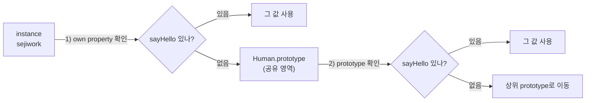

# 같은 함수는 두 번 만들지 마라: Prototype·Class·IIFE로 공유와 캡슐화


**한 문장 결론:** 인스턴스마다 같은 메서드를 만들지 말고 **프로토타입(prototype)** 에 올려 공유하되, “외부 접근을 막아야 하는 값/초기화”는 **IIFE(즉시 실행 함수)** 로 스코프를 닫아라.


같은 동작을 하는 함수를 인스턴스마다 새로 만들면, 객체가 늘어날수록 불필요한 중복이 생긴다.


이 중복은 메모리만의 문제가 아니다. “왜 같지?” 같은 비교/디버깅 비용으로도 돌아온다.


포인트는 단순하다. **공유할 건 공유하고, 감출 건 감춘다.**


---


## 배경/문제


아래 코드는 언뜻 정상처럼 보이지만, `sayHello`가 **매번 새로 생성**된다.


```javascript
function Human(name) {
  this.name = name;

  this.sayHello = function () {
    console.log(`안녕하세요.${this.name}입니다.`);
  };
}

const sejiwork = new Human("sejiwork");
const sejinjja = new Human("sejinjja");

console.log(sejiwork.sayHello === sejinjja.sayHello); // false
```


→ 기대 결과/무엇이 달라졌는지: 동작은 같아도 함수 참조가 서로 달라 `false`가 나온다(인스턴스마다 새 함수 생성).


---


## 핵심 개념


자바스크립트는 프로퍼티를 찾을 때, 먼저 **자기 자신(own property)** 을 보고 없으면 **프로토타입 체인(prototype chain)** 을 따라 올라간다.


이 동작 덕분에 “메서드를 한 번만 정의하고” 여러 인스턴스가 공유할 수 있다.


아래 다이어그램이 검색 순서를 고정해준다.





→ 기대 결과/무엇이 달라졌는지: `sayHello`를 어디에 두느냐(인스턴스 vs 프로토타입)에 따라 “공유” 여부가 결정된다.


---


## 해결 접근


### 1) Prototype에 메서드를 올려 공유하기


생성자에서 메서드를 빼고, `Human.prototype`에 올리면 된다.


```javascript
function Human(name) {
  this.name = name;
}

Human.prototype.sayHello = function () {
  console.log(`안녕하세요.${this.name}입니다.`);
};

const sejiwork = new Human("sejiwork");
const sejinjja = new Human("sejinjja");

console.log(sejiwork.sayHello === sejinjja.sayHello); // true
```


→ 기대 결과/무엇이 달라졌는지: `sayHello`가 프로토타입에 1번만 정의되어 두 인스턴스가 같은 함수를 공유한다.


---


### 2) Class로 “프로토타입 메서드”를 더 읽기 좋게 쓰기


`class` 메서드는 기본적으로 프로토타입에 올라간다(즉, 공유된다). 문법만 더 명확해진다.


```javascript
class Human {
  constructor(name) {
    this.name = name;
  }
  sayHello() {
    console.log(`안녕하세요.${this.name}입니다.`);
  }
}

const sejiwork = new Human("sejiwork");
const sejinjja = new Human("sejinjja");

console.log(sejiwork.sayHello === sejinjja.sayHello); // true
```


→ 기대 결과/무엇이 달라졌는지: `class`로 작성해도 메서드는 공유되며, `=== true`로 확인할 수 있다.


---


### 3) 인스턴스 메서드가 더 나은 경우


“인스턴스마다 숨겨야 하는 값(캡슐화)”이 필요하다면, **클로저(closure)** 로 감싸진 인스턴스 메서드가 오히려 합리적이다.


```javascript
function Human(name) {
  this.name = name;

  let count = 0; // 외부 직접 접근 불가

  this.sayHello = function () {
    count += 1;
    console.log(`안녕하세요.${this.name}입니다. (호출${count}회)`);
  };
}

const a = new Human("A");
const b = new Human("B");

a.sayHello(); // A 호출 1회
a.sayHello(); // A 호출 2회
b.sayHello(); // B 호출 1회
```


→ 기대 결과/무엇이 달라졌는지: 각 인스턴스가 “자기만의 count”를 가지며, 이때는 공유보다 캡슐화가 우선이 된다.


---


## 구현(코드)


### Next.js에서 바로 확인하기

- 브라우저 콘솔에서 확인하려면 **Client Component**에서 실행 위치를 고정하는 게 편하다.
- 브라우저 전용 API(`window`, `document`)도 이 경계에서 안전해진다.

`app/page.jsx`


```javascript
"use client";

import { useEffect } from "react";

class Human {
  constructor(name) {
    this.name = name;
  }
  sayHello() {
    console.log(`안녕하세요.${this.name}입니다.`);
  }
}

export default function Page() {
  useEffect(() => {
    const sejiwork = new Human("sejiwork");
    const sejinjja = new Human("sejinjja");

    sejiwork.sayHello();
    sejinjja.sayHello();

    console.log(sejiwork.sayHello === sejinjja.sayHello); // true
  }, []);

  return<main>DevTools 콘솔을 확인하세요.</main>;
}
```


→ 기대 결과/무엇이 달라졌는지: 브라우저 DevTools 콘솔에서 인사 로그가 찍히고, 함수 비교는 `true`로 나온다.


---


## 검증 방법(체크리스트)

- [ ] `instance1.sayHello === instance2.sayHello`가 `true`인가? (공유 확인)
- [ ] 인스턴스를 여러 개 만들어도 결과가 동일한가?
- [ ] “인스턴스마다 숨겨야 하는 값”이 있는 경우엔 의도적으로 인스턴스 메서드를 쓰고 있는가?
- [ ] Next.js에서 실행 위치(서버/브라우저)가 의도와 일치하는가?

---


## 흔한 실수/FAQ


### Q1. `class`에서도 “인스턴스마다 함수가 생기는” 경우가 있나요?


있다. **클래스 필드(프로퍼티)로 화살표 함수를 만들면** 인스턴스마다 새 함수가 생성된다.


```javascript
class Human {
  constructor(name) {
    this.name = name;
  }

  // 인스턴스마다 새 함수 생성
  sayHello = () => {
    console.log(`안녕하세요.${this.name}입니다.`);
  };
}

const a = new Human("A");
const b = new Human("B");

console.log(a.sayHello === b.sayHello); // false
```


→ 기대 결과/무엇이 달라졌는지: 메서드처럼 보여도 “인스턴스 프로퍼티”라서 `false`가 나온다(공유되지 않음).


---


### Q2. Prototype 메서드를 콜백으로 넘기면 `this`가 깨질 수 있나요?


메서드를 “뽑아서” 전달하면 호출 컨텍스트가 바뀌어 `this`가 의도와 달라질 수 있다. 이때는 래핑하거나 `bind`로 고정한다.


```javascript
class Human {
  constructor(name) {
    this.name = name;
  }
  sayHello() {
    console.log(`안녕하세요.${this.name}입니다.`);
  }
}

const h = new Human("sejiwork");
setTimeout(h.sayHello.bind(h), 0);
```


→ 기대 결과/무엇이 달라졌는지: 지연 호출에서도 `this.name`이 유지되어 정상 출력된다.


---


### Q3. IIFE는 언제 쓰는 게 제일 자연스럽나요?


“외부 접근을 막고 싶은 값”을 감추거나, **한 번만 실행되는 초기화**를 깔끔하게 묶고 싶을 때 좋다.


```javascript
const config = (() => {
  const token = "secret"; // 외부 직접 접근 불가
  return {
    getToken() {
      return token;
    },
  };
})();

console.log(config.getToken()); // "secret"
```


→ 기대 결과/무엇이 달라졌는지: `token`은 밖에서 보이지 않고, 공개된 API로만 접근된다.


---


## 요약(3~5줄)

- 생성자 안에서 메서드를 만들면 인스턴스마다 같은 함수가 중복 생성된다.
- 공유 가능한 메서드는 `prototype`(또는 `class` 메서드)로 올려 한 번만 정의한다.
- 인스턴스별로 숨겨야 할 상태가 있으면 클로저 기반 인스턴스 메서드가 더 적합할 수 있다.
- IIFE는 접근 차단/초기화에 유용하며, 스코프를 닫는 도구로 쓰면 목적이 선명해진다.

---


## 결론


이 글의 핵심은 “기능이 같아 보이는 코드”라도 **정의 위치**에 따라 결과(공유/중복, 캡슐화)가 달라진다는 점이다.


메서드는 프로토타입으로 올려 공유하고, 숨길 값은 스코프로 감싸라.


그렇게 하면 코드는 더 단순해지고, 비용은 줄어든다.


---


## 참고(공식 문서 링크)

- [Next.js Docs](https://nextjs.org/docs)
- [Next.js - Rendering](https://nextjs.org/docs/app/building-your-application/rendering)
- [Next.js - Client Components](https://nextjs.org/docs/app/building-your-application/rendering/client-components)
- [React Docs](https://react.dev/)
- [MDN Web Docs](https://developer.mozilla.org/)
- [MDN - Object prototypes](https://developer.mozilla.org/en-US/docs/Learn/JavaScript/Objects/Object_prototypes)
- [MDN - Classes](https://developer.mozilla.org/en-US/docs/Web/JavaScript/Reference/Classes)
- [MDN - Function expression](https://developer.mozilla.org/en-US/docs/Web/JavaScript/Reference/Operators/function)
- [MDN - bind](https://developer.mozilla.org/en-US/docs/Web/JavaScript/Reference/Global_objects/Function/bind)
