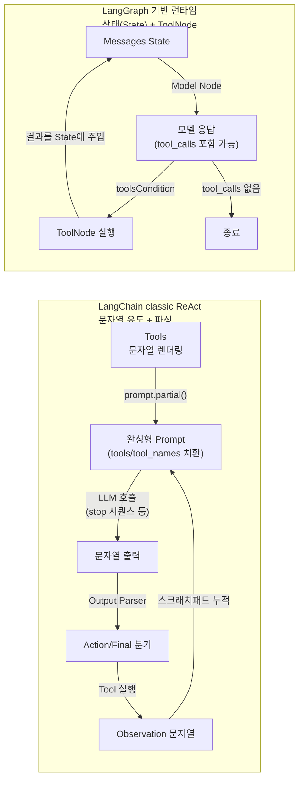

# 프로덕션을 막는 건 구조다: LangChain vs LangGraph 에이전트 설계


한 문장 결론: **“문자열로 유도하는 에이전트”는 금방 흔들리고, “도구 호출을 구조로 다루는 에이전트”는 운영 요구사항을 견딥니다.**


에이전트가 프로덕션으로 못 가는 순간은 대부분 비슷합니다.


- 요청이 조금만 복잡해지면 프롬프트가 비대해지고, 형식이 무너집니다.


- 도구 호출이 한 번만 삐끗해도 파싱/재시도/에러 처리로 비용이 폭증합니다.


- “지금 무슨 단계인지”가 코드에 드러나지 않아, 디버깅과 관측(Observability)이 난이도가 됩니다.


포인트는 “모델이 똑똑하냐”가 아니라 **에이전트를 어떤 실행 구조로 감싸느냐**입니다. 그리고 그 구조 차이가 LangChain의 classic ReAct와 LangGraph(그래프 기반 런타임)에서 가장 선명하게 갈립니다. ([reference.langchain.com](https://reference.langchain.com/v0.3/python/langchain/agents/langchain.agents.react.agent.create_react_agent.html))


---


## 핵심 개념


### 그래프 기반 런타임의 핵심 장점: “상태와 도구 실행을 구조로 분리한다”


LangGraph는 에이전트 워크플로우를 그래프(노드/엣지)로 모델링하고, 상태(State)를 중심으로 실행 흐름을 제어합니다. ([docs.langchain.com](https://docs.langchain.com/oss/python/langgraph/graph-api))


특히 ToolNode는 도구 실행(병렬 실행, 에러 처리, 상태 주입)을 런타임 구성 요소로 끌어올립니다. ([docs.langchain.com](https://docs.langchain.com/oss/javascript/langchain/tools))


아래 다이어그램을 보면 “프로덕션에서 중요한 책임”이 어디에 놓이는지 바로 드러납니다.





→ 기대 결과/무엇이 달라졌는지: **도구/상태/분기가 ’문자열 규칙’이 아니라 ’실행 구조’로 분리됩니다.** 운영에서 가장 큰 차이는 디버깅과 실패 제어 비용입니다.


---


## 해결 접근


### 선택 기준: “도구 호출을 어디에 두는가?”

- **프로덕션에 가까운 선택**: 그래프 기반 에이전트 런타임(예: `createAgent()` / `create_agent`)을 사용해 상태와 도구 실행을 구조로 분리합니다. `createAgent()`는 LangGraph 기반 그래프 런타임으로 설명되며, 프로덕션 사용을 전제로 한 에이전트 구현으로 안내됩니다. ([docs.langchain.com](https://docs.langchain.com/oss/javascript/langchain/agents))
- **대안 1**: 모델 제공자의 Tool Calling(예: `tools` 파라미터)로 직접 루프를 구현합니다. OpenAI/Anthropic 모두 `tools`로 스키마를 전달하는 방식을 문서화합니다. ([platform.openai.com](https://platform.openai.com/docs/guides/function-calling?utm_source=chatgpt.com))
- **대안 2**: Next.js 친화적인 추상화가 필요하면 Vercel AI SDK처럼 “툴 라운드트립”을 라이브러리 레벨에서 제공하는 선택지도 있습니다. ([vercel.com](https://vercel.com/academy/ai-sdk/tool-use?utm_source=chatgpt.com))

핵심은 하나입니다. **도구를 “프롬프트 텍스트”로 다루지 말고, “스키마 + 실행 단계”로 다루는 쪽**이 운영에서 유리합니다.


### MCP까지 고려한다면


MCP는 도구를 모델/클라이언트가 구조적으로 발견·호출할 수 있게 만드는 프로토콜입니다. ([modelcontextprotocol.io](https://modelcontextprotocol.io/specification/draft/server/tools?utm_source=chatgpt.com))


MCP 서버에서 도구를 가져오려면, 멀티 서버 연결과 도구 로딩을 지원하는 MCP 클라이언트(예: `MultiServerMCPClient`) 같은 구성으로 “도구 목록을 런타임에 주입”하는 그림이 자연스럽습니다. ([reference.langchain.com](https://reference.langchain.com/python/langchain_mcp_adapters/))


---


## 구현(코드)


아래 예시는 **Next.js Route Handler에서 에이전트를 실행**하는 형태입니다. 모델 키/도구 접근(내부 API, DB 등)은 서버에서만 처리하는 게 안전합니다. ([nextjs.org](https://nextjs.org/docs/app/building-your-application/routing/route-handlers?utm_source=chatgpt.com))


### 1) `/app/api/agent/route.js` — 서버에서 에이전트 실행


```javascript
// app/api/agent/route.js
export const runtime = "nodejs";

import { createAgent } from "langchain";
import { tool } from "@langchain/core/tools";
import * as z from "zod";

const searchFaq = tool(
  async ({ query }) => {
    // 실제 프로덕션에서는 내부 검색 API/DB를 호출하도록 교체하세요.
    // 예: const res = await fetch(process.env.FAQ_API_URL, { ... })
    if (query.toLowerCase().includes("refund")) {
      return "환불은 결제 수단에 따라 처리 시간이 달라질 수 있습니다. 주문 번호로 조회 후 진행하세요.";
    }
    return "FAQ에서 관련 항목을 찾지 못했습니다. 구체 키워드를 추가해 주세요.";
  },
  {
    name: "search_faq",
    description: "서비스 FAQ에서 정책/가이드를 검색한다.",
    schema: z.object({
      query: z.string().min(2),
    }),
  }
);

const agent = createAgent({
  model: "openai:gpt-5",
  tools: [searchFaq],
});

export async function POST(req) {
  const { message } = await req.json();

  const result = await agent.invoke({
    messages: [{ role: "user", content: message }],
  });

  // invoke 결과는 메시지 상태를 포함합니다.
  const last = result.messages?.at?.(-1);

  return Response.json({
    message: last?.content ?? "",
    toolCalls: last?.tool_calls ?? [],
  });
}
```


→ 기대 결과/무엇이 달라졌는지: **에이전트 실행이 서버(Route Handler)로 고정**되어 키/도구 접근이 안전해지고, **도구 호출은 스키마 기반**으로 정리됩니다. ([docs.langchain.com](https://docs.langchain.com/oss/javascript/langchain/agents))


### 2) `/app/page.jsx` — 클라이언트는 “요청만” 한다


```javascript
"use client";

import { useState } from "react";

export default function Page() {
  const [input, setInput] = useState("");
  const [output, setOutput] = useState("");

  const run = async () => {
    const res = await fetch("/api/agent", {
      method: "POST",
      headers: { "content-type": "application/json" },
      body: JSON.stringify({ message: input }),
    });
    const data = await res.json();
    setOutput(data.message);
  };

  return (
    <main style={{ padding: 24 }}>
      <h1>Agent Demo</h1>
      <input
        value={input}
        onChange={(e) => setInput(e.target.value)}
        placeholder="예: refund policy 알려줘"
        style={{ width: "100%", padding: 12 }}
      />
      <button onClick={run} style={{ marginTop: 12, padding: 12 }}>
        실행
      </button>
      <pre style={{ marginTop: 12, whiteSpace: "pre-wrap" }}>{output}</pre>
    </main>
  );
}
```


→ 기대 결과/무엇이 달라졌는지: 클라이언트는 **UI/네트워크만 담당**하고, 에이전트 실행/도구 호출은 서버로 분리되어 **서버·클라이언트 경계가 선명**해집니다. ([nextjs.org](https://nextjs.org/docs/app/getting-started/server-and-client-components?utm_source=chatgpt.com))


---


## 검증 방법(체크리스트)

- [ ] Route Handler가 Node.js 런타임에서 실행되는지 확인 (`runtime` 설정) ([nextjs.org](https://nextjs.org/docs/app/building-your-application/routing/route-handlers?utm_source=chatgpt.com))
- [ ] 도구 입력 스키마(zod)가 실제 요청 형태를 커버하는지(옵셔널/빈 문자열/길이 제한) ([docs.langchain.com](https://docs.langchain.com/oss/javascript/langchain/tools))
- [ ] 도구 실패 시(타임아웃/500/파싱 실패) 사용자 응답이 “중단”이 아니라 “복구”로 이어지는지
- [ ] tool_calls 로그를 남겨 “어떤 도구가 왜 불렸는지”를 추적 가능한지 ([docs.langchain.com](https://docs.langchain.com/oss/javascript/langchain/agents))
- [ ] 환경 변수/비밀키가 클라이언트로 노출되지 않는지 ([nextjs.org](https://nextjs.org/docs/pages/guides/environment-variables?utm_source=chatgpt.com))

---


## 흔한 실수/FAQ


### Q1. 왜 classic ReAct는 프로덕션에서 흔들리나요?


도구 정보가 프롬프트 문자열로 합쳐지고, 출력도 문자열 규칙을 파싱해 다음 단계를 결정하기 때문입니다. 도구가 늘거나 프롬프트가 길어질수록 형식 유지/파싱 실패 확률이 올라갑니다. ([reference.langchain.com](https://reference.langchain.com/v0.3/python/_modules/langchain/agents/react/agent.html))


### Q2. 그래프 기반이면 뭐가 제일 먼저 좋아지나요?


**디버깅**이 가장 먼저 좋아집니다. “모델 호출 노드 / 도구 실행 노드 / 분기 조건”이 코드 구조로 드러나서, 실패 지점을 빠르게 좁힐 수 있습니다. ([docs.langchain.com](https://docs.langchain.com/oss/javascript/langchain/tools))


### Q3. Edge 런타임에서 돌려도 되나요?


Route Handler는 Edge/Node.js 모두 가능하지만, 도구가 Node 전용 API나 특정 npm 패키지에 의존한다면 Node.js 런타임이 안전합니다. ([nextjs.org](https://nextjs.org/docs/app/building-your-application/routing/route-handlers?utm_source=chatgpt.com))


### Q4. MCP는 “무조건” LangGraph가 유리한가요?


MCP 자체는 프로토콜이라 설계에 따라 달라질 수 있습니다. 다만 MCP는 도구를 구조적으로 로딩/주입하는 흐름이 자연스럽기 때문에, 그래프 기반 런타임 + MCP 클라이언트 조합이 운영 설계와 잘 맞습니다. ([modelcontextprotocol.io](https://modelcontextprotocol.io/specification/draft/server/tools?utm_source=chatgpt.com))


---


## 요약(3~5줄)

- classic ReAct는 도구/출력을 **문자열 규칙**으로 다루기 때문에 운영에서 실패 제어 비용이 커집니다. ([reference.langchain.com](https://reference.langchain.com/v0.3/python/_modules/langchain/agents/react/agent.html))
- 그래프 기반 런타임은 상태(State)와 도구 실행을 **구조로 분리**해 디버깅/에러 처리/확장성이 좋아집니다. ([docs.langchain.com](https://docs.langchain.com/oss/javascript/langchain/agents))
- Next.js에서는 Route Handler/Server Actions 등 **서버 영역에서 에이전트를 실행**하는 방식이 안전합니다. ([nextjs.org](https://nextjs.org/docs/app/building-your-application/routing/route-handlers?utm_source=chatgpt.com))
- MCP까지 고려하면 “도구를 런타임에 로딩해 주입”하는 설계가 자연스럽습니다. ([reference.langchain.com](https://reference.langchain.com/python/langchain_mcp_adapters/))

---


## 결론


질문은 이겁니다.


**당신의 에이전트는 “프롬프트에 적힌 규칙을 흉내” 내고 있나요, 아니면 “도구 호출을 구조로 다루는 실행기”를 갖고 있나요?**


프로덕션은 “동작”보다 “실패했을 때의 비용”으로 승부가 납니다.


에이전트도 예외가 아닙니다. 구조가 바뀌면, 운영 난이도가 바뀝니다.


---


## 참고(공식 문서 링크)

- [LangChain Agents Docs](https://docs.langchain.com/oss/javascript/langchain/agents) ([docs.langchain.com](https://docs.langchain.com/oss/javascript/langchain/agents))
- [LangChain ](https://reference.langchain.com/v0.3/python/langchain/agents/langchain.agents.react.agent.create_react_agent.html)[`create_react_agent`](https://reference.langchain.com/v0.3/python/langchain/agents/langchain.agents.react.agent.create_react_agent.html)[ Reference](https://reference.langchain.com/v0.3/python/langchain/agents/langchain.agents.react.agent.create_react_agent.html) ([reference.langchain.com](https://reference.langchain.com/v0.3/python/langchain/agents/langchain.agents.react.agent.create_react_agent.html))
- [LangGraph Graph API](https://docs.langchain.com/oss/python/langgraph/graph-api) ([docs.langchain.com](https://docs.langchain.com/oss/python/langgraph/graph-api))
- [OpenAI Function Calling](https://platform.openai.com/docs/guides/function-calling) ([platform.openai.com](https://platform.openai.com/docs/guides/function-calling?utm_source=chatgpt.com))
- [Anthropic Tool Use](https://docs.anthropic.com/en/docs/build-with-claude/tool-use) ([docs.anthropic.com](https://docs.anthropic.com/en/docs/build-with-claude/tool-use?utm_source=chatgpt.com))
- [MCP Tools Spec](https://modelcontextprotocol.io/specification/draft/server/tools) ([modelcontextprotocol.io](https://modelcontextprotocol.io/specification/draft/server/tools?utm_source=chatgpt.com))
- [Next.js Route Handlers](https://nextjs.org/docs/app/building-your-application/routing/route-handlers) ([nextjs.org](https://nextjs.org/docs/app/building-your-application/routing/route-handlers?utm_source=chatgpt.com))
- [Next.js Data Security Guide](https://nextjs.org/docs/app/guides/data-security) ([nextjs.org](https://nextjs.org/docs/app/guides/data-security?utm_source=chatgpt.com))
