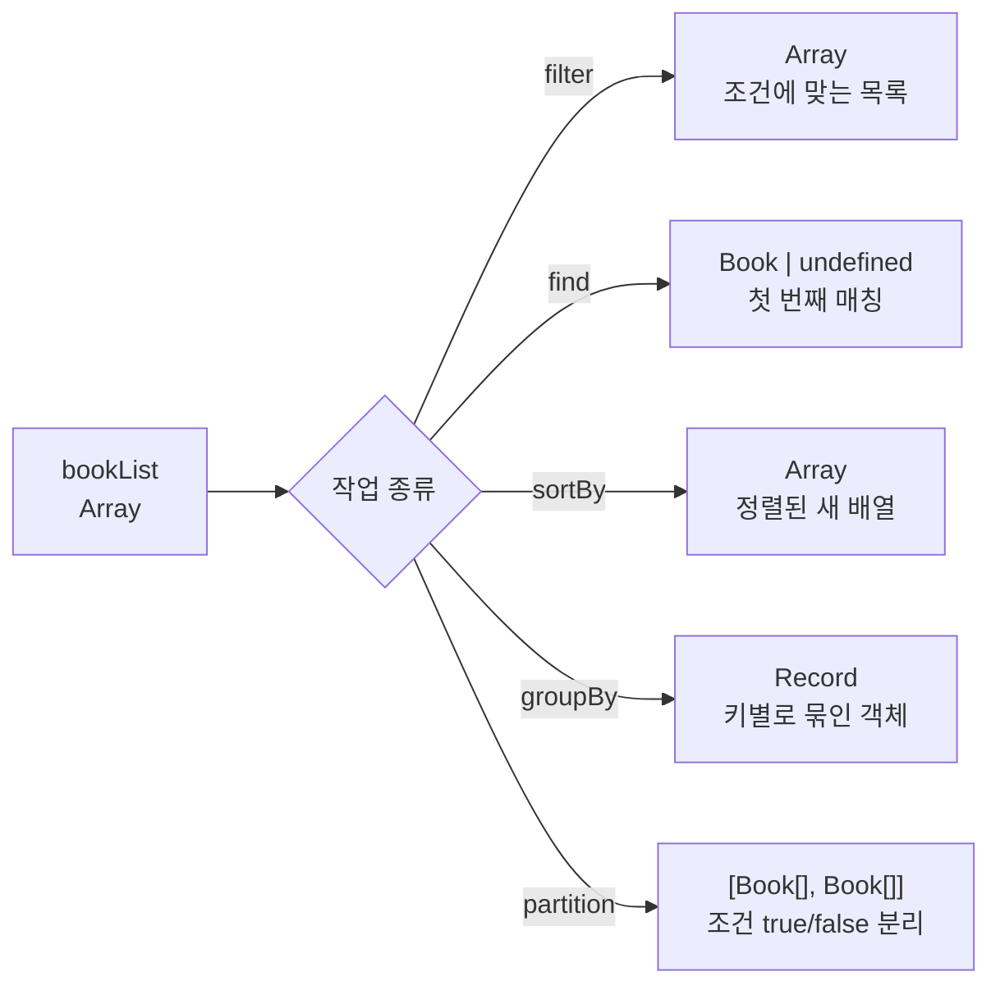

# 조건을 코드로 숨기지 마라: Lodash로 컬렉션 변환을 읽기 좋게


**한 문장 결론:** Lodash는 “조건/키”를 그대로 전달하는 패턴으로, 배열 변환 로직의 의도를 더 직접적으로 드러낸다. ([Lodash](https://lodash.com/))


프런트엔드에서 리스트를 다루는 코드는 생각보다 빨리 복잡해진다.


특히 “검색 조건이 늘어나는 순간” 콜백 함수가 길어지고, `reduce`로 형태를 바꾸는 로직은 한 번에 읽히지 않기 쉽다.


이때 **의도를 드러내는 API**를 선택하면, 유지보수·리팩터링·버그 수정 속도가 좋아진다.


---


## 배경/문제


자주 하는 작업은 대체로 비슷하다.

- 특정 조건으로 목록을 **필터링(filter)** 한다
- 조건에 맞는 **하나를 찾는다(find)**
- 기준 키로 **정렬(sort)** 한다
- 특정 키로 **묶는다(groupBy)**
- 기준을 기준으로 **둘로 나눈다(partition)**

표준 Array 메서드만으로도 가능하지만, 조건이 복잡해질수록 콜백이 길어지고 “어떤 조건인지”가 코드 속에 묻히는 문제가 생긴다.


---


## 핵심 개념


### 반복자(iteratee) 축약: “조건 오브젝트”로 의도를 전달


Lodash는 `filter`, `find` 같은 함수에서 **조건을 오브젝트로 전달하는 축약(shorthand)** 을 제공한다.


예를 들어 `{ author: 'tom' }`처럼 **“찾고 싶은 모양”** 을 그대로 넘기는 방식이다. ([Lodash Docs](https://lodash.com/docs/))





→ 기대 결과/무엇이 달라졌는지: 입력이 어떤 형태로 변환되는지 구조가 먼저 고정된다. 설명이 길어지기 전에 결과 타입이 눈에 들어온다.


---


## 해결 접근


이번 글은 같은 데이터에 대해 “표준 Array 메서드”와 “Lodash”를 나란히 비교한다.

- **표준 메서드**: 의존성 없이 바로 쓸 수 있고, 동작이 명확하다. 다만 조건이 길어질수록 콜백이 비대해질 수 있다. ([MDN Web Docs](https://developer.mozilla.org/))
- **Lodash**: 조건/키 중심으로 표현해 읽기 쉬워지고, `groupBy`, `partition`처럼 “의미 있는 이름의 변환”을 바로 쓸 수 있다. ([Lodash Docs](https://lodash.com/docs/))

대안도 있다.

- **작은 유틸을 직접 정의**해서 프로젝트 도메인에 맞게 “의도 중심 API”를 만들 수도 있다.
- 컬렉션 변환이 아주 단순한 구간이라면, **표준 메서드만으로도** 충분히 깔끔하게 유지할 수 있다.

---


## 구현(코드)


### 테스트 데이터


```javascript
const bookList = [
  { name: '재미있는 책', author: 'tom', pages: 123 },
  { name: '재미없는 책', author: 'tom', pages: 200 },
  { name: '그저 그런 책', author: 'tom', pages: 150 },
  { name: '재미있는 책', author: 'alice', pages: 150 },
  { name: '재미없는 책', author: 'alice', pages: 300 },
  { name: '그저 그런 책', author: 'alice', pages: 450 },
]
```


→ 기대 결과/무엇이 달라졌는지: 이후 예제에서 같은 입력으로 결과만 비교할 수 있다.


---


### 1) filter, find


### 1-1. 저자가 `tom`인 책들을 찾기


**Lodash**


```javascript
import _ from 'lodash'

_.filter(bookList, { author: 'tom' })
```


→ 기대 결과/무엇이 달라졌는지: `{ author: 'tom' }` 조건만으로 목록이 필터링된다(조건이 코드 밖으로 드러난다). ([Lodash Docs](https://lodash.com/docs/))


**표준 Array 메서드**


```javascript
bookList.filter(({ author }) => author === 'tom')
```


→ 기대 결과/무엇이 달라졌는지: 콜백으로 조건을 표현한다. 조건이 늘어나면 콜백이 길어질 수 있다. ([MDN: Array.prototype.filter](https://developer.mozilla.org/en-US/docs/Web/JavaScript/Reference/Global_Objects/Array/filter))


---


### 1-2. 저자가 `alice`이고 제목이 `재미있는 책`인 항목 하나 찾기


**Lodash**


```javascript
import _ from 'lodash'

_.find(bookList, { author: 'alice', name: '재미있는 책' })
```


→ 기대 결과/무엇이 달라졌는지: 복합 조건을 오브젝트로 전달하고, 첫 매칭 1개를 반환한다. ([Lodash Docs](https://lodash.com/docs/))


**표준 Array 메서드**


```javascript
bookList.find(({ author, name }) => author === 'alice' && name === '재미있는 책')
```


→ 기대 결과/무엇이 달라졌는지: `find`는 조건을 만족하는 첫 요소를 반환하고, 없으면 `undefined`다. ([MDN: Array.prototype.find](https://developer.mozilla.org/en-US/docs/Web/JavaScript/Reference/Global_Objects/Array/find))


---


### 2) 정렬: pages 오름차순


**표준 Array 메서드**


```javascript
// sort는 원본 배열을 직접 바꾼다.
const sorted = [...bookList].sort(({ pages: a }, { pages: b }) => a - b)
```


→ 기대 결과/무엇이 달라졌는지: 복사본을 정렬해 원본 순서를 유지한다. `sort` 자체는 in-place(원본 변형)라는 점이 포인트다. ([MDN: Array.prototype.sort](https://developer.mozilla.org/en-US/docs/Web/JavaScript/Reference/Global_Objects/Array/sort))


**Lodash**


```javascript
import _ from 'lodash'

_.sortBy(bookList, 'pages')
```


→ 기대 결과/무엇이 달라졌는지: 정렬 기준을 “키 문자열”로 전달해 의도가 단순해진다. ([Lodash Docs](https://lodash.com/docs/))


---


### 3) 저자별로 책 묶기: groupBy


**표준 Array 메서드(reduce)**


```javascript
const byAuthor = bookList.reduce((acc, book) => {
  const { author } = book
  acc[author] ??= []
  acc[author].push(book)
  return acc
}, {})
```


→ 기대 결과/무엇이 달라졌는지: `{ [author]: Book[] }` 형태로 데이터가 재구성된다. ([MDN: Array.prototype.reduce](https://developer.mozilla.org/en-US/docs/Web/JavaScript/Reference/Global_Objects/Array/reduce))


**Lodash**


```javascript
import _ from 'lodash'

_.groupBy(bookList, 'author')
```


→ 기대 결과/무엇이 달라졌는지: “저자 기준으로 묶는다”는 의도가 함수 이름에 고정된다. ([Lodash Docs](https://lodash.com/docs/))


---


### 4) 페이지 기준으로 둘로 나누기: partition (≤ 200 / > 200)


**표준 Array 메서드(reduce) — 읽기 쉬운 형태로**


```javascript
const [lte200, gt200] = bookList.reduce(
  ([a, b], book) => {
    if (book.pages <= 200) a.push(book)
    else b.push(book)
    return [a, b]
  },
  [[], []]
)
```


→ 기대 결과/무엇이 달라졌는지: 조건 기준으로 두 배열로 나뉜다(각 배열이 무엇을 의미하는지 코드로 드러난다). ([MDN: Array.prototype.reduce](https://developer.mozilla.org/en-US/docs/Web/JavaScript/Reference/Global_Objects/Array/reduce))


**Lodash**


```javascript
import _ from 'lodash'

_.partition(bookList, ({ pages }) => pages <= 200)
```


→ 기대 결과/무엇이 달라졌는지: 결과가 `[true 그룹, false 그룹]`의 2튜플 형태로 나온다. ([Lodash Docs](https://lodash.com/docs/))


---


## 검증 방법(체크리스트)

- [ ] `filter` 결과가 기대하는 author만 포함하는가? (`tom`만 남는지)
- [ ] `find`가 첫 매칭 1개를 반환하고, 없으면 `undefined`인가?
- [ ] 정렬 시 원본 배열이 변형되지 않는가? (복사 후 `sort` 사용)
- [ ] `groupBy` 결과가 `{ [author]: Book[] }` 형태로 묶이는가?
- [ ] `partition` 결과가 `[조건 true 그룹, 조건 false 그룹]`으로 나뉘는가?

---


## 흔한 실수/FAQ


### Q1. `filter`와 `find`를 언제 구분해서 쓰나?

- `filter`: 조건에 맞는 **모든 요소를 배열로** 받고 싶을 때. ([MDN: Array.prototype.filter](https://developer.mozilla.org/en-US/docs/Web/JavaScript/Reference/Global_Objects/Array/filter))
- `find`: 조건에 맞는 **첫 요소 하나만** 필요할 때. ([MDN: Array.prototype.find](https://developer.mozilla.org/en-US/docs/Web/JavaScript/Reference/Global_Objects/Array/find))

### Q2. 정렬했더니 원본 배열 순서가 깨졌다


`Array.prototype.sort()`는 **원본 배열을 직접 변형**한다.


원본 유지가 필요하면 `[...arr]`로 복사한 뒤 정렬한다. ([MDN: Array.prototype.sort](https://developer.mozilla.org/en-US/docs/Web/JavaScript/Reference/Global_Objects/Array/sort))


### Q3. `groupBy`, `partition`을 `reduce`로 만들면 뭐가 불편하나?


가능은 하지만, 로직이 길어지면 “이게 뭘 만들고 있지?”를 파악하는 비용이 커진다.


이럴 때는 **의미가 드러나는 함수 이름**(`groupBy`, `partition`)이 유지보수에 유리하다. ([Lodash Docs](https://lodash.com/docs/))


### Q4. Next.js에서 Lodash를 쓸 때 신경 쓸 점이 있나?


Lodash를 **클라이언트 컴포넌트에서 임포트하면** 브라우저 번들에 포함될 수 있다.


필요한 함수만 가져오거나, 프로젝트 정책에 맞게 최적화 옵션을 검토하는 식으로 관리한다. ([Next.js Docs](https://nextjs.org/docs))


---


## 요약(3~5줄)

- 표준 Array 메서드는 강력하지만, 조건이 늘면 콜백이 길어져 의도가 묻히기 쉽다.
- Lodash는 조건/키 중심으로 표현해 읽기 쉬운 “데이터 셰이핑(data shaping)” 코드를 만들기 좋다.
- `sort`는 원본을 변형하므로 복사 후 정렬이 안전하다.
- `groupBy`, `partition`처럼 이름이 의미를 담고 있는 API는 변환 로직을 빠르게 읽히게 한다.

---


## 결론


리스트 변환 코드는 “짧게”보다 “읽히게”가 더 중요해지는 순간이 온다.


조건이 자주 바뀌거나 변환이 여러 단계로 이어지는 구간이라면, Lodash의 축약 표현과 변환 함수들이 의도를 더 선명하게 만든다.


반대로, 단순한 변환만 반복된다면 표준 Array 메서드와 작은 도메인 유틸만으로도 충분히 깔끔한 코드를 만들 수 있다.


---


## 참고(공식 문서 링크)

- [Lodash](https://lodash.com/)
- [Lodash Docs](https://lodash.com/docs/)
- [MDN: Array.prototype.filter](https://developer.mozilla.org/en-US/docs/Web/JavaScript/Reference/Global_Objects/Array/filter)
- [MDN: Array.prototype.find](https://developer.mozilla.org/en-US/docs/Web/JavaScript/Reference/Global_Objects/Array/find)
- [MDN: Array.prototype.sort](https://developer.mozilla.org/en-US/docs/Web/JavaScript/Reference/Global_Objects/Array/sort)
- [MDN: Array.prototype.reduce](https://developer.mozilla.org/en-US/docs/Web/JavaScript/Reference/Global_Objects/Array/reduce)
- [Next.js Docs](https://nextjs.org/docs)
- [Next.js: optimizePackageImports](https://nextjs.org/docs/app/api-reference/config/next-config-js/optimizePackageImports)
