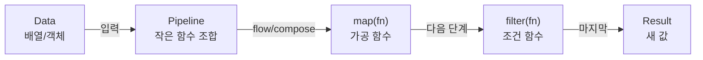

# 데이터는 마지막에 두어라: `lodash/fp`로 조합 가능한 파이프라인 만들기


한 문장 결론: `lodash/fp`는 **“함수 먼저, 데이터는 마지막”** 규칙으로 작은 함수를 쉽게 조합하게 만들어, 로직을 “흐름”으로 읽히게 한다. ([Lodash FP Guide](https://github.com/lodash/lodash/wiki/fp-guide))


UI/성능 관점에서 중요한 건 “짧게”가 아니라 “안전하게 조합되는 형태”다.


- 데이터 가공 로직이 흩어지면, 수정 범위가 넓어지고 회귀가 늘어난다.


- 함수가 재사용 가능한 모양(입력/출력 계약이 단순한 모양)일수록 테스트와 리팩터링이 빨라진다.


- Next.js에서는 **클라이언트 번들 크기**가 UX로 직결되므로, import 전략까지 같이 설계하는 편이 좋다. ([Next.js Package Bundling Guide](https://nextjs.org/docs/pages/guides/package-bundling))


---


## 배경/문제


Lodash를 쓰다 보면 이런 코드가 늘어난다.

- `map`, `filter`, `reduce` 같은 반복 로직이 여러 곳에 퍼짐
- “데이터 → 가공 → 출력” 흐름이 코드에서 한눈에 안 보임
- 콜백에 전달되는 인자(예: index)가 의도치 않은 버그를 만들기도 함

대표적인 예가 `parseInt` + `map` 조합이다.


```javascript
['6', '8', '10'].map(parseInt) // [6, NaN, 2]
```


기대 결과/무엇이 달라졌는지: `parseInt`의 두 번째 인자에 `index`가 들어가 버려 예상치 못한 결과가 나온다.


이런 “콜백 인자 gotcha”를 피하고, 동시에 “조합 가능한 작은 함수”를 만들고 싶을 때 `lodash/fp`가 후보가 된다. ([Lodash FP Guide](https://github.com/lodash/lodash/wiki/fp-guide))


---


## 핵심 개념


### 1) 커링(Currying)


커링(currying)은 **“인자를 다 받기 전까지 실행을 미루는 함수”**를 만드는 패턴이다. Lodash의 `_.curry`는 인자가 충분히 모이면 실행하고, 부족하면 나머지 인자를 받는 함수를 돌려준다. ([Lodash Docs](https://lodash.com/docs/))


```javascript
import curry from 'lodash/curry'

const sayBlah = curry((msg, to) => `${msg}${to}!`)

const sayHello = sayBlah('hello')
console.log(sayHello('world'))   // hello world!
console.log(sayHello('sejiwork')) // hello sejiwork!

console.log(sayBlah('goodBye', 'sejiwork')) // goodBye sejiwork!
```


기대 결과/무엇이 달라졌는지: `sayBlah('hello')`처럼 **부분 적용(Partial Application)** 형태로 함수를 만들어 재사용할 수 있다.


---


### 2) `lodash/fp`의 규칙: iteratee-first / data-last / auto-curried


`lodash/fp`는 Lodash 메서드들을 래핑해서 다음 성질을 강조한다. ([Lodash FP Guide](https://github.com/lodash/lodash/wiki/fp-guide))

- **iteratee-first**: “반복에서 실행할 함수(콜백)”를 먼저 받음
- **data-last**: 실제 데이터(배열/객체)는 마지막에 받음
- **auto-curried**: 기본적으로 커링 형태로 동작하도록 맞춰짐

이 조합의 포인트는 간단하다.

- `map(fn)(data)` 형태가 되면, `map(fn)` 자체가 재사용 가능한 “가공 함수”가 된다.
- “데이터가 나중에 들어오니” 함수 조합(파이프라인) 만들기가 쉬워진다.

---


### 3) 콜백 인자 캡(capped iteratee arguments)


`lodash/fp`는 일부 메서드에서 **iteratee 인자를 의도적으로 제한(capped)** 해서, variadic 콜백 때문에 생기는 함정을 줄인다. 공식 가이드에서도 `parseInt` 사례를 그대로 든다. ([Lodash FP Guide](https://github.com/lodash/lodash/wiki/fp-guide))


```javascript
import fpMap from 'lodash/fp/map'

console.log(fpMap(parseInt)(['6', '8', '10'])) // [6, 8, 10]
```


기대 결과/무엇이 달라졌는지: `map`이 iteratee에 `(value)`만 전달해 `parseInt(value, index)` 문제가 사라진다.


---


### 구조를 먼저 고정하기: “데이터-마지막” 파이프라인





→ 기대 결과/무엇이 달라졌는지: “데이터를 어디서 넣고, 어떤 단계로 변환되는지”가 코드/구조로 같이 고정된다.


(Mermaid가 렌더링되지 않는 플랫폼이라도, 코드 블록 형태로 문서가 깨지지 않는다. [Mermaid Docs](https://mermaid.js.org/))


---


## 해결 접근


### 접근 1) `lodash/fp` + “작게 쪼갠 import”로 시작


Next.js처럼 번들 최적화가 중요한 환경에서는, **필요한 함수만 경로로 잘라 import** 하는 편이 안전하다. `lodash/fp` 가이드도 “단일 메서드 로드”를 예시로 든다. ([Lodash FP Guide](https://github.com/lodash/lodash/wiki/fp-guide))

- ✅ 권장 흐름: `lodash/fp/map`, `lodash/fp/flow`처럼 **서브모듈 import**
- 상황에 따라: Next.js의 패키지 번들링 최적화 옵션을 고려 ([Next.js Package Bundling Guide](https://nextjs.org/docs/pages/guides/package-bundling))

### 접근 2) 대안/비교

- **대안 A: 네이티브 배열 메서드 + 유틸 몇 개만 직접 구현**
    - 장점: 의존성/번들 최소화
    - 단점: 커링/조합을 팀 규칙으로 유지해야 함 (일관성 비용)
- **대안 B: Ramda 같은 함수형 유틸 라이브러리**
    - 장점: FP 중심 설계가 더 강함
    - 단점: 팀 표준/번들/학습 비용 고려 필요
- **비교 대상: Lodash 체이닝(chain)**
    - `lodash/fp`는 체이닝을 “자동 변환”해 주는 방식이 아니라, **함수 조합을 기본값으로 두는 방향**에 가깝다. ([Lodash FP Guide](https://github.com/lodash/lodash/wiki/fp-guide))

---


## 구현(코드)


### 1) `map`을 “함수”로 만들기


```javascript
import map from 'lodash/fp/map'

const squareAll = map((n) => n * n)

console.log(squareAll([1, 2, 3, 4])) // [1, 4, 9, 16]
```


기대 결과/무엇이 달라졌는지: `squareAll`은 이제 **데이터를 나중에 받는 재사용 함수**가 된다.


---


### 2) `flow`로 파이프라인 만들기


Lodash의 `flow`는 “앞 단계 결과를 다음 단계 입력으로 넘기는 합성 함수”를 만든다. ([Lodash Docs](https://lodash.com/docs/))


```javascript
import flow from 'lodash/fp/flow'
import filter from 'lodash/fp/filter'
import map from 'lodash/fp/map'
import sum from 'lodash/fp/sum'

const sumOfSquaresOfEven = flow([
  filter((n) => n % 2 === 0),
  map((n) => n * n),
  sum,
])

console.log(sumOfSquaresOfEven([1, 2, 3, 4])) // 20
```


기대 결과/무엇이 달라졌는지: “짝수만 → 제곱 → 합” 흐름이 한 줄로 읽히고, 각 단계가 독립 함수로 남는다.


---


### 3) Next.js에서 재현 가능한 구조로 정리


서버/클라이언트 어디에서든 쓸 수 있는 “순수 함수(pure function)” 형태로 `lib/`에 모아두면 재사용이 편하다.


```typescript
// lib/numberPipeline.ts
import flow from 'lodash/fp/flow'
import filter from 'lodash/fp/filter'
import map from 'lodash/fp/map'

export const squareAll = map((n: number) => n * n)

export const evenSquares = flow([
  filter((n: number) => n % 2 === 0),
  squareAll,
])
```


기대 결과/무엇이 달라졌는지: 컴포넌트에서 “로직”이 빠지고, 데이터 가공은 `lib/`의 조합 함수로 고정된다.


```typescript
// app/example/page.tsx (Server Component에서도 동작 가능한 형태)
import { evenSquares } from '@/lib/numberPipeline'

export default function Page() {
  const result = evenSquares([1, 2, 3, 4])
  return <pre>{JSON.stringify(result)}</pre>
}
```


기대 결과/무엇이 달라졌는지: 렌더링 코드는 출력에만 집중하고, 가공 로직은 재사용 가능한 모듈로 분리된다.


---


## 검증 방법(체크리스트)

- [ ] `map(fn)(data)` 형태로 “데이터-마지막” 규칙이 유지되는가 ([Lodash FP Guide](https://github.com/lodash/lodash/wiki/fp-guide))
- [ ] 콜백 gotcha(예: `parseInt`)가 재현되며, `lodash/fp`에서 개선되는가 ([Lodash FP Guide](https://github.com/lodash/lodash/wiki/fp-guide))
- [ ] 파이프라인 단계가 “입력 1개 → 출력 1개”인 단항 함수(unary function)로 유지되는가 (`flow` 조합 안정성) ([Lodash Docs](https://lodash.com/docs/))
- [ ] import가 `lodash/fp/map`처럼 필요한 함수만 가져오는 형태인가 ([Lodash FP Guide](https://github.com/lodash/lodash/wiki/fp-guide))
- [ ] (선택) 번들 최적화 옵션을 도입했다면, 실제로 클라이언트 번들이 줄었는지 확인했는가 ([Next.js Package Bundling Guide](https://nextjs.org/docs/pages/guides/package-bundling))

---


## 흔한 실수/FAQ


### Q1. `lodash`랑 `lodash/fp`를 같은 `_`로 섞어 써도 되나?


가능은 하지만, 프로젝트에서는 **명시적인 import**가 더 안전하다. 브라우저 전역 `_`를 바꾸는 방식도 있긴 하나, Next.js에서는 모듈 import가 기본이다. ([Lodash FP Guide](https://github.com/lodash/lodash/wiki/fp-guide))


### Q2. `map(parseInt)`가 왜 문제고, 왜 `lodash/fp`에서는 괜찮나?


기본 `map`은 iteratee에 `(value, index, collection)`을 넘길 수 있어 `parseInt(value, index)`가 되어 버린다. `lodash/fp`는 iteratee 인자를 캡해서 `(value)`만 전달하도록 설계되어 이 함정을 줄인다. ([Lodash FP Guide](https://github.com/lodash/lodash/wiki/fp-guide))


### Q3. 옵션 객체를 받는 Lodash 함수들은 `fp`에서 그대로 쓰면 되나?


`lodash/fp`는 auto-curry를 위해 일부 함수의 arity(인자 개수)를 고정하는 규칙이 있다. 옵션을 넘기는 방식이 달라질 수 있으니, 필요한 경우 가이드의 “Fixed Arity” 매핑을 확인하는 편이 안전하다. ([Lodash FP Guide](https://github.com/lodash/lodash/wiki/fp-guide))


### Q4. 체이닝은 어떻게 되나?


`lodash/fp`는 체이닝을 그대로 “변환”해 주는 접근이 아니라, 함수 조합을 기본값으로 두는 쪽이다. `flow/flowRight`로 파이프라인을 만들면 된다. ([Lodash FP Guide](https://github.com/lodash/lodash/wiki/fp-guide))


### Q5. CDN으로 `lodash.fp.min.js`를 로드해도 되나?


가능은 하다. 다만 Next.js에서는 서드파티 스크립트 로딩 전략을 제어해야 하므로, 필요하다면 `<Script />`를 통해 로딩 타이밍을 관리하는 편이 좋다. ([Next.js Script Component](https://nextjs.org/docs/pages/api-reference/components/script))


---


## 요약(3~5줄)

- `lodash/fp`는 **iteratee-first / data-last / auto-curried** 규칙으로 “조합 가능한 작은 함수” 만들기를 돕는다. ([Lodash FP Guide](https://github.com/lodash/lodash/wiki/fp-guide))
- iteratee 인자 캡 덕분에 `parseInt` 같은 콜백 gotcha를 줄일 수 있다. ([Lodash FP Guide](https://github.com/lodash/lodash/wiki/fp-guide))
- `flow`로 파이프라인을 구성하면 “데이터 가공 흐름”이 코드에서 바로 읽힌다. ([Lodash Docs](https://lodash.com/docs/))
- Next.js에서는 **필요한 함수만 import** 하는 형태로 번들 영향을 관리하는 편이 유리하다. ([Lodash FP Guide](https://github.com/lodash/lodash/wiki/fp-guide))

---


## 결론


`lodash/fp`의 핵심은 “짧게 쓰기”가 아니라 **조합 가능한 형태로 규칙을 고정**하는 데 있다.


`map(fn)` 같은 작은 조각을 만들고, `flow([...])`로 흐름을 조립하면, 로직은 재사용 가능해지고 변경은 국소화된다. ([Lodash FP Guide](https://github.com/lodash/lodash/wiki/fp-guide))


---


## 참고(공식 문서 링크)

- [Lodash FP Guide](https://github.com/lodash/lodash/wiki/fp-guide)
- [Lodash Docs](https://lodash.com/docs/)
- [Lodash on npm](https://www.npmjs.com/package/lodash)
- [Next.js Script Component](https://nextjs.org/docs/pages/api-reference/components/script)
- [Next.js Package Bundling Guide](https://nextjs.org/docs/pages/guides/package-bundling)
- [MDN Array.prototype.map](https://developer.mozilla.org/en-US/docs/Web/JavaScript/Reference/Global_Objects/Array/map)
