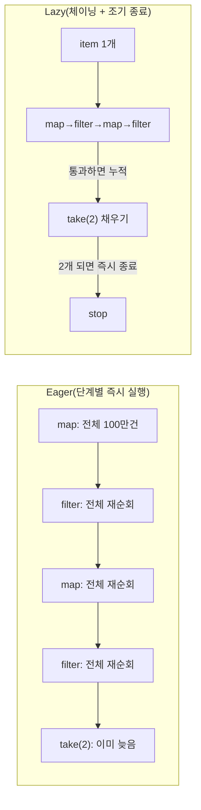

# 필요한 만큼만 돌려라: Lodash 체이닝으로 Lazy Evaluation·조기 종료 얻기

> 결론: _.map/_.filter를 “따로따로” 호출하지 말고 _(data)...take(n).value()로 묶으면, 필요한 결과가 모이는 순간 평가를 멈출 수 있다.

대량 데이터에서 “조건을 만족하는 결과 2개만” 뽑고 싶을 때가 있다. 이때 `map → filter → map → filter → take`를 **각 단계마다 전체를 순회**하면, 결과가 2개만 필요해도 매번 끝까지 돈다. CPU도 쓰고, 중간 배열도 계속 만든다.


반대로 **게으른 평가(Lazy Evaluation)** 를 쓰면, 데이터 한 건씩 파이프라인을 통과시키면서 `take(2)`가 채워지는 순간 **바로 멈춘다**. 포인트는 “연산을 줄이는 것”이고, 그 효과는 데이터가 클수록 커진다.


---


## 배경/문제


요구사항을 이런 형태로 단순화해보자.

- 사용자 데이터(`members`)에서
- `family * point`로 계산한 값이 `1000` 이상인 것만 고르고
- 그 값의 제곱근을 내린 뒤(`Math.sqrt`) 소수점은 버리고
- 홀수만 남긴 다음
- 앞에서 2개만 가져온다

문제는, 아래처럼 각 단계를 따로 호출하면 **매 단계가 전체를 끝까지 돈다**는 점이다.


---


## 핵심 개념


### Lodash 체이닝이 “게으른 평가”가 되는 순간


Lodash 는 체이닝 구간에서 **shortcut fusion**(이터레이터 합치기) 최적화를 제공한다. 이 최적화는 **중간 배열 생성을 줄이고**, `take` 같은 “조기 종료”와 결합되면 **필요한 만큼만 평가**할 수 있게 된다. ([lodash.com](https://lodash.com/docs/))


또한 shortcut fusion이 적용되려면, 체이닝 구간이 배열에 적용되고 iteratee가 “한 개 인자만 받는 형태”여야 한다는 조건이 있다(휴리스틱은 바뀔 수 있음). ([lodash.com](https://lodash.com/docs/))


### 한 장으로 보는 차이





→ 기대 결과/무엇이 달라졌는지: “전체를 여러 번 도는 구조”가 “필요한 만큼만 도는 구조”로 바뀐다. `take(n)`이 빠르게 채워질수록 차이가 커진다.


---


## 해결 접근


같은 로직을 만들 수 있는 선택지는 여러 개다.

1. **Eager(즉시 실행)로 단계별 호출**
- 장점: 눈에 익고 단순하다
- 단점: `take(2)`가 있어도 각 단계가 전체를 끝까지 돈다
1. **Lodash 체이닝으로 Lazy Evaluation + 조기 종료**
- 장점: 코드 흐름은 그대로 두고 “필요한 만큼만 평가”가 가능하다 ([lodash.com](https://lodash.com/docs/))
- 단점: iteratee 시그니처/메서드 조합에 따라 최적화가 달라질 수 있다 ([lodash.com](https://lodash.com/docs/))
1. **네이티브** **`for...of`** **+ 수동 조기 종료**
- 장점: 라이브러리 없이 확실한 조기 종료
- 단점: 파이프라인 형태의 선언적 구성이 줄어든다

이 글에서는 1)과 2)를 비교하고, 3)는 “대안”으로 정리한다.


---


## 구현(코드)

> 아래 코드는 Next.js 프로젝트 안에서도 그대로 실행 가능하도록 “서버/Node 환경” 기준으로 작성했다. Next.js는 서버 런타임으로 Node.js(기본)와 Edge 런타임을 제공하며, 런타임 선택에 따라 사용 가능한 API 범위가 달라질 수 있다. (nextjs.org)

### 0) 샘플 데이터 만들기


원문 방식(`range().map(...)`)도 가능하지만, 데이터 생성만 보면 `_.times`가 더 직관적이다(반복 횟수만큼 호출해 배열을 만든다). ([lodash.com](https://lodash.com/docs/))


```javascript
import _ from "lodash";

const genMember = () => ({
  family: Math.ceil(Math.random() * 8),
  point: Math.ceil(Math.random() * 8000),
});

// members는 "타이밍 측정" 바깥에서 한 번만 만든다.
const members = _.times(1_000_000, genMember);
```


→ 기대 결과/무엇이 달라졌는지: `members`에 100만 건의 랜덤 데이터가 생성된다. 벤치마크는 이 데이터 생성 비용을 제외하고 비교할 수 있다.


---


### 1) Eager: 단계별로 즉시 실행


```javascript
console.time("eager");

let res = _.map(members, (member) => {
  const { family, point } = member;
  return { ...member, calPoint: family * point };
});
res = _.filter(res, ({ calPoint }) => calPoint >= 1000);
res = _.map(res, ({ calPoint }) => Math.floor(Math.sqrt(calPoint)));
res = _.filter(res, (calPoint) => calPoint % 2);
res = _.take(res, 2);

console.timeEnd("eager");
console.log(res);
```


→ 기대 결과/무엇이 달라졌는지: `map/filter/map/filter`가 각각 전체를 순회하며 중간 배열이 계속 만들어진다. `take(2)`는 맨 마지막에 적용된다.


---


### 2) Lazy: 체이닝으로 묶고 `take(2)`에서 멈추기


```javascript
console.time("lazy");

const res = _(members)
  .map((member) => {
    const { family, point } = member;
    return { ...member, calPoint: family * point };
  })
  .filter(({ calPoint }) => calPoint >= 1000)
  .map(({ calPoint }) => Math.floor(Math.sqrt(calPoint)))
  .filter((calPoint) => calPoint % 2)
  .take(2)
  .value();

console.timeEnd("lazy");
console.log(res);
```


→ 기대 결과/무엇이 달라졌는지: 체이닝 구간은 필요 시점까지 평가를 미루고, `take(2)`가 채워지는 순간 이후 원소는 더 보지 않는다. `map/filter/take`는 shortcut fusion 대상에 포함된다. ([lodash.com](https://lodash.com/docs/))


---


### 3) 대안: 네이티브 `for...of`로 확실한 조기 종료


```javascript
const picked = [];

for (const member of members) {
  const calPoint = member.family * member.point;
  if (calPoint < 1000) continue;

  const v = Math.floor(Math.sqrt(calPoint));
  if (v % 2 === 0) continue;

  picked.push(v);
  if (picked.length === 2) break;
}

console.log(picked);
```


→ 기대 결과/무엇이 달라졌는지: 라이브러리 없이도 “2개가 모이면 즉시 종료”가 된다. 대신 파이프라인 형태의 구성은 줄어든다.


---


## 검증 방법(체크리스트)

- [ ] **동일한 로직인지**: eager 결과와 lazy 결과가 의미상 같은지 확인한다(샘플 데이터를 고정하면 비교가 더 쉽다).
- [ ] **조기 종료가 실제로 되는지**: `take(2)` 이후에는 더 이상 처리하지 않는지 확인한다.
- [ ] **체이닝이 실제로 실행됐는지**: 체이닝 결과는 `.value()`로 언랩(unwrapping)되며, 호출 시점에 실행이 확정된다. ([lodash.com](https://lodash.com/docs/))
- [ ] **iteratee 인자 개수**: shortcut fusion을 노리면 iteratee를 “한 개 인자만 받는 형태”로 유지한다. ([lodash.com](https://lodash.com/docs/))

---


## 흔한 실수/FAQ


### Q1. “체이닝만 했는데 왜 빨라지지 않지?”

- `take`로 “끝을 정해주는 연산”이 없으면, 결국 끝까지 평가할 수 있다.
- shortcut fusion이 항상 모든 체이닝 구간에 적용되는 건 아니다. 체이닝 대상/iteratee 형태에 따라 달라질 수 있다. ([lodash.com](https://lodash.com/docs/))

### Q2. `.value()`를 빼면 어떻게 돼?

- 체이닝 결과는 “래퍼 객체” 상태로 남는다. 최종 값이 필요하면 `.value()`로 언랩한다. ([lodash.com](https://lodash.com/docs/))

### Q3. iteratee에서 `(value, index)`처럼 두 개 인자를 받으면?

- shortcut fusion 조건 중 하나가 “iteratee가 한 개 인자를 받는 형태”다. 불필요한 인자를 받지 않도록 정리하는 편이 안전하다. ([lodash.com](https://lodash.com/docs/))

### Q4. Next.js에서 어디서 돌리는 게 좋아?

- 100만 건 순회는 클라이언트에서 실행하면 UI가 멈출 수 있다. 서버(예: Route Handler)나 별도 Node 스크립트로 돌리는 편이 안전하다. Next.js는 서버 컴포넌트/클라이언트 컴포넌트가 분리되므로 실행 위치를 의식하는 게 중요하다. ([nextjs.org](https://nextjs.org/docs/app/getting-started/server-and-client-components))

---


## 요약(3~5줄)

- `_.map/_.filter`를 단계별로 호출하면 각 단계가 전체를 순회한다.
- `_(data).map().filter()...take(n).value()`로 묶으면, `take(n)`이 채워지는 순간 평가를 멈출 수 있다.
- 이때 shortcut fusion이 중간 배열 생성/iteratee 호출을 줄이는 데 도움을 준다. ([lodash.com](https://lodash.com/docs/))
- iteratee 인자 개수 같은 조건에 따라 최적화가 달라질 수 있으니, “필요한 형태로” 작성하는 게 포인트다. ([lodash.com](https://lodash.com/docs/))

---


## 결론


“2개만 필요” 같은 요구는 생각보다 많다. Lodash 체이닝은 코드를 크게 바꾸지 않고도 **필요한 만큼만 평가**하는 구조로 전환할 수 있다. 핵심은 `take(n)` 같은 조기 종료 지점을 두고, 체이닝을 `.value()`로 마무리하는 것이다.


---


## 참고(공식 문서 링크)

- [Lodash Docs](https://lodash.com/docs/)
- [Next.js Docs](https://nextjs.org/docs)
- [Next.js Route Handlers](https://nextjs.org/docs/app/getting-started/route-handlers)
- [Next.js Server and Client Components](https://nextjs.org/docs/app/getting-started/server-and-client-components)
- [React Docs](https://react.dev/)
- [MDN Web Docs](https://developer.mozilla.org/)
- [MDN: console.time](https://developer.mozilla.org/ko/docs/Web/API/console/time_static)
- [MDN: performance.now](https://developer.mozilla.org/ko/docs/Web/API/Performance/now)
- [web.dev](https://web.dev/)
