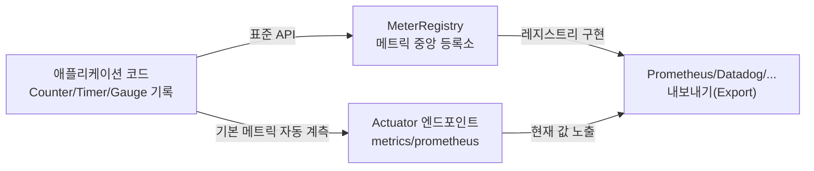

# 메트릭은 코드에 얇게 심고, 백엔드는 바꿔치기하라: Micrometer와 Actuator


한 문장 결론: **Micrometer는 메트릭 수집 코드를 “한 번만” 작성해두고, 내보낼 모니터링 백엔드는 “나중에” 바꿀 수 있게 해주는 계측 파사드다.**


운영 환경에서 “지금 서비스가 정상인가?”를 말로만 확인하기는 어렵습니다. 숫자가 필요해요. CPU/메모리 같은 시스템 지표부터 HTTP 지연 시간, 에러 비율, 비즈니스 이벤트(결제 성공/실패)까지 메트릭으로 남겨두면 **문제 감지 → 원인 좁히기 → 개선 효과 검증**이 빨라집니다.


여기서 중요한 건, 메트릭을 붙이는 순간 모니터링 벤더에 종속되면 유지보수 비용이 급격히 올라간다는 점입니다.


---


## 배경/문제


모니터링 시스템은 Prometheus, Datadog, Graphite 등 선택지가 많습니다.


문제는 각 벤더의 SDK/API가 다르고, 메트릭 모델(이름 규칙, 태그/라벨, 히스토그램 지원 등)도 조금씩 달라서 **“벤더 SDK에 맞춰 코드가 오염되는 상황”**이 자주 생긴다는 겁니다.


Micrometer는 이 지점을 해결합니다.


---


## 핵심 개념


Micrometer를 한 문장으로 정리하면 **“관측(Observability)용 SLF4J 같은 역할”**입니다. 애플리케이션 코드는 `MeterRegistry`와 기본 Meter 타입(Counter/Timer/Gauge 등)만 바라보고, 실제 전송/노출 방식은 레지스트리 구현(백엔드)에 맡깁니다.





→ 기대 결과/무엇이 달라졌는지: 메트릭 계측 코드는 그대로 두고, 내보내는 대상(백엔드)만 교체할 수 있습니다. Actuator는 “노출 인터페이스”, Micrometer는 “계측/등록” 역할로 분리됩니다.


### Actuator와의 관계

- **Actuator**: 운영 정보를 밖으로 꺼내는 관리 엔드포인트(헬스, 환경, 메트릭 등)
- **Micrometer**: 그 아래에서 실제 메트릭을 만들고(계측) 레지스트리에 쌓는 계층

즉, “보여주는 창구”가 Actuator, “숫자를 만드는 엔진”이 Micrometer입니다.


---


## 해결 접근


### 1) Micrometer를 쓰는 이유

- **벤더 중립성**: 모니터링 백엔드가 바뀌어도 애플리케이션 계측 코드는 최소 변경
- **일관된 모델**: Counter/Timer/Gauge 같은 공통 추상화로 지표를 표현
- **운영 친화성**: Spring Boot Actuator와 결합 시 기본 메트릭 + 커스텀 메트릭을 같은 흐름으로 관리

### 2) 대안/비교 (최소 2개)

- **대안 A: 벤더 SDK 직접 사용**

    장점: 기능을 가장 빠르게 활용 가능


    단점: 코드가 벤더 모델에 묶여 이식/교체 비용이 커짐

- **대안 B: OpenTelemetry 기반으로 통합**

    장점: 메트릭/트레이스/로그를 한 흐름으로 묶기 쉬움


    단점: 도입 범위가 넓어 “지표만 빠르게” 붙이고 싶은 상황에서는 과해질 수 있음


Micrometer는 “메트릭 중심으로 빠르게 안정화”할 때 특히 깔끔합니다.


---


## 구현(코드)


아래 예제는 **요청 건수(Counter), 요청 처리 시간(Timer), 현재 활성 세션 수(Gauge)** 를 측정합니다.


### 1) 커스텀 메트릭 등록 + 업데이트


```java
package com.example.metrics;

import io.micrometer.core.instrument.Counter;
import io.micrometer.core.instrument.Gauge;
import io.micrometer.core.instrument.MeterRegistry;
import io.micrometer.core.instrument.Timer;
import org.springframework.stereotype.Service;

import java.util.concurrent.atomic.AtomicInteger;

@Service
public class CustomMetricsService {

    private final Counter requestCounter;
    private final Timer requestTimer;
    private final AtomicInteger activeSessions;

    public CustomMetricsService(MeterRegistry meterRegistry) {
        // 요청 총 건수
        this.requestCounter = Counter.builder("custom.requests.total")
                .description("Total requests for a logical endpoint")
                .tag("endpoint", "api_test") // 값 범위가 제한된 태그로 유지
                .register(meterRegistry);

        // 요청 처리 시간
        this.requestTimer = Timer.builder("custom.request.duration")
                .description("Request duration for a logical endpoint")
                .tag("endpoint", "api_test")
                .register(meterRegistry);

        // 활성 세션 수 (Gauge는 '현재 값'을 읽어가는 방식)
        this.activeSessions = new AtomicInteger(0);
        Gauge.builder("custom.active.sessions", activeSessions, AtomicInteger::get)
                .description("Number of active sessions")
                .tag("region", "us-east")
                .register(meterRegistry);
    }

    public void processRequest(Runnable requestLogic) {
        requestCounter.increment();
        requestTimer.record(requestLogic);
    }

    public void updateActiveSessions(int sessions) {
        activeSessions.set(sessions);
    }
}
```


→ 기대 결과/무엇이 달라졌는지: 요청이 처리될 때마다 카운트와 처리 시간이 누적되고, 활성 세션 수는 최신 값이 즉시 반영됩니다. 메트릭 이름/태그는 고정돼 운영에서 안정적으로 집계됩니다.


### 2) Actuator로 메트릭 확인 경로 준비


```yaml
management:
  endpoints:
    web:
      exposure:
        include: "health,info,metrics,prometheus"
```


→ 기대 결과/무엇이 달라졌는지: 메트릭을 확인할 수 있는 엔드포인트가 노출됩니다. 실제 노출 범위는 보안 정책에 맞춰 최소화할 수 있습니다.


---


## 검증 방법(체크리스트)

- [ ] 요청을 몇 번 호출한 뒤, `metrics` 엔드포인트에서 `custom.requests.total`가 증가하는지 확인한다.
- [ ] `custom.request.duration`가 count/total time 등의 집계값을 갖는지 확인한다.
- [ ] 로그인/로그아웃(또는 세션 변화) 이벤트 후 `custom.active.sessions` 값이 즉시 바뀌는지 확인한다.
- [ ] 태그 값이 “제한된 집합”인지 점검한다(요청 URL 전체/사용자 ID 같은 값이 태그로 들어가면 위험).
- [ ] 운영 환경에서는 엔드포인트 접근 제어(인증/내부망/리버스 프록시 제한 등)를 적용한다.

---


## 흔한 실수/FAQ


### Q1. 태그에 URL 전체를 넣으면 안 되나요?


태그 조합이 늘어날수록 시계열이 폭발합니다. `/api/users/1`, `/api/users/2`처럼 값이 무한히 늘어나는 태그는 피하고, 라우트 템플릿 수준의 “고정된 값”으로 설계하는 게 안전합니다.


### Q2. Gauge는 `increment()`처럼 올리면 되나요?


Gauge는 “누적”이 아니라 “현재 값”을 읽습니다. 그래서 Gauge는 **값 저장소(AtomicInteger 등)** 를 두고 set으로 갱신하는 형태가 잘 맞습니다.


### Q3. 이미 HTTP 요청 메트릭이 있는데 커스텀 Timer가 또 필요할까요?


기본 메트릭으로 충분한 경우가 많습니다. 다만 “특정 비즈니스 로직 구간”처럼 HTTP 요청 단위보다 더 좁은 범위를 재고 싶다면 커스텀이 유효합니다.


---


## 요약 (3~5줄)

- Micrometer는 메트릭 계측 코드를 벤더로부터 분리해주는 표준 API(파사드)입니다.
- Actuator는 운영 정보를 노출하는 창구이고, Micrometer는 그 아래에서 숫자를 만들고 등록합니다.
- Counter/Timer/Gauge로 “누적/지연/현재 상태”를 각각 표현할 수 있습니다.
- 태그는 반드시 값 범위를 제한해 시계열 폭발을 막는 게 핵심입니다.

---


## 결론


Micrometer를 쓰면 메트릭을 “붙이는 비용”이 줄고, 모니터링 백엔드를 “교체하는 비용”도 줄어듭니다.


포인트는 두 가지입니다. **(1) 태그 카디널리티를 통제하고 (2) 의미 있는 구간에만 측정기를 심기**.


이 두 가지만 지키면, 운영에서 메트릭은 디버깅 도구를 넘어 “제품 품질 지표”가 됩니다.


---


## 참고(공식 문서 링크)

- [Micrometer Docs](https://docs.micrometer.io/micrometer/reference/)
- [Micrometer Timers](https://docs.micrometer.io/micrometer/reference/concepts/timers.html)
- [Micrometer Prometheus Registry](https://docs.micrometer.io/micrometer/reference/implementations/prometheus.html)
- [Spring Boot Actuator Metrics](https://docs.spring.io/spring-boot/reference/actuator/metrics.html)
- [Spring Boot Actuator Prometheus Endpoint](https://docs.spring.io/spring-boot/api/rest/actuator/prometheus.html)
- [Spring Boot Observability](https://docs.spring.io/spring-boot/reference/actuator/observability.html)
