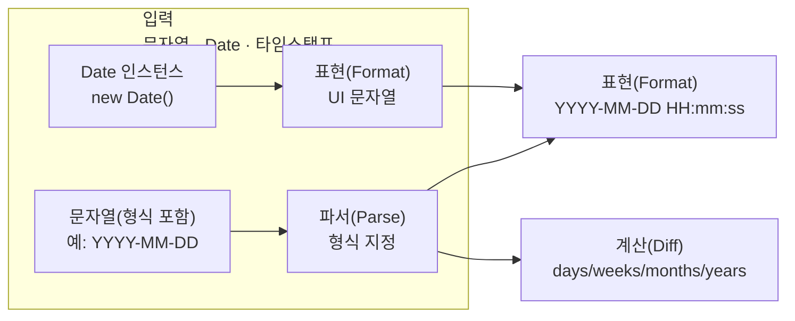

# 시간 계산에 뇌를 쓰지 마라: 포맷·파싱·차이를 한 흐름으로 고정하기


한 문장 결론: **날짜/시간 로직은 “표현(Format) · 입력(Parse) · 계산(Diff)”을 분리하고, Next.js에서는 실행 위치(서버/클라이언트)까지 같이 고정하면 흔들리지 않는다.**


날짜/시간은 대충 처리하면 바로 티가 납니다. UI에 노출되는 순간 “두 자리 패딩”, “요일”, “기간 차이”, “타임존”이 얽히면서 코드가 급격히 커지죠.


포인트는 하나입니다. **포맷을 만들기 위해 매번 도구(패딩 함수, 조합 문자열)를 새로 만들지 말고, 표준 API 또는 검증된 유틸로 한 번에 해결**하는 쪽이 유지보수에 유리합니다.


---


## 배경/문제


요구사항이 딱 하나라고 해도, 순식간에 보일러플레이트가 생깁니다.

- “현재 시간을 `YYYY-MM-DD HH:mm:ss` 형태로 보여줘”
- “문자열로 들어온 날짜가 무슨 요일인지 알려줘”
- “두 날짜 사이가 며칠/몇 주/몇 달/몇 년인지 계산해줘”

기본 `Date`만으로도 가능하지만, 보통은 아래처럼 **포맷 함수 + lpad 같은 보조 함수**를 만들게 됩니다.


```javascript
function getFormattedDate(date) {
  return `${date.getFullYear()}-${lpad(date.getMonth() + 1)}-${lpad(date.getDate())}` +
    `${lpad(date.getHours())}:${lpad(date.getMinutes())}:${lpad(date.getSeconds())}`;
}

function lpad(val, length = 2, char = '0') {
  let valStr = val && val.toString() ? val.toString() : '';
  for (let i = valStr.length; i < length; i++) {
    valStr = char + valStr;
  }
  return valStr;
}
```


→ 기대 결과/무엇이 달라졌는지: 요구사항은 만족하지만, **포맷 하나를 위해 헬퍼가 늘고 재사용 기준이 흐려지기 쉽다.**


---


## 핵심 개념


날짜/시간 로직은 크게 3가지 역할로 쪼개집니다.

- **표현(Format)**: 사람이 읽을 문자열로 바꾸기
- **입력(Parse)**: 문자열/입력값을 날짜 객체로 해석하기
- **계산(Diff)**: 두 시점의 차이를 원하는 단위로 구하기

아래 다이어그램처럼 “입력 → 표현/계산” 흐름을 고정해두면 구현이 단순해집니다.





→ 기대 결과/무엇이 달라졌는지: “포맷/파싱/계산”을 **각각의 책임으로 분리**해서, 코드가 커져도 구조가 무너지지 않는다.


---


## 해결 접근


선택지는 크게 3가지로 정리할 수 있습니다.

1. **표준 API(권장)**: `Intl.DateTimeFormat`으로 포맷을 안정적으로 만들기
2. **모듈형 유틸 라이브러리**: 필요한 함수만 가져다 쓰기(포맷/파싱/차이 계산)
3. **Moment 스타일 API**: 기존 코드/레거시에서 “한 줄”로 정리하기 좋지만, 공식 문서에서 프로젝트 상태를 유지보수 단계로 안내한다 ([Moment.js Docs](https://momentjs.com/docs/))

정리하면:


| 선택                  | 장점                   | 주의점                                                                 |
| ------------------- | -------------------- | ------------------------------------------------------------------- |
| Intl.DateTimeFormat | 표준, 의존성 최소           | 커스텀 문자열 조립이 필요할 수 있음                                                |
| 모듈형 유틸(예: date-fns) | 필요한 것만 사용, 함수 조합이 명확 | 포맷 토큰/파싱 규칙을 팀에서 통일해야 함 ([date-fns](https://date-fns.org/))         |
| Moment 스타일          | 포맷/파싱/계산이 직관적        | 번들/트리쉐이킹 등은 기대하기 어렵다 ([Moment.js Docs](https://momentjs.com/docs/)) |


---


## 구현(코드)


### 1) `Intl.DateTimeFormat`로 `YYYY-MM-DD HH:mm:ss` 만들기


핵심은 `formatToParts()`로 **연/월/일/시/분/초를 “토큰 단위”로 뽑아서 조립**하는 겁니다. 로케일에 따라 표시 순서가 달라도 토큰 타입은 유지되므로 안전합니다. ([MDN - formatToParts](https://developer.mozilla.org/en-US/docs/Web/JavaScript/Reference/Global_Objects/Intl/DateTimeFormat/formatToParts))


```javascript
// lib/date.js
export function formatYmdHms(date, { timeZone } = {}) {
  const dtf = new Intl.DateTimeFormat('en', {
    timeZone,
    year: 'numeric',
    month: '2-digit',
    day: '2-digit',
    hour: '2-digit',
    minute: '2-digit',
    second: '2-digit',
    hour12: false,
  });

  const parts = dtf.formatToParts(date).reduce((acc, p) => {
    acc[p.type] = p.value;
    return acc;
  }, {});

  return `${parts.year}-${parts.month}-${parts.day}${parts.hour}:${parts.minute}:${parts.second}`;
}
```


→ 기대 결과/무엇이 달라졌는지: 패딩/문자열 조합 헬퍼를 흩뿌리지 않고, **표준 API로 포맷을 한 곳에서 고정**한다.


### Next.js에서 렌더 위치 고정하기

- 서버에서 “현재 시간”을 그리면 **요청 시점 기준으로 고정된 문자열**을 렌더링합니다.
- 클라이언트에서 실시간 시계를 만들면 `useEffect`로 **hydration 이후** 갱신하는 편이 안전합니다.
Server/Client Components 구분은 공식 가이드를 참고하세요. ([Next.js Server/Client Components](https://nextjs.org/docs/app/getting-started/server-and-client-components))

```javascript
// app/page.jsx (Server Component)
import { formatYmdHms } from '@/lib/date';

export default function Page() {
  const now = new Date();
  const text = formatYmdHms(now, { timeZone: 'Asia/Seoul' }); // 필요 시 지정

  return (
    <main>
      <time dateTime={now.toISOString()}>{text}</time>
    </main>
  );
}
```


→ 기대 결과/무엇이 달라졌는지: “현재 시간”을 **서버에서 한 번 계산해 문자열로 내려** 렌더링 흔들림을 줄인다.


---


### 2) 모듈형 유틸로 포맷/파싱/차이 계산하기(예: date-fns)


모듈형 유틸은 “필요한 함수만” 가져오게 구성된 경우가 많아, 기능이 늘어도 책임이 선명합니다. ([date-fns](https://date-fns.org/))


```javascript
import {
  format,
  parse,
  differenceInDays,
  differenceInWeeks,
  differenceInMonths,
  differenceInYears,
} from 'date-fns';

const nowText = format(new Date(), 'yyyy-MM-dd HH:mm:ss');

const a = parse('2015-12-31', 'yyyy-MM-dd', new Date());
const b = parse('2021-01-31', 'yyyy-MM-dd', new Date());

const days = differenceInDays(b, a);
const weeks = differenceInWeeks(b, a);
const months = differenceInMonths(b, a);
const years = differenceInYears(b, a);

console.log({ nowText, days, weeks, months, years });
```


→ 기대 결과/무엇이 달라졌는지: 포맷/파싱/차이 계산을 **각 함수 호출로 분리**해 읽기 쉬워지고, 테스트도 단위별로 나눌 수 있다.


---


### 3) Moment 스타일 API로 “한 줄” 처리하기


Moment 스타일은 “읽자마자 의도가 보이는” 장점이 큽니다. 다만 공식 문서에서는 프로젝트 상태를 유지보수 단계로 안내하며, 번들/트리쉐이킹 같은 최적화를 기대하기 어렵다는 점도 함께 확인할 수 있습니다. ([Moment.js Docs](https://momentjs.com/docs/))


```javascript
// 포맷
moment().format('YYYY-MM-DD HH:mm:ss')

// 요일(입력 형식이 여러 가지여도 포맷을 지정할 수 있음)
moment('2015년 12월 31일', 'YYYY년 MM월 DD일').format('ddd')
moment('2015-12-31', 'YYYY-MM-DD').format('ddd')
moment('20151231', 'YYYYMMDD').format('ddd')

// 차이
moment('2021-01-31', 'YYYY-MM-DD').diff(moment('2015-12-31', 'YYYY-MM-DD'), 'days')
moment('2021-01-31', 'YYYY-MM-DD').diff(moment('2015-12-31', 'YYYY-MM-DD'), 'weeks')
moment('2021-01-31', 'YYYY-MM-DD').diff(moment('2015-12-31', 'YYYY-MM-DD'), 'months')
moment('2021-01-31', 'YYYY-MM-DD').diff(moment('2015-12-31', 'YYYY-MM-DD'), 'years')
```


→ 기대 결과/무엇이 달라졌는지: 포맷/파싱/차이 계산이 **한 줄의 의도로 정리**되어 구현 속도가 빨라진다.


### Next.js에서 “클라이언트 번들”이 부담이면 지연 로딩


Moment를 클라이언트에서 써야 한다면, `next/dynamic`으로 필요한 화면에서만 지연 로딩하는 패턴을 고려할 수 있습니다. ([Next.js Lazy Loading](https://nextjs.org/docs/pages/guides/lazy-loading))


```javascript
// components/Clock.jsx (Client Component)
'use client';

import dynamic from 'next/dynamic';

const MomentClock = dynamic(() => import('./MomentClock'), { ssr: false });

export function Clock() {
  return<MomentClock />;
}
```


→ 기대 결과/무엇이 달라졌는지: Moment 관련 코드를 **초기 로딩에서 분리**해, 필요한 화면에서만 내려받게 할 수 있다.


---


## 검증 방법(체크리스트)

- [ ] 포맷 결과가 항상 `YYYY-MM-DD HH:mm:ss` 형태로 나온다 (월/일/시/분/초 두 자리 포함)
- [ ] 서버/클라이언트에서 같은 기준으로 표시된다 (타임존 옵션을 쓰는 경우 특히)
- [ ] “요일” 결과가 로케일 설정에 맞게 나온다 (표시 언어/축약 형태 포함)
- [ ] 문자열 파싱은 **반드시 입력 형식(format)** 을 명시한다
- [ ] 기간 차이는 **원하는 단위 기준**으로 정의되어 있다(일/주/월/년 중 무엇이 기준인지)
- [ ] Next.js에서 “현재 시간”이 UI에 들어갈 때, SSR/CSR 동작을 의도대로 설계했다 ([Next.js Server/Client Components](https://nextjs.org/docs/app/getting-started/server-and-client-components))

---


## 흔한 실수/FAQ


### Q1. `Date`로 만들면 뭐가 제일 자주 틀어지나?

- `getMonth()`는 **0부터 시작**합니다. (1월이 0) ([MDN - Date.getMonth](https://developer.mozilla.org/en-US/docs/Web/JavaScript/Reference/Global_Objects/Date/getMonth))
- 타임존 오프셋이 없는 문자열(`YYYY-MM-DD` 등)은 해석 규칙 때문에 의도치 않은 결과가 나올 수 있습니다. ([MDN - Date](https://developer.mozilla.org/en-US/docs/Web/JavaScript/Reference/Global_Objects/Date))

### Q2. “현재 시간”을 서버에서 그리면 왜 가끔 어색해 보이나?


요청 시점에 고정된 값이므로 “실시간 시계”처럼 매초 바뀌어야 한다면 클라이언트에서 갱신 로직이 필요합니다. Next.js에서는 Client Component + `useEffect` 패턴이 일반적입니다. ([Next.js Server/Client Components](https://nextjs.org/docs/app/getting-started/server-and-client-components))


### Q3. Moment 말고 다른 선택지도 있나?


Moment와 유사한 사용감을 원하면 Day.js 같은 대안을 검토할 수 있고, 복잡한 타임존/캘린더 연산이 많다면 Luxon 같은 접근도 있습니다.


표준 쪽에서는 TC39의 Temporal 제안도 참고해둘 만합니다.

- [Day.js Docs](https://day.js.org/docs/en/parse/parse)
- [Luxon Docs](https://moment.github.io/luxon/#/)
- [Temporal Proposal Docs](https://tc39.es/proposal-temporal/docs/)

---


## 요약(3~5줄)

- 날짜/시간 로직은 **포맷(표현) · 파싱(입력) · diff(계산)** 으로 분리하면 유지보수가 쉬워진다.
- `Intl.DateTimeFormat + formatToParts()`로 “두 자리 패딩 포함” 커스텀 포맷을 표준 API로 고정할 수 있다. ([MDN - formatToParts](https://developer.mozilla.org/en-US/docs/Web/JavaScript/Reference/Global_Objects/Intl/DateTimeFormat/formatToParts))
- 모듈형 유틸은 필요한 기능만 선택해 쓰기 좋아서 규모가 커질수록 안정적이다. ([date-fns](https://date-fns.org/))
- Moment 스타일 API는 직관적이지만, Next.js에서는 번들 전략까지 같이 설계하는 편이 좋다. ([Moment.js Docs](https://momentjs.com/docs/))

---


## 결론


“날짜 포맷 하나”로 시작해도 결국은 파싱과 계산이 따라옵니다.


그래서 **처음부터 역할을 3개로 쪼개고, Next.js에서는 서버/클라이언트 실행 위치까지 고정**하는 게 가장 큰 방어막입니다.


표준 API(Intl)로 시작하고, 필요해지면 모듈형 유틸을 붙이되, Moment 계열은 번들 전략까지 함께 가져가는 방식이 현실적입니다.


---


## 참고(공식 문서 링크)

- [Next.js Docs](https://nextjs.org/docs)
- [React Docs](https://react.dev/)
- [MDN Web Docs - Date](https://developer.mozilla.org/en-US/docs/Web/JavaScript/Reference/Global_Objects/Date)
- [MDN Web Docs - Intl.DateTimeFormat](https://developer.mozilla.org/en-US/docs/Web/JavaScript/Reference/Global_Objects/Intl/DateTimeFormat)
- [MDN Web Docs - Intl.DateTimeFormat.formatToParts](https://developer.mozilla.org/en-US/docs/Web/JavaScript/Reference/Global_Objects/Intl/DateTimeFormat/formatToParts)
- [Moment.js Docs](https://momentjs.com/docs/)
- [date-fns Docs](https://date-fns.org/docs/Getting-Started)
- [Mermaid Docs](https://mermaid.js.org/)
