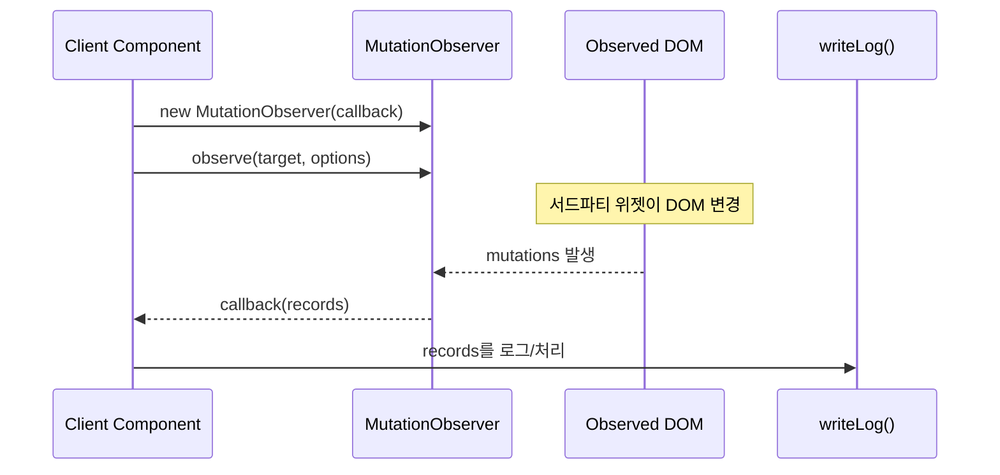

# 몰래 바뀌면 바로 알자: MutationObserver로 DOM 변경 감지


**한 문장 결론:** 내가 직접 건드리지 않은 DOM 변경이 문제를 만든다면, `MutationObserver`로 “변경 지점”을 로그로 잡아내면 해결 속도가 빨라진다.


UI는 “원래 이렇게 생겼는데?”라는 순간부터 디버깅이 어렵습니다. 특히 **서드파티 위젯/DOM 조작 라이브러리**가 섞이면, React/Next.js가 모르는 사이에 DOM이 바뀌는 상황이 생깁니다.


이때 중요한 건 “누가 바꿨는지”를 추측하는 게 아니라, **무엇이/어디서/언제 바뀌었는지**를 증거로 남기는 겁니다.


---


## 배경/문제

- 내가 관리하지 않는 코드(서드파티, 레거시 위젯)가 DOM을 바꾸면, 변경 원인을 추적하기가 급격히 어려워집니다.
- React/Next.js 환경에서는 DOM을 직접 조작하는 코드가 렌더링 흐름과 충돌할 수 있어, “가끔 깨지는” 형태로 나타나기도 합니다.
- 함수마다 로그를 심는 방식은 **코드를 오염**시키고, 변경 주체가 여러 곳이면 빠르게 관리 불가능해집니다.

정리하면, “변경 감지” 자체가 요구 사항인 순간이 있고, 그때 `MutationObserver`는 꽤 실용적인 도구가 됩니다.


---


## 핵심 개념


`MutationObserver`는 특정 DOM 노드(또는 그 하위 트리)의 변경을 감지해 **콜백을 호출**합니다. 감지 대상은 크게 3가지로 정리됩니다.

- `childList`: 자식 노드 추가/삭제
- `attributes`: 속성(attribute) 변경
- `characterData`: 텍스트 노드 변경

또, `subtree`를 켜면 해당 노드 아래의 모든 하위 노드까지 감시 범위를 확장할 수 있습니다.


아래 다이어그램을 보면 흐름이 단순합니다. “관측 시작 → DOM 변경 발생 → 기록(records) 전달 → 처리(로그/동기화)”.





→ 기대 결과/무엇이 달라졌는지: “누가 바꿨는지” 추측 대신, 실제로 바뀐 기록(records)을 기준으로 원인 추적이 가능해집니다.


---


## 해결 접근


### 1) 관측 범위를 최소화한다


왜 하냐면, 넓게 잡을수록 기록이 늘고 콜백 비용이 커집니다.


기대 결과는 “노이즈 감소 + 성능 안정”입니다.


### 2) 속성 감지는 `attributeFilter`로 좁힌다


왜 하냐면, 모든 속성 변경을 받으면 로그가 의미 없이 커집니다.


기대 결과는 “원하는 변경만 남긴 로그”입니다.


### 3) Next.js에서는 Client Component에서만 연결한다


왜 하냐면, `MutationObserver`는 브라우저 DOM API라서 서버 렌더링 문맥에서는 동작하지 않습니다.


기대 결과는 “실행 위치가 명확한, 재현 가능한 코드”입니다.


### 대안/비교 (최소 2개)

- **대안 A: 폴링(Polling)으로 DOM 상태를 주기적으로 비교**
단순하지만 불필요한 비교가 계속 발생할 수 있습니다.
- **대안 B: 변경이 발생하는 함수에 직접 로그 삽입(래핑/계측)**
변경 주체가 명확할 땐 좋지만, 서드파티/간접 변경에는 취약합니다.
- **대안 C: 가능하다면 “이벤트 기반”으로 전환(CustomEvent/콜백 제공)**
라이브러리가 공식 이벤트를 제공한다면 그쪽이 더 명시적이고 비용이 예측 가능합니다.

---


## 구현(코드)


### 1) `useMutationObserver` 훅: 연결/해제 책임을 고정하기


```javascript
'use client'

import { useEffect, useRef } from 'react'

export function useMutationObserver(targetRef, callback, options) {
  const callbackRef = useRef(callback)
  callbackRef.current = callback

  useEffect(() => {
    const target = targetRef.current
    if (!target) return

    const observer = new MutationObserver((records) => {
      callbackRef.current(records)
    })

    observer.observe(target, options)

    return () => {
      observer.disconnect()
    }
  }, [targetRef, options])
}
```


→ 기대 결과/무엇이 달라졌는지: 관측 시작/종료가 컴포넌트 생명주기와 함께 움직여 “끊지 못한 observer”가 남는 문제를 줄입니다.


---


### 2) 데모: 함수에 로그를 심지 않고, 변경 기록만으로 추적하기


```javascript
'use client'

import { useMemo, useRef, useState } from 'react'
import { useMutationObserver } from './useMutationObserver'

function writeLog(records, setLogs) {
  const lines = records.map((r) => {
    if (r.type === 'attributes') {
      return `attributes:${r.attributeName}`
    }
    if (r.type === 'childList') {
      return `childList: +${r.addedNodes.length} -${r.removedNodes.length}`
    }
    if (r.type === 'characterData') {
      return `characterData`
    }
    return `unknown:${r.type}`
  })

  setLogs((prev) => [...lines, ...prev].slice(0, 20))
}

export default function MutationObserverDemo() {
  const boxRef = useRef(null)
  const [logs, setLogs] = useState([])

  const options = useMemo(
    () => ({
      subtree: true,
      childList: true,
      attributes: true,
      attributeFilter: ['class', 'style'],
    }),
    []
  )

  useMutationObserver(
    boxRef,
    (records) => writeLog(records, setLogs),
    options
  )

  const appendChild = () => {
    const box = boxRef.current
    if (!box) return
    const el = document.createElement('div')
    el.textContent = `item-${Math.random().toString(16).slice(2, 6)}`
    el.style.padding = '6px'
    el.style.border = '1px solid #ddd'
    el.style.borderRadius = '8px'
    box.appendChild(el)
  }

  const setColor = () => {
    const box = boxRef.current
    if (!box) return
    box.style.background = box.style.background ? '' : 'rgba(0,0,0,0.04)'
  }

  const toggleClass = () => {
    const box = boxRef.current
    if (!box) return
    box.classList.toggle('active')
  }

  return (
    <div style={{ display: 'grid', gap: 12, maxWidth: 720 }}>
      <div style={{ display: 'flex', gap: 8, flexWrap: 'wrap' }}>
        <button onClick={appendChild}>appendChild()</button>
        <button onClick={setColor}>setColor()</button>
        <button onClick={toggleClass}>toggleClass()</button>
      </div>

      <div
        ref={boxRef}
        style={{
          minHeight: 120,
          padding: 12,
          border: '2px dashed #bbb',
          borderRadius: 12,
        }}
      >
        <div style={{ opacity: 0.7 }}>여기가 관측 대상입니다.</div>
      </div>

      <div
        style={{
          padding: 12,
          border: '1px solid #eee',
          borderRadius: 12,
          background: 'rgba(0,0,0,0.02)',
        }}
      >
        <div style={{ fontWeight: 700, marginBottom: 8 }}>Logs</div>
        <ul style={{ margin: 0, paddingLeft: 18 }}>
          {logs.map((l, i) => (
            <li key={`${l}-${i}`}>{l}</li>
          ))}
        </ul>
      </div>
    </div>
  )
}
```


→ 기대 결과/무엇이 달라졌는지: `appendChild()`/`setColor()`/`toggleClass()` 내부에 로그를 심지 않아도, 실제로 발생한 DOM 변경이 `records`로 잡힙니다.


---


## 검증 방법(체크리스트)

- [ ] 자식 노드를 추가하면 로그에 `childList: +1 -0` 같은 항목이 쌓인다.
- [ ] 배경색/클래스 변경 시 로그에 `attributes: style` 또는 `attributes: class`가 쌓인다.
- [ ] 컴포넌트를 언마운트하면 관측이 중단되고(해제), 로그가 더 이상 증가하지 않는다.
- [ ] `subtree`를 끄면 하위 노드 변경이 감지되지 않는 것을 재현할 수 있다(범위 확인).

---


## 흔한 실수/FAQ


### Q. 아무 로그도 안 찍혀요.


옵션에서 `childList`, `attributes`, `characterData` 중 최소 하나가 켜져 있어야 합니다. 또한 관측 시작 시점에 `targetRef.current`가 실제 DOM을 가리키는지 확인하세요.


### Q. 로그가 너무 많아요.


관측 범위를 좁히는 게 우선입니다.


- `subtree`를 정말 필요한 경우에만 켭니다.


- `attributeFilter`로 관심 있는 속성만 받습니다.


### Q. 콜백에서 DOM을 또 바꾸면 무한 루프가 날 수도 있나요?


가능합니다. 콜백에서 같은 영역을 다시 변경하면 “변경 → 콜백 → 변경”이 반복될 수 있습니다.


필요하면 콜백 처리 중에는 `disconnect()` 후 처리하고 다시 `observe()` 하거나, “내가 만든 변경”을 식별해 무시하는 방식으로 끊어야 합니다.


### Q. React가 렌더링하는 영역을 서드파티가 직접 바꿔도 되나요?


환경/구현 방식에 따라 달라질 수 있지만, 일반적으로는 충돌 위험이 있습니다. 가능하다면 **서드파티가 건드릴 DOM을 별도 컨테이너로 격리**하고, React는 그 컨테이너 “바깥”만 관리하는 구성이 안전합니다.


---


## 요약(3~5줄)

- `MutationObserver`는 DOM 변경을 기록(records) 단위로 받아 추적할 수 있게 해줍니다.
- 관측 범위는 최소화하고, 속성 감지는 `attributeFilter`로 노이즈를 줄이는 게 포인트입니다.
- Next.js에서는 브라우저 API이므로 Client Component에서 연결/해제를 고정합니다.
- “함수마다 로그 삽입” 대신 “변경 기록 기반”으로 원인을 좁히는 데 강점이 있습니다.

---


## 결론


DOM이 몰래 바뀌는 문제는, 원인보다 “증거”가 먼저입니다.


`MutationObserver`로 변경 기록을 잡아두면, 서드파티/간접 변경이 섞여도 디버깅이 단단해집니다.


---


## 참고(공식 문서 링크)

- [Next.js Docs: Server and Client Components](https://nextjs.org/docs/app/getting-started/server-and-client-components)
- [React Docs: useEffect](https://react.dev/reference/react/useEffect)
- [React Docs: Manipulating the DOM with Refs](https://react.dev/learn/manipulating-the-dom-with-refs)
- [MDN: MutationObserver](https://developer.mozilla.org/en-US/docs/Web/API/MutationObserver)
- [MDN: MutationObserver.observe()](https://developer.mozilla.org/en-US/docs/Web/API/MutationObserver/observe)
