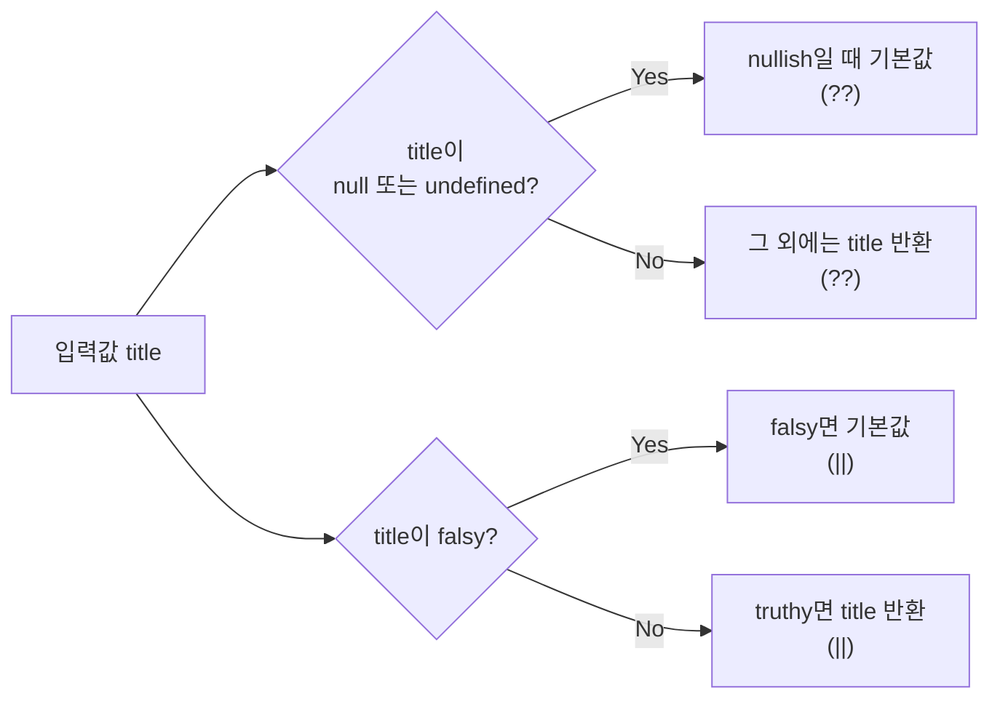

# 없는 값만 채워라: `??`·`?.`로 기본값과 안전한 접근 만들기


**한 문장 결론:** “없음(null/undefined)”과 “비어 있음(빈 문자열/0/false)”을 구분하려면 `??`와 `?.`를 쓰는 편이 안전하다. ([MDN: Nullish coalescing (??)](https://developer.mozilla.org/ko/docs/Web/JavaScript/Reference/Operators/Nullish_coalescing))


`||`로 기본값을 넣는 코드는 흔하다. 그런데 UI에서 **빈 문자열도 ‘유효한 값’** 인 경우가 꽤 많다. 이때 `||`는 의도와 다르게 기본값으로 바꿔버릴 수 있다. ([MDN: Logical OR (||)](https://developer.mozilla.org/ko/docs/Web/JavaScript/Reference/Operators/Logical_OR))


포인트는 두 가지다.

- “값이 없을 때만” 기본값을 넣고 싶은가?
- “중간 경로가 없을 때만” 안전하게 접근하고 싶은가?

이 두 가지를 코드로 깔끔하게 표현하는 도구가 `??`(Nullish coalescing)와 `?.`(Optional chaining)다. ([MDN: Nullish coalescing (??)](https://developer.mozilla.org/ko/docs/Web/JavaScript/Reference/Operators/Nullish_coalescing))


---


## 배경/문제


아래 코드는 `title`이 “없으면” 기본값을 주는 의도처럼 보인다.


```javascript
function getTitle(title) {
  return title || 'no title'
}

console.log(getTitle('알면 쓸만한 자바스크립트 문법'))
console.log(getTitle())
console.log(getTitle(''))
```


하지만 마지막 `getTitle('')`는 **빈 문자열이 falsy** 라는 이유로 기본값으로 바뀐다. `||`는 왼쪽이 falsy면 오른쪽을 반환하는 동작이기 때문이다. ([MDN: Logical OR (||)](https://developer.mozilla.org/ko/docs/Web/JavaScript/Reference/Operators/Logical_OR))


→ 기대 결과/무엇이 달라졌는지: `''`(빈 문자열)도 정상적인 제목이라면, `||`는 기본값 처리 범위가 너무 넓어서 의도와 어긋날 수 있다.


---


## 핵심 개념


### 1) `||` vs `??` — “falsy”와 “nullish”의 차이

- `||` : 왼쪽이 **falsy** 면 오른쪽을 반환한다. (`''`, `0`, `false`도 포함) ([MDN: Logical OR (||)](https://developer.mozilla.org/ko/docs/Web/JavaScript/Reference/Operators/Logical_OR))
- `??` : 왼쪽이 **nullish** (`null` 또는 `undefined`)일 때만 오른쪽을 반환한다. ([MDN: Nullish coalescing (??)](https://developer.mozilla.org/ko/docs/Web/JavaScript/Reference/Operators/Nullish_coalescing))

아래 다이어그램을 보면 둘의 “기본값 발동 조건”이 정확히 갈린다.





→ 기대 결과/무엇이 달라졌는지: `''`/`0`/`false`를 “유효한 값”으로 취급해야 할 때, `??`가 의도를 더 정확히 보존한다.

> 추가로, ??는 ||, &&와 괄호 없이 섞어 쓰면 문법 오류가 날 수 있다. 섞어야 한다면 괄호로 우선순위를 명확히 한다. (MDN: Nullish coalescing (??))

---


### 2) `?.` — “없을 수도 있는 경로”를 짧게 처리하기


깊은 경로의 값/함수를 호출하기 위해 `&&`로 하나씩 검사하는 패턴이 자주 나온다.


```javascript
let a = null

if (a && a.test && a.test.test) {
  a.test.test()
}
```


`?.`는 “중간이 nullish이면 그 즉시 멈추고 undefined”로 평가한다. 그래서 아래처럼 짧아진다. ([MDN: Optional chaining (?.)](https://developer.mozilla.org/ko/docs/Web/JavaScript/Reference/Operators/Optional_chaining))


```javascript
a?.test?.test?.()
```


→ 기대 결과/무엇이 달라졌는지: 중간 객체가 `null`/`undefined`여도 예외를 던지지 않고 조용히 `undefined`로 끝나서, 가드 코드가 크게 줄어든다. ([MDN: Optional chaining (?.)](https://developer.mozilla.org/ko/docs/Web/JavaScript/Reference/Operators/Optional_chaining))


---


## 해결 접근


### 기본값 처리 규칙을 먼저 고정한다

- **빈 문자열/0/false도 그대로 유지해야 한다** → `??` 선택
- **falsy면 전부 기본값으로 바꾸고 싶다** → `||` 선택 ([MDN: Logical OR (||)](https://developer.mozilla.org/ko/docs/Web/JavaScript/Reference/Operators/Logical_OR))

그리고 “대안”도 같이 알아두면 설계가 쉬워진다.

- 대안 A: **기본 매개변수(default parameter)**`undefined`에만 기본값이 적용된다. `null`까지 포함하려면 `??`가 더 명확하다.
- 대안 B: **명시적 조건문(삼항 연산자)**
조건을 더 세밀하게 제어하고 싶을 때 적합하다. (예: “빈 문자열은 기본값 처리” 같은 정책)

---


## 구현(코드)


### 1) “없을 때만” 기본값 넣기: `??`


```javascript
function getTitle(title) {
  return title ?? 'no title'
}

console.log(getTitle('알면 쓸만한 자바스크립트 문법')) // "알면 쓸만한 자바스크립트 문법"
console.log(getTitle()) // "no title"
console.log(getTitle('')) // ""
console.log(getTitle(0)) // 0
console.log(getTitle(false)) // false
```


→ 기대 결과/무엇이 달라졌는지: `''`, `0`, `false` 같은 “유효하지만 falsy인 값”은 유지되고, `null/undefined`만 기본값으로 대체된다. ([MDN: Nullish coalescing (??)](https://developer.mozilla.org/ko/docs/Web/JavaScript/Reference/Operators/Nullish_coalescing))


### `??`와 `||`를 함께 써야 한다면 괄호로


```javascript
// ❌ 괄호 없이 섞으면 문법 오류가 날 수 있다.
const title = (userInput || fallbackFromCache) ?? 'no title'
```


→ 기대 결과/무엇이 달라졌는지: 우선순위를 명확히 해 런타임 이전(파싱 단계)에서 막히는 문제를 피한다. ([MDN: Nullish coalescing (??)](https://developer.mozilla.org/ko/docs/Web/JavaScript/Reference/Operators/Nullish_coalescing))


---


### 2) 안전한 접근/호출: `?.`


```javascript
const a = null
a?.test?.test?.() // undefined (에러 없음)
```


→ 기대 결과/무엇이 달라졌는지: 중간 경로가 `null/undefined`면 자동으로 멈춰서 “Cannot read properties…” 같은 예외를 줄인다. ([MDN: Optional chaining (?.)](https://developer.mozilla.org/ko/docs/Web/JavaScript/Reference/Operators/Optional_chaining))


### “함수인지”까지 보장하고 싶다면 `typeof`로 한 번 더


`?.`는 “nullish인지”만 막아준다. 값이 존재하지만 함수가 아니면 호출 시 예외가 날 수 있다. ([MDN: Optional chaining (?.)](https://developer.mozilla.org/ko/docs/Web/JavaScript/Reference/Operators/Optional_chaining))


```javascript
const fn = a?.test?.test

if (typeof fn === 'function') {
  fn()
}
```


→ 기대 결과/무엇이 달라졌는지: 경로 존재 여부뿐 아니라 “호출 가능(callable)” 여부까지 확인해서, 타입이 어긋난 데이터에도 안전해진다.


---


### 3) 콘솔 출력 꾸미기: `%c`


브라우저 DevTools 콘솔에서는 `%c` 지시어로 CSS 스타일을 적용할 수 있다. ([MDN: console API](https://developer.mozilla.org/ko/docs/Web/API/console))


```javascript
console.log(
  "%c콘솔을 꾸며 봅시다.",
  "color: yellow; font-style: italic; background-color: blue; padding: 2px;"
)
```


→ 기대 결과/무엇이 달라졌는지: 경고/안내 메시지를 눈에 띄게 만들어, 디버깅 포인트를 빠르게 전달할 수 있다. ([MDN: console API](https://developer.mozilla.org/ko/docs/Web/API/console))


### Next.js에서 재현하기: Client Component + `useEffect`


`console.log` 자체는 어디서든 쓸 수 있지만, **브라우저 전용 동작(DevTools 스타일링)은 클라이언트에서만 의미**가 있다. Next.js에서는 브라우저 API/라이프사이클 로직이 필요하면 Client Component를 사용한다. ([Next.js Docs: Server and Client Components](https://nextjs.org/docs/app/getting-started/server-and-client-components))


```javascript
// app/ui/DevConsoleNotice.jsx
'use client'

import { useEffect } from 'react'

export default function DevConsoleNotice() {
  useEffect(() => {
    console.log(
      '%c콘솔을 꾸며 봅시다.',
      'color: yellow; font-style: italic; background-color: blue; padding: 2px;'
    )
  }, [])

  return null
}
```


→ 기대 결과/무엇이 달라졌는지: 서버 로그가 아니라 **브라우저 콘솔에서** 스타일이 적용된 메시지를 확인할 수 있다. ([Next.js Docs: Server and Client Components](https://nextjs.org/docs/app/getting-started/server-and-client-components))


---


## 검증 방법(체크리스트)

- [ ] `getTitle()`이 기본값을 반환한다.
- [ ] `getTitle(null)`과 `getTitle(undefined)`만 기본값이 적용된다.
- [ ] `getTitle('')`, `getTitle(0)`, `getTitle(false)`는 값이 유지된다.
- [ ] `a?.b?.c`에서 `a` 또는 `b`가 `null/undefined`여도 예외가 없다.
- [ ] “함수 호출”은 `typeof fn === 'function'` 가드로 안전하게 동작한다.
- [ ] Next.js에서는 콘솔 스타일링이 필요한 코드를 Client Component에서 실행한다. ([Next.js Docs: Server and Client Components](https://nextjs.org/docs/app/getting-started/server-and-client-components))

---


## 흔한 실수/FAQ


### Q1. `||`로도 되는데 `??`를 꼭 써야 하나요?


`||`는 falsy 전체가 기본값으로 바뀐다. 빈 문자열/0/false를 “유효한 값”으로 인정해야 한다면 `??`가 의도를 보존한다. ([MDN: Logical OR (||)](https://developer.mozilla.org/ko/docs/Web/JavaScript/Reference/Operators/Logical_OR))


### Q2. `??`를 `||`/`&&`와 같이 쓰다가 SyntaxError가 났어요.


`??`는 `||`, `&&`와 **괄호 없이 직접 결합할 수 없다**. 괄호로 우선순위를 명확히 해야 한다. ([MDN: Nullish coalescing (??)](https://developer.mozilla.org/ko/docs/Web/JavaScript/Reference/Operators/Nullish_coalescing))


### Q3. `a?.b?.c?.()`면 “함수인지”까지 확인해주나요?


아니다. `?.`는 “nullish인지”만 막아준다. 값이 존재하지만 함수가 아니면 호출 시 예외가 날 수 있으니 `typeof` 가드를 추가한다. ([MDN: Optional chaining (?.)](https://developer.mozilla.org/ko/docs/Web/JavaScript/Reference/Operators/Optional_chaining))


### Q4. `%c` 스타일이 안 먹히는데요?


브라우저/DevTools에 따라 표현이 달라질 수 있다. 그래도 일반 `console.log`로는 출력되므로 “표현이 다를 수 있다” 정도로 받아들이는 편이 안전하다. ([MDN: console API](https://developer.mozilla.org/ko/docs/Web/API/console))


---


## 요약(3~5줄)

- `||`는 falsy 전체를 기본값으로 바꾼다.
- `??`는 `null/undefined`만 기본값으로 바꾸어, 빈 문자열/0/false를 보존한다. ([MDN: Logical OR (||)](https://developer.mozilla.org/ko/docs/Web/JavaScript/Reference/Operators/Logical_OR))
- `?.`는 중간 경로가 nullish일 때 안전하게 멈춰 가드 코드를 줄인다. ([MDN: Optional chaining (?.)](https://developer.mozilla.org/ko/docs/Web/JavaScript/Reference/Operators/Optional_chaining))
- 콘솔 스타일링은 브라우저 DevTools 기능이라, Next.js에서는 Client Component에서 실행하는 편이 자연스럽다. ([Next.js Docs: Server and Client Components](https://nextjs.org/docs/app/getting-started/server-and-client-components))

---


## 결론


기본값 처리와 안전한 접근은 “코드가 짧아지는 것”보다 “의도가 정확해지는 것”이 더 중요하다.


빈 문자열을 값으로 존중해야 한다면 `??`가 답이고, 중간 경로가 사라질 수 있다면 `?.`가 가드 코드를 정리해준다.


필요한 범위에서만 이 두 연산자를 사용하면, 예외와 사이드이펙트가 줄고 유지보수성이 올라간다.


---


## 참고(공식 문서 링크)

- [Next.js Docs: Server and Client Components](https://nextjs.org/docs/app/getting-started/server-and-client-components)
- [React Docs](https://react.dev/)
- [MDN: Nullish coalescing operator (??)](https://developer.mozilla.org/ko/docs/Web/JavaScript/Reference/Operators/Nullish_coalescing)
- [MDN: Optional chaining (?.)](https://developer.mozilla.org/ko/docs/Web/JavaScript/Reference/Operators/Optional_chaining)
- [MDN: console API (%c 스타일링 포함)](https://developer.mozilla.org/ko/docs/Web/API/console)

---
