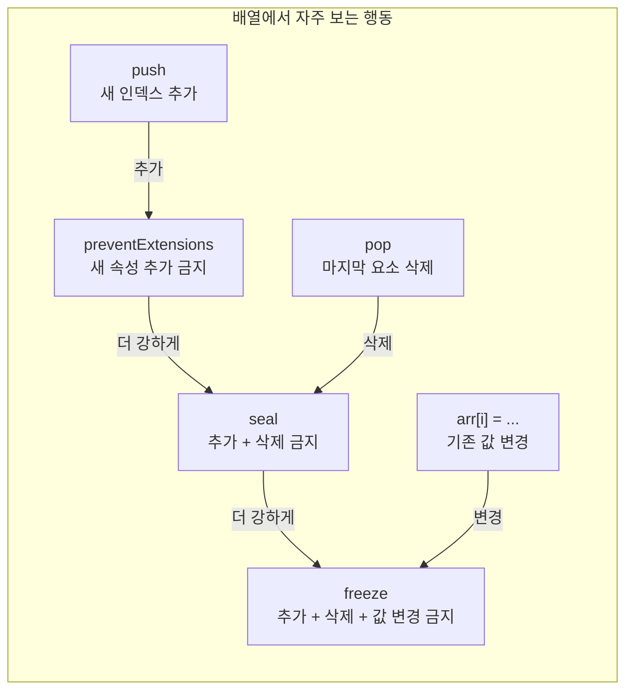

# 상태를 고정하라: `Object.preventExtensions` · `Object.seal` · `Object.freeze`로 변경을 차단하는 법


한 문장 결론: **“추가/삭제/수정” 중 무엇을 막을지 먼저 정하고, 그에 맞는** **`preventExtensions → seal → freeze`****를 선택하면 된다.**


## 배경/문제


자바스크립트에서 배열(Array)도 결국 객체(Object)다. 그래서 “배열에 값을 더 못 넣게 하거나”, “길이를 줄이지 못하게 하거나”, “아예 내부 값을 바꾸지 못하게” 만들고 싶을 때가 있다.


이런 제어는 특히 다음 상황에서 의미가 크다.

- **유지보수**: 의도치 않은 `push/pop` 같은 변경이 들어오면 버그가 늦게 터진다.
- **안정성**: “읽기 전용으로 다루자”는 규칙을 코드 레벨로 강제할 수 있다.
- **디버깅 효율**: 변경이 일어나는 순간 바로 에러로 잡아내면 원인 추적이 빨라진다.

포인트는 하나다. **어떤 종류의 변경을 막을지(추가/삭제/수정)를 선택**하는 것.


---


## 핵심 개념


세 API는 모두 **해당 객체의 “속성(프로퍼티) 상태”를 바꿔서** 변경을 제한한다. 아래 다이어그램처럼 “막는 범위”가 점점 넓어진다.





→ 기대 결과/무엇이 달라졌는지: **어떤 메서드가 “추가/삭제/변경”에 해당하는지**가 먼저 고정되고, 그에 따라 어떤 API를 선택해야 하는지 빠르게 정리된다.


### 배열에서 왜 `pop`은 되고 `push`는 막힐까?

- `push`: **새 인덱스(새 속성)를 추가**한다 → “확장”에 해당
- `pop`: **기존 마지막 인덱스를 삭제**한다 → “축소(삭제)”에 해당
- `arr[0] = 5`: **이미 존재하는 인덱스 값을 변경**한다 → “변경”에 해당

즉, **막는 규칙이 “추가/삭제/변경” 중 어디에 걸리는지**로 결과가 갈린다.


---


## 해결 접근

1. **추가만 막고 싶다** → `Object.preventExtensions`
2. **추가와 삭제를 막고 싶다** → `Object.seal`
3. **추가/삭제/수정까지 모두 막고 싶다** → `Object.freeze`

그리고 중요한 한 가지:

- 실패가 “조용히 무시”되면 디버깅이 어렵다.
가능하면 **실패를 에러로 드러내는 실행 환경(모듈/엄격 모드)**에서 확인하는 습관이 안전하다. (관련 동작은 실행 환경에 따라 달라질 수 있다.)

---


## 구현(코드)


아래 예시는 **Next.js에서 그대로 실행해도 되는 형태**로 정리했다. 콘솔 결과로 확인하면 된다.


### 1) `Object.preventExtensions`: 확장(추가)만 막기


```javascript
'use strict';

const arr = [1, 2, 3];

Object.preventExtensions(arr);

arr[0] = 5;     // 기존 값 변경: 가능
arr.pop();      // 기존 요소 삭제: 가능

try {
  arr.push(3);  // 새 요소 추가: 불가
} catch (err) {
  console.error('push failed:', err);
}

console.log(arr);
```


→ 기대 결과/무엇이 달라졌는지: `pop()`은 정상 동작하지만 `push()`는 실패한다. **“새 요소 추가(확장)”만 막히기 때문**이다.


---


### 2) `Object.seal`: 확장(추가) + 축소(삭제) 막기


```javascript
'use strict';

const arr = [1, 2, 3];

Object.seal(arr);

arr[0] = 5; // 기존 값 변경: 가능

try {
  arr.pop(); // 삭제: 불가
} catch (err) {
  console.error('pop failed:', err);
}

try {
  arr.push(4); // 추가: 불가
} catch (err) {
  console.error('push failed:', err);
}

console.log(arr);
```


→ 기대 결과/무엇이 달라졌는지: `push()`와 `pop()`이 모두 실패한다. **추가/삭제가 동시에 막히고, 기존 값 변경은 여전히 가능**하다.


---


### 3) `Object.freeze`: 확장(추가) + 축소(삭제) + 변경(수정) 막기


```javascript
'use strict';

const arr = [1, 2, 3];

Object.freeze(arr);

try {
  arr[0] = 5; // 변경: 불가
} catch (err) {
  console.error('assign failed:', err);
}

try {
  arr.pop(); // 삭제: 불가
} catch (err) {
  console.error('pop failed:', err);
}

try {
  arr.push(4); // 추가: 불가
} catch (err) {
  console.error('push failed:', err);
}

console.log(arr);
```


→ 기대 결과/무엇이 달라졌는지: `push/pop`이 막히고, `arr[0] = 5` 같은 **기존 값 변경도 실패**한다.


---


### Next.js에서 실행 예시 (Client Component)


```javascript
'use client';

import { useEffect } from 'react';

export default function Page() {
  useEffect(() => {
    // 위 예제 중 하나를 여기에 붙여넣고 콘솔로 확인한다.
  }, []);

  return<main>콘솔을 확인하세요.</main>;
}
```


→ 기대 결과/무엇이 달라졌는지: 브라우저 콘솔에서 **실패(에러)와 최종 배열 상태**를 바로 확인할 수 있다.


---


## 검증 방법(체크리스트)

- [ ] `preventExtensions`에서 `push()`가 실패하고 `pop()`이 성공하는가?
- [ ] `seal`에서 `push()/pop()`이 모두 실패하는가?
- [ ] `freeze`에서 `push()/pop()`뿐 아니라 `arr[i] = ...`도 실패하는가?
- [ ] 콘솔에 실패가 명확히 드러나는가? (에러/로그로 확인)
- [ ] 중첩 구조(객체/배열 내부의 객체)가 있다면, “freeze가 얕게 적용”되는 점을 고려했는가?

---


## 흔한 실수/FAQ


### Q1. `freeze`면 내부 객체도 완전히 못 바꾸는 거 아닌가?


`Object.freeze`는 기본적으로 **얕게(shallow)** 적용된다. 배열 안에 객체가 들어있으면, 배열 자체는 얼지만 **그 객체 내부는 그대로 변경 가능**할 수 있다. 중첩까지 막고 싶다면 재귀적으로 동결하는 유틸 패턴이 필요하다.


관련: [MDN - Object.freeze](https://developer.mozilla.org/en-US/docs/Web/JavaScript/Reference/Global_Objects/Object/freeze)


### Q2. 왜 어떤 환경에서는 에러가 안 나고 조용히 넘어가?


실행 방식(스크립트/모듈 등)에 따라 **실패가 에러로 터지거나 조용히 무시**될 수 있다. 그래서 예제처럼 `try/catch`로 감싸서 “실패를 관찰 가능”하게 만드는 편이 안전하다.


(동작은 환경에 따라 달라질 수 있다.)


### Q3. React 상태(state)에 `freeze`를 걸어도 되나?


가능은 하지만 목적이 다르다. 보통은 **불변 업데이트(새 객체/배열 생성)**로 상태를 관리하고, `freeze`는 “실수로 직접 변경하는 코드를 빨리 잡기” 같은 **디버깅 보조**로 쓰는 편이 자연스럽다.


관련: [React Docs - Updating Objects in State](https://react.dev/learn/updating-objects-in-state), [React Docs - Updating Arrays in State](https://react.dev/learn/updating-arrays-in-state)


---


## 요약(3~5줄)

- `Object.preventExtensions`: **추가만 금지** → `push` 같은 확장 동작이 막힌다.
- `Object.seal`: **추가 + 삭제 금지** → `push/pop`이 함께 막힌다.
- `Object.freeze`: **추가 + 삭제 + 변경 금지** → 값 수정까지 막는다.
- 배열 메서드가 “추가/삭제/변경” 중 무엇인지로 결과가 갈린다.

---


## 결론


“배열을 고정한다”는 말은 하나로 뭉뚱그리기 어렵다. 실제로는 **추가를 막을지, 삭제를 막을지, 변경까지 막을지**를 선택하는 문제다.


정리하면, **`preventExtensions → seal → freeze`** **순서로 강도가 올라간다.** 필요한 만큼만 막는 것이 유지보수에 가장 유리하다.


---


## 참고(공식 문서 링크)

- [MDN - Object.preventExtensions](https://developer.mozilla.org/en-US/docs/Web/JavaScript/Reference/Global_Objects/Object/preventExtensions)
- [MDN - Object.seal](https://developer.mozilla.org/en-US/docs/Web/JavaScript/Reference/Global_Objects/Object/seal)
- [MDN - Object.freeze](https://developer.mozilla.org/en-US/docs/Web/JavaScript/Reference/Global_Objects/Object/freeze)
- [React Docs](https://react.dev/)
- [Next.js Docs](https://nextjs.org/docs)
