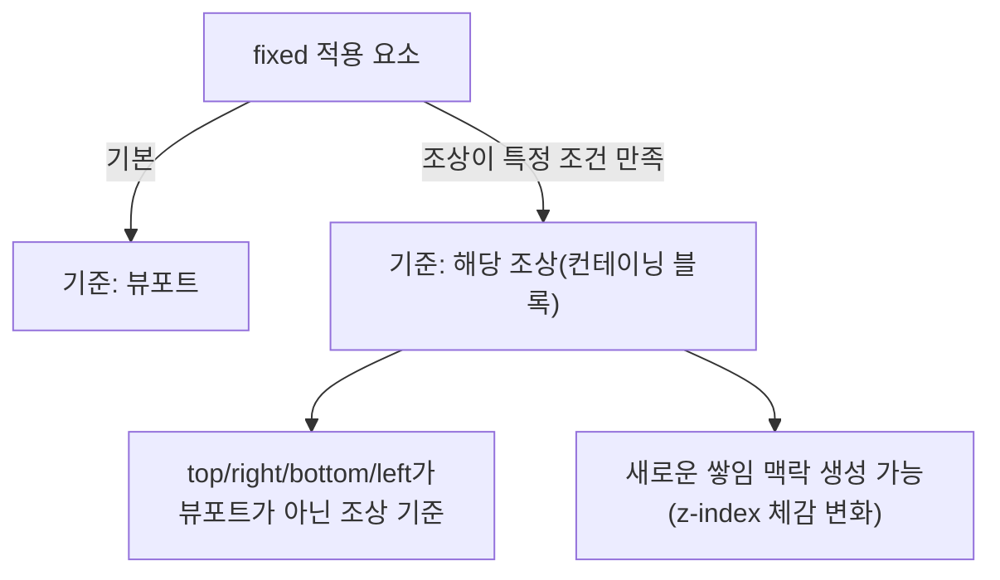
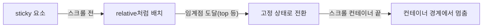

# **부모가 기준이 되는 순간을 막아라:** **`position: fixed`****·****`sticky`****의 진짜 기준**


**한 문장 결론:** `fixed`는 “뷰포트 기준”이 깨지는 순간이 있고, `sticky`는 “스크롤 컨테이너 기준”이 잡히는 순간이 있다. 둘 다 **기준(컨테이닝 블록/스크롤 컨테이너)**부터 확인하면 대부분의 삽질이 사라진다.


UI에서 헤더/툴바/플로팅 버튼은 자주 `fixed`나 `sticky`로 구현한다.


그런데 특정 페이지에서만 “갑자기 부모 기준으로 붙는다”, “스크롤해도 안 따라온다”, “z-index가 먹지 않는다” 같은 문제가 튀어나온다.


포인트는 단순하다. **“어디를 기준으로 위치를 계산하느냐”**가 바뀌는 순간이 있기 때문이다.


---


## 배경/문제


### 흔히 만나는 증상

- `position: fixed`인데 **뷰포트가 아니라 부모 박스 기준으로 움직임**
- `position: sticky`인데 **스크롤해도 고정되지 않음**
- `z-index`를 올려도 **레이어가 기대대로 안 올라감**

이런 증상은 대부분 **컨테이닝 블록(containing block: 위치 계산 기준이 되는 박스)** 또는 **스크롤 컨테이너(scroll container: 스크롤이 실제로 발생하는 박스)**를 잘못 잡아서 생긴다.


---


## 핵심 개념


### 1) `fixed`의 기준: “대부분 뷰포트, 가끔 조상”


`position: fixed`는 기본적으로 **뷰포트(viewport: 브라우저에서 실제로 보이는 화면 영역)**를 기준으로 `top/right/bottom/left`를 계산한다.


다만 특정 CSS 속성이 조상(ancestor)에 걸리면, 그 조상이 **`fixed`****의 컨테이닝 블록**이 될 수 있다. 이때부터 `fixed`가 “부모 기준처럼” 보인다.


아래 다이어그램을 보면, 기준이 어떻게 갈리는지 한 번에 정리된다.





→ 기대 결과/무엇이 달라졌는지: `fixed`가 “왜 부모 기준처럼 보이는지”를 **기준 변경** 관점에서 바로 진단할 수 있다.


**대표적으로 기준을 바꾸는 조상 조건(환경에 따라 달라질 수 있음):**
- `transform` / `perspective`가 `none`이 아님
- `will-change`가 `transform` 또는 `perspective`를 예고함
- `filter`가 적용되는 경우(브라우저별로 차이가 있을 수 있음)
- `contain: paint` 같은 containment 설정

> 참고(공식/권장 문서): [MDN - position](https://developer.mozilla.org/docs/Web/CSS/position), [MDN - containing block](https://developer.mozilla.org/docs/Web/CSS/CSS_display/Containing_block), [MDN - transform](https://developer.mozilla.org/docs/Web/CSS/transform), [MDN - will-change](https://developer.mozilla.org/docs/Web/CSS/will-change), [MDN - contain](https://developer.mozilla.org/docs/Web/CSS/contain), [MDN - filter](https://developer.mozilla.org/docs/Web/CSS/filter)

---


### 2) `sticky`의 기준: “스크롤이 누구의 책임이냐”


`position: sticky`는 규칙이 단순한 편이지만, **전제가 많다.**


핵심은 딱 하나: **sticky는 스크롤과 함께 작동한다**는 점이다.

- 스크롤이 **문서(뷰포트)**에서 일어나면 → sticky도 뷰포트 스크롤 기준으로 동작
- 스크롤이 **특정 컨테이너(overflow로 스크롤 생성)**에서 일어나면 → sticky도 그 컨테이너 기준으로 동작




→ 기대 결과/무엇이 달라졌는지: `sticky`가 “따라오다 멈추는 이유”가 **컨테이너 경계** 때문임을 구조로 이해할 수 있다.

> 참고(공식/권장 문서): [MDN - position: sticky](https://developer.mozilla.org/docs/Web/CSS/position#sticky)

---


## 해결 접근


### 접근 1) `fixed`가 부모 기준처럼 보일 때의 해결

1. **조상에 기준을 바꾸는 속성(transform/filter/contain/will-change)이 있는지** 확인한다.
    - 왜: 조상이 컨테이닝 블록이 되면 `fixed`가 “그 안에서만” 고정된 것처럼 보인다.
    - 기대 결과: “부모 기준으로 붙는 현상” 원인을 즉시 특정.
2. 레이아웃 전체 래퍼(wrapper)에 `transform: translateZ(0)` 같은 최적화 트릭을 걸었다면, **`fixed`****가 필요한 레이어만 분리**한다.
    - 대안 A: `fixed` 요소를 래퍼 밖(문서 루트)에 배치
    - 대안 B: **Portal(포탈)**로 `document.body` 아래로 렌더링

### 접근 2) `sticky`가 안 붙을 때의 해결

1. **스크롤이 어디에서 일어나는지**(문서 vs 특정 컨테이너) 먼저 확정한다.
    - 왜: sticky는 “스크롤 컨테이너”에 종속된다.
    - 기대 결과: “왜 페이지에서는 되는데 모달/패널에서는 안 되는지”가 정리된다.
2. `sticky`에는 보통 `top`(또는 `bottom`)이 필요하다.
    - 왜: 임계점이 없으면 “언제부터 붙을지”를 결정할 수 없다.
    - 기대 결과: sticky 전환 타이밍이 예측 가능해진다.

### 비교: `fixed` vs `sticky` vs `absolute`

- `fixed`: 뷰포트(또는 특정 조상)를 기준으로 **항상 고정**
- `sticky`: 스크롤 컨테이너에서 **임계점 이후에만 고정**, 컨테이너 경계에서 멈춤
- `absolute`: 컨테이닝 블록 기준으로 **그냥 배치(스크롤 따라 자연 이동)**

추가 대안(비교용): sticky가 브라우저/레이아웃 조건 때문에 까다로우면, **Intersection Observer로 “붙는 순간”을 감지해 클래스 토글**하는 방식도 선택지다.


참고: [MDN - Intersection Observer](https://developer.mozilla.org/docs/Web/API/Intersection_Observer_API)


---


## 구현(코드)


### 예제 1) `sticky` 헤더 (Next.js에서 재현 가능한 형태)


**`app/sticky-demo/page.tsx`**


```typescript
export default function StickyDemoPage() {
  return (
    <main style={{ padding: 24 }}>
      <section style={{ maxWidth: 720, margin: "0 auto" }}>
        <header style={{ position: "sticky", top: 0, zIndex: 10, background: "white", borderBottom: "1px solid #eee" }}>
          <div style={{ padding: "12px 0" }}>
            <strong>Sticky Header</strong>
            <div style={{ fontSize: 12, opacity: 0.7 }}>스크롤 임계점 이후 top=0에 고정</div>
          </div>
        </header>

        <article style={{ paddingTop: 16 }}>
          {Array.from({ length: 60 }).map((_, i) => (
            <p key={i} style={{ lineHeight: 1.8 }}>
              콘텐츠 라인 {i + 1}
            </p>
          ))}
        </article>
      </section>
    </main>
  );
}
```


→ 기대 결과/무엇이 달라졌는지: 스크롤을 내리면 헤더가 상단에 붙고, 콘텐츠는 아래로 계속 흐른다.


**포인트**
- `top: 0`이 sticky 전환 임계점이다.
- `background`를 주지 않으면 아래 콘텐츠가 비쳐 가독성이 떨어질 수 있다.
- `zIndex`는 “어떤 쌓임 맥락 안에 있느냐”에 따라 체감이 달라질 수 있다. 참고: [MDN - stacking context](https://developer.mozilla.org/docs/Web/CSS/CSS_positioned_layout/Understanding_z-index/Stacking_context)


---


### 예제 2) “부모가 기준이 되는 fixed”를 Portal로 분리


아래 패턴은 **레이아웃 래퍼에 transform 등이 걸린 상태**에서도, `fixed` UI(예: 토스트/전역 퀵메뉴)를 **문서 루트로 빼는** 방식이다.


**`app/components/BodyPortal.tsx`**


```typescript
"use client";

import { useEffect, useState } from "react";
import { createPortal } from "react-dom";

type Props = {
  children: React.ReactNode;
};

export function BodyPortal({ children }: Props) {
  const [mounted, setMounted] = useState(false);

  useEffect(() => {
    setMounted(true);
  }, []);

  if (!mounted) return null;
  return createPortal(children, document.body);
}
```


→ 기대 결과/무엇이 달라졌는지: `document` 접근이 필요한 Portal이 **클라이언트에서만** 안전하게 동작한다(서버 렌더링 단계에서 터지지 않음).


참고: [Next.js Docs](https://nextjs.org/docs), [React Docs - Portals](https://react.dev/reference/react-dom/createPortal)


**`app/fixed-demo/page.tsx`**


```typescript
import { BodyPortal } from "../components/BodyPortal";

export default function FixedDemoPage() {
  return (
    <main>
      {/* 일부러 "문제 상황"을 만들기 위해 래퍼에 transform을 적용 */}
      <div style={{ transform: "translateZ(0)", minHeight: "200vh", padding: 24 }}>
        <h1>Fixed Demo</h1>
        <p>아래 버튼은 Portal로 body에 렌더링되어 기준이 흔들리지 않는다.</p>
      </div>

      <BodyPortal>
        <button
          style={{
            position: "fixed",
            right: 16,
            bottom: 16,
            padding: "12px 14px",
            borderRadius: 12,
            border: "1px solid #ddd",
            background: "white",
          }}
        >
          Floating Action
        </button>
      </BodyPortal>
    </main>
  );
}
```


→ 기대 결과/무엇이 달라졌는지: 래퍼에 `transform`이 있어도 버튼은 **뷰포트 기준으로** 우하단에 고정된다.


---


## 검증 방법(체크리스트)

- [ ] `fixed`가 부모 기준처럼 보이면: 조상에 `transform/perspective/filter/contain/will-change`가 있는지 확인
- [ ] `sticky`가 안 붙으면: 스크롤이 문서에서 나는지, 특정 컨테이너(overflow)에서 나는지 확인
- [ ] `sticky`에 `top`(또는 `bottom`)이 있는지 확인
- [ ] `z-index`가 기대대로 안 먹으면: 부모가 쌓임 맥락을 새로 만들었는지 확인
- [ ] 모바일/사파리 등에서 레이아웃이 다르면: 스크롤 컨테이너 구성(overflow/height)부터 재점검
- [ ] 고정 헤더가 앵커 이동을 가리면: `scroll-margin-top` 같은 보정 고려
참고: [MDN - scroll-margin](https://developer.mozilla.org/docs/Web/CSS/scroll-margin)

---


## 흔한 실수/FAQ


### Q1. `position: sticky`가 “그냥 아무 일도 안 해요”

- `top`이 없으면 sticky 전환 임계점이 없어서 “붙는 순간”이 생기지 않는다.
- 스크롤이 **문서가 아니라 컨테이너**에서 일어나는데, sticky 요소가 그 컨테이너 규칙을 못 타고 있을 수도 있다.
참고: [MDN - position: sticky](https://developer.mozilla.org/docs/Web/CSS/position#sticky)

### Q2. `fixed`인데 특정 페이지에서만 부모 기준으로 붙어요

- 그 페이지의 조상에 `transform` 같은 속성이 들어가면서 **컨테이닝 블록이 바뀌었을 가능성**이 크다.
- 전역 플로팅 UI라면 Portal로 `body` 아래에 분리하는 방식이 안전하다.
참고: [React Docs - Portals](https://react.dev/reference/react-dom/createPortal)

### Q3. `z-index`를 올려도 위로 안 올라가요

- 숫자만 올린다고 해결되지 않는다. **쌓임 맥락**이 갈라졌을 수 있다.
참고: [MDN - stacking context](https://developer.mozilla.org/docs/Web/CSS/CSS_positioned_layout/Understanding_z-index/Stacking_context)

---


## 요약(3~5줄)

- `fixed`는 기본적으로 뷰포트 기준이지만, 조상 CSS에 의해 기준(컨테이닝 블록)이 바뀔 수 있다.
- `sticky`는 스크롤이 어디서 발생하는지(스크롤 컨테이너)가 전부다.
- 문제가 생기면 “기준”부터 확인하고, 전역 플로팅 UI는 Portal로 분리하면 안정적이다.
- `z-index`는 숫자보다 **쌓임 맥락**을 먼저 본다.

---


## 결론


`position` 문제는 “속성 자체가 어려워서”가 아니라, **기준이 바뀌는 순간을 놓쳐서** 터진다.


`fixed`는 컨테이닝 블록, `sticky`는 스크롤 컨테이너. 이 두 축으로 보면 대부분의 케이스가 정리된다.


---


## 참고(공식 문서 링크)

- [Next.js Docs](https://nextjs.org/docs)
- [React Docs](https://react.dev/)
- [React Docs - createPortal](https://react.dev/reference/react-dom/createPortal)
- [MDN - position](https://developer.mozilla.org/docs/Web/CSS/position)
- [MDN - containing block](https://developer.mozilla.org/docs/Web/CSS/CSS_display/Containing_block)
- [MDN - transform](https://developer.mozilla.org/docs/Web/CSS/transform)
- [MDN - will-change](https://developer.mozilla.org/docs/Web/CSS/will-change)
- [MDN - contain](https://developer.mozilla.org/docs/Web/CSS/contain)
- [MDN - filter](https://developer.mozilla.org/docs/Web/CSS/filter)
- [MDN - stacking context](https://developer.mozilla.org/docs/Web/CSS/CSS_positioned_layout/Understanding_z-index/Stacking_context)
- [MDN - Intersection Observer](https://developer.mozilla.org/docs/Web/API/Intersection_Observer_API)
