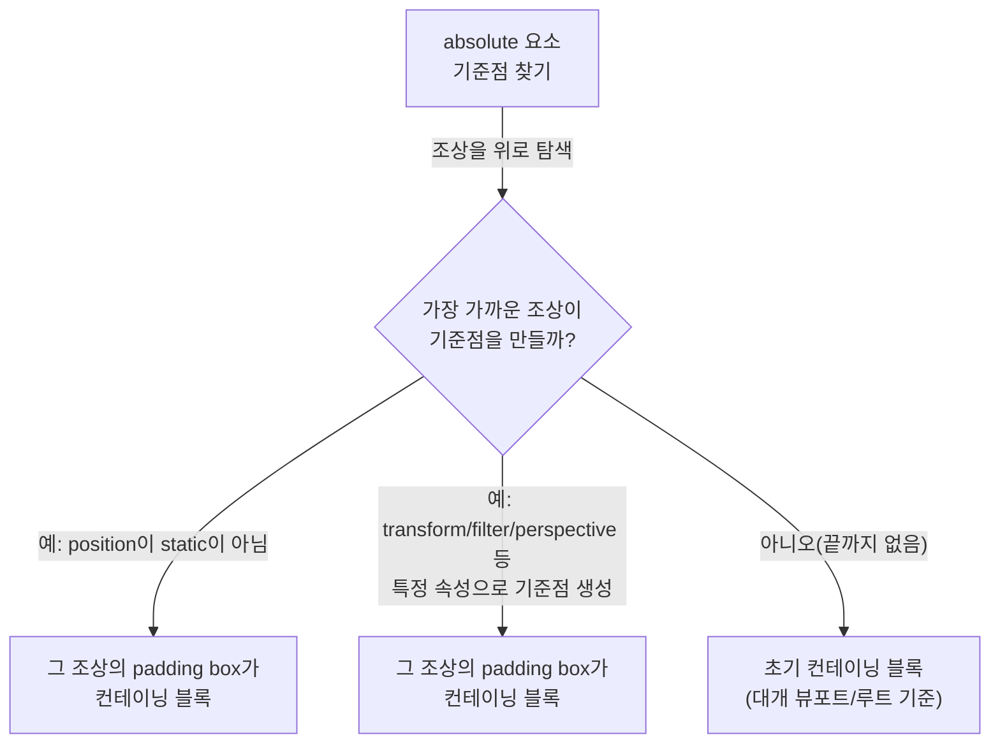

# 기준점을 먼저 잡아라: position static·relative·absolute


**한 문장 결론:** `position`은 **기준점(컨테이닝 블록)** 과 **겹침 규칙(쌓임 맥락)** 을 먼저 고정하면, 배치 버그의 대부분이 정리된다.


툴팁/드롭다운/배지처럼 “어딘가에 붙어 있어야 하는 UI”는 작은 CSS 한 줄로도 기준점이 바뀌며 엉뚱한 곳에 붙는다.


게다가 겹침(z축) 문제가 섞이면 `z-index` 숫자만 키우다가 더 복잡해지기 쉽다.


포인트는 단순하다. **“어디 기준으로 붙는가”와 “누가 위에 그려지는가”를 분리**해서 판단한다.


---


## 배경/문제


다음 같은 상황이 자주 발생한다.

- `position: absolute`로 만든 배지가 카드 안이 아니라 페이지 모서리에 붙는다.
- `top/right` 값을 줬는데 전혀 움직이지 않는다.
- `z-index`를 올려도 특정 요소 위로 올라오지 않는다.

이건 “속성 하나가 잘못됐다”기보다, **컨테이닝 블록과 쌓임 맥락이 생각과 달라진 것**일 때가 많다.


---


## 핵심 개념


### 1) 컨테이닝 블록(Containing block)


컨테이닝 블록은 “이 요소의 **크기/위치 계산이 기대는 기준 박스**”다.


예를 들어 `height: 100%`, `top: 0` 같은 값은 **어딘가를 기준**으로 해석되는데, 그 기준이 컨테이닝 블록이다.


공식 정의/규칙은 MDN의 컨테이닝 블록 가이드가 가장 보기 좋다: [MDN: Containing block](https://developer.mozilla.org/en-US/docs/Web/CSS/Guides/Display/Containing_block)


아래 다이어그램은 `position: absolute`가 “어떤 기준”을 잡는지 흐름을 잡아준다.





→ 기대 결과/무엇이 달라졌는지: `absolute`가 “부모에 붙는다/바디에 붙는다”가 아니라, **규칙에 의해 선택된 기준점에 붙는다**는 관점으로 정리된다.

> `transform`, `filter`, `contain` 같은 속성이 **의도치 않게 기준점을 생성**할 수 있다는 점이 실무에서 특히 중요하다.
>
> (관련 규칙: [MDN: Containing block](https://developer.mozilla.org/en-US/docs/Web/CSS/Guides/Display/Containing_block))
>
>

---


### 2) 쌓임 맥락(Stacking context)


쌓임 맥락은 “겹치는 요소를 **어떤 그룹/단위로 z축 정렬할지**”를 결정하는 개념이다.


`z-index`는 **쌓임 맥락 내부에서만** 비교되는 값이라, 다른 쌓임 맥락으로 갈라져 있으면 숫자를 크게 줘도 기대대로 안 움직일 수 있다.


공식 설명/생성 조건은 여기로 정리된다:


- [MDN: Stacking context](https://developer.mozilla.org/en-US/docs/Web/CSS/Guides/Positioned_layout/Stacking_context)


- [MDN: z-index](https://developer.mozilla.org/en-US/docs/Web/CSS/z-index)


---


## 해결 접근


### static / relative / absolute를 “역할”로 기억하기

- **static**: 문서 흐름(일반 레이아웃)대로 배치된다. 오프셋(`top/right/bottom/left` 또는 `inset`)은 적용되지 않는다.

    참고: [MDN: position](https://developer.mozilla.org/en-US/docs/Web/CSS/position)

- **relative**: 원래 자리(문서 흐름에서 계산된 자리)를 유지하면서, 시각적으로만 오프셋을 줄 수 있다. 또한 **자식 absolute의 기준점 후보**가 되기 쉽다.

    참고: [MDN: position](https://developer.mozilla.org/en-US/docs/Web/CSS/position)

- **absolute**: 문서 흐름에서 빠지고, 선택된 컨테이닝 블록을 기준으로 오프셋을 적용한다.

    참고: [MDN: position](https://developer.mozilla.org/en-US/docs/Web/CSS/position)


정리하면 이렇게다.

1. “붙여야 하는 UI”는 먼저 **기준점(컨테이닝 블록)** 을 만든다. (보통 부모에 `position: relative`)
2. 겹침이 필요하면 그 다음에 **쌓임 맥락과** **`z-index`** 를 다룬다.
3. 숫자만 키우는 `z-index` 경쟁 대신, **쌓임 맥락을 의도적으로 분리/통제**한다.

---


## 구현(코드)


### 예제 1: 카드 우상단 배지 — “부모를 기준점으로 만들기”


Next.js에서 재현 가능한 형태로, CSS Modules 예제를 만든다. 스타일링 방식은 Next.js 공식 문서를 따른다: [Next.js Docs: Styling](https://nextjs.org/docs/app/building-your-application/styling)


```javascript
// app/page.jsx
import styles from "./page.module.css";

export default function Page() {
  return (
    <main className={styles.page}>
      <section className={styles.card}>
        <h2 className={styles.title}>Card</h2>
        <span className={styles.badge}>NEW</span>
        <p className={styles.desc}>
          배지는 카드 컨테이너를 기준으로 우상단에 고정된다.
        </p>
      </section>
    </main>
  );
}
```


→ 기대 결과/무엇이 달라졌는지: 배치 로직이 컴포넌트 내부로 캡슐화된다. 배지가 “페이지 모서리”로 튀는 문제를 먼저 차단한다.


```css
/* app/page.module.css */
.page {
  padding: 40px;
}

.card {
  position: relative; /* ✅ absolute 기준점 */
  border: 1px solid #ddd;
  border-radius: 12px;
  padding: 24px;
  width: 320px;
}

.title {
  margin: 0 0 12px;
}

.desc {
  margin: 0;
  line-height: 1.5;
}

.badge {
  position: absolute; /* ✅ 카드 기준으로 오프셋 */
  top: 12px;
  right: 12px;

  padding: 6px 10px;
  border-radius: 999px;
  border: 1px solid #999;
  background: #fff;
}
```


→ 기대 결과/무엇이 달라졌는지: `.card`가 컨테이닝 블록이 되면서 `.badge`의 `top/right`가 카드 기준으로 해석된다.


---


### 예제 2: relative 오프셋 — “자리는 그대로, 보이기만 이동”


`position: relative`는 레이아웃상의 “자리”는 유지하고, **그려지는 위치만 이동**한다. 이 차이가 겹침/클릭 영역에서 체감된다.


```css
.box {
  width: 140px;
  height: 64px;
  border: 1px solid #ddd;
}

.moved {
  position: relative;
  top: 12px;
  left: 12px;
}
```


→ 기대 결과/무엇이 달라졌는지: `.moved`는 아래/오른쪽으로 “보이기만” 이동한다. 주변 요소 배치는 그대로라 겹침이 생길 수 있다.


---


### 예제 3: “부모에 relative를 줬는데도 기준점이 이상하다” — 숨은 기준점 체크


`absolute`/`fixed`의 컨테이닝 블록은 `position`뿐 아니라 `transform`, `filter`, `contain` 같은 속성에서도 생길 수 있다.


이런 속성이 중간 조상에 걸려 있으면, 기대와 다른 기준점이 잡힐 수 있다. 규칙은 여기에서 확인한다: [MDN: Containing block](https://developer.mozilla.org/en-US/docs/Web/CSS/Guides/Display/Containing_block)


```css
.wrapper {
  transform: translateZ(0); /* ✅ 의도와 다르게 기준점을 만들 수 있음 */
}

.popover {
  position: absolute;
  top: 0;
  left: 0;
}
```


→ 기대 결과/무엇이 달라졌는지: `wrapper`가 기준점이 되어 `.popover`가 그 내부 기준으로 붙을 수 있다. “왜 부모 relative가 안 먹지?” 같은 상황에서 원인을 좁힌다.


---


## 검증 방법(체크리스트)

- [ ] **기준점 확인**: `absolute` 요소가 붙어야 하는 컨테이너에 `position: relative`가 있는가?
- [ ] **숨은 기준점 확인**: 조상 중에 `transform/filter/contain/will-change`가 의도치 않게 들어가 있지 않은가? ([MDN: Containing block](https://developer.mozilla.org/en-US/docs/Web/CSS/Guides/Display/Containing_block))
- [ ] **오프셋 적용 여부 확인**: `static`에는 `top/right/bottom/left(inset)`가 적용되지 않는다. ([MDN: position](https://developer.mozilla.org/en-US/docs/Web/CSS/position))
- [ ] **겹침 문제 분리**: `z-index`가 안 먹으면 “쌓임 맥락이 갈라졌는지”부터 본다. ([MDN: Stacking context](https://developer.mozilla.org/en-US/docs/Web/CSS/Guides/Positioned_layout/Stacking_context))
- [ ] **측정/디버깅은 클라이언트에서**: 위치 측정을 JS로 할 경우(예: `getBoundingClientRect`)는 브라우저 API이므로 Client Component에서 실행한다. ([React Docs](https://react.dev/))

---


## 흔한 실수/FAQ


### Q1. `top: 0`을 줬는데 안 움직인다.


A. 대상이 `position: static`이면 오프셋이 적용되지 않는다. 먼저 `relative/absolute/fixed/sticky` 중 하나로 바꾼다.


참고: [MDN: position](https://developer.mozilla.org/en-US/docs/Web/CSS/position)


### Q2. `absolute`가 “부모”가 아니라 페이지 기준으로 붙는다.


A. 가까운 조상 중 기준점이 될 만한 요소가 없으면 초기 컨테이닝 블록을 기준으로 배치된다. 일반적으로 컨테이너에 `position: relative`를 준다.


참고: [MDN: Containing block](https://developer.mozilla.org/en-US/docs/Web/CSS/Guides/Display/Containing_block)


### Q3. `z-index: 999999`인데도 위로 안 올라간다.


A. `z-index`는 같은 쌓임 맥락 안에서만 비교된다. 쌓임 맥락이 다르면 숫자 싸움이 아니라 “맥락 구조” 문제다.


참고: [MDN: Stacking context](https://developer.mozilla.org/en-US/docs/Web/CSS/Guides/Positioned_layout/Stacking_context), [MDN: z-index](https://developer.mozilla.org/en-US/docs/Web/CSS/z-index)


### Q4. 미세한 위치 조정이 필요할 때 `relative + top/left`가 맞나?


A. “레이아웃은 그대로 두고 시각적 이동만” 필요하면 `relative`가 편하다.


다만 애니메이션/성능 관점에서 “자주 움직이는 요소”는 `transform` 기반 이동이 더 예측 가능한 경우가 많다. (레이아웃 계산 영향이 줄어드는 방향)


참고: [MDN: transform](https://developer.mozilla.org/en-US/docs/Web/CSS/transform)


### Q5. 오버레이/헤더는 absolute로 끝내면 안 되나?


A. 스크롤/뷰포트 고정이 목적이면 `fixed`가 더 명확한 선택이고, 스크롤 컨테이너 내부에서 붙어야 하면 `sticky`가 대안이 된다.


참고: [MDN: position](https://developer.mozilla.org/en-US/docs/Web/CSS/position)


---


## 요약(3~5줄)

- `position` 문제는 “컨테이닝 블록”과 “쌓임 맥락”을 분리해 보면 빨리 풀린다.
- `absolute`는 **선택된 기준점**을 기준으로 붙고, 기준점은 `position`뿐 아니라 `transform/filter/contain` 등에서도 생길 수 있다.
- `relative`는 자리를 유지한 채 “보이기만 이동”한다.
- `z-index`는 같은 쌓임 맥락에서만 의미가 있으니, 숫자보다 **맥락 구조**를 먼저 점검한다.

---


## 결론


`static / relative / absolute`를 외우는 것보다, **기준점(컨테이닝 블록)과 겹침(쌓임 맥락)을 먼저 고정하는 습관**이 더 강력하다.


부모에 `position: relative`를 주는 패턴은 여전히 유효하지만, 중간 조상의 `transform/filter/contain` 같은 “숨은 기준점”까지 함께 점검하면 배치 버그가 훨씬 덜 반복된다.


---


## 참고(공식 문서 링크)

- [Next.js Docs: Styling](https://nextjs.org/docs/app/building-your-application/styling)
- [MDN: position](https://developer.mozilla.org/en-US/docs/Web/CSS/position)
- [MDN: Containing block](https://developer.mozilla.org/en-US/docs/Web/CSS/Guides/Display/Containing_block)
- [MDN: Stacking context](https://developer.mozilla.org/en-US/docs/Web/CSS/Guides/Positioned_layout/Stacking_context)
- [MDN: z-index](https://developer.mozilla.org/en-US/docs/Web/CSS/z-index)
- [MDN: transform](https://developer.mozilla.org/en-US/docs/Web/CSS/transform)
- [Mermaid Docs](https://mermaid.js.org/)
