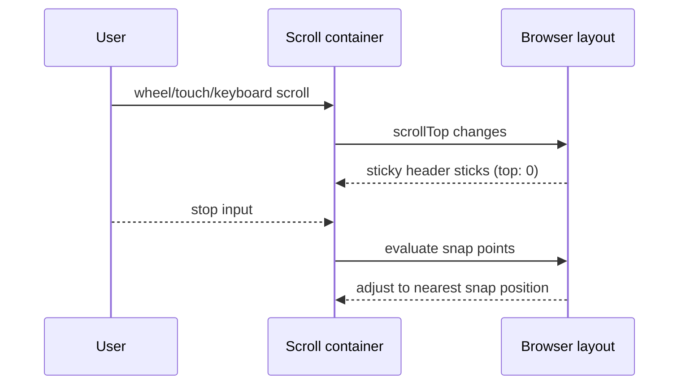

# 스크롤을 멈추면 정렬하라: sticky + scroll-snap으로 섹션 고정하기


**한 문장 결론:** `position: sticky`로 “붙는 제목”을 만들고, `scroll-snap-*`으로 “멈추는 위치”를 고정하면 스크롤 UI가 훨씬 예측 가능해진다.


스크롤 기반 UI는 사용자가 멈추는 지점이 애매하면 레이아웃이 흐트러진다.


특히 섹션이 길고 제목이 반복되는 화면에서는 “지금 어디를 보고 있는지”가 금방 흐려진다.


여기서 중요한 건 두 가지다.

- **제목은 스크롤 중에도 상단에 남게(sticky)**
- **스크롤이 멈추면 섹션 시작점에 딱 맞게(snap)**

---


## 배경/문제


아래 같은 화면을 만들고 싶을 때가 많다.

- 섹션을 스크롤로 넘기되, 각 섹션의 제목이 상단에 붙어 따라온다.
- 스크롤을 멈추면 애매한 위치가 아니라 “다음 섹션 시작점”으로 정렬된다.
- 추가 JS 없이 CSS만으로 구현하고 싶다.

`position: sticky`만 쓰면 “붙는 제목”은 만들 수 있지만, 스크롤 정지 지점이 들쑥날쑥해 UX가 흔들릴 수 있다.


이때 `scroll-snap-*`이 같이 들어오면 “멈추는 위치”까지 제어할 수 있다.


---


## 핵심 개념


### sticky는 “스크롤 컨테이너” 기준으로 붙는다


`position: sticky`는 요소가 스크롤되다가 특정 지점(`top` 등)에 도달하면 그 위치에 “붙는” 동작을 한다.


실무에서는 “어느 스크롤을 기준으로 붙는지”가 제일 중요하다. 규칙은 [MDN: position](https://developer.mozilla.org/en-US/docs/Web/CSS/position)을 기준으로 잡아두면 안전하다.


### scroll-snap은 “멈추는 지점”을 정렬한다


`scroll-snap-type`은 스크롤 컨테이너에 적용해 스냅 동작을 켠다. ([MDN: scroll-snap-type](https://developer.mozilla.org/en-US/docs/Web/CSS/scroll-snap-type))


`scroll-snap-align`은 각 섹션(스냅 대상)이 어디에 맞춰질지 정한다. ([MDN: scroll-snap-align](https://developer.mozilla.org/en-US/docs/Web/CSS/scroll-snap-align))


아래 다이어그램처럼, sticky는 “스크롤 중 제목 고정”, snap은 “정지 후 위치 보정” 역할로 분리하면 설계가 단순해진다.





→ 기대 결과/무엇이 달라졌는지: 스크롤 “진행 중”과 “정지 후” 동작이 분리돼, 어떤 속성이 어떤 역할인지 한 번에 정리된다.


---


## 해결 접근


### 조합의 핵심은 3줄이다

- 컨테이너: `scroll-snap-type`
- 섹션: `scroll-snap-align`
- 제목: `position: sticky`

원문에서 언급한 `scroll-snap-type: y mandatory`, `scroll-snap-align: start`, `position: sticky`가 바로 이 조합이다.


### 대안/비교(최소 2개)

1. `scroll-snap-type: mandatory` vs `proximity`
- `mandatory`: 멈출 때 항상 스냅 지점으로 정렬된다. “섹션 페이지” 느낌이 강하다.
- `proximity`: 스냅 지점 근처일 때만 정렬된다. 트랙패드/휠에서 덜 강압적이다.
공식 개념은 [MDN: scroll-snap-type](https://developer.mozilla.org/en-US/docs/Web/CSS/scroll-snap-type)과 [W3C: CSS Scroll Snap](https://www.w3.org/TR/css-scroll-snap-1/)을 참고하면 된다.
1. `position: sticky` vs `position: fixed`
- `sticky`: 섹션 흐름 안에서 자연스럽게 “붙었다가 밀려난다”.
- `fixed`: 뷰포트에 고정되므로 항상 떠 있지만, 내용 가림/오프셋 보정이 필수다.
기준은 [MDN: position](https://developer.mozilla.org/en-US/docs/Web/CSS/position).

---


## 구현(코드)


아래 예시는 Next.js에서 바로 재현 가능한 형태로 정리했다. 스타일링은 CSS Modules 방식으로 구성한다. ([Next.js Docs: Styling](https://nextjs.org/docs/app/building-your-application/styling))


### 예제: 섹션 스냅 + 섹션 제목 sticky


```javascript
// app/page.jsx
import styles from "./page.module.css";

const SECTIONS = [
  { id: "a", title: "Section A", body: "스크롤을 멈추면 섹션 시작점으로 정렬된다." },
  { id: "b", title: "Section B", body: "제목은 상단에 붙어 유지된다." },
  { id: "c", title: "Section C", body: "CSS만으로 페이지처럼 넘기는 감각을 만든다." },
];

export default function Page() {
  return (
    <main className={styles.page}>
      <h1 className={styles.pageTitle}>Sticky + Scroll Snap</h1>

      <div className={styles.snapContainer} aria-label="Snap scrolling sections">
        {SECTIONS.map((s) => (
          <article key={s.id} className={styles.section} aria-labelledby={`h-${s.id}`}>
            <header className={styles.sectionHeader}>
              <h2 id={`h-${s.id}`} className={styles.sectionTitle}>
                {s.title}
              </h2>
            </header>
            <div className={styles.sectionBody}>
              <p>{s.body}</p>
              <p>내용을 늘려도 제목은 상단에 붙는다.</p>
              <p>섹션은 스냅 기준으로 정렬된다.</p>
            </div>
          </article>
        ))}
      </div>
    </main>
  );
}
```


→ 기대 결과/무엇이 달라졌는지: 스크롤 컨테이너 안에서 섹션 단위로 “페이지 넘김”처럼 동작하고, 섹션 제목이 상단에 붙어 현재 섹션을 식별하기 쉬워진다.


```css
/* app/page.module.css */
.page {
  height: 100vh;
  display: grid;
  grid-template-rows: auto 1fr;
  gap: 12px;
  padding: 16px;
}

.pageTitle {
  margin: 0;
  font-size: 18px;
}

.snapContainer {
  height: 100%;
  overflow-y: auto;

  /* ✅ 스크롤 스냅: 컨테이너에서 활성화 */
  scroll-snap-type: y mandatory;

  /* ✅ 섹션 제목(sticky)이 가리는 걸 줄이기 위한 여유(선택) */
  scroll-padding-top: 56px;

  /* ✅ 중첩 스크롤에서 바깥 스크롤로 “튐”을 줄이는 옵션(선택) */
  overscroll-behavior: contain;
}

.section {
  /* ✅ 스냅 대상 */
  scroll-snap-align: start;

  min-height: 100%;
  border: 1px solid #ddd;
  border-radius: 12px;
  overflow: clip;
}

.sectionHeader {
  position: sticky;
  top: 0;

  padding: 14px 16px;
  background: white;
  border-bottom: 1px solid #eee;
}

.sectionTitle {
  margin: 0;
  font-size: 16px;
}

.sectionBody {
  padding: 16px;
  line-height: 1.6;
}
```


→ 기대 결과/무엇이 달라졌는지: 컨테이너는 스냅을 책임지고(`scroll-snap-type`), 섹션은 정렬 기준을 제공하며(`scroll-snap-align`), 섹션 헤더는 스크롤 중 상단에 고정된다(`position: sticky`).


---


## 검증 방법(체크리스트)

- [ ] 스크롤 컨테이너에 `overflow-y: auto|scroll`이 적용되어 있는가? (`sticky`, `scroll-snap` 모두 “컨테이너 스크롤”이 전제다)
- [ ] 컨테이너에 `scroll-snap-type`이 있고, 섹션에 `scroll-snap-align`이 있는가?
- [ ] sticky 요소에 `top`(또는 `inset-block-start`)이 지정되어 있는가?
- [ ] 휠/트랙패드/터치/키보드(PageDown/Space)로 스크롤했을 때도 의도대로 스냅되는가?
- [ ] 스냅이 너무 강압적이라면 `mandatory → proximity`로 바꿨을 때 UX가 개선되는가? ([MDN: scroll-snap-type](https://developer.mozilla.org/en-US/docs/Web/CSS/scroll-snap-type))

---


## 흔한 실수/FAQ


### Q1. `position: sticky`가 전혀 안 붙는다


A. `sticky`는 스크롤 컨테이너/레이아웃 조건에 영향을 받는다. 특히 `top`이 없으면 붙는 지점이 정의되지 않는다.


규칙 점검은 [MDN: position](https://developer.mozilla.org/en-US/docs/Web/CSS/position) 기준으로 하면 된다.


### Q2. 스냅이 안 된다


A. `scroll-snap-type`은 **컨테이너**, `scroll-snap-align`은 **자식(스냅 대상)** 에 있어야 한다.


개념 정리는 [MDN: Scroll snap guide](https://developer.mozilla.org/en-US/docs/Web/CSS/Guides/Scroll_snap)가 가장 빠르다.


### Q3. `mandatory`가 너무 “잡아당기는 느낌”이다


A. 트랙패드/휠 환경에서는 `proximity`가 더 자연스러운 경우가 있다.


강도 조절은 [MDN: scroll-snap-type](https://developer.mozilla.org/en-US/docs/Web/CSS/scroll-snap-type)과 [W3C: CSS Scroll Snap](https://www.w3.org/TR/css-scroll-snap-1/)을 참고해 선택한다.


### Q4. 중첩 스크롤에서 바깥 페이지까지 같이 스크롤된다


A. 스크롤 체이닝(scroll chaining)이 거슬리면 컨테이너에 `overscroll-behavior`를 검토할 수 있다.


설명은 [MDN: overscroll-behavior](https://developer.mozilla.org/en-US/docs/Web/CSS/overscroll-behavior).


---


## 요약(3~5줄)

- `sticky`는 “스크롤 중 제목 고정”, `scroll-snap`은 “정지 후 위치 정렬”을 담당한다.
- 컨테이너에 `scroll-snap-type`, 섹션에 `scroll-snap-align`, 제목에 `position: sticky`를 배치하면 조합이 깔끔해진다.
- 스냅 강도는 `mandatory`와 `proximity`로 조절한다.
- 중첩 스크롤에서는 `overscroll-behavior` 같은 옵션이 도움이 될 수 있다.

---


## 결론


스크롤 UI를 “페이지처럼” 만들고 싶다면, 먼저 제목을 `sticky`로 고정하고 정지 지점을 `scroll-snap`으로 고정하자.


이 조합은 JS 없이도 충분히 강력하고, 설계 포인트가 명확해 유지보수 비용이 낮다.


---


## 참고(공식 문서 링크)

- [Next.js Docs: Styling](https://nextjs.org/docs/app/building-your-application/styling)
- [MDN: position](https://developer.mozilla.org/en-US/docs/Web/CSS/position)
- [MDN: scroll-snap-type](https://developer.mozilla.org/en-US/docs/Web/CSS/scroll-snap-type)
- [MDN: scroll-snap-align](https://developer.mozilla.org/en-US/docs/Web/CSS/scroll-snap-align)
- [MDN: CSS Scroll Snap guide](https://developer.mozilla.org/en-US/docs/Web/CSS/Guides/Scroll_snap)
- [web.dev: CSS Scroll Snap](https://web.dev/articles/css-scroll-snap)
- [W3C: CSS Scroll Snap Module](https://www.w3.org/TR/css-scroll-snap-1/)
