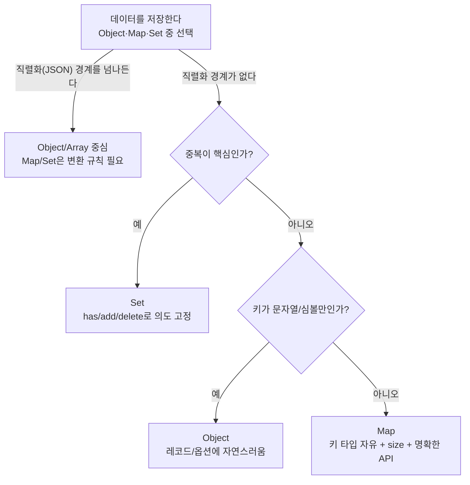

# 의도를 자료구조로 말하라: Object·Map·Set 선택 체크리스트


한 문장 결론: **직렬화(서버 전송/저장) 경계에는 Object/Array, 조회·캐시에는 Map, 선택·중복 제거에는 Set**이 가장 자연스럽게 들어맞습니다.


컬렉션 선택은 “돌아가냐/안 돌아가냐”보다 “코드가 의도를 드러내냐”에 더 가깝습니다.


React/Next.js에서는 API 응답을 가공해 빠르게 조회하거나, 중복 요청을 막거나, UI 선택 상태를 다루는 일이 자주 생깁니다. 이때 자료구조가 맞지 않으면 `find/includes/filter/Object.keys` 같은 조각이 곳곳에 퍼지면서 유지보수가 어려워집니다.


---


## 배경/문제


JavaScript는 Object와 Array만으로도 대부분 구현이 가능합니다.


그런데 “레코드(record)처럼 보이는 데이터”와 “사전(dictionary)처럼 동작해야 하는 데이터”를 같은 방식으로 다루기 시작하면 문제가 생깁니다.

- **키 타입 제약**(문자열/심볼만 가능한가?)
- **접근 패턴**(순회가 많은가? 조회/삭제가 많은가?)
- **직렬화 필요**(JSON으로 저장/전송해야 하는가?)
- **의도 표현**(이 데이터가 옵션인지, 인덱스/캐시인지, 선택 집합인지)

이 네 가지가 컬렉션 선택을 사실상 결정합니다.


---


## 핵심 개념


### Object·Map·Set이 “잘하는 일”은 다릅니다

- **Object**: 프로퍼티를 가진 “레코드/설정”에 강함. JSON과의 호환이 자연스럽습니다.
- **Map**: “키-값 저장소”라는 목적이 API로 드러남(`get/set/has/delete/size`). 인덱스/캐시에 강합니다.
- **Set**: “중복 없는 값의 집합”. 포함 여부가 핵심인 상태(선택/방문/처리됨)에 강합니다.

아래 다이어그램을 보면, 선택 기준이 한 번에 정리됩니다.





→ 기대 결과/무엇이 달라졌는지: “지금 요구사항이 어떤 형태인지”만 잡으면 컬렉션 선택이 취향 논쟁이 아니라 설계 결정으로 정리됩니다.


---


## 해결 접근


### 1) 먼저 “경계(직렬화)”를 본다


Next.js에서는 서버/클라이언트 사이를 오가거나, 저장소(localStorage 등)에 넣거나, 네트워크로 보내야 하는 순간이 많습니다.


이 경계를 지나야 한다면 **Object/Array가 기본 선택**이고, Map/Set을 쓰더라도 **경계에서 변환 규칙을 고정**하는 편이 안전합니다.

- Map → `Array.from(map.entries())` 또는 `Object.fromEntries(map)`
- Set → `[...set]`

### 2) 다음은 “핵심 연산”을 본다

- `id`로 **자주 조회**한다 → Map 인덱스가 코드가 짧고 의도가 분명해집니다.
- **포함 여부**가 로직의 중심이다(선택/방문/중복) → Set이 가장 자연스럽습니다.
- 폼 값/설정/레코드처럼 **구조 자체가 데이터**다 → Object가 가장 읽기 쉽습니다.

### 3) 대안/비교를 최소 2개는 놓고 결정한다

- (대안 A) **Array + find**: 단순하지만 조회가 반복되면 호출부가 금방 늘어납니다.
- (대안 B) **Object를 딕셔너리처럼 사용**: 문자열 키만 필요하고 직렬화가 중요하면 좋습니다. 다만 키 충돌/프로토타입 영향이 신경 쓰이면 `Object.create(null)` 또는 Map으로 전환합니다.
- (대안 C) **Set 대신 Array + includes/filter**: 가능한데 “포함 여부”가 커지면 의도가 흐려집니다.

---


## 구현(코드)


### 1) Object를 “사전”처럼 쓸 때: 프로토타입 영향 피하기


```javascript
const dict = { a: 1 };

// in은 프로토타입 체인까지 확인합니다.
console.log("toString" in dict); // true

// 내 프로퍼티인지 확인하려면 Object.hasOwn을 사용합니다.
console.log(Object.hasOwn(dict, "toString")); // false
console.log(Object.hasOwn(dict, "a"));        // true
```


기대 결과/무엇이 달라졌는지: `in`으로는 “내가 넣은 키인지” 보장되지 않습니다. `Object.hasOwn`으로 의도를 고정할 수 있습니다.


프로토타입이 없는 “순수 딕셔너리”가 필요하면:


```javascript
const safeDict = Object.create(null);
safeDict["toString"] = "ok";

console.log(safeDict.toString);       // undefined
console.log(safeDict["toString"]);    // "ok"
```


기대 결과/무엇이 달라졌는지: 키 충돌(예: `toString`) 걱정 없이 “문자열 키 사전”으로 쓸 수 있습니다.


참고: [MDN - Object.hasOwn()](https://developer.mozilla.org/en-US/docs/Web/JavaScript/Reference/Global_Objects/Object/hasOwn), [MDN - Object.create()](https://developer.mozilla.org/en-US/docs/Web/JavaScript/Reference/Global_Objects/Object/create)


---


### 2) Map: API 응답을 인덱스로 바꿔 “조회 의도”를 고정하기


```javascript
const posts = [
  { id: 101, title: "A" },
  { id: 102, title: "B" },
  { id: 103, title: "C" },
];

const postById = new Map(posts.map((p) => [p.id, p]));

console.log(postById.get(102)); // { id: 102, title: "B" }
console.log(postById.has(999)); // false
console.log(postById.size);     // 3
```


기대 결과/무엇이 달라졌는지: `find` 호출이 사라지고, 조회/존재 확인/크기 확인이 `get/has/size`로 통일됩니다.


참고: [MDN - Map](https://developer.mozilla.org/en-US/docs/Web/JavaScript/Reference/Global_Objects/Map)


---


### 3) Set: 선택 상태(토글)를 “집합”으로 표현하기 (React/Next.js)

> 포인트는 “불변성(immutability)”입니다. Set/Map은 내부가 변할 수 있으므로, **새 인스턴스로 교체**해야 React가 상태 변경을 안정적으로 추적합니다.
>
> 참고: [React - State 업데이트](https://react.dev/learn/updating-objects-in-state)
>
>

```typescript
'use client';

import { useCallback, useMemo, useState } from 'react';

type Post = { id: number; title: string };

export default function PostList({ posts }: { posts: Post[] }) {
  const [selected, setSelected] = useState<Set<number>>(() => new Set());

  const postById = useMemo(() => new Map(posts.map((p) => [p.id, p])), [posts]);

  const toggle = useCallback((id: number) => {
    setSelected((prev) => {
      const next = new Set(prev);
      if (next.has(id)) next.delete(id);
      else next.add(id);
      return next;
    });
  }, []);

  return (
    <div>
      <ul>
        {posts.map((p) => (
          <li key={p.id}>
            <label>
              <input
                type="checkbox"
                checked={selected.has(p.id)}
                onChange={() => toggle(p.id)}
              />
              {p.title}
            </label>
          </li>
        ))}
      </ul>

      <hr />

      <div>
        <strong>현재 선택:</strong> {[...selected].join(', ') || '없음'}
      </div>

      <div>
        <strong>빠른 조회 예시:</strong>{' '}
        {postById.get(posts[0]?.id ?? -1)?.title ?? 'N/A'}
      </div>
    </div>
  );
}
```


기대 결과/무엇이 달라졌는지: 선택 상태 토글이 `has/add/delete`로 고정되어 코드가 짧아지고, `id → 객체` 조회도 Map으로 명확해집니다.


참고: [MDN - Set](https://developer.mozilla.org/en-US/docs/Web/JavaScript/Reference/Global_Objects/Set), [Next.js - Client Components](https://nextjs.org/docs/app/building-your-application/rendering/client-components)


---


### 4) 직렬화 경계를 넘겨야 한다면: 변환 규칙을 고정하기


```javascript
const map = new Map([
  ["theme", "dark"],
  ["lang", "ko"],
]);

const set = new Set([1, 3, 5]);

const mapAsEntries = Array.from(map.entries());
const setAsArray = [...set];

console.log(JSON.stringify(mapAsEntries)); // [["theme","dark"],["lang","ko"]]
console.log(JSON.stringify(setAsArray));   // [1,3,5]

// 복원
const restoredMap = new Map(mapAsEntries);
const restoredSet = new Set(setAsArray);

console.log(restoredMap.get("lang")); // "ko"
console.log(restoredSet.has(3));      // true
```


기대 결과/무엇이 달라졌는지: 저장/전송은 배열/객체로 하고, 경계 안쪽에서는 Map/Set의 장점을 유지할 수 있습니다.


참고: [MDN - JSON.stringify](https://developer.mozilla.org/en-US/docs/Web/JavaScript/Reference/Global_Objects/JSON/stringify), [MDN - Array.from](https://developer.mozilla.org/en-US/docs/Web/JavaScript/Reference/Global_Objects/Array/from), [MDN - Object.fromEntries](https://developer.mozilla.org/en-US/docs/Web/JavaScript/Reference/Global_Objects/Object/fromEntries)


---


## 검증 방법(체크리스트)

- [ ] 이 데이터는 **JSON으로 저장/전송**해야 하나? → 그렇다면 Object/Array 중심 + 변환 규칙 고정
- [ ] 로직의 중심이 **포함 여부**인가? → Set
- [ ] 로직의 중심이 **키로 빠른 조회/삭제**인가? → Map
- [ ] 데이터가 “설정/레코드”처럼 **구조 자체가 의미**인가? → Object
- [ ] Object를 사전으로 쓰며 **외부 입력 키**를 받는가? → `Object.hasOwn` 사용 또는 `Object.create(null)`/Map 고려
- [ ] React state로 Map/Set을 들고 있나? → **새 인스턴스 생성 후 교체**(불변성 유지)

---


## 흔한 실수/FAQ


**Q1. Map/Set을 React state에 넣고** **`add/delete`****만 하면 되나?**


아니요. 같은 인스턴스를 수정하면 상태 변경을 안정적으로 감지하기 어렵습니다. `new Set(prev)` / `new Map(prev)`로 복사 후 교체하는 패턴이 안전합니다.


참고: [React - State 업데이트](https://react.dev/learn/updating-objects-in-state)


**Q2. Object로 딕셔너리를 만들면 충분하지 않나?**


문자열/심볼 키만 쓰고 직렬화가 중요하면 충분한 경우가 많습니다. 다만 외부 입력 키를 받거나 키 충돌이 걱정되면 `Object.create(null)` 또는 Map이 더 안전한 선택이 됩니다.


참고: [MDN - Object.create()](https://developer.mozilla.org/en-US/docs/Web/JavaScript/Reference/Global_Objects/Object/create)


**Q3. Map/Set은 JSON.stringify가 안 되나?**


그대로는 기대한 형태로 직렬화되지 않습니다. 경계에서는 `Array.from(map.entries())`, `[...set]` 같은 변환 규칙을 고정하는 편이 좋습니다.


참고: [MDN - JSON.stringify](https://developer.mozilla.org/en-US/docs/Web/JavaScript/Reference/Global_Objects/JSON/stringify)


**Q4. “순회가 편한 건 뭐지?”**


순회 중심이면 Array가 가장 단순합니다. 반대로 “id로 조회”가 반복되면 Map 인덱스를 곁들이는 쪽이 코드가 더 짧아집니다.


---


## 요약(3~5줄)

- Object는 레코드/설정처럼 “구조가 곧 의미”이고 JSON 경계를 넘나들 때 강합니다.
- Map은 키-값 저장소로서 조회/삭제/크기 확인이 명확해 인덱스·캐시에 잘 맞습니다.
- Set은 중복 없는 집합을 표현해 선택 상태/방문 여부/중복 제거 로직을 깔끔하게 만듭니다.
- Next.js처럼 경계가 많은 환경에서는 “직렬화 여부”를 먼저 보고, 필요하면 변환 규칙을 고정합니다.

---


## 결론


컬렉션 선택은 취향이 아니라 **요구사항(경계, 핵심 연산, 의도 표현)**의 문제입니다.


Object/Map/Set을 “대체재”로 보지 말고, 데이터가 어떤 성격인지부터 확정하면 코드가 더 읽히고 유지보수가 쉬워집니다.


---


## 참고(공식 문서 링크)

- [Next.js Docs](https://nextjs.org/docs)
- [Next.js - Client Components](https://nextjs.org/docs/app/building-your-application/rendering/client-components)
- [React Docs](https://react.dev/)
- [React - Updating Objects in State](https://react.dev/learn/updating-objects-in-state)
- [MDN - Object](https://developer.mozilla.org/en-US/docs/Web/JavaScript/Reference/Global_Objects/Object)
- [MDN - Object.hasOwn()](https://developer.mozilla.org/en-US/docs/Web/JavaScript/Reference/Global_Objects/Object/hasOwn)
- [MDN - Object.create()](https://developer.mozilla.org/en-US/docs/Web/JavaScript/Reference/Global_Objects/Object/create)
- [MDN - Map](https://developer.mozilla.org/en-US/docs/Web/JavaScript/Reference/Global_Objects/Map)
- [MDN - Set](https://developer.mozilla.org/en-US/docs/Web/JavaScript/Reference/Global_Objects/Set)
- [MDN - JSON.stringify](https://developer.mozilla.org/en-US/docs/Web/JavaScript/Reference/Global_Objects/JSON/stringify)
- [MDN - Object.fromEntries](https://developer.mozilla.org/en-US/docs/Web/JavaScript/Reference/Global_Objects/Object/fromEntries)
- [MDN - Array.from](https://developer.mozilla.org/en-US/docs/Web/JavaScript/Reference/Global_Objects/Array/from)
