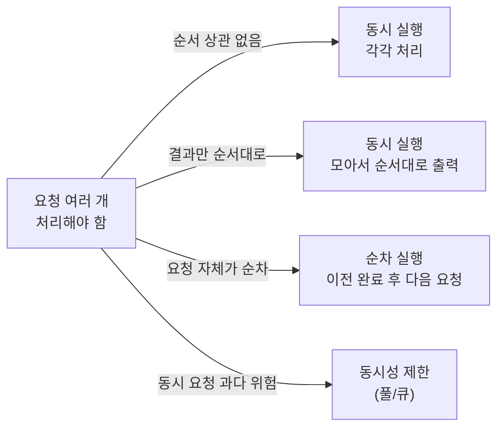

# 빠르게 보내되, 순서를 잃지 마라: Promise 병렬·순차 제어


여러 요청은 **“언제 시작할지(동시성)”**와 **“언제/어떻게 보여줄지(출력 순서)”**를 분리하면, 속도와 순서를 동시에 설계할 수 있다.


요청이 많아질수록 UX(화면 반응), 성능(대기 시간), 유지보수(실패 처리)가 서로 충돌한다.


포인트는 “무조건 빠르게”가 아니라, **요구사항(순서/동시성/실패 정책)에 맞는 실행 전략을 고르는 것**이다.


---


## 배경/문제


네트워크 요청을 여러 번 호출해야 하는 상황을 가정해보자.

- **요청은 동시에 보내도 된다** → 다만 결과가 섞여도 괜찮은지?
- **결과는 요청 순서대로 보여야 한다** → 전부 끝난 뒤에라도 순서대로 출력하면 되는지?
- **요청 자체를 1 → 2 → 3… 순서대로 보내야 한다** → 이전 요청이 끝나야 다음 요청을 보내야 하는지?

요구사항이 달라지면 정답도 달라진다.


---


## 핵심 개념





→ 기대 결과/무엇이 달라졌는지:


요구사항을 “출력 순서”와 “요청 순서”로 나눠서, 선택지를 빠르게 고를 수 있다.


### 1) 동시 실행 vs 순차 실행

- **동시 실행(병렬)**: 여러 요청을 한 번에 시작한다. 전체 완료 시간은 보통 짧다.
- **순차 실행(직렬)**: 하나가 끝나야 다음을 시작한다. 전체 시간은 길어질 수 있다.

### 2) 출력 순서(표시 순서)는 별도의 문제

- 동시 실행을 하더라도, **출력을 모아서 “입력 순서대로” 찍을 수 있다**.
- 이때 핵심은 `Promise.all()`이 **완료 순서가 아니라 “입력 배열 순서”대로 결과를 정렬해 준다**는 점이다.

---


## 해결 접근


요구사항을 아래 3가지로 분류하면 결정이 쉬워진다.

1. **그냥 동시 실행 + 끝나는 대로 출력**
2. **동시 실행 + 전부 끝난 뒤 요청 순서대로 출력**
3. **요청 자체를 순차로 실행 + 요청 순서대로 출력**

추가로, 실무에서는 **동시 요청이 너무 많아지는 걸 막기 위해 “동시성 제한”**까지 고려하는 경우가 많다.


---


## 구현(코드)


먼저 “요청 시간이 랜덤하게 걸리는 API”를 시뮬레이션한다.


```javascript
const callApi = (param) => {
  return new Promise((resolve) => {
    const delay = Math.floor(Math.random() * 10) * 1000
    setTimeout(() => resolve(param), delay)
  })
}
```


→ 기대 결과/무엇이 달라졌는지:


각 호출이 서로 다른 시점에 완료되므로, 출력 순서가 섞일 수 있는 조건을 재현한다.


### 1) 동시 실행 + 끝나는 대로 출력(순서 보장 없음)


```javascript
const paramList = [1, 2, 3, 4, 5]

for (const param of paramList) {
  callApi(param).then((res) => console.log(res))
}
```


→ 기대 결과/무엇이 달라졌는지:


요청은 거의 동시에 시작되지만, `console.log`는 **완료된 순서대로** 찍혀서 1~5가 보장되지 않는다.


---


### 2) 동시 실행 + 전부 완료 후 요청 순서대로 출력(`Promise.all`)


```javascript
async function process() {
  const paramList = [1, 2, 3, 4, 5]
  const promises = paramList.map((param) => callApi(param))

  const resList = await Promise.all(promises)
  resList.forEach((res) => console.log(res))
}

process()
```


→ 기대 결과/무엇이 달라졌는지:


요청은 동시 실행되면서도, 출력은 **1 → 2 → 3 → 4 → 5**로 정렬되어 나온다(입력 순서 유지).

> 대안/비교 1) 실패를 “모아서” 다루고 싶다면 Promise.allSettled()도 선택지다.

```javascript
async function processSafely() {
  const paramList = [1, 2, 3, 4, 5]
  const results = await Promise.allSettled(paramList.map(callApi))

  results.forEach((r, i) => {
    if (r.status === "fulfilled") console.log("ok", i + 1, r.value)
    else console.log("fail", i + 1, r.reason)
  })
}

processSafely()
```


→ 기대 결과/무엇이 달라졌는지:


중간에 하나가 실패해도 전체가 끊기지 않고, **각 요청의 성공/실패를 순서대로 처리**할 수 있다.


---


### 3) 요청 자체를 순차로 실행 + 요청 순서대로 출력(`await` in `for...of`)


```javascript
async function processSequential() {
  const paramList = [1, 2, 3, 4, 5]

  for (const param of paramList) {
    const res = await callApi(param)
    console.log(res)
  }
}

processSequential()
```


→ 기대 결과/무엇이 달라졌는지:


**1번이 끝나야 2번을 시작**하므로, 요청/출력 모두 1~5 순서가 보장된다(대신 전체 시간은 길어질 수 있다).


---


### Next.js에서 재현하기(클라이언트에서 버튼으로 실행)


Next.js에서는 렌더링 시점에 자동 실행되면 의도치 않게 반복될 수 있다.


그래서 **Client Component에서 버튼 클릭으로 실행**하는 예시가 가장 안전하다.


```javascript
"use client"

import { useState } from "react"

const callApi = (param) => {
  return new Promise((resolve) => {
    const delay = Math.floor(Math.random() * 10) * 1000
    setTimeout(() => resolve({ param, delay }), delay)
  })
}

export default function PromiseOrderDemoPage() {
  const [logs, setLogs] = useState([])

  const reset = () => setLogs([])
  const append = (line) => setLogs((prev) => [...prev, line])

  const runOutOfOrder = () => {
    reset()
    const paramList = [1, 2, 3, 4, 5]

    for (const param of paramList) {
      callApi(param).then(({ param, delay }) => {
        append(`done${param} (${delay}ms)`)
      })
    }
  }

  const runOrderedAfterAll = async () => {
    reset()
    const paramList = [1, 2, 3, 4, 5]

    const resList = await Promise.all(paramList.map(callApi))
    resList.forEach(({ param, delay }) => {
      append(`done${param} (${delay}ms)`)
    })
  }

  const runSequential = async () => {
    reset()
    const paramList = [1, 2, 3, 4, 5]

    for (const param of paramList) {
      const { param: p, delay } = await callApi(param)
      append(`done${p} (${delay}ms)`)
    }
  }

  return (
    <main style={{ padding: 16, display: "grid", gap: 12 }}>
      <h1 style={{ fontSize: 18, fontWeight: 700 }}>Promise 실행 전략 데모</h1>

      <div style={{ display: "flex", gap: 8, flexWrap: "wrap" }}>
        <button onClick={runOutOfOrder}>동시 실행(순서 섞임)</button>
        <button onClick={runOrderedAfterAll}>동시 실행 + 순서대로 출력</button>
        <button onClick={runSequential}>순차 실행</button>
      </div>

      <pre
        style={{
          padding: 12,
          background: "#111",
          color: "#eee",
          borderRadius: 8,
          minHeight: 120,
          overflowX: "auto",
        }}
      >
        {logs.join("\n")}
      </pre>
    </main>
  )
}
```


→ 기대 결과/무엇이 달라졌는지:


브라우저에서 버튼을 눌러 세 전략의 결과를 직접 비교할 수 있고, 서버/클라이언트 실행 위치 혼동을 피할 수 있다.


---


## 검증 방법(체크리스트)

- [ ] “요청 순서”가 요구사항인가, “출력 순서”가 요구사항인가?
- [ ] 출력이 순서대로여야 한다면, `Promise.all()`로 **입력 순서 유지**가 필요한가?
- [ ] 요청을 순차로 보내야 한다면, `for...of` + `await`로 **요청 자체가 직렬**인지 확인했는가?
- [ ] 실패가 한 건이라도 나면 전체를 중단해야 하는가? 아니면 **모아서 처리**해야 하는가(`allSettled`)?
- [ ] Next.js에서 실행 위치가 클라이언트인지 서버인지 명확한가(브라우저 API 사용 여부 포함)?

---


## 흔한 실수/FAQ


### Q1. “동시 실행 코드”인데 왜 출력 순서가 섞이나요?


Promise는 “미래의 값”을 들고 있고, 완료 시점이 제각각이라서 `then`이 실행되는 타이밍도 달라진다.


동시 실행은 **출력 순서를 보장하지 않는다**.


### Q2. `Promise.all()`은 왜 순서대로 나오나요?


`Promise.all([p1, p2, p3])`은 완료 순서가 아니라 **입력 배열의 인덱스** 기준으로 결과 배열을 만든다.


그래서 `p2`가 먼저 끝나도 결과는 `[res1, res2, res3]` 형태로 정렬된다.


### Q3. `Promise.all()`을 쓰면 “다 끝날 때까지” 아무 것도 못 보나요?


`Promise.all()`은 “모두 완료 후”를 전제로 한다.


중간 진행 상황을 보여주고 싶다면, 각 요청의 `then`에서 별도 로그를 남기거나, UI에 “진행 중” 상태를 업데이트하는 구조가 필요하다. (출력 순서가 중요하면 버퍼링이 필요할 수 있다.)


### Q4. 순차 실행이 너무 느린데, 대안이 있나요?

> 대안/비교 2) 동시성 제한(풀/큐)
>
> 요청은 어느 정도 병렬로 돌리되(예: 한 번에 N개), 과도한 동시 요청을 막는 방식이다.
>
>
> 환경(서버 제한/레이트 리밋/사용자 네트워크)에 따라 최적 값이 달라질 수 있다.
>
>

---


## 요약(3~5줄)

- 여러 요청 처리는 “동시성(언제 시작)”과 “출력 순서(언제/어떻게 표시)”를 분리해서 설계한다.
- 동시 실행 후 순서대로 출력하려면 `Promise.all()`이 기본 선택지다.
- 요청 자체를 순차로 보내야 하면 `for...of` + `await`로 직렬 실행을 만든다.
- 실패 정책이 중요하면 `Promise.allSettled()`로 결과를 모아서 처리한다.
- Next.js에서는 실행 위치(서버/클라이언트)를 명확히 하고, 버튼/이벤트 기반으로 재현하면 안전하다.

---


## 결론


“빠르다”는 건 실행 전략의 결과일 뿐, 목표가 아니다.


요구사항을 **요청 순서 / 출력 순서 / 실패 정책**으로 나눠서 판단하면, Promise 기반 비동기 제어가 단순해진다.


---


## 참고(공식 문서 링크)

- [Next.js Docs](https://nextjs.org/docs)
- [React Docs](https://react.dev/)
- [MDN Web Docs - Promise](https://developer.mozilla.org/docs/Web/JavaScript/Reference/Global_Objects/Promise)
- [MDN Web Docs - async function](https://developer.mozilla.org/docs/Web/JavaScript/Reference/Statements/async_function)
- [MDN Web Docs - Promise.all](https://developer.mozilla.org/docs/Web/JavaScript/Reference/Global_Objects/Promise/all)
- [MDN Web Docs - Promise.allSettled](https://developer.mozilla.org/docs/Web/JavaScript/Reference/Global_Objects/Promise/allSettled)
- [Mermaid Docs](https://mermaid.js.org/)
