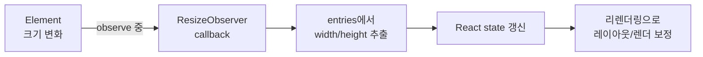
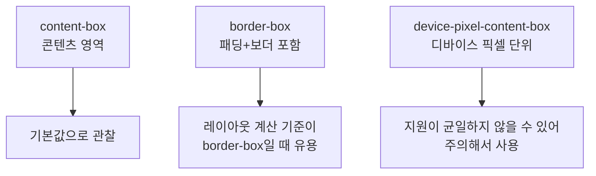

# **뷰포트 말고 “요소”에 반응하라:** **`ResizeObserver`****로 레이아웃 변화를 잡는 법**


**한 문장 결론:** `ResizeObserver`는 **요소(element)의 크기 변화**를 콜백으로 받을 수 있어서, “컴포넌트 단위 반응형”이 필요할 때 가장 빠르게 답이 된다. ([developer.mozilla.org](https://developer.mozilla.org/en-US/docs/Web/API/ResizeObserver))


미디어 쿼리만으로 해결이 어려운 순간이 있다.


예를 들어 “사이드바가 열리면 카드 폭이 줄어들고, 그에 맞춰 차트/가상 리스트/툴팁 배치가 바뀌어야 하는” 케이스다. 이건 뷰포트 기반이 아니라 **컨테이너(부모)의 실제 폭**에 따라 반응해야 한다.


그럴 때 `ResizeObserver`는 깔끔한 선택이다. “윈도우 크기”가 아니라 **관찰 대상 요소 자체의 크기 변화**를 알려준다. ([developer.mozilla.org](https://developer.mozilla.org/en-US/docs/Web/API/ResizeObserver))


---


## 배경/문제


### 이런 상황에서 막힌다

- 사이드바/필터 패널 토글로 **본문 영역 폭이 변함**
- 카드 그리드 열 수가 바뀌어 **차트/캔버스 렌더링이 깨짐**
- 텍스트 줄바꿈/폰트 로딩 등으로 **컴포넌트 높이가 변해** 스크롤 계산이 틀어짐

미디어 쿼리는 뷰포트 기반이라 “부모 박스 폭” 같은 **컴포넌트 컨텍스트 변화**를 직접 반영하기 어렵다. 이 간극을 메우는 게 `ResizeObserver`다. ([developer.mozilla.org](https://developer.mozilla.org/en-US/docs/Web/API/ResizeObserver))


---


## 핵심 개념


### 1) 관찰 흐름: “요소 크기 변화 → 콜백 → 상태 갱신”


`ResizeObserver`는 관찰 대상의 크기가 변할 때마다 엔트리(entries)를 전달한다. ([developer.mozilla.org](https://developer.mozilla.org/en-US/docs/Web/API/ResizeObserver))





→ 기대 결과/무엇이 달라졌는지: “언제/어떤 타이밍에” 크기를 읽고 UI를 보정해야 하는지 흐름이 고정된다.


---


### 2) 어떤 “박스(box)”를 기준으로 볼지 선택할 수 있다


`observe(target, { box })` 형태로 “어떤 박스를 관찰할지” 지정할 수 있다. 기본은 `content-box`이며 `border-box`, `device-pixel-content-box` 같은 옵션이 있다. ([developer.mozilla.org](https://developer.mozilla.org/en-US/docs/Web/API/ResizeObserver/observe))





→ 기대 결과/무엇이 달라졌는지: “내가 필요로 하는 크기 기준”을 먼저 정하고, 관찰 값을 일관되게 사용할 수 있다.

> `device-pixel-content-box` 관련 값은 브라우저 지원이 균일하지 않을 수 있다. ([developer.mozilla.org](https://developer.mozilla.org/en-US/docs/Web/API/ResizeObserverEntry/devicePixelContentBoxSize?utm_source=chatgpt.com))

---


## 해결 접근


### 접근 A) CSS로 끝낼 수 있으면 먼저 CSS로 끝낸다


컴포넌트가 “크기에 따라 **스타일만** 바뀌면 되는” 케이스라면, JS 관찰 없이 **컨테이너 쿼리(Container Queries)**가 더 단순하다. ([developer.mozilla.org](https://developer.mozilla.org/en-US/docs/Web/CSS/Guides/Containment/Container_queries?utm_source=chatgpt.com))

- 장점: 렌더 사이클/상태 관리 없이 선언적으로 해결
- 단점: “JS 계산(캔버스 재렌더, 가상화 높이 계산 등)”이 필요하면 한계

### 접근 B) JS 계산이 필요하면 `ResizeObserver`로 “진짜 크기”를 읽는다


차트 리사이즈, 가상 리스트, 드롭다운/툴팁 정렬처럼 **실제 픽셀 값**이 필요한 경우엔 `ResizeObserver`가 자연스럽다. ([developer.mozilla.org](https://developer.mozilla.org/en-US/docs/Web/API/ResizeObserver))


대안 비교(최소 2개)
- `window.resize` 이벤트: **요소가 아니라 뷰포트**만 알 수 있음
- 폴링(polling) / 반복 측정: 구현은 가능하지만 비용이 커지기 쉬움
- 컨테이너 쿼리: 스타일 중심이면 최우선 후보 ([developer.mozilla.org](https://developer.mozilla.org/en-US/docs/Web/CSS/Guides/Containment/Container_queries?utm_source=chatgpt.com))


---


## 구현(코드)


### 예제 1) Next.js에서 `useResizeObserver` 훅 만들기


브라우저 API를 쓰므로 **Client Component**에서만 동작하도록 경계를 명확히 잡는다. ([nextjs.org](https://nextjs.org/docs/app/api-reference/directives/use-client?utm_source=chatgpt.com))


**`app/components/useResizeObserver.ts`**


```typescript
"use client";

import { useEffect, useRef, useState } from "react";

type Size = { width: number; height: number };

export function useResizeObserver<T extends Element>() {
  const ref = useRef<T | null>(null);
  const [size, setSize] = useState<Size>({ width: 0, height: 0 });

  useEffect(() => {
    const el = ref.current;
    if (!el) return;

    let rafId: number | null = null;

    const ro = new ResizeObserver((entries) => {
      const entry = entries[0];
      if (!entry) return;

      // contentRect는 널리 쓰이는 호환 경로다.
      const next = {
        width: Math.round(entry.contentRect.width),
        height: Math.round(entry.contentRect.height),
      };

      // ResizeObserver 콜백에서 즉시 setState를 연쇄로 호출하면 루프가 생길 수 있어
      // rAF로 한 프레임 뒤로 미루고, 값이 바뀐 경우에만 갱신한다.
      if (rafId != null) cancelAnimationFrame(rafId);
      rafId = requestAnimationFrame(() => {
        setSize((prev) =>
          prev.width === next.width && prev.height === next.height ? prev : next
        );
      });
    });

    ro.observe(el); // 기본: content-box

    return () => {
      if (rafId != null) cancelAnimationFrame(rafId);
      ro.disconnect();
    };
  }, []);

  return { ref, size };
}
```


→ 기대 결과/무엇이 달라졌는지: 특정 요소의 실제 `width/height`가 바뀔 때만 상태가 갱신되고, 컴포넌트는 그 값을 기반으로 안전하게 리렌더링할 수 있다.

> `useEffect`는 외부 시스템(브라우저 API 등)과 동기화할 때 쓰는 훅이다. ([react.dev](https://react.dev/reference/react/useEffect?utm_source=chatgpt.com))

---


### 예제 2) 관찰한 크기로 UI를 바꾸기


**`app/resize-demo/page.tsx`**


```typescript
import { useResizeObserver } from "../components/useResizeObserver";

export default function ResizeDemoPage() {
  return (
    <main style={{ padding: 24 }}>
      <CardPreview />
    </main>
  );
}

function CardPreview() {
  const { ref, size } = useResizeObserver<HTMLDivElement>();

  const isNarrow = size.width > 0 && size.width < 420;

  return (
    <div
      ref={ref}
      style={{
        border: "1px solid #e5e7eb",
        borderRadius: 12,
        padding: 16,
        maxWidth: 720,
      }}
    >
      <div style={{ fontSize: 12, opacity: 0.7, marginBottom: 12 }}>
        measured: {size.width} × {size.height}
      </div>

      <div style={{ display: "flex", gap: 12, flexDirection: isNarrow ? "column" : "row" }}>
        <div style={{ flex: 1, padding: 12, border: "1px solid #eee", borderRadius: 10 }}>
          Left
        </div>
        <div style={{ flex: 2, padding: 12, border: "1px solid #eee", borderRadius: 10 }}>
          Right
        </div>
      </div>
    </div>
  );
}
```


→ 기대 결과/무엇이 달라졌는지: 카드 컨테이너 폭이 줄어들면(예: 사이드바 열림) 레이아웃이 즉시 재배치되고, “요소 기반 반응형”이 된다.


---


### (옵션) 관찰 박스(box) 지정하기


레이아웃이 `border-box` 기준으로 계산되는 상황이라면 관찰 옵션을 명시할 수 있다. ([developer.mozilla.org](https://developer.mozilla.org/en-US/docs/Web/API/ResizeObserver/observe))


```typescript
ro.observe(el, { box: "border-box" });
```


→ 기대 결과/무엇이 달라졌는지: 패딩/보더까지 포함한 크기 변화를 기준으로 계산 로직을 맞출 수 있다.


---


## 검증 방법(체크리스트)

- [ ] 관찰 대상이 **Client Component**에서만 생성/관찰되는가 (`"use client"`) ([nextjs.org](https://nextjs.org/docs/app/api-reference/directives/use-client?utm_source=chatgpt.com))
- [ ] cleanup에서 `disconnect()` 또는 `unobserve()`가 호출되는가 ([developer.mozilla.org](https://developer.mozilla.org/en-US/docs/Web/API/ResizeObserver))
- [ ] 콜백에서 관찰 대상의 크기를 직접 바꾸는 코드를 넣지 않았는가(루프 유발 가능) ([developer.mozilla.org](https://developer.mozilla.org/en-US/docs/Web/API/ResizeObserver))
- [ ] 상태 갱신은 “값이 바뀐 경우에만” 일어나도록 가드가 있는가
- [ ] 스타일만 바꾸면 되는 케이스는 컨테이너 쿼리로 대체 가능한가 ([developer.mozilla.org](https://developer.mozilla.org/en-US/docs/Web/CSS/Guides/Containment/Container_queries?utm_source=chatgpt.com))

---


## 흔한 실수/FAQ


### Q1. “`ResizeObserver loop…` 류의 경고/에러가 떠요”


관찰 → 콜백 → 레이아웃 재평가 과정에서 **연쇄적으로 다시 리사이즈가 발생**하면, 브라우저가 루프를 제한하려고 경고를 낼 수 있다. ([developer.mozilla.org](https://developer.mozilla.org/en-US/docs/Web/API/ResizeObserver))


해결 포인트는 아래 중 하나다.

- 콜백에서 상태 갱신을 `requestAnimationFrame`으로 미루기(예제처럼)
- 값이 안 바뀌면 `setState` 하지 않기
- 관찰 대상의 크기를 콜백에서 직접 변경하지 않기

→ 기대 결과/무엇이 달라졌는지: “관찰-갱신-관찰”의 순환이 끊기고, 불필요한 리렌더/레이아웃 재계산이 줄어든다.


### Q2. `transform: scale()`로 커졌는데 감지가 안 되는 것 같아요


`device-pixel-content-box` 설명처럼 관찰 값은 “CSS 변형(transform) 적용 전 기준”으로 정의되는 부분이 있어, 기대한 값과 다르게 느껴질 수 있다. ([developer.mozilla.org](https://developer.mozilla.org/en-US/docs/Web/API/ResizeObserver/observe))


레이아웃(박스 모델) 기준 크기가 필요하면 `contentRect`/`content-box` 관점으로 로직을 잡는 편이 안전하다.


### Q3. 무조건 `ResizeObserver`를 써야 하나요?


아니다. “스타일만” 반응하면 컨테이너 쿼리가 더 단순하다. ([developer.mozilla.org](https://developer.mozilla.org/en-US/docs/Web/CSS/Guides/Containment/Container_queries?utm_source=chatgpt.com))


반대로 차트/캔버스/가상화처럼 JS 계산이 필요하면 `ResizeObserver`가 가장 직관적이다. ([developer.mozilla.org](https://developer.mozilla.org/en-US/docs/Web/API/ResizeObserver))


---


## 요약(3~5줄)

- `ResizeObserver`는 요소의 크기 변화를 감지해 콜백으로 받을 수 있다. ([developer.mozilla.org](https://developer.mozilla.org/en-US/docs/Web/API/ResizeObserver))
- 뷰포트 기준 반응형이 아니라 “컴포넌트 기준 반응형”이 필요할 때 특히 유용하다.
- 스타일만 바꾸면 컨테이너 쿼리, JS 계산이 필요하면 `ResizeObserver`가 깔끔하다. ([developer.mozilla.org](https://developer.mozilla.org/en-US/docs/Web/CSS/Guides/Containment/Container_queries?utm_source=chatgpt.com))
- 루프/과도한 업데이트는 rAF + 값 변경 가드로 줄일 수 있다. ([developer.mozilla.org](https://developer.mozilla.org/en-US/docs/Web/API/ResizeObserver))

---


## 결론


요소 크기 변화는 생각보다 다양한 이유로 발생한다(레이아웃 토글, 콘텐츠 변화, 폰트 로딩 등).


그 변화를 “뷰포트”가 아니라 “요소” 기준으로 다뤄야 하는 순간엔 `ResizeObserver`가 가장 짧은 경로다. ([developer.mozilla.org](https://developer.mozilla.org/en-US/docs/Web/API/ResizeObserver))


단, 스타일만 반응하면 컨테이너 쿼리로 더 단순하게 끝낼 수 있으니, 목적에 맞춰 선택하는 게 핵심이다. ([developer.mozilla.org](https://developer.mozilla.org/en-US/docs/Web/CSS/Guides/Containment/Container_queries?utm_source=chatgpt.com))


---


## 참고(공식 문서 링크)

- [Next.js Docs - use client](https://nextjs.org/docs/app/api-reference/directives/use-client) ([nextjs.org](https://nextjs.org/docs/app/api-reference/directives/use-client?utm_source=chatgpt.com))
- [Next.js Docs - Server and Client Components](https://nextjs.org/docs/app/getting-started/server-and-client-components) ([nextjs.org](https://nextjs.org/docs/app/getting-started/server-and-client-components?utm_source=chatgpt.com))
- [React Docs - useEffect](https://react.dev/reference/react/useEffect) ([react.dev](https://react.dev/reference/react/useEffect?utm_source=chatgpt.com))
- [MDN - ResizeObserver](https://developer.mozilla.org/en-US/docs/Web/API/ResizeObserver) ([developer.mozilla.org](https://developer.mozilla.org/en-US/docs/Web/API/ResizeObserver))
- [MDN - ResizeObserver.observe](https://developer.mozilla.org/en-US/docs/Web/API/ResizeObserver/observe) ([developer.mozilla.org](https://developer.mozilla.org/en-US/docs/Web/API/ResizeObserver/observe))
- [W3C - Resize Observer](https://www.w3.org/TR/resize-observer/) ([w3.org](https://www.w3.org/TR/resize-observer/?utm_source=chatgpt.com))
- [MDN - CSS Container Queries](https://developer.mozilla.org/en-US/docs/Web/CSS/Guides/Containment/Container_queries) ([developer.mozilla.org](https://developer.mozilla.org/en-US/docs/Web/CSS/Guides/Containment/Container_queries?utm_source=chatgpt.com))
- [web.dev - Container queries](https://web.dev/learn/css/container-queries) ([web.dev](https://web.dev/learn/css/container-queries?utm_source=chatgpt.com))
