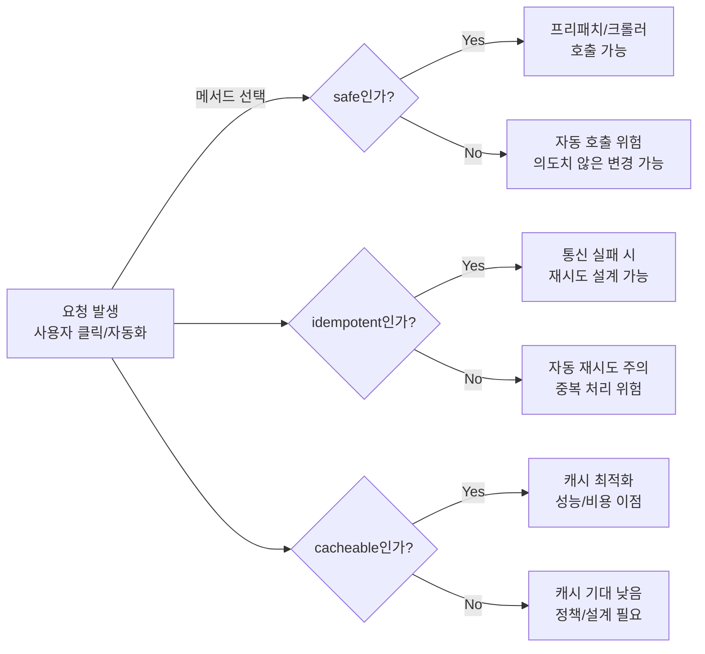

# 재시도 가능한 요청만 보내라: Safe·Idempotent로 고르는 HTTP 메서드


**한 문장 결론:** `safe(안전)`와 `idempotent(멱등)`만 제대로 지켜도 **재시도·캐시·프리패치**에서 터지는 사고의 대부분이 줄어든다.


웹 앱은 생각보다 “자동으로” 요청을 보냅니다. 브라우저·프록시·CDN·크롤러는 물론이고, Next.js에서도 `<Link />` 프리패치처럼 **사용자 클릭 이전에** 요청이 발생할 수 있어요. 이때 메서드 선택이 느슨하면, “그냥 조회였는데 로그아웃이 됨”, “네트워크 끊겨서 재시도했더니 중복 생성됨” 같은 문제가 현실이 됩니다.


포인트는 간단합니다.

- **safe(안전)**: 자동화가 마음 놓고 호출해도 “의도된 상태 변경”이 없는 읽기 성격
- **idempotent(멱등)**: 같은 요청을 여러 번 보내도 “의도된 효과”가 한 번과 같은 성격
- **cacheable(캐시 가능)**: 캐시가 저장/재사용해도 되는 성격(환경/정책에 따라 달라질 수 있음)

아래는 이 세 가지를 기준으로 **GET/POST/PUT/PATCH/DELETE**를 실무에서 어떻게 고르는지 정리합니다.


---


## 배경/문제


### 왜 “메서드 의미(semantics)”가 실무에서 중요한가

1. **재시도(retry)**

    네트워크는 끊깁니다. 클라이언트/프록시가 재시도를 고려할 때, **멱등성**은 “한 번 더 보내도 괜찮다”의 근거가 됩니다.

2. **프리패치(prefetch)·크롤러·링크 미리보기**

    Next.js의 `<Link />` 프리패치나 크롤러는 링크를 “미리” 따라갑니다. 이때 **안전(safe)** 하지 않은 동작이 GET에 숨어 있으면, 클릭하지 않았는데도 상태가 바뀔 수 있어요.

3. **캐시(cache)**

    캐시는 대부분 **GET/HEAD 중심**으로 설계됩니다. “조회인데 POST를 썼더니 캐시가 안 먹음” 같은 문제는 메서드 의미를 거슬렀을 때 자주 나옵니다.


---


## 핵심 개념


### 1) safe(안전): “읽기 전용”에 가까운 의미


safe는 “부작용이 0”이 아니라, **클라이언트가 상태 변경을 요청/기대하지 않는다**는 의미가 핵심입니다. 서버 로깅 같은 부수 효과는 있을 수 있어요.


→ 참고: [HTTP Semantics (IETF)](https://datatracker.ietf.org/doc/html/rfc9110), [MDN: Safe (HTTP Methods)](https://developer.mozilla.org/en-US/docs/Glossary/Safe/HTTP)


### 2) idempotent(멱등): “의도된 효과”가 한 번과 같음


멱등은 “응답이 항상 같다”가 아닙니다. 같은 요청을 반복해도 **의도된 효과가 동일**하면 멱등이고, 상황에 따라 상태코드/응답은 달라질 수 있어요.


→ 참고: [MDN: Idempotent](https://developer.mozilla.org/en-US/docs/Glossary/Idempotent)


### 3) cacheable(캐시 가능): “캐시가 재사용해도 되는가”


명세는 캐싱 의미를 정의하지만, 실제 동작은 **캐시 구현/정책**(브라우저/프록시/CDN/프레임워크)에 따라 달라집니다. 다만 실무에서 캐시는 대체로 **GET/HEAD 위주**로 동작하는 편입니다.


→ 참고: [HTTP Semantics (IETF)](https://datatracker.ietf.org/doc/html/rfc9110)


---


### 구조로 먼저 보기: 자동화(프리패치/재시도/캐시)와 메서드의 관계





→ 기대 결과/무엇이 달라졌는지: “왜 GET에 상태 변경을 숨기면 안 되는지”, “왜 POST 자동 재시도가 위험한지”가 한 번에 연결됩니다.


---


## 해결 접근


## 메서드별 safe / idempotent 한눈에 보기


| Method | Safe | Idempotent | 실무 감각                            |
| ------ | ---- | ---------- | -------------------------------- |
| GET    | ✅    | ✅          | 조회(읽기)                           |
| PUT    | ❌    | ✅          | **같은 리소스를 특정 상태로 “맞춤”**(덮어쓰기/생성) |
| DELETE | ❌    | ✅          | 삭제(의도된 효과 기준)                    |
| POST   | ❌    | 보장 ❌       | 생성/처리/작업(반복 시 중복 위험이 커지기 쉬움)     |
| PATCH  | ❌    | 보장 ❌       | 부분 수정(설계로 멱등처럼 만들 수는 있음)         |


---


### 선택 규칙(실무용)

- **조회(읽기)** → `GET`

    캐시·링크 공유·프리패치 같은 “웹 최적화 레일”을 그대로 탑니다.

- **동일 URI 리소스를 “이 상태로 맞춰라”** → `PUT`

    멱등이기 때문에 재시도 설계가 상대적으로 수월합니다.

- **삭제** → `DELETE`

    반복 호출되어도 “삭제 상태로 만든다”는 의도는 동일하게 유지됩니다(응답은 달라질 수 있음).

- **서버에서 작업을 수행/새 리소스를 생성** → `POST`

    기본적으로 비멱등으로 보고, 중복 처리/재시도 정책을 별도로 고민합니다.

- **부분 수정** → `PATCH`

    “무엇을 얼마나 바꿀지” 표현 방식에 따라 멱등이 될 수도/아닐 수도 있습니다.


---


### 대안/비교 (자주 헷갈리는 지점 2개)


### 비교 1) “복잡한 조회 조건”을 GET으로 보낼까, POST로 보낼까?

- ✅ **추천(기본): GET + Query String**
    - 장점: 캐시/공유/프리패치/관측(로그)까지 자연스럽게 맞물림
    - 단점: 조건이 너무 크거나 민감한 경우 설계가 까다로움
- ✅ **대안: POST** **`/search`**
    - 장점: 큰 조건/복잡한 필터를 body로 전달 가능
    - 단점: 기본적으로 비멱등·캐시 기대가 낮아짐(정책/키 설계 필요)
> 참고로, GET 요청의 body는 “일반적으로 정의된 의미가 없다”는 점이 명세에서 강조됩니다.
>
> → 참고: [HTTP Semantics (IETF)](https://datatracker.ietf.org/doc/html/rfc9110)
>
>

### 비교 2) PUT vs PATCH: “교체(replace)”냐 “부분 수정(partial)”이냐

- `PUT`: 전체를 “이 상태로 맞춘다” (멱등)
- `PATCH`: 일부만 바꾼다 (기본 보장은 비멱등)

예를 들어 **수량을 +1 하는 PATCH**는 반복 호출 시 결과가 누적되기 쉬워서 멱등과 거리가 멉니다. 반대로 **수량을 3으로 설정**하는 형태는 멱등에 가깝게 설계할 수 있어요.


---


## 구현(코드)


아래 예시는 Next.js의 Route Handler로 메서드 의미를 “코드 레벨에서” 고정하는 방식입니다.


→ 참고: [Next.js route.js](https://nextjs.org/docs/app/api-reference/file-conventions/route), [Next.js Route Handlers](https://nextjs.org/docs/app/getting-started/route-handlers)


### 1) 조회는 GET: 프리패치/캐시 친화적으로 열어두기


```javascript
// app/api/products/route.js
export async function GET(request) {
  const { searchParams } = new URL(request.url)
  const q = searchParams.get('q') ?? ''

  // 조회 로직 (DB/외부 API 등)
  const data = await fetch(`https://example.com/products?q=${encodeURIComponent(q)}`).then(r => r.json())

  return Response.json({ data })
}
```


→ 기대 결과/무엇이 달라졌는지: 조회 요청이 GET으로 고정되어 캐시/링크 공유/프리패치 같은 “기본 최적화”가 자연스럽게 적용됩니다(환경/정책에 따라 범위는 달라질 수 있음).


---


### 2) 같은 리소스를 “이 상태로”: PUT으로 멱등 설계하기


```javascript
// app/api/cart/items/[id]/route.js
export async function PUT(request, { params }) {
  const { id } = params
  const body = await request.json() // { quantity: number }

  // 예: 카트 아이템의 최종 수량을 "설정"
  await setCartItemQuantity({ id, quantity: body.quantity })

  return Response.json({ ok: true })
}
```


→ 기대 결과/무엇이 달라졌는지: 네트워크 오류로 같은 요청이 여러 번 들어와도 “최종 수량을 설정한다”는 의도는 동일하게 유지됩니다.


---


### 3) 작업/생성은 POST: 중복 가능성을 먼저 경계하기


```javascript
// app/api/orders/route.js
export async function POST(request) {
  const body = await request.json() // { items: [...] }

  // 예: 주문 생성(반복 호출 시 중복 생성 위험이 생기기 쉬움)
  const order = await createOrder(body)

  return Response.json({ orderId: order.id }, { status: 201 })
}
```


→ 기대 결과/무엇이 달라졌는지: “생성/처리” 성격을 POST로 분리해 자동 재시도/프리패치가 함부로 건드리지 않도록 경계를 세웁니다.


---


### 4) 프리패치로 호출될 수 있는 링크는 “safe”만 걸기


Next.js의 `<Link />`는 라우트를 프리패치할 수 있습니다. 따라서 **GET으로 상태가 바뀌는 엔드포인트**(예: `/logout`)를 링크로 걸면, 의도치 않은 호출이 발생할 수 있어요.


→ 참고: [Next.js Link](https://nextjs.org/docs/app/api-reference/components/link), [Next.js Prefetching Guide](https://nextjs.org/docs/app/guides/prefetching)


```javascript
import Link from 'next/link'

export function Nav() {
  return (
    <nav>
      <Link href="/pricing">Pricing</Link>

      {/* 상태 변경 가능성이 있는 링크는 프리패치 비활성화도 고려 */}
      <Link href="/logout" prefetch={false}>Logout</Link>
    </nav>
  )
}
```


→ 기대 결과/무엇이 달라졌는지: 사용자 의도와 무관한 “미리 로드”가 상태 변경으로 이어지는 가능성을 낮춥니다. (근본적으로는 “상태 변경은 POST/PUT/PATCH/DELETE 뒤로” 숨기는 게 핵심입니다.)


---


## 검증 방법(체크리스트)

- [ ] `GET/HEAD` 호출로 **비즈니스 상태**(로그인/결제/삭제/구독 등)가 바뀌지 않는다.
- [ ] `PUT/DELETE`는 **같은 요청을 반복해도** 의도된 결과가 동일하다(데이터 최종 상태 기준).
- [ ] `POST`는 **중복 호출**이 들어올 수 있음을 가정하고(클라이언트 재전송/사용자 더블클릭 등) 중복 처리 전략이 있다.
- [ ] `<Link />` 프리패치, 크롤러, 링크 미리보기로 호출되어도 문제가 없는 엔드포인트만 GET으로 공개한다.
- [ ] “복잡한 조회 조건”이 필요하면 `GET + query`를 우선 고려하고, 정말 필요할 때만 `POST /search` 같은 대안을 쓴다.
- [ ] 캐시(브라우저/프록시/CDN/프레임워크)의 적용 범위를 문서/설정으로 확인하고 기대치를 조정한다.

---


## 흔한 실수/FAQ


### Q1. “GET이면 서버에서 아무 변화도 일어나면 안 되나요?”


A. “클라이언트가 상태 변경을 요청/기대하지 않는다”가 핵심입니다. 로깅 같은 부수 효과는 있을 수 있지만, **비즈니스 상태 변경**은 GET에 두지 않는 쪽이 안전합니다.


→ 참고: [HTTP Semantics (IETF)](https://datatracker.ietf.org/doc/html/rfc9110), [MDN: Safe (HTTP Methods)](https://developer.mozilla.org/en-US/docs/Glossary/Safe/HTTP)


### Q2. “멱등이면 응답도 항상 같아야 하나요?”


A. 아닙니다. “의도된 효과”가 같으면 멱등이고, 응답 상태코드/본문은 달라질 수 있어요.


→ 참고: [MDN: Idempotent](https://developer.mozilla.org/en-US/docs/Glossary/Idempotent)


### Q3. “조회 조건이 길어서 GET body로 보내면 안 되나요?”


A. GET body는 일반적으로 정의된 의미가 없고, 구현체에 따라 거부될 수도 있습니다. 조회라면 먼저 **query string**을 검토하고, 정말 필요할 때 **POST** **`/search`** 같은 대안을 선택합니다.


→ 참고: [HTTP Semantics (IETF)](https://datatracker.ietf.org/doc/html/rfc9110)


### Q4. “PATCH는 무조건 비멱등인가요?”


A. 기본 보장은 없지만, 설계에 따라 멱등에 가깝게 만들 수 있습니다. 예: “+1”은 위험, “최종 값을 3으로 설정”은 상대적으로 안전.


### Q5. “DELETE를 여러 번 보내면 404가 뜨는데, 멱등이 아닌 거 아닌가요?”


A. 멱등은 **응답 동일성**이 아니라 **의도된 효과**(삭제 상태 유지)에 대한 성질입니다.


### Q6. “TRACE는 써도 되나요?”


A. 진단 목적 메서드지만, 보안 정책에 따라 서버에서 비활성화되는 경우가 있습니다. 사용 여부는 운영 정책에 맞춰 결정하는 편이 안전합니다.


→ 참고: [MDN: TRACE](https://developer.mozilla.org/en-US/docs/Web/HTTP/Reference/Methods/TRACE)


---


## 요약(3~5줄)

- `safe(안전)`은 자동화가 호출해도 “의도된 상태 변경”이 없다는 약속에 가깝습니다.
- `idempotent(멱등)`는 재시도/중복 호출 상황에서 시스템을 안정적으로 만듭니다.
- 조회는 `GET`, 최종 상태를 맞추는 갱신은 `PUT`, 삭제는 `DELETE`, 생성/작업은 `POST`, 부분 수정은 `PATCH`가 기본 축입니다.
- Next.js의 프리패치 같은 자동 요청을 고려하면 “GET에 상태 변경 숨기기”는 특히 위험합니다.

---


## 결론


HTTP 메서드는 “취향”이 아니라 **자동화(재시도·캐시·프리패치)가 안전하게 움직이기 위한 계약**입니다.


조회는 GET로 열고, 상태 변경은 POST/PUT/PATCH/DELETE 뒤로 밀어두고, 갱신/삭제는 멱등하게 설계하세요. 그 순간부터 장애 대응(재시도)도, 성능(캐시)도, UX(프리패치)도 같이 정리됩니다.


---


## 참고(공식 문서 링크)

- [HTTP Semantics (IETF)](https://datatracker.ietf.org/doc/html/rfc9110)
- [MDN: HTTP request methods](https://developer.mozilla.org/en-US/docs/Web/HTTP/Reference/Methods)
- [MDN: Safe (HTTP Methods)](https://developer.mozilla.org/en-US/docs/Glossary/Safe/HTTP)
- [MDN: Idempotent](https://developer.mozilla.org/en-US/docs/Glossary/Idempotent)
- [Next.js Link](https://nextjs.org/docs/app/api-reference/components/link)
- [Next.js Prefetching Guide](https://nextjs.org/docs/app/guides/prefetching)
- [Next.js route.js](https://nextjs.org/docs/app/api-reference/file-conventions/route)
- [Next.js Route Handlers](https://nextjs.org/docs/app/getting-started/route-handlers)
- [Next.js fetch](https://nextjs.org/docs/app/api-reference/functions/fetch)
- [Next.js Caching Guide](https://nextjs.org/docs/app/guides/caching)
