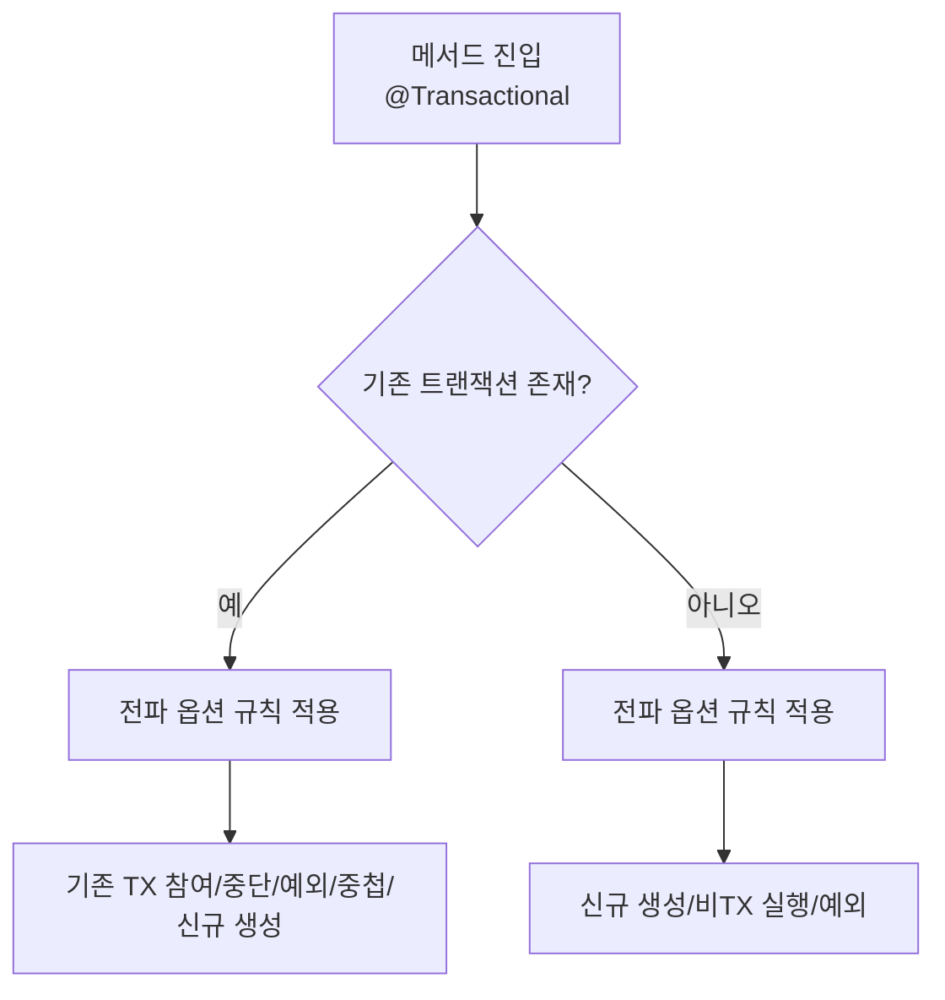

# 트랜잭션 경계를 설계하라: 스프링 전파(Propagation) 옵션을 안전하게 쓰는 법


트랜잭션 전파(Transaction Propagation)는 **이미 트랜잭션이 진행 중일 때(또는 없을 때)** `@Transactional`이 붙은 메서드가 **어떤 경계로 실행될지**를 결정합니다. 핵심은 간단합니다. _“지금 이 작업은 기존 트랜잭션에 묶여야 하나, 아니면 분리돼야 하나?”_


## 배경/문제


서비스 메서드가 여러 레이어(서비스 → 저장소, 또는 서비스 → 다른 서비스)를 호출하는 구조에서는 한 요청 안에서 트랜잭션이 **중첩 호출**되는 일이 흔합니다.

- 같은 트랜잭션에 묶이면: 실패 시 **한 번에 롤백**되어 일관성이 쉽습니다.
- 분리하면: 일부 작업(예: 감사 로그, 알림 기록)은 **비즈니스 실패와 무관하게 남길 수** 있습니다.
- 반대로 잘못 분리하면: 잠금/격리/플러시 타이밍 때문에 **성능 저하나 교착**이 생길 수 있습니다.

포인트는 “전파 옵션은 기능이 아니라 **경계 설계 도구**”라는 점입니다.


## 핵심 개념


### “물리 트랜잭션”과 “논리 트랜잭션”을 구분하기


스프링은 전파 옵션을 통해 메서드 호출들이 **같은 물리 트랜잭션(같은 DB 트랜잭션)** 을 공유할지, 별도의 트랜잭션을 만들지 제어합니다. 기본값인 `REQUIRED`는 보통 “논리적으로는 여러 메서드가 각각 트랜잭션처럼 보이지만, 실제로는 하나의 물리 트랜잭션”으로 동작합니다.


(공식 문서가 이 차이를 강조합니다.)

- 참고: [Spring Transaction Propagation](https://docs.spring.io/spring-framework/reference/data-access/transaction/declarative/tx-propagation.html)

### 전파 옵션 흐름을 한 번에 잡는 다이어그램





→ 기대 결과/무엇이 달라졌는지: 호출 시점에 “있던 트랜잭션을 쓸지/끊을지/막을지”를 전파 옵션이 결정한다는 그림이 고정됩니다.


---


## 해결 접근


아래의 전파 옵션 7개를 **“기존 트랜잭션이 있을 때 / 없을 때”** 로 나눠 기억하면 헷갈림이 줄어듭니다.

> 공식 정의(요약)는 `Propagation` 열거형 문서가 가장 정확합니다.
> - [Propagation Enum (Spring)](https://docs.spring.io/spring-framework/docs/current/javadoc-api/org/springframework/transaction/annotation/Propagation.html)
> - [@Transactional (Spring)](https://docs.spring.io/spring-framework/docs/current/javadoc-api/org/springframework/transaction/annotation/Transactional.html)
>

### 전파 옵션 요약표


| 옵션              | 기존 TX가 있을 때                            | 기존 TX가 없을 때              | 주로 쓰는 상황                        |
| --------------- | -------------------------------------- | ------------------------ | ------------------------------- |
| `REQUIRED`      | 기존 TX에 **참여**                          | **새 TX 생성**              | 대부분의 서비스 로직 기본값                 |
| `REQUIRES_NEW`  | 기존 TX **일시 중단(suspend)** 후 **새 TX 생성** | **새 TX 생성**              | 로깅/감사/아웃박스 기록 등 “반드시 남겨야 하는 작업” |
| `MANDATORY`     | 기존 TX에 **참여**                          | **예외 발생**                | “반드시 상위에서 TX를 시작해야 한다”를 강제      |
| `SUPPORTS`      | 기존 TX에 **참여**                          | **비TX로 실행**              | 읽기 전용/선택적 트랜잭션(일관성 요구가 낮을 때)    |
| `NOT_SUPPORTED` | 기존 TX **일시 중단** 후 **비TX로 실행**          | **비TX로 실행**              | TX로 묶고 싶지 않은 호출(외부 API, 긴 작업 등) |
| `NESTED`        | **세이브포인트(SAVEPOINT)** 기반 중첩            | **새 TX 생성(=REQUIRED처럼)** | 부분 롤백이 필요할 때(지원 조건 중요)          |
| `NEVER`         | **예외 발생**                              | **비TX로 실행**              | “트랜잭션 안에서 실행되면 안 된다”를 강제        |


---


## 구현(코드)


아래 예시는 “주문 생성” 흐름에서 전파 옵션 차이를 보여줍니다.


### 1) REQUIRED: 있으면 참여, 없으면 생성


```java
@Service
public class OrderService {
  @Transactional // propagation = REQUIRED (기본값)
  public void placeOrder() {
    orderRepository.save(...);
    paymentService.capture(); // 기본적으로 같은 TX에 참여
  }
}
```


→ 기대 결과/무엇이 달라졌는지: `placeOrder()`가 시작한 트랜잭션(또는 상위 트랜잭션)에 `paymentService.capture()`가 묶입니다. 내부에서 예외가 나면 보통 전체가 같은 경계로 롤백됩니다.


---


### 2) REQUIRES_NEW: 기존 TX를 잠시 멈추고 새 TX로 분리


```java
@Service
public class AuditService {
  @Transactional(propagation = Propagation.REQUIRES_NEW)
  public void writeAuditLog(AuditLog log) {
    auditLogRepository.save(log);
  }
}
```


→ 기대 결과/무엇이 달라졌는지: 상위 트랜잭션이 실패해도 `writeAuditLog()`는 별도의 트랜잭션으로 커밋될 수 있습니다(반대로 `writeAuditLog()` 실패가 상위에 영향을 주는 방식은 예외 처리에 따라 달라질 수 있습니다).


**주의 포인트(실무에서 자주 터지는 지점)**

- 상위 TX가 잡고 있는 락(잠금)과 분리된 TX가 같은 리소스를 건드리면 교착/지연이 발생할 수 있습니다.
- JPA를 쓰는 경우, 플러시/영속성 컨텍스트 경계가 “생각보다” 복잡해질 수 있습니다.
- 전파 옵션을 바꿔도 **프록시 기반 호출 규칙(자기 자신 메서드 호출은 적용되지 않는 경우 등)** 에 영향을 받습니다.

---


### 3) MANDATORY: 트랜잭션이 “반드시” 있어야 함


```java
@Service
public class InventoryService {
  @Transactional(propagation = Propagation.MANDATORY)
  public void decreaseStock(...) {
    inventoryRepository.update(...);
  }
}
```


→ 기대 결과/무엇이 달라졌는지: 호출자가 트랜잭션을 시작하지 않았다면 즉시 예외가 발생합니다. “재고 감소는 반드시 트랜잭션 안에서만” 같은 규칙을 코드로 강제할 때 유용합니다.


---


### 4) SUPPORTS: 있으면 참여, 없으면 그냥 실행


```java
@Service
public class CatalogService {
  @Transactional(propagation = Propagation.SUPPORTS, readOnly = true)
  public Product findProduct(...) {
    return productRepository.findById(...);
  }
}
```


→ 기대 결과/무엇이 달라졌는지: 상위가 트랜잭션이면 그 안에서 읽고, 아니면 트랜잭션 없이 읽습니다. 조회 로직을 광범위하게 재사용할 때 부담이 줄 수 있습니다.


---


### 5) NOT_SUPPORTED: 트랜잭션을 끊고(중단하고) 비TX로 실행


```java
@Service
public class ExternalApiService {
  @Transactional(propagation = Propagation.NOT_SUPPORTED)
  public ApiResult callExternal(...) {
    return httpClient.call(...);
  }
}
```


→ 기대 결과/무엇이 달라졌는지: 상위 트랜잭션이 있어도 외부 API 호출은 트랜잭션 밖에서 수행됩니다. 긴 네트워크 호출로 DB 트랜잭션을 오래 붙잡지 않게 할 때 사용합니다.


---


### 6) NESTED: 세이브포인트 기반 “부분 롤백” 경계


```java
@Service
public class CouponService {
  @Transactional(propagation = Propagation.NESTED)
  public void applyCoupon(...) {
    couponRepository.use(...);
    // 여기서 실패하면 이 블록만 롤백(가능한 환경에서)
  }
}
```


→ 기대 결과/무엇이 달라졌는지: 상위 트랜잭션이 있을 때 `SAVEPOINT`를 만들어 두고, 내부 실패 시 “상위 전체 롤백”이 아니라 “세이브포인트까지 롤백”이 가능해집니다.


**중요: NESTED는 트랜잭션 매니저/환경에 따라 동작이 달라질 수 있습니다.**


공식 문서/자바독은 `NESTED`가 **특정 트랜잭션 매니저에서만** 세이브포인트 기반으로 동작한다고 명시합니다.

- 참고: [Propagation.NESTED javadoc](https://docs.spring.io/spring-framework/docs/current/javadoc-api/org/springframework/transaction/annotation/Propagation.html)

---


### 7) NEVER: 트랜잭션이 있으면 실패, 없으면 비TX로 실행


```java
@Service
public class NonTransactionalJobService {
  @Transactional(propagation = Propagation.NEVER)
  public void runJob(...) {
    // 트랜잭션 안에서 실행되면 안 되는 작업
  }
}
```


→ 기대 결과/무엇이 달라졌는지: 누군가 실수로 트랜잭션 안에서 호출하면 즉시 예외로 막습니다. “절대 트랜잭션에 묶이면 안 되는 작업”을 보호하는 안전장치입니다.


---


## 검증 방법(체크리스트)


전파 옵션을 적용했다면, 아래를 테스트로 “증명”하는 게 안전합니다.

- [ ] 상위 트랜잭션이 롤백될 때, 하위 메서드 결과가 어떻게 되는지(커밋/롤백/예외) 확인
- [ ] 하위 메서드에서 예외가 발생할 때, 상위 트랜잭션에 미치는 영향 확인
- [ ] `REQUIRES_NEW`/`NOT_SUPPORTED` 사용 시, 데이터 정합성(중간 상태 노출 가능성) 확인
- [ ] `NESTED` 사용 시, 실제로 세이브포인트가 생성/롤백되는지(환경별 차이) 확인
- [ ] 프록시 기반 AOP 적용 범위(호출 방식/가시성)에 의해 `@Transactional`이 무시되는 경로가 없는지 확인

---


## 흔한 실수/FAQ


### Q1. “내부 메서드에 @Transactional을 붙였는데 전파가 안 먹는 것 같아요.”


스프링의 선언적 트랜잭션은 보통 **프록시 기반**으로 동작합니다. 같은 클래스 내부에서 자기 자신 메서드를 직접 호출하면 프록시를 거치지 않아 적용이 달라질 수 있습니다.

- 참고: [@Transactional javadoc](https://docs.spring.io/spring-framework/docs/current/javadoc-api/org/springframework/transaction/annotation/Transactional.html)

### Q2. `REQUIRES_NEW`면 “내부 실패가 외부에 절대 영향 없다”가 맞나요?


항상 그렇지는 않습니다. 내부에서 던진 예외를 외부에서 어떻게 처리하느냐(전파/재던짐/캐치)에 따라 외부 트랜잭션이 롤백 마킹되는 흐름이 달라질 수 있습니다. 또한 락/리소스 경합 관점에서는 외부에 영향을 줄 수도 있습니다.


### Q3. `NESTED`는 왜 환경에 따라 실패하나요?


`NESTED`는 **세이브포인트 지원**이 필요한데, 트랜잭션 매니저/드라이버/JPA 설정에 따라 지원 범위가 달라질 수 있습니다. 자바독은 기본적으로 JDBC 기반 매니저에서 주로 동작한다고 설명합니다.

- 참고: [Propagation.NESTED javadoc](https://docs.spring.io/spring-framework/docs/current/javadoc-api/org/springframework/transaction/annotation/Propagation.html)
- 참고(사례): [우아한형제들 기술블로그 - NESTED 동작 실패 사례](https://techblog.woowahan.com/2606/)

---


## 요약(3~5줄)

- 전파 옵션은 “트랜잭션 경계를 어떻게 나눌지”를 결정하는 설계 도구입니다.
- `REQUIRED`는 기본값으로 대부분의 서비스 로직에 적합합니다.
- `REQUIRES_NEW`/`NOT_SUPPORTED`는 기존 트랜잭션을 중단시키므로 락/정합성/성능 영향을 반드시 고려해야 합니다.
- `NESTED`는 세이브포인트 기반이며 환경(트랜잭션 매니저)에 따라 동작이 달라질 수 있습니다.

## 결론


전파 옵션을 외우는 것보다 중요한 건 “이 작업은 어떤 경계로 커밋/롤백되어야 안전한가”를 먼저 결정하는 것입니다.


기본은 `REQUIRED`로 두고, 정말 필요한 경우에만 `REQUIRES_NEW`/`NOT_SUPPORTED`/`NESTED`로 경계를 조정하면 트러블 슈팅 비용이 크게 줄어듭니다.


---


## 참고(공식 문서 링크)

- [Spring Transaction Propagation](https://docs.spring.io/spring-framework/reference/data-access/transaction/declarative/tx-propagation.html)
- [Propagation Enum (Spring)](https://docs.spring.io/spring-framework/docs/current/javadoc-api/org/springframework/transaction/annotation/Propagation.html)
- [@Transactional (Spring)](https://docs.spring.io/spring-framework/docs/current/javadoc-api/org/springframework/transaction/annotation/Transactional.html)
