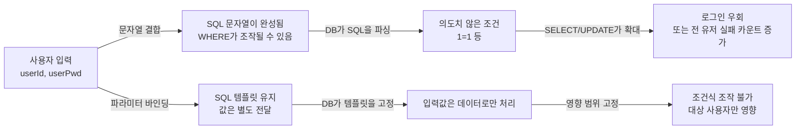

# 입력값을 쿼리로 만들지 마라: 로그인 우회와 “전 계정 잠금”을 부르는 한 줄


사용자 입력을 SQL 문자열에 붙여 넣는 순간, 로그인 우회는 물론 “전체 사용자 UPDATE” 같은 운영 장애까지 한 번에 터질 수 있다.


이 글은 **운영 유지보수 중 실제로 “전 사용자 계정 잠금”이 발생했던 사건**을 바탕으로, 같은 유형의 사고가 다시 나지 않도록 재현과 해결 원칙을 정리한다.


포인트는 단순하다. **SQL(코드)과 입력값(데이터)을 분리**하라. 그 시작이 **파라미터 바인딩(parameter binding)** 이다.


---


## 배경/문제


운영에서 실제로 다음 상황이 발생했다.

- “로그인 5회 실패 시 계정 잠금” 정책이 켜져 있는 환경에서
- **모든 계정이 동시에 블록(잠금) 처리**되었다.
- 로그인 실패 카운트가 올라간 시간이 **한 타임스탬프에 수렴**했고, 즉시 장애로 이어졌다.
- 응급 조치로 운영 데이터에서 실패 카운트를 초기화해 서비스 접근을 복구한 뒤, 원인을 추적했다.

원인 추적의 핵심 단서는 “실패 카운트를 올리는 쿼리의 영향 범위”였다.


**한 번의 요청으로 다수(또는 전체) 사용자의 실패 카운트를 올릴 수 있는 형태**라면, 계정 잠금 정책 자체가 공격 표면이 된다.


---


## 핵심 개념


SQL Injection은 “입력값이 데이터로만 취급되지 않고, SQL의 구조를 바꾸는 순간” 발생한다.


즉, 아래 두 흐름은 결과가 완전히 다르다.





→ 기대 결과/무엇이 달라졌는지: 입력값이 SQL 구조를 바꾸는 경로가 차단된다. 같은 입력이라도 “조건식”이 아니라 “문자열 값”으로만 처리된다.


---


## 해결 접근

1. **문자열 결합으로 쿼리를 만들지 않는다**
- 왜: 입력값이 따옴표/주석/연산자를 포함하면 WHERE 절이 깨질 수 있다.
- 기대 결과: 로그인 우회, 전 행 UPDATE 같은 확장이 막힌다.
1. **파라미터 바인딩을 사용한다**
- JDBC라면 `PreparedStatement`
- Next.js 서버 코드라면 “드라이버의 파라미터 쿼리” 또는 ORM(예: Prisma)의 쿼리 API
- 기대 결과: SQL 템플릿과 데이터가 분리되어, DB가 SQL을 안전하게 해석한다.
1. **실패 카운트 UPDATE까지 같은 기준으로 고정한다**
- 왜: 실제 사건에서도 “로그인 쿼리”보다 “실패 카운트 증가 쿼리”가 더 큰 장애로 이어졌다.
- 기대 결과: 실패 카운트 증가는 **단일 사용자**로만 제한된다.
1. **서버 경계를 고정한다 (Next.js)**
- 인증/DB 접근은 서버에서만 처리하고, 비밀정보는 환경 변수로만 관리한다.
    - [Next.js Route Handlers](https://nextjs.org/docs/app/building-your-application/routing/route-handlers)
    - [Next.js Environment Variables](https://nextjs.org/docs/app/building-your-application/configuring/environment-variables)

---


## 구현(코드)


### 1) 문자열 결합(취약) — 입력값이 WHERE를 바꾼다 (JDBC 예시)


```java
String userId = "' or 1=1 #";
String userPwd = "5678";

String loginSql =
  "SELECT * " +
  "FROM `test-user`.tb_user " +
  "WHERE user_id = '" + userId + "' and user_pw = '" + userPwd + "'";

Statement stmt = conn.createStatement();
ResultSet rs = stmt.executeQuery(loginSql);
```


→ 기대 결과/무엇이 달라졌는지: `userId`가 조건식을 깨면서 결과가 “원래 의도보다 넓게” 조회될 수 있다. (로그인 우회처럼 보이는 증상이 나온다)


---


### 2) 파라미터 바인딩(개선) — 입력값은 데이터로만 처리된다 (JDBC 예시)


```java
String userId = "' or 1=1 #";
String userPwd = "5678";

String loginSql =
  "SELECT * " +
  "FROM `test-user`.tb_user " +
  "WHERE user_id = ? and user_pw = ?";

PreparedStatement pstmt = conn.prepareStatement(loginSql);
pstmt.setString(1, userId);
pstmt.setString(2, userPwd);

ResultSet rs = pstmt.executeQuery();
System.out.println("end");
```


→ 기대 결과/무엇이 달라졌는지: 동일한 입력이 들어와도 `?` 자리에 “값”으로만 들어간다. 조건식이 바뀌지 않아서 로그인 우회가 발생하지 않는다.


---


### 3) “전 계정 잠금”을 만들기 쉬운 실패 카운트 UPDATE 예시


실제 운영 사고에서 핵심은 여기였다.


로그인 실패 시 실패 카운트를 올리는 로직이 문자열 결합으로 작성되어 있으면, 입력값 하나로 업데이트 범위가 커질 수 있다.


```sql
-- 취약 패턴(개념 예시): 문자열 결합으로 WHERE가 흔들릴 수 있음
UPDATE tb_user
SET login_fail_count = login_fail_count + 1
WHERE user_id = '<userId-from-client>';
```


→ 기대 결과/무엇이 달라졌는지: `user_id` 조건이 조작되면, 실패 카운트가 “특정 사용자”가 아니라 “여러 사용자/전체 사용자”로 확장될 수 있다.


아래처럼 “값 바인딩”으로 고정하는 것이 기본이다.


```sql
-- 개선 패턴(개념 예시): 파라미터 바인딩으로 값만 전달
UPDATE tb_user
SET login_fail_count = login_fail_count + 1
WHERE user_id = ?;
```


→ 기대 결과/무엇이 달라졌는지: 실패 카운트 증가는 오직 해당 user_id 1명에만 적용된다. 입력값으로 WHERE 절 구조를 바꿀 수 없다.


---


### 4) Next.js에서의 적용 포인트 (Route Handler)


Next.js에서는 DB 접근과 로그인 검증을 **Route Handler(서버)** 로 모으는 구성이 흔하다.


```javascript
// app/api/login/route.js
import { NextResponse } from "next/server";

export async function POST(req) {
  const { userId, userPwd } = await req.json();

  // 핵심: 문자열 결합으로 SQL 만들지 말고
  // DB 드라이버/ORM의 "파라미터 바인딩" API를 사용한다.

  return NextResponse.json({ ok: true });
}
```


→ 기대 결과/무엇이 달라졌는지: DB 접근이 서버 경계 안에서만 실행된다. 클라이언트로 DB 비밀정보가 노출될 여지가 줄어든다.


---


## 검증 방법(체크리스트)

- [ ] 로그인 입력에 `"' or 1=1 #"` 같은 문자열을 넣어도 로그인 성공이 되지 않는다.
- [ ] 실패 카운트 증가가 “단일 user_id”에만 적용된다. (DB에서 업데이트된 행 수 확인)
- [ ] 특정 시점에 “전 사용자”가 잠기는 현상이 재현되지 않는다.
- [ ] 로그인/실패 카운트 쿼리 모두 동일하게 “파라미터 바인딩” 방식이다.
- [ ] DB 접속 정보는 서버 환경 변수로만 관리되고, 클라이언트 번들에 포함되지 않는다.
    - [Next.js Environment Variables](https://nextjs.org/docs/app/building-your-application/configuring/environment-variables)

---


## 흔한 실수/FAQ


### Q1. “SELECT만 PreparedStatement면 충분하지 않나?”


아니다. **UPDATE/INSERT/DELETE도 동일하게** 파라미터 바인딩이 필요하다.


특히 “실패 카운트 증가”처럼 보안 정책과 연결된 UPDATE는 영향 범위가 커서 더 위험하다.


### Q2. 문자열 escape로 해결할 수 있나?


환경에 따라 달라질 수 있다. 일반적으로는 **escape에 의존하기보다** “파라미터 바인딩”을 기본으로 두는 편이 더 단단하다.


보안 관점의 설명은 [OWASP SQL Injection](https://owasp.org/www-community/attacks/SQL_Injection) 정리가 도움이 된다.


### Q3. Next.js에서 이건 Client Component에서 처리해도 되나?


DB 쿼리/인증 로직은 **서버에서만** 처리하는 게 원칙이다. Route Handler나 서버 측 로직으로 경계를 고정하자.


- [Next.js Route Handlers](https://nextjs.org/docs/app/building-your-application/routing/route-handlers)


---


## 요약(3~5줄)

- 운영에서 실제로 “전 사용자 계정 잠금”이 발생했고, 원인은 쿼리의 영향 범위가 확장되는 구조였다.
- 문자열 결합 SQL은 입력값이 WHERE 절을 바꾸는 순간 취약해진다.
- 해결의 시작은 **파라미터 바인딩**이다(PreparedStatement/드라이버 파라미터/ORM).
- 로그인뿐 아니라 실패 카운트 UPDATE까지 같은 기준으로 점검해야 한다.

---


## 결론


로그인 기능은 “맞으면 끝”이 아니라, 실패 경로까지 포함해 **정책이 안전하게 작동하는지**가 핵심이다.


운영에서 실제로 한 번에 전 계정이 잠기는 사고를 겪고 나면, “입력값을 SQL에 붙여 넣지 말라”는 원칙이 규칙이 아니라 생존 전략이 된다.


SQL 템플릿과 데이터를 분리하고, 실패 카운트 UPDATE까지 같은 기준으로 고정하자.


---


## 참고(공식 문서 링크)

- [Next.js Route Handlers](https://nextjs.org/docs/app/building-your-application/routing/route-handlers)
- [Next.js Environment Variables](https://nextjs.org/docs/app/building-your-application/configuring/environment-variables)
- [OWASP SQL Injection](https://owasp.org/www-community/attacks/SQL_Injection)
- [MDN Web Docs](https://developer.mozilla.org/)
(보안 전반 참고용)
