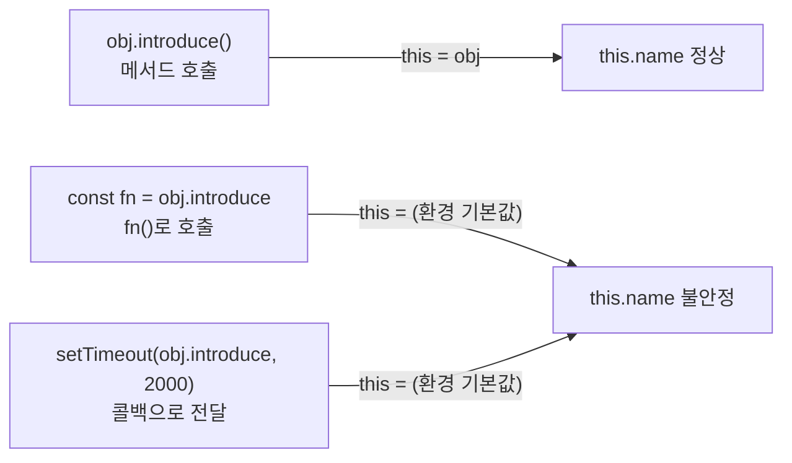

# 호출자가 this를 결정한다: setTimeout 콜백에서 “자기 자신”이 사라지는 이유


결론: **JavaScript의** **`this`****는 “어디에 정의됐는지”가 아니라 “어떻게 호출됐는지(호출 지점)”로 결정된다.**


타이머·이벤트·Promise 같은 비동기 흐름에서 메서드를 “그대로 넘기는 순간” `this`가 바뀌는 일이 자주 생긴다.


이 문제는 디버깅이 어렵고, UI 로직에서는 “값이 갑자기 `undefined`가 된다” 같은 형태로 사용자 경험(UX)까지 흔들 수 있다.


정리하면, **콜백으로 건네는 순간에도** **`this`****를 고정하거나, 아예** **`this`****에 의존하지 않는 구조로 만드는 게 핵심**이다.


---


## 배경/문제


객체지향 프로그래밍에서 `this`는 “객체 자기 자신”을 가리키는 것처럼 보인다. 그래서 다음 코드는 직관적으로 동작한다.


```javascript
function Person(name) {
  this.name = name
}

Person.prototype.introduce = function () {
  console.log(`My name is${this.name}`)
}

const sejin = new Person("Sejin")
sejin.introduce()
```


→ 기대 결과/무엇이 달라졌는지: `sejin.introduce()` 호출 시 `this === sejin` 이므로 이름이 정상 출력된다.


그런데 “2초 후에 자기소개”처럼 타이머로 넘기면 상황이 달라진다.


```javascript
setTimeout(sejin.introduce, 2000)
```


→ 기대 결과/무엇이 달라졌는지: `introduce`가 **객체에서 분리(detach)** 된 채 호출되어 `this`가 기대와 달라질 수 있다(환경에 따라 `undefined` 등).


---


## 핵심 개념


### `this`는 “호출자”에 의해 정해진다


아래 3가지 호출 방식이 `this`를 어떻게 바꾸는지 한 번에 고정해보자.





→ 기대 결과/무엇이 달라졌는지: **메서드 호출(****`obj.introduce()`****)만이** **`this`****를** **`obj`****로 묶어준다.** 분리된 함수 호출은 `this`가 바뀐다.


핵심은 한 줄이다.

- `obj.introduce()` 처럼 **점(.) 앞의** **`obj`****가 호출자(receiver)** 가 된다.
- `setTimeout(obj.introduce, ...)`는 “함수만” 넘기는 형태라 **호출자가 사라진다.**

공식 문서 기준으로도 `this`는 호출 방식에 따라 달라진다: [MDN - this](https://developer.mozilla.org/en-US/docs/Web/JavaScript/Reference/Operators/this)


---


## 해결 접근


### 해결책 1) “호출을 감싸서” 다시 메서드 호출로 만든다


콜백에서는 **객체가 메서드를 호출하도록** 한 번 더 감싸면 된다.


```javascript
setTimeout(() => sejin.introduce(), 2000)
```


→ 기대 결과/무엇이 달라졌는지: 2초 후에도 `sejin.introduce()` 형태가 유지되어 `this === sejin`로 동작한다.


---


### 해결책 2) `bind`로 `this`를 고정한다


메서드를 넘기고 싶다면, **넘기기 전에** **`this`****를 묶어둔다.**


```javascript
setTimeout(sejin.introduce.bind(sejin), 2000)
```


→ 기대 결과/무엇이 달라졌는지: `introduce`가 어디에서 호출되든 `this`는 항상 `sejin`으로 고정된다.


공식 문서: [MDN - Function.prototype.bind()](https://developer.mozilla.org/en-US/docs/Web/JavaScript/Reference/Global_Objects/Function/bind)


---


### 대안/비교

- **감싸기(arrow wrapper)**: 읽기 쉽고, “여기서 이 객체의 메서드를 실행한다”는 의도가 명확하다.
- **`bind`**: 콜백으로 “함수 레퍼런스”를 그대로 넘겨야 할 때 적합하다(이벤트 핸들러 등록 등).
- **`this`** **자체를 없애는 설계(클로저)**: React/Next.js 컴포넌트에서는 이 방식이 가장 자연스럽다.

```javascript
const createPerson = (name) => ({
  introduce: () => console.log(`My name is${name}`),
})

const sejin2 = createPerson("Sejin")
setTimeout(sejin2.introduce, 2000)
```


→ 기대 결과/무엇이 달라졌는지: `introduce`가 `this`를 쓰지 않으므로 “분리 호출”이어도 안전하다.


---


## 구현(코드)


### Next.js에서 재현 가능한 예시


타이머 기반 동작은 UI와 연결되는 경우가 많아서 **Client Component에서 실행 위치를 고정**하는 게 안전하다.


공식 문서: [Next.js Docs - Client Components](https://nextjs.org/docs/app/building-your-application/rendering/client-components)


```typescript
"use client"

import { useEffect } from "react"

function Person(name: string) {
  this.name = name
}
Person.prototype.introduce = function () {
  console.log(`My name is ${this.name}`)
}

export default function ThisBindingDemo() {
  useEffect(() => {
    const sejin = new (Person as any)("Sejin")

    // ✅ 방법 1) 감싸기
    const id1 = window.setTimeout(() => sejin.introduce(), 2000)

    // ✅ 방법 2) bind
    const id2 = window.setTimeout(sejin.introduce.bind(sejin), 2500)

    return () => {
      window.clearTimeout(id1)
      window.clearTimeout(id2)
    }
  }, [])

  return null
}
```


→ 기대 결과/무엇이 달라졌는지: 콘솔에 일정 시간 후 이름이 정상 출력되고, 언마운트 시 타이머가 정리되어 불필요한 실행을 막는다.


참고: `useEffect`는 클라이언트에서 실행되며, 정리(cleanup) 함수를 통해 타이머를 안전하게 해제할 수 있다. [React Docs - useEffect](https://react.dev/reference/react/useEffect)


---


## 검증 방법(체크리스트)

- [ ] `obj.method()` 형태일 때 `this.name`이 정상 출력되는가
- [ ] `setTimeout(obj.method, ...)`처럼 “함수만 전달”하면 `this`가 바뀌는 현상이 재현되는가
- [ ] `setTimeout(() => obj.method(), ...)`로 바꾸면 정상 동작으로 돌아오는가
- [ ] `bind`를 적용한 함수가 어떤 호출 흐름에서도 동일한 결과를 내는가
- [ ] Next.js에서는 Client Component + `useEffect`에서 타이머가 설정/정리되는가

---


## 흔한 실수/FAQ


### Q1. `setTimeout(() => obj.method, 2000)`도 되지 않나요?


`obj.method`는 “함수 참조”일 뿐이고 호출이 아니다. **괄호** **`()`****로 실제 호출을 해야** 한다.


```javascript
setTimeout(() => sejin.introduce, 2000) // ❌ 호출 아님
setTimeout(() => sejin.introduce(), 2000) // ✅ 호출
```


→ 기대 결과/무엇이 달라졌는지: 첫 줄은 아무 일도 일어나지 않거나 기대와 다르게 동작하고, 둘째 줄은 정상 실행된다.


---


### Q2. 화살표 함수(arrow function)가 왜 도움이 되나요?


화살표 함수는 자체 `this`를 새로 만들지 않고, **바깥 스코프의** **`this`****를 그대로 사용**한다.


다만 여기 글의 핵심은 “arrow가 만능”이 아니라, **`obj.method()`** **형태로 호출 지점을 유지하는 것**이다.


공식 문서: [MDN - Arrow functions](https://developer.mozilla.org/en-US/docs/Web/JavaScript/Reference/Functions/Arrow_functions)


---


### Q3. `bind`와 “감싸기” 중 무엇을 쓰는 게 맞나요?


둘 다 목적은 같다: **콜백에서도** **`this`****를 기대대로 만들기.**

- “감싸기”는 호출 의도가 명확하고, 필요한 시점에만 실행 흐름을 만들기 쉽다.
- `bind`는 콜백 등록 API에 “함수 레퍼런스”를 그대로 넘겨야 하는 경우 깔끔하다.

---


## 요약(3~5줄)

- JavaScript의 `this`는 “정의 위치”가 아니라 **호출 방식**으로 결정된다.
- `obj.method()`는 `this`를 `obj`로 묶지만, `setTimeout(obj.method)`는 호출자를 잃는다.
- 해결은 간단하다: **호출을 감싸서** **`obj.method()`****로 만들거나**, **`bind`****로** **`this`****를 고정**한다.
- 컴포넌트 코드에서는 `this` 의존을 줄이고 **클로저 기반 설계**가 더 단순해질 때가 많다.

---


## 결론


`this`는 “객체 자신”이라는 직관만으로 다루기엔, **콜백/비동기 흐름에서 너무 쉽게 흔들린다.**


그래서 `setTimeout`, 이벤트 핸들러, 비동기 콜백에서는 **호출 지점을 명시적으로 유지하거나(****`() => obj.method()`****),** **`bind`****로 고정하는 습관**이 안전하다.


정리하면, `this`는 자동으로 지켜지지 않는다. **호출자가 곧** **`this`****를 만든다.**


---


## 참고(공식 문서 링크)

- [Next.js Docs - Client Components](https://nextjs.org/docs/app/building-your-application/rendering/client-components)
- [React Docs - useEffect](https://react.dev/reference/react/useEffect)
- [MDN - this](https://developer.mozilla.org/en-US/docs/Web/JavaScript/Reference/Operators/this)
- [MDN - Function.prototype.bind()](https://developer.mozilla.org/en-US/docs/Web/JavaScript/Reference/Global_Objects/Function/bind)
- [MDN - setTimeout](https://developer.mozilla.org/en-US/docs/Web/API/setTimeout)
- [MDN - Arrow functions](https://developer.mozilla.org/en-US/docs/Web/JavaScript/Reference/Functions/Arrow_functions)
