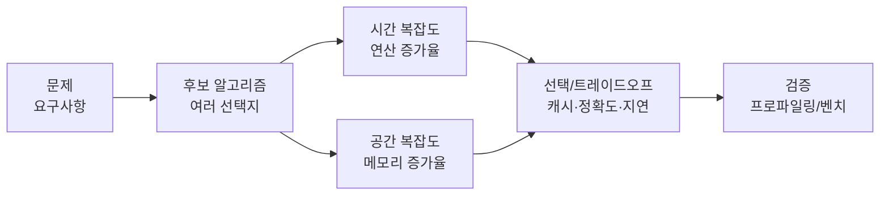

# 속도는 “측정값”이 아니라 “증가율”이다: 시간·공간 복잡도와 Big-O


**한 문장 결론:** 알고리즘 비교는 실행 시간 측정보다, 입력 크기에 따라 얼마나 빨리 커지는지(시간/공간 복잡도)를 먼저 고정하는 게 안정적입니다.


실무에서는 “더 빠른 코드”를 고르는 일이 자주 생깁니다. 그런데 실행 시간은 런타임 최적화(JIT), 서버 스펙, 트래픽 패턴, 캐시 상태에 따라 흔들립니다.


그래서 먼저 **입력 크기(n)가 커질 때 비용이 어떻게 증가하는지**를 보는 게 좋습니다. 포인트는 단순합니다. **시간 복잡도는 연산 증가율**, **공간 복잡도는 메모리 증가율**입니다.


---


## 배경/문제


같은 문제를 푸는 알고리즘이 여러 개일 때, 단순히 “몇 ms 걸렸는지”만 비교하면 다음 문제가 생깁니다.

- 환경이 달라지면 결과가 뒤집힐 수 있다.
- 테스트 입력이 작으면 차이가 안 보인다.
- 캐시/GC/스케줄링 같은 변수 때문에 재현이 어렵다.

그래서 성능 의사결정은 보통 이렇게 갑니다.

1. **복잡도 분석으로 증가율을 먼저 고정**
2. 그 다음 **프로파일링/벤치마크로 상수항(현실 체감)을 확인**

---


## 핵심 개념


### 시간 복잡도 vs 공간 복잡도

- **시간 복잡도(Time Complexity)**: 입력 크기(n)에 따라 **연산량이 얼마나 증가하는지**(성장률)
- **공간 복잡도(Space Complexity)**: 입력 크기(n)에 따라 **추가로 필요한 메모리가 얼마나 증가하는지**(성장률)

여기서 “연산의 수를 정확히 센다”기보다는, **불필요한 상세를 걷어내고 증가율만 남긴다**는 관점이 핵심입니다.





→ 기대 결과/무엇이 달라졌는지: “감(측정값)”이 아니라 “증가율(복잡도)”로 먼저 방향을 잡고, 마지막에 실측으로 확인하는 흐름이 고정됩니다.


---


### Big-O 표기법이 하는 일


**Big-O(빅오) 표기법**은 복잡도를 표현하는 방식 중 하나로, **입력이 커질수록 지배적인 항(dominant term)**만 남겨 “대략 얼마나 커지는지”를 말합니다.

- 상수항은 무시합니다. 예: `O(n + 10)` → `O(n)`
- 계수도 무시합니다. 예: `O(5n)` → `O(n)`
- 독립 입력이 있으면 더합니다. 예: `O(n + m)`
- 중첩 반복 등은 곱해집니다. 예: `O(n^2)`

---


## 해결 접근


복잡도를 실무에 적용하는 방법은 간단합니다.

1. **입력 크기(n)를 먼저 정의한다**
    - 왜: “무엇이 커질 때 비용이 커지는지”가 고정돼야 비교가 됩니다.
    - 기대 결과: 복잡도 표기가 의미 있는 기준이 됩니다.
2. **시간/공간을 함께 적는다**
    - 왜: 캐시/메모이제이션은 시간을 줄이는 대신 공간을 더 씁니다.
    - 기대 결과: “빠르지만 메모리 많이 씀” 같은 트레이드오프가 문서화됩니다.
3. **마지막에 벤치/프로파일링으로 체감 확인**
    - 왜: Big-O가 같아도 상수항/데이터 분포에 따라 체감이 달라집니다.
    - 기대 결과: 실제 환경에서의 병목이 드러납니다.

---


## 구현(코드)


아래 예시는 **Big-O 감각을 빠르게 잡기 위한** 자주 나오는 패턴입니다.


### 1) 한 번 도는 루프: O(n)


```javascript
function sum(arr) {
  let total = 0;
  for (let i = 0; i < arr.length; i++) total += arr[i];
  return total;
}
```


→ 기대 결과/무엇이 달라졌는지: 입력이 2배가 되면 반복 횟수도 대체로 2배로 늘어납니다.


---


### 2) 상수배는 무시: O(n)


```javascript
function touchNTimes(n) {
  const k = 5;
  for (let i = 0; i < n * k; i++) {
    // do something
  }
}
```


→ 기대 결과/무엇이 달라졌는지: `k`가 고정이면 증가율은 `n`에 비례하므로 `O(n)`으로 봅니다.


---


### 3) 독립 입력은 더함: O(n + m)


```javascript
function mergeTwoWorks(a, b) {
  for (let i = 0; i < a.length; i++) {
    // work A
  }
  for (let j = 0; j < b.length; j++) {
    // work B
  }
}
```


→ 기대 결과/무엇이 달라졌는지: 두 입력이 서로 다른 크기로 커질 수 있으면 `O(n + m)`처럼 분리해서 봅니다.


---


### 4) 중첩 루프: O(n²)


```javascript
function allPairs(arr) {
  for (let i = 0; i < arr.length; i++) {
    for (let j = 0; j < arr.length; j++) {
      // pair (i, j)
    }
  }
}
```


→ 기대 결과/무엇이 달라졌는지: 입력이 2배가 되면 반복 횟수는 대체로 4배로 늘어납니다.


---


### 5) 공간 복잡도 감각: “추가 메모리”가 핵심


```javascript
function copyArray(arr) {
  const copied = []; // 추가 공간
  for (const v of arr) copied.push(v);
  return copied;
}
```


→ 기대 결과/무엇이 달라졌는지: 입력이 커질수록 `copied`가 커지므로 추가 공간도 `O(n)`으로 증가합니다.


---


### Next.js에서 자주 만나는 트레이드오프 예시: 캐시(Map)는 시간↓ 공간↑


```javascript
const cache = new Map();

export function getUserFast(id, fetchUser) {
  if (cache.has(id)) return cache.get(id);
  const user = fetchUser(id);
  cache.set(id, user);
  return user;
}
```


→ 기대 결과/무엇이 달라졌는지: 같은 요청이 반복될 때 조회가 빨라질 수 있지만, 캐시가 커지면 메모리 사용량도 함께 늘어납니다(시간-공간 트레이드오프).


---


## 검증 방법(체크리스트)

- [ ] **입력 크기(n)** 를 명확히 적었다(예: 배열 길이, 요청 수, DOM 노드 수).
- [ ] 시간 복잡도와 공간 복잡도를 **함께** 적었다.
- [ ] 지배 항(가장 큰 항) 기준으로 Big-O를 정리했다.
- [ ] 실제 데이터 분포(중복 많음/정렬됨/랜덤 등)에서 병목이 달라질 수 있음을 고려했다.
- [ ] 마지막으로 프로파일링/벤치마크로 “체감”을 확인했다.

---


## 흔한 실수/FAQ


### Q1. Big-O면 실행 시간이 “정확히” 결정되나요?


아닙니다. Big-O는 **증가율**을 말합니다. 같은 `O(n)`이어도 상수항, 런타임 최적화, 캐시 히트율에 따라 체감은 달라질 수 있습니다.


### Q2. “시간 복잡도만” 보면 되지 않나요?


캐시/메모이제이션/인덱싱은 대부분 **공간을 더 써서 시간을 줄이는** 전략입니다. 특히 서버 환경이나 장시간 실행 프로세스에서는 공간을 같이 봐야 안정적입니다.


### Q3. 입력이 작으면 복잡도 분석이 의미 없나요?


작을수록 상수항이 지배적일 수 있습니다. 그래도 복잡도는 “커졌을 때 무너질 지점”을 미리 보여주는 안전장치 역할을 합니다.


---


## 요약(3~5줄)

- 시간 복잡도는 **연산 증가율**, 공간 복잡도는 **메모리 증가율**을 봅니다.
- Big-O는 불필요한 상세를 걷어내고 **지배 항만 남기는 표기법**입니다.
- 선택은 보통 “복잡도 분석으로 방향 결정 → 실측으로 체감 확인” 순서가 안전합니다.
- 캐시 같은 최적화는 대개 **시간↓ 공간↑** 트레이드오프를 동반합니다.

---


## 결론


실행 시간은 흔들리지만, 복잡도는 흔들리지 않습니다.


그래서 알고리즘 선택의 출발점은 **시간/공간 복잡도로 증가율을 고정하는 것**입니다. 그 다음에야 비로소 프로파일링으로 “현실에서 얼마나 빠른지”를 확인하면 됩니다.


---


## 참고(공식 문서 링크)

- [Next.js Docs](https://nextjs.org/docs)
- [React Docs](https://react.dev/)
- [MDN Web Docs](https://developer.mozilla.org/)
- [web.dev](https://web.dev/)
- [Node.js Performance Hooks](https://nodejs.org/api/perf_hooks.html)
- [Big O notation (Wikipedia)](https://en.wikipedia.org/wiki/Big_O_notation)
