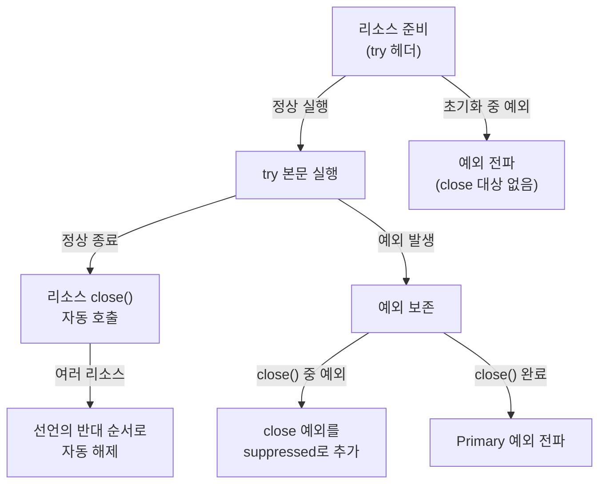

# 실수 없는 자원 정리를 기본값으로: try-with-resources


**한 문장 결론:** `try-with-resources`는 “자원 해제”를 코드의 기본 동작으로 만들고, 예외 상황에서도 디버깅 정보를 잃지 않게 해줍니다. ([Oracle Java Tutorials](https://docs.oracle.com/javase/tutorial/essential/exceptions/tryResourceClose.html))


## 배경/문제


백엔드에서는 커넥션, 파일/소켓, 입출력 스트림처럼 **사용 후 반드시 반납해야 하는 자원**이 많습니다.


반납이 늦거나 누락되면 풀 고갈, 파일 핸들 고갈, 지연 증가 같은 형태로 이어지고, 결국 API 응답 시간이 흔들립니다. ([AutoCloseable](https://docs.oracle.com/en/java/javase/17/docs/api/java.base/java/lang/AutoCloseable.html))


문제는 “해제해야 한다”는 사실보다, **예외가 섞이는 순간 자원 정리가 쉽게 깨진다**는 점입니다.


## 핵심 개념


`try-with-resources`는 `try (...) { ... }` 헤더에 리소스를 선언해두면, 블록을 벗어날 때 **`close()`****를 자동 호출**합니다.


이때 리소스는 `AutoCloseable`(또는 그 하위인 `Closeable`)을 구현해야 합니다. ([Oracle Java Tutorials](https://docs.oracle.com/javase/tutorial/essential/exceptions/tryResourceClose.html))





→ 기대 결과/무엇이 달라졌는지: “close를 잊지 않는 구조”가 되고, 예외가 겹쳐도 원인 추적에 필요한 정보가 함께 남습니다. ([Oracle Java Tutorials](https://docs.oracle.com/javase/tutorial/essential/exceptions/tryResourceClose.html))


## 해결 접근


### 왜 try-catch-finally만으로는 자주 깨질까?


`finally`에서 `close()`를 직접 호출하는 패턴은 **실수 포인트가 많습니다**.

- `close()` 호출 자체를 누락하기 쉽다.
- `close()`에서 예외가 나면, 원래 예외가 가려질 수 있다.
- 리소스가 여러 개면, 해제 순서/예외 처리까지 고려해야 해서 코드가 급격히 복잡해진다.

반면 `try-with-resources`는:

- 블록 종료 시점에 `close()`를 자동 호출한다. ([Oracle Java Tutorials](https://docs.oracle.com/javase/tutorial/essential/exceptions/tryResourceClose.html))
- 여러 리소스를 선언하면 **선언의 반대 순서로 해제**한다. ([JLS — try-with-resources](https://docs.oracle.com/javase/specs/jls/se7/html/jls-14.html))
- `close()`에서 발생한 예외는 **suppressed**로 묶어 “주 예외(Primary)”를 보존한다. ([Throwable](https://docs.oracle.com/javase/8/docs/api/java/lang/Throwable.html))

### 대안/비교 (최소 2가지)

1. **try-catch-finally로 수동 close**
    - 장점: 언어 기능에 대한 의존이 적어 보임
    - 단점: 예외 마스킹/누락/중복 try 블록 등으로 유지보수 비용이 커짐
2. **유틸리티로 close를 감싸기(“조용히 닫기”류)**
    - 장점: 코드가 짧아질 수 있음
    - 단점: 예외를 삼키면 장애 징후를 놓치기 쉬움(로그/관측이 전제)
3. **try-with-resources 사용**
    - 장점: 언어 차원에서 해제/예외 결합 규칙이 고정되어 실수가 줄어듦 ([Oracle Java Tutorials](https://docs.oracle.com/javase/tutorial/essential/exceptions/tryResourceClose.html))

## 구현(코드)


### 1) 단일 리소스: “닫는 코드”를 없앤다


```java
try (BufferedReader br = new BufferedReader(new FileReader("path"))) {
    return br.readLine();
} catch (IOException e) {
    return null;
}
```


→ 기대 결과/무엇이 달라졌는지: `return`으로 빠져나가도 `br.close()`가 자동 호출됩니다. ([Oracle Java Tutorials](https://docs.oracle.com/javase/tutorial/essential/exceptions/tryResourceClose.html))


### 2) 여러 리소스: 선언의 반대 순서로 닫힌다


```java
try (
    FileReader fr = new FileReader("path");
    BufferedReader br = new BufferedReader(fr)
) {
    return br.readLine();
}
```


→ 기대 결과/무엇이 달라졌는지: `br` → `fr` 순서로 자동 해제됩니다(“마지막에 만든 것부터 정리”). ([JLS — try-with-resources](https://docs.oracle.com/javase/specs/jls/se7/html/jls-14.html))


### 3) Suppressed Exception: “주 예외”를 잃지 않는다


`try 본문`에서 예외가 터지고, `close()`에서도 예외가 터지면 **둘 다 필요**합니다. 이때 `try-with-resources`는 `close()` 예외를 suppressed로 보관합니다. ([Throwable](https://docs.oracle.com/javase/8/docs/api/java/lang/Throwable.html))


```java
class CustomResource implements AutoCloseable {
    @Override
    public void close() throws Exception {
        throw new Exception("Close Exception 발생");
    }

    void process() throws Exception {
        throw new Exception("Primary Exception 발생");
    }
}

public class Main {
    public static void main(String[] args) throws Exception {
        try (CustomResource resource = new CustomResource()) {
            resource.process();
        }
    }
}
```


→ 기대 결과/무엇이 달라졌는지: 출력은 “Primary Exception”이 중심이 되고, `close()` 예외는 `Suppressed:`로 함께 따라옵니다. ([Throwable](https://docs.oracle.com/javase/8/docs/api/java/lang/Throwable.html))


추적할 때는 `getSuppressed()`로 꺼낼 수 있습니다.


```java
try (CustomResource resource = new CustomResource()) {
    resource.process();
} catch (Exception e) {
    for (Throwable suppressed : e.getSuppressed()) {
        System.out.println("suppressed = " + suppressed.getMessage());
    }
    throw e;
}
```


→ 기대 결과/무엇이 달라졌는지: 장애 원인이 “본문 예외인지 / 해제 예외인지”를 함께 확인할 수 있어 디버깅이 빨라집니다. ([Throwable](https://docs.oracle.com/javase/8/docs/api/java/lang/Throwable.html))


## 검증 방법(체크리스트)

- [ ] `try` 헤더에 선언한 객체가 `AutoCloseable`(또는 `Closeable`)을 구현하는가? ([AutoCloseable](https://docs.oracle.com/en/java/javase/17/docs/api/java.base/java/lang/AutoCloseable.html))
- [ ] 리소스가 2개 이상이면, “선언의 반대 순서”로 닫히는 것을 기대한 코드인가? ([JLS — try-with-resources](https://docs.oracle.com/javase/specs/jls/se7/html/jls-14.html))
- [ ] 예외 로그에서 `Suppressed:`가 보이면, `close()`에서 추가 예외가 난 것이므로 같이 조사했는가? ([Throwable](https://docs.oracle.com/javase/8/docs/api/java/lang/Throwable.html))
- [ ] `catch`에서 예외를 삼키고 `null`을 반환한다면, 호출부가 그 계약을 확실히 처리하는가?

## 흔한 실수/FAQ


### Q1. “Suppressed Exception은 무시되는 예외인가요?”


“사라지는 예외”가 아니라, **주 예외에 덧붙여 기록되는 예외**에 가깝습니다. 스택트레이스에 `Suppressed:`로 같이 출력되고, `getSuppressed()`로 조회할 수 있습니다. ([Throwable](https://docs.oracle.com/javase/8/docs/api/java/lang/Throwable.html))


### Q2. try-catch-finally에서 왜 원래 예외가 사라질 수 있나요?


`finally`에서 `close()`가 던진 예외가 그대로 전파되면, 기존 예외가 덮일 수 있습니다. `try-with-resources`는 이 상황을 언어 차원에서 suppressed로 결합합니다. ([Throwable](https://docs.oracle.com/javase/8/docs/api/java/lang/Throwable.html))


### Q3. 커넥션 풀을 쓰는데도 close가 중요한가요?


중요합니다. 풀을 쓰는 환경에서는 `close()`가 “진짜 소켓을 닫는 것”이 아니라 **풀에 반납하는 의미**로 동작하는 경우가 일반적입니다. 반납 누락은 곧 풀 고갈로 이어질 수 있습니다. ([AutoCloseable](https://docs.oracle.com/en/java/javase/17/docs/api/java.base/java/lang/AutoCloseable.html))


## 요약(3~5줄)

- `try-with-resources`는 `AutoCloseable` 기반 리소스를 블록 종료 시 자동으로 정리합니다. ([Oracle Java Tutorials](https://docs.oracle.com/javase/tutorial/essential/exceptions/tryResourceClose.html))
- 수동 `finally { close }` 패턴에서 자주 발생하는 누락/예외 마스킹 문제를 줄입니다. ([Throwable](https://docs.oracle.com/javase/8/docs/api/java/lang/Throwable.html))
- 여러 리소스는 선언의 반대 순서로 해제되어 “정리 순서”까지 고정됩니다. ([JLS — try-with-resources](https://docs.oracle.com/javase/specs/jls/se7/html/jls-14.html))
- `close()` 예외는 suppressed로 남아 주 예외를 잃지 않습니다. ([Throwable](https://docs.oracle.com/javase/8/docs/api/java/lang/Throwable.html))

## 결론


자원 관리는 “해야 한다”가 아니라 **“실수할 수 없게 만들어야 한다”**에 가깝습니다.


`try-with-resources`는 자원 해제를 기본 동작으로 고정하고, 예외가 겹쳐도 정보를 보존해 운영/디버깅 비용을 낮춥니다. ([Oracle Java Tutorials](https://docs.oracle.com/javase/tutorial/essential/exceptions/tryResourceClose.html))


## 참고(공식 문서 링크)

- [Oracle Java Tutorials — The try-with-resources Statement](https://docs.oracle.com/javase/tutorial/essential/exceptions/tryResourceClose.html)
- [Oracle API — AutoCloseable](https://docs.oracle.com/en/java/javase/17/docs/api/java.base/java/lang/AutoCloseable.html)
- [Oracle API — Throwable (Suppressed 관련 메서드 포함)](https://docs.oracle.com/javase/8/docs/api/java/lang/Throwable.html)
- [Java Language Specification — try-with-resources 동작 규칙](https://docs.oracle.com/javase/specs/jls/se7/html/jls-14.html)
- [Baeldung — Java Suppressed Exceptions](https://www.baeldung.com/java-suppressed-exceptions)
