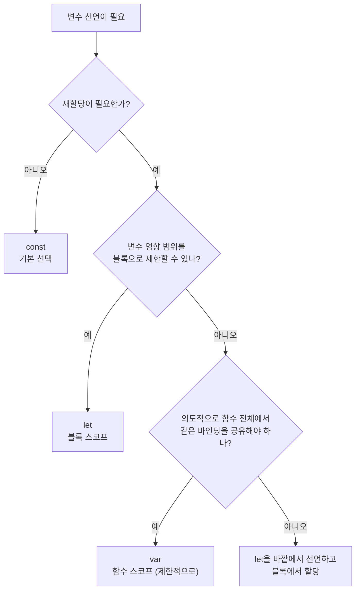

# 실수를 막되, 유연함은 남겨라: `var`를 “목적 있게” 쓰는 순간들


## 1) 게시용 최종 글(Markdown)


한 문장 결론: **기본은** **`const/let`****로 예측 가능성을 확보하고,** **`var`****는 “의도적으로 함수 스코프/전역 브리징/재선언 허용”이 필요한 순간에만 제한적으로 쓴다.**


`var`를 피하자는 이야기는 보통 “버그가 나기 쉽다”는 경험에서 나온다. 다만 포인트는 금지가 아니라 **도구의 성격**이다.


`var`는 **블록을 무시하고 함수 단위로 묶이는 스코프 모델**이고, 이 특성은 단점이 될 수도, 목적이 있으면 장점이 될 수도 있다.


참고: [`var`](https://developer.mozilla.org/docs/Web/JavaScript/Reference/Statements/var), [`let`](https://developer.mozilla.org/docs/Web/JavaScript/Reference/Statements/let), [`const`](https://developer.mozilla.org/docs/Web/JavaScript/Reference/Statements/const)


---


## 배경/문제


`var`와 `let/const`는 “변수 선언”이라는 점만 같고, 다음이 다르게 동작한다.

- **스코프(변수 유효 범위)**: `var`는 함수 스코프, `let/const`는 블록 스코프
- **초기화 전 접근**: `var`는 `undefined`가 섞이며 조용히 지나갈 수 있고, `let/const`는 TDZ로 접근을 차단한다

이 차이를 의식하지 않으면 `var`는 실수로 이어지기 쉽다. 반대로 이 차이를 **의도적으로 활용**하는 경우도 있다.


---


## 핵심 개념


### 선택 기준을 먼저 고정하기





→ 기대 결과/무엇이 달라졌는지: “기본은 const/let, var는 목적이 있을 때만”이라는 기준이 흐름으로 고정된다.


---


## 해결 접근

1. **기본은** **`const`****, 재할당이 필요하면** **`let`**

    값이 변하지 않는다면 `const`가 의도를 가장 잘 드러낸다.

2. **`var`****는 ’편의’가 아니라 ’스코프 모델’로 쓴다**

    `var`를 선택한다면 “왜 함수 스코프여야 하는지 / 왜 재선언 허용이 필요한지 / 왜 전역 브리징이 필요한지”가 코드로 설명되어야 한다.

3. **팀 규칙으로 실수를 구조적으로 줄인다**

    기본값은 `const/let`, `var`는 특정 영역(예: 레거시 스니펫)에서만 허용하는 방식이 관리하기 쉽다.


    참고: [Next.js Docs: ESLint](https://nextjs.org/docs/app/building-your-application/configuring/eslint)


대안/비교(최소 2개):
- **대안 A:** **`const/let`****만 쓰고, 함수 공유는 바깥** **`let`** **선언으로 해결**


가장 예측 가능하고 디버깅이 쉽다.
- **대안 B: 레거시/서드파티 호환이 필요한 위치에만** **`var`** **허용**


마찰을 줄이되, 범위를 분리해 리스크를 제한한다.


---


## 구현(코드)


### 1) `var`가 위험해지는 대표 패턴(비교 기준)


### 블록을 벗어나는 `var`, 끊어지는 `let`


```javascript
(function () {
  {
    var a = 1
    console.log(a) // 1
  }
  console.log(a)   // 1 (블록 밖에서도 보임)
})()

(function () {
  {
    let b = 1
    console.log(b) // 1
  }
  console.log(b)   // ReferenceError
})()
```


→ 기대 결과/무엇이 달라졌는지: `var`는 블록 내부 선언이 함수 전체로 퍼지고, `let`은 블록을 벗어나면 끊긴다.


### TDZ: 선언 이전 접근을 막아 실수를 빨리 드러낸다


```javascript
(function () {
  console.log(a) // undefined처럼 보일 수 있음
  var a = 1
})()

(function () {
  console.log(b) // ReferenceError (TDZ)
  let b = 1
})()
```


→ 기대 결과/무엇이 달라졌는지: `var`는 실수가 조용히 지나갈 수 있고, `let`은 초기화 전 접근을 에러로 차단한다.


참고: [MDN: Hoisting](https://developer.mozilla.org/docs/Glossary/Hoisting), [MDN: TDZ](https://developer.mozilla.org/docs/Web/JavaScript/Reference/Statements/let#temporal_dead_zone_tdz)


---


### 2) `var`가 유리해질 수 있는 예제들


아래 예제들은 “`var`의 특성 자체가 목적일 때”에만 의미가 있다. 동일 목적을 `let/const`로 달성할 수 있다면, 대안도 같이 고려하는 편이 안전하다.


---


### 예제 A) 레거시/서드파티가 `window` 프로퍼티를 기대하는 전역 브리징


브라우저의 고전적인 `<script>` 환경에서 `var`는 전역 객체 프로퍼티로 연결되는 방식이 쓰이곤 한다(환경에 따라 차이가 있을 수 있다). “전역 변수를 읽는” 서드파티 스크립트와 맞물릴 때 마찰이 줄어든다.


```html
<script>
  // 서드파티가 window.analyticsQueue를 기대하는 상황
  var analyticsQueue = window.analyticsQueue || []
  window.analyticsQueue = analyticsQueue
</script>
```


→ 기대 결과/무엇이 달라졌는지: “전역 프로퍼티가 있어야 동작하는 코드”와 연결하는 비용이 줄어든다.


참고: [MDN: var - 전역 스코프 동작](https://developer.mozilla.org/docs/Web/JavaScript/Reference/Statements/var#description), [MDN: 전역 객체](https://developer.mozilla.org/docs/Glossary/Global_object)


---


### 예제 B) Next.js에서 “먼저 주입해야 하는 전역 설정”을 `<Script>`로 보장


Next.js에서는 스크립트를 의도한 시점에 주입할 수 있다. 전역 설정을 먼저 만들고(또는 브리징하고), 이후 스크립트가 그 값을 읽게 하는 패턴에서 `var`가 유용할 수 있다.


```typescript
import Script from 'next/script'

export default function Page() {
  return (
    <>
      <Script id="app-config" strategy="beforeInteractive">
        {`
          var APP_CONFIG = window.APP_CONFIG || { feature: { enabled: true } };
          window.APP_CONFIG = APP_CONFIG;
        `}
      </Script>

      <Script src="https://example.com/third-party.js" strategy="afterInteractive" />
    </>
  )
}
```


→ 기대 결과/무엇이 달라졌는지: 전역 설정이 먼저 존재하도록 만들고, 뒤에 로드되는 스크립트가 안정적으로 읽을 수 있다.


참고: [Next.js Docs: Script](https://nextjs.org/docs/app/building-your-application/optimizing/scripts)

> 실제 서비스에서는 외부 스크립트를 로드할 때 CSP(Content Security Policy)와 출처 신뢰도를 함께 점검하는 편이 안전하다. 참고: MDN: CSP

---


### 예제 C) “합쳐진 스크립트/중복 로딩”에서 재선언 허용이 충돌을 줄일 때


여러 파일이 한 스코프에 합쳐져 실행되거나, 같은 스크립트가 중복 로드될 수 있는 환경에서는 `let/const`의 중복 선언이 즉시 에러가 된다. 이때 `var` 재선언 허용이 “충돌 회피”로 작동할 수 있다.


```javascript
// script-a.js
var shared = window.shared || {}
window.shared = shared

// script-b.js (같은 스코프에서 다시 실행될 수 있음)
var shared = window.shared || {}
window.shared = shared
```


→ 기대 결과/무엇이 달라졌는지: 중복 로드/합성 환경에서도 선언 충돌로 바로 터지지 않고, 기존 값을 재사용한다.


참고: [MDN: var - 재선언 특성](https://developer.mozilla.org/docs/Web/JavaScript/Reference/Statements/var#description)


---


### 예제 D) `switch`에서 케이스별 변수를 “한 번만” 공유하고 싶을 때


`switch`는 `case`들이 같은 블록을 공유하는 구조다. `let/const`로는 케이스마다 `{}`를 두는 게 안전하지만, “케이스 결과를 하나의 변수로 모으는” 목적이라면 `var`가 덜 번거로울 수 있다.


```javascript
function label(type) {
  switch (type) {
    case 'a':
      var msg = 'A'
      break
    case 'b':
      msg = 'B'
      break
    default:
      msg = 'UNKNOWN'
  }

  return msg
}

console.log(label('a')) // A
console.log(label('b')) // B
```


→ 기대 결과/무엇이 달라졌는지: 케이스마다 변수를 따로 선언하지 않고, 하나의 바인딩으로 결과를 모은다.


대안(더 예측 가능한 방식):


```javascript
function label(type) {
  let msg

  switch (type) {
    case 'a': msg = 'A'; break
    case 'b': msg = 'B'; break
    default: msg = 'UNKNOWN'
  }

  return msg
}
```


→ 기대 결과/무엇이 달라졌는지: 블록 스코프의 예측 가능성을 유지하면서도, 동일 목적(결과 모으기)을 달성한다.


참고: [MDN: switch](https://developer.mozilla.org/docs/Web/JavaScript/Reference/Statements/switch)


---


### 예제 E) `try/catch`에서 “파싱 결과를 함수 바깥(함수 스코프)으로 남겨야 할 때”


`try/catch` 내부에서 성공 시 값을 만들고, 실패 시 대체값을 넣어 함수 마지막에서 반환하는 패턴은 흔하다. 이때 `var`는 “블록을 넘어 반환”이 자연스럽다.


```javascript
function safeParse(text) {
  try {
    var data = JSON.parse(text)
  } catch (e) {
    data = null
  }

  return data
}

console.log(safeParse('{"ok":true}')) // { ok: true }
console.log(safeParse('{broken'))     // null
```


→ 기대 결과/무엇이 달라졌는지: 성공/실패 분기에서 만든 값을 함수 마지막에서 동일하게 반환한다.


대안(의도를 더 또렷하게):


```javascript
function safeParse(text) {
  let data = null

  try {
    data = JSON.parse(text)
  } catch (e) {
    // keep null
  }

  return data
}
```


→ 기대 결과/무엇이 달라졌는지: “기본값 → 성공 시 덮어쓰기” 구조가 명확해지고, 스코프가 예측 가능해진다.


참고: [MDN: try…catch](https://developer.mozilla.org/docs/Web/JavaScript/Reference/Statements/try...catch)


---


### 예제 F) “반복문에서 같은 바인딩을 공유”해야 하는 비동기 로직(의도적으로)


`let`은 반복마다 바인딩이 분리되는 게 기본이고, `var`는 하나의 바인딩을 공유한다. 보통은 `let`이 안전하지만, “항상 최신 값을 바라보게” 하는 목적이라면 `var`의 공유 특성이 의도에 맞을 수 있다.


```javascript
(function () {
  var latest = null

  for (var i = 0; i < 3; i++) {
    latest = i
    setTimeout(() => {
      console.log('latest =', latest) // 2가 3번 출력될 수 있음
    }, 0)
  }
})()
```


→ 기대 결과/무엇이 달라졌는지: 콜백이 실행될 때마다 “현재(최신) latest”를 읽는다. 반복마다 값이 고정되지 않는다.


동일 목적을 `let/const`로 더 명확하게 표현하는 대안:


```javascript
(function () {
  let latest = null

  for (let i = 0; i < 3; i++) {
    latest = i
    setTimeout(() => {
      console.log('latest =', latest) // 2가 3번 출력될 수 있음
    }, 0)
  }
})()
```


→ 기대 결과/무엇이 달라졌는지: “최신 값을 공유”라는 목적 자체는 `let`로도 만들 수 있고, `var`가 필수는 아니다. 중요한 건 “반복별 값 고정이 아니라 최신 값 공유”라는 의도를 분명히 하는 것이다.


참고: [MDN: setTimeout](https://developer.mozilla.org/docs/Web/API/setTimeout)


---


## 검증 방법(체크리스트)

- [ ] 블록 내부 `var` 선언이 블록 밖에서 참조 가능한지 확인
- [ ] `let/const`가 블록 밖에서 참조 시 에러로 드러나는지 확인
- [ ] `switch`/`try/catch`에서 “결과를 모으는 변수”가 의도대로 동작하는지 확인
- [ ] 전역 브리징이 필요한 경우, 실제로 소비 코드가 `window.*`를 읽는지 확인
- [ ] Next.js에서 전역 설정 주입이 필요한 경우, 스크립트 주입 시점이 의도대로인지 확인

---


## 흔한 실수/FAQ


### Q1. “`var`가 유리한 예제를 봤으니 그냥 써도 되나요?”


유리한 포인트가 있다는 것과 “기본 선택지”라는 건 다르다. `var`를 쓰려면 **왜 함수 스코프/재선언/전역 브리징이 필요한지**가 코드로 설명되어야 한다.


### Q2. 전역 브리징은 `let`로는 못 하나요?


할 수는 있다. 다만 고전적인 스크립트/서드파티는 종종 `window.SOMETHING` 같은 프로퍼티를 직접 기대한다. 그 기대가 존재할 때는 `var` 또는 `globalThis` 기반 브리징이 실용적이다.


참고: [MDN: 전역 객체](https://developer.mozilla.org/docs/Glossary/Global_object)


### Q3. `switch`에서 `var`가 편한데, 그럼 `var`가 더 낫나요?


편의는 얻지만 스코프가 넓어지는 비용도 함께 온다. `switch`에서 결과를 모으려면 `let`을 바깥에 두고 케이스에서 할당하는 방식이 예측 가능성을 유지하기 쉽다.


---


## 요약(3~5줄)

- 기본은 `const`, 필요하면 `let`로 스코프를 좁혀 예측 가능성을 확보한다.
- `var`는 함수 스코프/재선언/전역 브리징 같은 특성이 목적일 때 유리해질 수 있다.
- 전역 브리징(서드파티 호환), 합성/중복 로딩 방어, `switch`/`try-catch` 결과 모으기 같은 사례가 대표적이다.
- 결론은 “금지”가 아니라 **목적이 있을 때만 제한적으로 사용**이다.

---


## 결론


`var`는 실수를 유발하기 쉬운 스코프 모델이지만, 바로 그 특성이 필요한 순간이 있다.


기본은 `const/let`로 안정성을 만들고, `var`는 **전역 브리징·재선언 허용·함수 스코프 공유**처럼 목적이 명확할 때만 선택하는 것이 균형 잡힌 접근이다.


---


## 참고(공식 문서 링크)

- [Next.js Docs: ESLint](https://nextjs.org/docs/app/building-your-application/configuring/eslint)
- [Next.js Docs: Script](https://nextjs.org/docs/app/building-your-application/optimizing/scripts)
- [MDN: var](https://developer.mozilla.org/docs/Web/JavaScript/Reference/Statements/var)
- [MDN: let](https://developer.mozilla.org/docs/Web/JavaScript/Reference/Statements/let)
- [MDN: const](https://developer.mozilla.org/docs/Web/JavaScript/Reference/Statements/const)
- [MDN: Hoisting](https://developer.mozilla.org/docs/Glossary/Hoisting)
- [MDN: try…catch](https://developer.mozilla.org/docs/Web/JavaScript/Reference/Statements/try...catch)
- [MDN: switch](https://developer.mozilla.org/docs/Web/JavaScript/Reference/Statements/switch)
- [MDN: setTimeout](https://developer.mozilla.org/docs/Web/API/setTimeout)
- [MDN: CSP](https://developer.mozilla.org/docs/Web/HTTP/CSP)
