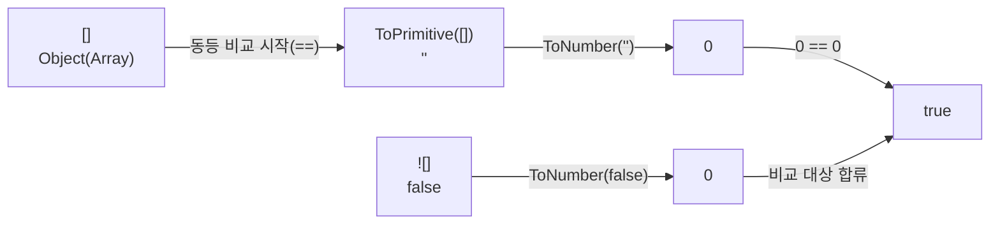
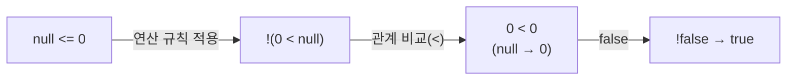

# 비교는 단순하지 않다: `[] == ![]`와 `null <= 0`가 드러내는 강제 형변환 트랩


**한 문장 결론:** JavaScript의 `==`와 관계 연산자는 비교 전에 값을 “같은 타입처럼 보이게” 만들기 때문에, 예측 가능한 비교가 필요하면 `===`/`Object.is`와 **명시적 변환**을 기본값으로 두는 편이 안전하다.


비교 결과가 뒤집히면 UX는 바로 흔들린다. 폼 검증이 갑자기 통과하거나, 조건 분기가 예상과 달리 타면서 UI 상태가 꼬인다. 유지보수 관점에서도 “왜 이 분기가 탔지?”를 추적하는 시간이 늘어난다. 그래서 비교 연산은 코드 품질을 크게 좌우한다.


---


## 배경/문제


아래 코드는 직관과 다르게 동작한다.


```javascript
console.log([] == ![])
console.log(+[] == +![])
```


그리고 `null`은 더 이상하다.


```javascript
console.log(null == 0 || null < 0)
console.log(null <= 0)
```


이 글의 목표는 “이상해 보이는 결과”를 **규칙으로 분해**해서, 다시는 같은 함정에 빠지지 않도록 비교 기준을 정리하는 것이다.


---


## 핵심 개념


처음 한 번만 용어를 정리하자.

- **동등 비교(느슨한 동등,** **`==`****)**: 타입이 다르면 내부 규칙에 따라 **강제 형변환(type coercion)**을 한 뒤 비교한다.
- **일치 비교(엄격한 동등,** **`===`****)**: 타입이 다르면 바로 `false`다. 변환이 없다.
- **관계 연산(****`<`****,** **`<=`****,** **`>`****,** **`>=`****)**: `==`와는 **다른 규칙**으로 비교한다. 특히 `<=`는 “그냥 숫자 변환 후 비교”로 단순화하면 오해하기 쉽다.

아래 다이어그램을 보면, `[] == ![]`가 왜 `true`가 되는지 한 번에 정리된다.





→ 기대 결과/무엇이 달라졌는지: `[]`는 “배열”이라서가 아니라, **객체 → 원시값 → 숫자**로 변환되는 경로를 타면서 `0`이 된다. `![]`는 먼저 `false`가 되고, 그 다음 `0`이 된다.


---


## 해결 접근


정리하면, 비교에서 안전해지려면 선택지가 세 가지다.

1. **기본은** **`===`**

    타입이 다른데도 같아지는 케이스를 원천 차단한다.

2. **비교 전 타입을 명시적으로 맞춘다**

    숫자를 비교할 거면 `Number(x)`로, 문자열이면 `String(x)`로 “의도를 코드로 고정”한다.

3. **의도가 분명한 예외만 허용한다**

    예를 들어 “`null` 또는 `undefined` 둘 다 없다로 취급”하는 경우에만 `value == null` 같은 패턴을 제한적으로 쓴다.


---


## 구현(코드)


### 1) 변환이 어디서 일어나는지 그대로 찍어보기


```javascript
console.log('Boolean([]):', Boolean([]))
console.log('String([]):', String([]))
console.log('Number([]):', Number([]))

console.log('![]:', ![])
console.log('Number(![]):', Number(![]))

console.log('[] == ![]:', [] == ![])
console.log('+[] == +![]:', +[] == +![])
```


→ 기대 결과/무엇이 달라졌는지: `Boolean([])`은 `true`지만, `Number([])`는 `0`이다. 즉 **truthy/falsy**와 **숫자 변환**은 같은 축이 아니다.


---


### 2) Next.js에서 재현 가능한 형태로 묶기 (Client Component)


`console.log`를 “브라우저 콘솔에서” 재현하려면, 실행 위치가 클라이언트여야 한다. 아래 예시는 페이지를 열자마자 결과를 화면에 찍는다.


```javascript
'use client'

import { useEffect, useState } from 'react'

const cases = [
  ['[] == ![]', () => [] == ![]],
  ['+[] == +![]', () => +[] == +![]],
  ['true == []', () => true == []],
  ['true == ![]', () => true == ![]],
  ['null == 0 || null < 0', () => null == 0 || null < 0],
  ['null <= 0', () => null <= 0],
  ['[] === []', () => [] === []],
  ['Object.is(NaN, NaN)', () => Object.is(NaN, NaN)],
]

export default function WeirdComparisonDemoPage() {
  const [lines, setLines] = useState([])

  useEffect(() => {
    const next = cases.map(([label, run]) => {
      let value
      try {
        value = run()
      } catch (e) {
        value = `Error:${e?.message ?? e}`
      }
      return `${label}  ->${value}`
    })
    setLines(next)
  }, [])

  return (
    <main style={{ padding: 24 }}>
      <h1>Weird JS Comparison Demo</h1>
      <pre style={{ whiteSpace: 'pre-wrap' }}>{lines.join('\n')}</pre>
    </main>
  )
}
```


→ 기대 결과/무엇이 달라졌는지: 페이지에서 비교 결과를 한 번에 확인할 수 있고, `===`와 `Object.is`의 차이(예: `NaN`)도 함께 비교할 수 있다.


---


## 검증 방법(체크리스트)

- [ ] 비교가 “타입까지 같아야 하는 값”이면 `===`를 사용했는가?
- [ ] 숫자 비교라면 비교 전에 `Number(...)`로 변환했는가?
- [ ] `null`/`undefined`를 동시에 “없음” 처리하려는 의도라면, 그 의도가 코드에 명확히 드러나는가?
- [ ] 린터에서 `==`를 제한하고 있는가? (`eqeqeq` 같은 규칙)
- [ ] UI 조건 분기(렌더링 조건, 폼 검증 조건)는 테스트로 고정했는가?

---


## 흔한 실수/FAQ


### Q1. “배열은 0으로, 값 있는 배열은 1로 변환된다”가 맞나?


아니다. 배열이 항상 `0/1`로 변환되는 게 아니라, **어떤 변환을 거쳐 최종적으로 어떤 값이 되느냐**가 핵심이다.


예: `Number([]) === 0`이지만, `Number([2]) === 2`다. “값 있는 배열이면 1” 같은 규칙은 없다.


### Q2. `true == []`와 `true == ![]`가 둘 다 `false`인 이유는?

- `true == []`는 결국 `1 == 0`이 된다.
- `true == ![]`는 `true == false`로 바뀌고, 결국 `1 == 0`이 된다.
경로는 다르지만 도착점이 같다.

### Q3. `null == 0`은 `false`인데, 왜 `null <= 0`은 `true`가 될까?


`==`에서 `null`은 특별 취급(주로 `undefined`와만 동등)되고,


`<=`는 관계 비교 규칙을 따라 **숫자 변환 및 비교 규칙**이 적용되면서 결과가 달라질 수 있다.


아래 다이어그램처럼 `<=`는 “단순히 양쪽 숫자 변환 후 비교”로만 보면 오해가 생긴다.





→ 기대 결과/무엇이 달라졌는지: `null`의 동등 비교(`==`)와 관계 비교(`<`, `<=`)는 **같은 규칙이 아니다**. 그래서 같은 값처럼 보여도 결과가 갈릴 수 있다.


### Q4. 그럼 `==`는 아예 쓰면 안 되나?


대부분의 비교는 `===`로 충분하다.


다만 “`null` 또는 `undefined` 둘 다 없음으로 처리” 같은 의도가 명확한 경우에만 제한적으로 쓰는 편이 관리하기 쉽다.


---


## 요약(3~5줄)

- `==`는 타입이 다르면 내부 규칙에 따라 강제 형변환을 수행한다.
- `[] == ![]`가 `true`인 이유는 “배열” 때문이 아니라, 변환 결과가 둘 다 `0`으로 수렴하기 때문이다.
- `null`은 `==`에서 특별 취급되지만, 관계 연산에서는 숫자 변환 규칙이 개입해 결과가 달라질 수 있다.
- 기본은 `===`, 필요한 경우에만 명시적 변환(`Number/String/Boolean`)으로 의도를 고정하자.

---


## 결론


비교는 “같다/다르다”가 아니라 “**어떤 규칙으로 같게 만들었나**”의 문제다.


`===`로 기본값을 고정하고, 필요한 변환만 코드에 직접 적어두면, 이런 트랩은 대부분 사라진다.


---


## 참고(공식 문서 링크)

- [Next.js Docs – Server and Client Components](https://nextjs.org/docs/app/getting-started/server-and-client-components)
- [React Docs – ](https://react.dev/reference/rsc/use-client)[`'use client'`](https://react.dev/reference/rsc/use-client)[ directive](https://react.dev/reference/rsc/use-client)
- [MDN – Equality comparisons and sameness](https://developer.mozilla.org/ko/docs/Web/JavaScript/Guide/Equality_comparisons_and_sameness)
- [MDN – Equality (==) operator](https://developer.mozilla.org/en-US/docs/Web/JavaScript/Reference/Operators/Equality)
- [MDN – Object.is](https://developer.mozilla.org/en-US/docs/Web/JavaScript/Reference/Global_Objects/Object/is)
- [ECMAScript Language Specification](https://tc39.es/ecma262/)
- [Mermaid Docs](https://mermaid.js.org/)
