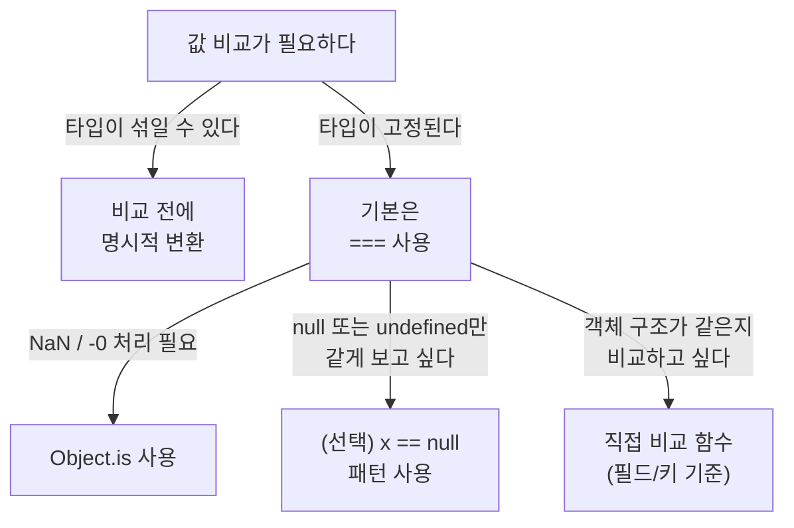

# 숨은 변환을 허용하지 마라: `==`·`===`·`Object.is` 비교 기준


한 문장 결론: **비교는** **`===`****를 기본으로 두고,** **`NaN`****/부호 있는 0(****`-0`****)까지 정확히 다뤄야 할 때만** **`Object.is`****로 넘어가면 된다.**


---


## 배경/문제


자바스크립트에서 “같다”는 말은 생각보다 여러 의미를 가집니다.

- `==`(느슨한 동등 비교)는 **암묵적 타입 변환(type coercion)** 을 끼워 넣습니다.
- `===`(엄격한 동등 비교)는 타입 변환을 하지 않지만, **`NaN`** **같은 특수 값은 예외**가 있습니다.
- `Object.is`는 `NaN`과 `0`까지 포함해 **“값이 정말 같은지”**를 더 엄밀하게 다룹니다.

여기서 중요한 건 “뭘 쓰느냐”보다 **팀/코드베이스가 ’같다’의 의미를 일관되게 유지하느냐**입니다.


---


## 핵심 개념


### 비교 연산자 선택 흐름(실무 기준)





→ 기대 결과/무엇이 달라졌는지: “같다”의 의미가 코드 곳곳에서 흔들리지 않도록, 비교 전략을 빠르게 결정할 수 있습니다.


---


## 해결 접근


### 1) `==`는 “타입 변환이 끼어든다”는 점이 핵심


```javascript
console.log(0 == [])   // true
console.log('0' == 0)  // true
console.log('0' == []) // false
```


→ 기대 결과/무엇이 달라졌는지: 같은 “0”처럼 보이는 값들이, **암묵적 변환 규칙** 때문에 예상과 다른 결과를 만들 수 있음을 확인합니다.


포인트는 단순합니다. `==`는 비교 전에 값의 형태를 바꿉니다. 이 “숨은 변환”이 디버깅 난이도를 올립니다.


---


### 2) `===`는 기본값이지만, `NaN`은 예외다


```javascript
const a = NaN
console.log(a === a) // false
```


→ 기대 결과/무엇이 달라졌는지: “자기 자신과 같지 않은 값”이 실제로 존재한다는 걸 확인합니다(대표적으로 `NaN`).


반대로 `null`은 `===`에서 일관적입니다.


```javascript
const b = null
console.log(b === b) // true
```


→ 기대 결과/무엇이 달라졌는지: `null`은 `===`에서 “자기 자신과 같다”는 직관적인 결과를 유지합니다.


---


### 3) `Object.is`는 `NaN`과 `0`까지 구분한다


```javascript
console.log(Object.is(NaN, NaN)) // true
console.log(Object.is(-0, 0))    // false
```


→ 기대 결과/무엇이 달라졌는지: `===`로는 잡기 어려운 케이스(`NaN`, `-0`)를 **명시적으로 다룰 수 있습니다.**


그리고 객체 비교는 “구조”가 아니라 **참조(레퍼런스)** 기준입니다.


```javascript
const c = { a: 1 }

console.log(Object.is(c, c))         // true
console.log(Object.is({ a: 1 }, { a: 1 })) // false
```


→ 기대 결과/무엇이 달라졌는지: “모양이 같아 보이는 객체”라도 **서로 다른 객체면 같지 않다**는 기준이 고정됩니다.


문자열도 “원시 값(string)”과 “래퍼 객체(String)”가 섞이면 결과가 달라질 수 있습니다.


```javascript
console.log(Object.is('123', '123'))             // true
console.log(Object.is('123', new String('123'))) // false
```


→ 기대 결과/무엇이 달라졌는지: 값 비교에서 “타입 일관성”이 왜 중요한지(래퍼 객체 혼입) 즉시 드러납니다.


---


## 구현(코드)


### Next.js에서 바로 재현 가능한 예시: React는 비교에 `Object.is`를 쓴다


`useState`와 `useEffect`는 내부적으로 값이 바뀌었는지 판단할 때 `Object.is` 기준을 사용합니다. 그래서 `NaN` 같은 값도 “동일함”으로 취급될 수 있습니다.


```typescript
'use client'

import { useEffect, useState } from 'react'

export default function EqualityDemo() {
  const [value, setValue] = useState<number>(NaN)

  useEffect(() => {
    console.log('effect runs:', value)
  }, [value])

  return (
    <main style={{ padding: 16 }}>
      <button onClick={() => setValue(NaN)}>set NaN again</button>
      <button onClick={() => setValue(Math.random())}>set random</button>
    </main>
  )
}
```


→ 기대 결과/무엇이 달라졌는지: `setValue(NaN)`을 반복해도, 비교 기준상 “같은 값”이면 **리렌더/이펙트가 건너뛰어질 수 있습니다.**


(반대로 랜덤 값은 매번 달라서 이펙트가 실행됩니다.)


---


## 검증 방법(체크리스트)

- [ ] 비교는 기본적으로 `===`로 통일했는가?
- [ ] 타입이 섞일 수 있는 입력이라면, 비교 전에 **명시적 변환**(예: `Number(x)`, `String(x)`)을 했는가?
- [ ] `NaN` 체크가 필요한 곳은 `Object.is(x, NaN)` 또는 `Number.isNaN(x)`처럼 의도가 드러나는 방식인가?
- [ ] 객체/배열 비교에서 “구조 비교”가 필요하다면, 필드/키 기준 비교 함수를 별도로 두었는가?
- [ ] 린트 규칙으로 `==` 사용을 관리하고(필요한 예외만 허용) 있는가? ([Next.js ESLint 설정](https://nextjs.org/docs/app/api-reference/config/eslint), [ESLint ](https://eslint.org/docs/latest/rules/eqeqeq)[`eqeqeq`](https://eslint.org/docs/latest/rules/eqeqeq)[ 규칙](https://eslint.org/docs/latest/rules/eqeqeq))

---


## 흔한 실수/FAQ


### Q1. “그럼 `==`는 무조건 금지인가?”


팀 정책에 따라 다를 수 있습니다. 다만 `==`는 타입 변환이 끼어들기 때문에, “같다”의 의미가 코드 위치마다 달라지기 쉽습니다. 금지/허용보다 중요한 건 **예외를 코드베이스에서 관리 가능한 수준으로 제한하는 것**입니다.


### Q2. `Object.is`면 모든 비교가 해결되나?


아닙니다. `Object.is({a:1}, {a:1})`가 `false`인 것처럼, **구조적 동일성**을 판단해주진 않습니다. 구조 비교는 별도의 정책(필드 선택, 정렬, 깊이 제한 등)이 필요합니다.


### Q3. `new String('123')` 같은 래퍼 객체는 왜 피하나?


원시 문자열과 다른 타입이라 비교 결과가 달라집니다. 문자열/숫자/불리언은 가능한 한 **원시 값**으로만 다루는 편이 예측 가능성이 높습니다.


---


## 요약(3~5줄)

- `==`는 암묵적 타입 변환이 들어가서, 예상 못 한 결과를 만들기 쉽다.
- 기본 비교는 `===`로 고정하는 편이 유지보수에 유리하다.
- `NaN`과 `0`까지 엄밀하게 다뤄야 할 때는 `Object.is`가 해답이다.
- 객체/배열은 구조가 같아도 참조가 다르면 같지 않다. 구조 비교는 별도로 설계해야 한다.

---


## 결론


“왜 `==`를 쓰지 말라”는 말의 본질은 **타입 변환을 숨기지 말자**에 가깝습니다.


정리하면, **`===`****를 기본으로**, 특별한 숫자 케이스(`NaN`, `-0`)까지 의미가 중요한 지점에서만 **`Object.is`****를 선택**하는 게 가장 안전합니다.


---


## 참고(공식 문서 링크)

- [MDN: Equality (==)](https://developer.mozilla.org/en-US/docs/Web/JavaScript/Reference/Operators/Equality)
- [MDN: Strict equality (===)](https://developer.mozilla.org/en-US/docs/Web/JavaScript/Reference/Operators/Strict_equality)
- [MDN: Object.is()](https://developer.mozilla.org/en-US/docs/Web/JavaScript/Reference/Global_Objects/Object/is)
- [MDN: Equality comparisons and sameness](https://developer.mozilla.org/en-US/docs/Web/JavaScript/Guide/Equality_comparisons_and_sameness)
- [React: useState](https://react.dev/reference/react/useState)
- [React: useEffect](https://react.dev/reference/react/useEffect)
- [Next.js: ESLint 설정](https://nextjs.org/docs/app/api-reference/config/eslint)
- [ESLint: eqeqeq](https://eslint.org/docs/latest/rules/eqeqeq)
