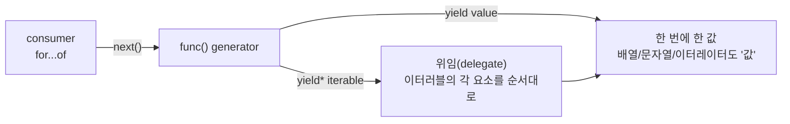

# 의도대로 한 칸씩 내보내라: `yield*`로 제너레이터 합성하기


한 문장 결론: **`yield`****가 “값을 한 번 내보내기”라면,** **`yield*`****는 “다른 이터러블(iterable)의 순회를 통째로 위임하기”다.**


제너레이터(generator)를 쓰다 보면 “값을 여러 번 내보내고 싶다”는 요구가 자주 나온다.


여기서 중요한 건 **내보내는 단위**다. 배열/문자열/다른 제너레이터를 `yield`로 그대로 내보내면, 소비자(예: `for...of`)는 그걸 “한 덩어리 값”으로 받는다.


반대로 `yield*`를 쓰면 “그 안쪽의 요소”가 바깥 제너레이터의 출력처럼 흘러나와, **합성(composition)된 순회**를 만들 수 있다.


---


## 배경/문제


아래 코드는 얼핏 “42, 43, 45를 순서대로 출력”할 것처럼 보이지만, 실제로는 작성 의도와 다르게 동작할 수 있다.


```javascript
function* func() {
  yield [42, 43, 45];
  yield "424345";
  yield childFunc();
}

function* childFunc() {
  yield 42;
  yield 43;
  yield 45;
}

const iterator = func();

for (const val of iterator) {
  console.log("val", val);
}
```


→ 기대 결과/무엇이 달라졌는지: `yield`는 **배열/문자열/제너레이터 객체 자체**를 “한 번의 값”으로 내보낸다. 즉, `for...of`는 “원소”가 아니라 “덩어리”를 순회하게 된다.


---


## 핵심 개념


`yield`와 `yield*`의 차이는 “값을 내보내는 단위”로 정리할 수 있다.





→ 기대 결과/무엇이 달라졌는지: `yield*`를 쓰면 “내보내는 단위”가 **덩어리 → 요소**로 바뀌어, 합성된 제너레이터를 만들기 쉬워진다.

- `yield someIterable`: `someIterable` **자체**가 한 번 출력된다.
- `yield* someIterable`: `someIterable`의 **각 요소**가 차례대로 출력된다.
- `yield*`는 배열뿐 아니라 문자열, Set/Map, 다른 제너레이터 등 **이터러블이면 모두 위임 대상**이 된다.

---


## 해결 접근


### 1) 의도가 “요소 단위 순회”라면 `yield*`로 위임하기


```javascript
function* func() {
  yield* [42, 43, 45];
  yield* "424345";
  yield* childFunc();
}

function* childFunc() {
  yield 42;
  yield 43;
  yield 45;
}

for (const val of func()) {
  console.log("val", val);
}
```


→ 기대 결과/무엇이 달라졌는지:
- `[42, 43, 45]`는 `42 → 43 → 45`로 풀려서 출력된다.
- `"424345"`는 문자열이 이터러블이므로 **문자 단위**로 `4 → 2 → 4 → 3 → 4 → 5`가 출력된다.
- `childFunc()`는 위임되어 `42 → 43 → 45`가 이어서 출력된다.


---


## 구현(코드)


### 출력이 “덩어리”인지 “요소”인지 한 번에 확인하는 방법


제너레이터의 결과를 눈으로 확인할 때는 스프레드(spread)로 배열로 펼치면 단위가 바로 보인다.


```javascript
function* funcYield() {
  yield [42, 43, 45];
  yield "424345";
  yield childFunc();
}

function* funcYieldStar() {
  yield* [42, 43, 45];
  yield* "424345";
  yield* childFunc();
}

function* childFunc() {
  yield 42;
  yield 43;
  yield 45;
}

console.log([...funcYield()]);
console.log([...funcYieldStar()]);
```


→ 기대 결과/무엇이 달라졌는지:
- `funcYield()`는 배열/문자열/제너레이터 객체가 **그대로 담긴 배열**이 출력된다.
- `funcYieldStar()`는 모든 값이 **하나의 평평한(flat) 시퀀스**로 펼쳐진 배열이 출력된다.


---


## 검증 방법(체크리스트)

- [ ] `for...of`로 돌렸을 때 “원하는 단위(요소)”가 나오는가?
- [ ] 문자열에 `yield*`를 썼다면 **문자 단위로 나오는 게 의도**인가?
- [ ] 다른 제너레이터를 합성할 때 `yield child()`가 아니라 `yield* child()`가 필요한 상황인가?
- [ ] 빠르게 확인하려면 `console.log([...gen()])`로 결과 단위를 점검했는가?

---


## 흔한 실수/FAQ


### Q1. `yield childFunc()`가 왜 “값 42”가 아니라 “제너레이터 객체”로 나오나요?


`childFunc()`는 **이터레이터(Iterator)** 를 반환한다. `yield`는 그걸 “그냥 값”으로 내보내기 때문에, 소비자는 내부 값을 자동으로 펼치지 않는다.


내부 값을 이어서 내보내려면 `yield* childFunc()`처럼 **순회를 위임**해야 한다.


### Q2. `yield* "424345"`가 숫자가 아니라 문자로 나오는 이유는?


문자열은 이터러블이라서, `yield*`는 문자열의 각 문자를 순서대로 내보낸다.


문자열 전체를 한 번에 내보내려면 `yield "424345"`를 사용한다.


### Q3. `yield*` 없이도 같은 효과를 낼 수 있나요? (대안/비교)


가능하다. 아래처럼 수동으로 펼칠 수도 있다.


```javascript
function* funcManual() {
  for (const v of [42, 43, 45]) yield v;
  for (const ch of "424345") yield ch;
  for (const v of childFunc()) yield v;
}
```


→ 기대 결과/무엇이 달라졌는지: `yield*`와 동일하게 “요소 단위”로 내보내지만, 코드가 길어지고 “위임” 의도가 덜 선명해질 수 있다.


---


## 요약(3~5줄)

- `yield`는 **값을 한 번** 내보낸다(배열/문자열/제너레이터도 “값”으로 취급).
- `yield*`는 **다른 이터러블의 순회 결과를 위임**해 요소를 순서대로 내보낸다.
- 문자열에 `yield*`를 쓰면 **문자 단위**로 나온다.
- 합성된 제너레이터를 만들 때 `yield*`는 의도를 가장 짧게 드러낸다.

---


## 결론


제너레이터 합성에서 실수는 대부분 “내보내는 단위”를 놓치면서 생긴다.


배열/문자열/다른 제너레이터를 **덩어리로 내보낼지**, **요소 단위로 이어 붙일지**를 먼저 결정하고, 그 다음 `yield`와 `yield*`를 선택하면 코드의 의도가 흔들리지 않는다.


---


## 참고(공식 문서 링크)

- [`yield*`](https://developer.mozilla.org/en-US/docs/Web/JavaScript/Reference/Operators/yield*)[ (MDN)](https://developer.mozilla.org/en-US/docs/Web/JavaScript/Reference/Operators/yield*)
- [Generator function ](https://developer.mozilla.org/en-US/docs/Web/JavaScript/Reference/Statements/function*)[`function*`](https://developer.mozilla.org/en-US/docs/Web/JavaScript/Reference/Statements/function*)[ (MDN)](https://developer.mozilla.org/en-US/docs/Web/JavaScript/Reference/Statements/function*)
- [Iteration protocols: iterable / iterator (MDN)](https://developer.mozilla.org/en-US/docs/Web/JavaScript/Reference/Iteration_protocols)
- [`for...of`](https://developer.mozilla.org/en-US/docs/Web/JavaScript/Reference/Statements/for...of)[ (MDN)](https://developer.mozilla.org/en-US/docs/Web/JavaScript/Reference/Statements/for...of)
- [Next.js Docs](https://nextjs.org/docs)
