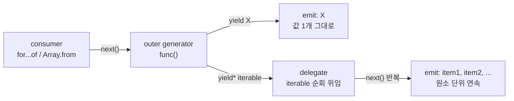

# 펼치지 않으면 객체가 나온다: `yield*`로 제너레이터 출력 단위를 고정하기


한 문장 결론: **`yield`****는 “값 1개”,** **`yield*`****는 “이터러블을 펼친 값들”을 내보낸다.**


제너레이터(generator)를 쓰는 순간부터, 출력은 “무엇을”보다 “어떤 단위로”가 더 중요해집니다.


배열, 문자열, 다른 제너레이터를 `yield`로 던지면 **덩어리째** 나가고, 소비자는 그 덩어리를 그대로 받습니다.


반대로 `yield*`로 위임하면, 그 덩어리는 **흐름(stream)** 으로 풀려서 나오죠. 포인트는 여기 하나입니다: **출력 단위를 고정하라.**


---


## 배경/문제


아래 코드는 문법상 문제는 없습니다. 다만 “순회 결과가 기대한 모양이 아닐 때” 가장 흔하게 만나는 형태입니다.


```javascript
function* func() {
  yield [42, 43, 45];
  yield "424345";
  yield childFunc();
}

function* childFunc() {
  yield 42;
  yield 43;
  yield 45;
}

const iterator = func();

for (const val of iterator) {
  console.log("val", val);
}
```


→ 기대 결과/무엇이 달라졌는지:


- `[42, 43, 45]`는 **배열 자체**가 한 번 출력됩니다.


- `"424345"`는 **문자열 자체**가 한 번 출력됩니다.


- `childFunc()`는 **이터레이터(제너레이터 객체) 자체**가 한 번 출력됩니다. 값들이 자동으로 나오지 않습니다.


이 상황에서 많은 경우 원하는 건 “`func()`의 결과를 순회했더니 숫자들이 쭉 나온다”에 가깝습니다.


---


## 핵심 개념


### `yield` vs `yield*`: 한 번에 “무엇”을 내보내는가

- `yield 값`
    - 값을 **그대로 1회** 내보냅니다.
- `yield* 이터러블`
    - 이터러블(iterable)의 순회를 **위임(delegation)** 해서, 내부 원소를 **하나씩 연속으로** 내보냅니다.

한 눈에 보면 더 빠릅니다.


| 표현         | 출력 단위 | 예: 배열 | 예: 문자열 | 예: 제너레이터    |
| ---------- | ----- | ----- | ------ | ----------- |
| `yield x`  | 값 1개  | 배열 1개 | 문자열 1개 | 이터레이터 객체 1개 |
| `yield* x` | 원소들   | 원소들   | 문자들    | yield 값들    |


아래 다이어그램은 “소비자가 받는 흐름”을 기준으로 차이를 고정합니다.





→ 기대 결과/무엇이 달라졌는지:


- `yield`는 “덩어리(값 1개)”를 그대로 내보냅니다.


- `yield*`는 “덩어리 → 흐름(원소들)”로 바꿔 내보냅니다.


---


## 해결 접근


목표를 먼저 고정합니다.

- **덩어리째 한 번만 내보낼 것**: `yield`
- **원소 단위로 풀어 내보낼 것**: `yield*`

그리고 “문자열”만 별도 취급할지 결정합니다. 문자열은 이터러블이라 `yield*`를 쓰면 **문자 단위**로 펼쳐집니다.


---


## 구현(코드)


### 1) 배열·문자열·다른 제너레이터를 “펼쳐서” 내보내기


```javascript
function* func() {
  yield* [42, 43, 45];
  yield* "424345";
  yield* childFunc();
}

function* childFunc() {
  yield 42;
  yield 43;
  yield 45;
}

console.log(Array.from(func()));
```


→ 기대 결과/무엇이 달라졌는지:


- 배열은 `42, 43, 45`로 **원소 단위**로 펼쳐집니다.


- 문자열은 `"4","2","4","3","4","5"`처럼 **문자 단위**로 펼쳐집니다.


- `childFunc()`는 객체가 아니라 **결과 값 스트림**으로 합쳐집니다.


---


### 2) 문자열은 “문자 단위”가 아니라 “문자열 1개”로 내보내기


문자열을 펼치는 게 아니라 “그대로 1회” 내보내고 싶다면, 문자열은 `yield`로 고정합니다.


```javascript
function* func() {
  yield* [42, 43, 45];
  yield "424345"; // 문자열은 덩어리로 1회
  yield* childFunc();
}

function* childFunc() {
  yield 42;
  yield 43;
  yield 45;
}

console.log(Array.from(func()));
```


→ 기대 결과/무엇이 달라졌는지:


- `"424345"`가 문자로 쪼개지지 않고 **한 번만** 포함됩니다.


- 나머지는 `yield*`로 그대로 펼쳐집니다.


---


## 대안/비교


`yield*`가 정답인 경우가 많지만, 의도에 따라 다른 선택지가 더 명확할 수 있습니다.


### 대안 A) “생산자에서 펼치기”: `yield*` (추천)

- 출력 단위를 **생산자에서 고정**하니, 소비자는 단순해집니다.
- `for...of`, `Array.from`, 스프레드 등 어떤 소비자에도 동일하게 동작합니다.

```javascript
function* stream() {
  yield* childFunc();
}
```


→ 기대 결과/무엇이 달라졌는지:


- 소비자는 언제나 “숫자 스트림”만 받습니다.


### 대안 B) “소비자에서 펼치기”: 중첩 순회로 flatten


생산자를 건드리기 어렵거나, “덩어리/흐름”을 상황에 따라 바꿔야 한다면 소비자에서 펼칠 수 있습니다.


```javascript
function* func() {
  yield [42, 43, 45];
  yield childFunc();
}

function* childFunc() {
  yield 42;
  yield 43;
  yield 45;
}

for (const val of func()) {
  if (typeof val?.[Symbol.iterator] === "function" && typeof val !== "string") {
    for (const item of val) console.log("item", item);
  } else {
    console.log("val", val);
  }
}
```


→ 기대 결과/무엇이 달라졌는지:


- 소비자 로직이 복잡해집니다.


- 문자열처럼 “펼치면 곤란한 값”을 조건으로 걸러야 합니다.


### 대안 C) “명시적 리스트로 변환”: `Array.from`로 고정한 뒤 내보내기


“흐름”이 아니라 “완성된 배열”이 필요하면, 위임 대신 명시적으로 모을 수 있습니다.


```javascript
function* func() {
  yield Array.from(childFunc()); // 배열로 확정
}

function* childFunc() {
  yield 42;
  yield 43;
  yield 45;
}

console.log(Array.from(func()));
```


→ 기대 결과/무엇이 달라졌는지:


- `childFunc()`의 결과가 **배열 1개**로 고정됩니다.


- 스트리밍이 아니라 “완성본”을 다루는 형태가 됩니다.


---


## 검증 방법(체크리스트)

- [ ] `Array.from(func())` 결과가 **원하는 단위(원소/덩어리)** 로 나오나요?
- [ ] `yield childFunc()`처럼 **이터레이터 객체가 그대로 섞여** 나오지 않나요?
- [ ] 문자열에 `yield*`를 쓰는 경우, **문자 단위 출력이 의도**와 맞나요?
- [ ] `for...of` 루프 변수는 `const`/`let`으로 선언했나요?

---


## 흔한 실수/FAQ


### Q1. `yield childFunc()`로는 왜 값이 안 나오나요?


`childFunc()`는 “값”이 아니라 “이터레이터 객체”를 반환합니다.


`yield`는 그 객체를 **값 1개로** 내보내기 때문에, 내부 값이 자동으로 펼쳐지지 않습니다.


값을 위임하려면 `yield* childFunc()`를 사용합니다.


### Q2. `yield*`는 아무 값에나 쓸 수 있나요?


아니요. 오른쪽은 반드시 **이터러블**이어야 합니다. 순회 규약이 없는 값이면 런타임 에러가 날 수 있습니다.


이터러블/이터레이터 규약은 [MDN Iteration protocols](https://developer.mozilla.org/en-US/docs/Web/JavaScript/Reference/Iteration_protocols)를 참고하세요.


### Q3. Next.js에서 어디에 두면 좋나요?


DOM 의존이 없는 순수 로직이라면 `lib/` 같은 공용 모듈에 두고 서버/클라이언트 어디서든 가져다 쓸 수 있습니다.


로그는 실행 위치에 따라 브라우저 콘솔/서버 로그로 나뉩니다.


---


## 요약(3~5줄)

- `yield`는 값을 **덩어리째 1회** 내보냅니다.
- `yield*`는 이터러블을 **펼쳐서 원소 단위**로 내보냅니다.
- 제너레이터를 `yield`로 내보내면 객체가 나오므로, 값 스트림을 합치려면 `yield*`가 자연스럽습니다.
- 문자열은 `yield*` 시 문자 단위로 펼쳐지니, 필요하면 `yield "문자열"`로 단위를 고정하세요.

---


## 결론


`yield*`의 역할은 “편리함”이 아니라 “의도 고정”입니다.


이 글에서 다룬 문제는 결국 하나로 귀결됩니다: **소비자가 기대하는 출력 단위를 생산자에서 확정하라.**


그 한 줄이, 중첩 순회와 조건문을 지워줍니다.


---


## 참고(공식 문서 링크)

- [`yield*`](https://developer.mozilla.org/en-US/docs/Web/JavaScript/Reference/Operators/yield*)[ (MDN)](https://developer.mozilla.org/en-US/docs/Web/JavaScript/Reference/Operators/yield*)
- [Generators (MDN)](https://developer.mozilla.org/en-US/docs/Web/JavaScript/Reference/Global_Objects/Generator)
- [Iteration protocols (MDN)](https://developer.mozilla.org/en-US/docs/Web/JavaScript/Reference/Iteration_protocols)
- [Next.js Docs](https://nextjs.org/docs)
- [React Docs](https://react.dev/)
